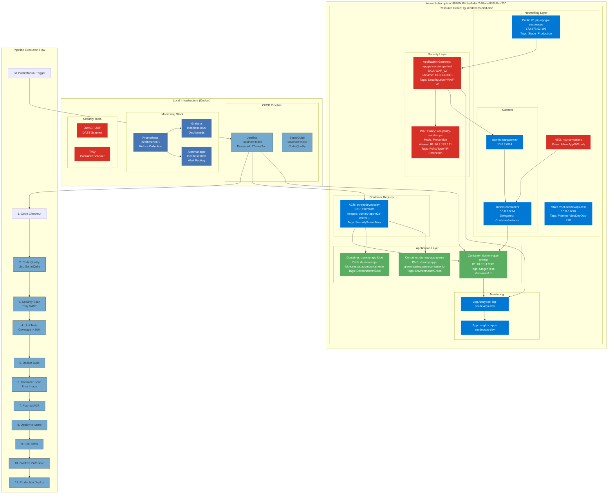
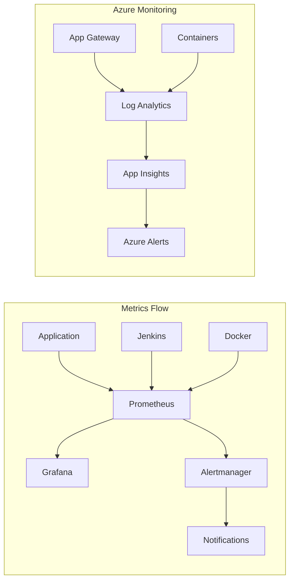
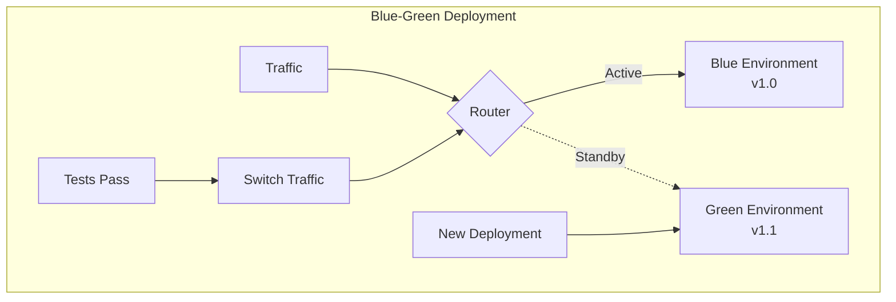

# SecDevOps E2E CI/CD Architecture Diagram



## Resource Labels & Execution Groups

### Execution Group: `e2e-full`
All resources are tagged with `ExecutionGroup=e2e-full` for easy identification

### Resource Group Details
- **Name**: `rg-secdevops-cicd-dev`
- **Location**: `eastus`
- **Tags**:
  - Environment: Dev
  - Pipeline: SecDevOps-E2E
  - Project: CICD
  - Owner: Jez
  - CreatedBy: Claude
  - ManagedBy: Pipeline
  - ExecutionGroup: e2e-full
  - SecurityLevel: WAF-Protected

### Key Service Endpoints

| Service | URL | Purpose | Labels |
|---------|-----|---------|--------|
| Application Gateway | http://172.178.53.198 | WAF-protected entry point | Stage=Production, SecurityLevel=WAF-v2 |
| Jenkins | http://localhost:8080 | CI/CD orchestration | Component=CICD |
| Grafana | http://localhost:3000 | Monitoring dashboards | Component=Monitoring |
| Prometheus | http://localhost:9091 | Metrics collection | Component=Metrics |
| SonarQube | http://localhost:9000 | Code quality analysis | Component=Quality |
| Alertmanager | http://localhost:9093 | Alert management | Component=Alerting |

### Container Instances

| Name | IP/DNS | Stage | Strategy |
|------|--------|-------|----------|
| dummy-app-private | 10.0.1.4:3001 (private) | Test | Main deployment |
| dummy-app-blue | dummy-app-blue.eastus.azurecontainer.io | Production | Blue-Green |
| dummy-app-green | dummy-app-green.eastus.azurecontainer.io | Staging | Blue-Green |
| dummy-app-prod | dummy-app-prod.eastus.azurecontainer.io | Production | Active |

### Pipeline Scripts

| Script | Location | Purpose | Execution Time |
|--------|----------|---------|----------------|
| run-e2e-pipeline.sh | /home/jez/code/SecDevOps_CICD/ | Complete E2E pipeline | ~100 seconds |
| blue-green-deploy.sh | scripts/deployment/ | Zero-downtime deployment | ~3 minutes |
| run-zap-scan.sh | scripts/security/ | DAST scanning | 5-10 minutes |
| run-sonarqube-scan.sh | scripts/quality/ | Code quality analysis | 2-5 minutes |
| deploy-with-app-gateway.sh | /home/jez/code/SecDevOps_CICD/ | WAF deployment | 15-20 minutes |

### Security Layers

1. **Network Security**
   - Private VNet with isolated subnets
   - NSG rules restricting access
   - Container subnet delegation

2. **Application Security**
   - WAF v2 with OWASP rules
   - IP whitelisting (86.3.129.121)
   - Prevention mode enabled

3. **Container Security**
   - Trivy scanning at build time
   - ACR with retention policies
   - Private endpoint connections

4. **Code Security**
   - SAST with Trivy
   - DAST with OWASP ZAP
   - SonarQube security hotspots

### Monitoring & Alerting



### Deployment Strategies



### Tags Structure

All resources follow this tagging convention:
```yaml
Tags:
  Environment: Dev/Test/Prod
  Pipeline: SecDevOps-E2E
  Component: Application/Network/Security/Monitoring
  Stage: Build/Test/Production
  ExecutionGroup: e2e-full
  SecurityLevel: WAF-Protected/Private/Public
  Version: v1.0/v1.1/latest
  DeploymentStrategy: Blue-Green/Canary/Rolling
  Owner: Jez
  ManagedBy: Terraform/Pipeline
```

### Quick Access Commands

```bash
# Run full E2E pipeline
./run-e2e-pipeline.sh dummy-app-e2e-test v1.2

# Deploy with blue-green strategy
./scripts/deployment/blue-green-deploy.sh dummy-app-e2e-test v1.2

# Security scan
./scripts/security/run-zap-scan.sh http://172.178.53.198 baseline

# Quality check
./scripts/quality/run-sonarqube-scan.sh secdevops-cicd "SecDevOps CICD"

# Query resources by execution group
az resource list --tag ExecutionGroup=e2e-full --output table
```