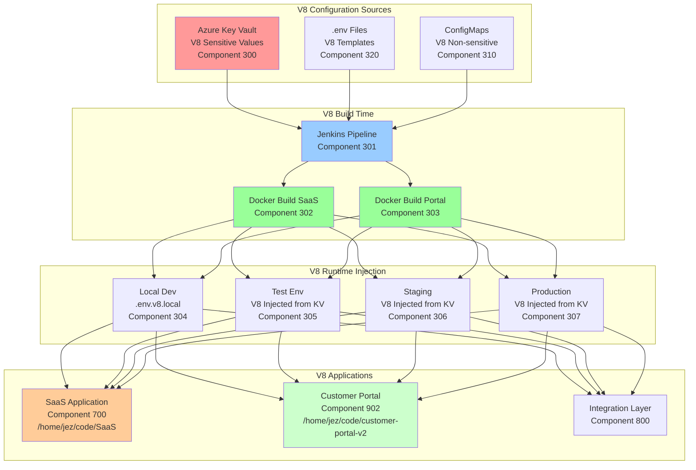

# Environment Configuration Management V8
## Dynamic Configuration for Integrated SaaS & Customer Portal Architecture

**Version:** 8.0  
**Date:** 2025-09-22  
**Author:** Winston - System Architect  
**Components:** 300-399 (Configuration Layer), 700-799 (SaaS), 900-999 (Portal)

---

## 🔐 Overview

This document defines V8 environment configuration management across the integrated architecture without any hardcoding. All sensitive values are stored in Azure Key Vault with hierarchical resource group naming and injected at runtime across both SaaS (/home/jez/code/SaaS) and Customer Portal (/home/jez/code/customer-portal-v2) codebases.

---

## 📁 V8 Environment File Structure

### V8 Hierarchical Configuration

```bash
# V8 Configuration Locations
/home/jez/code/SaaS/
├── .env.v8                     # V8 SaaS Base configuration (never committed)
├── .env.v8.local              # Local development overrides  
├── .env.v8.development        # Development environment
├── .env.v8.test               # Test environment
├── .env.v8.staging            # Staging environment
├── .env.v8.production         # Production environment
└── .env.v8.example            # V8 SaaS Template (committed to Git)

/home/jez/code/customer-portal-v2/
├── .env.portal.v8             # V8 Portal Base configuration
├── .env.portal.v8.local       # Local development overrides
├── .env.portal.v8.development # Development environment
├── .env.portal.v8.test        # Test environment  
├── .env.portal.v8.staging     # Staging environment
├── .env.portal.v8.production  # Production environment
└── .env.portal.v8.example     # V8 Portal Template (committed to Git)

# V8 Shared Configuration
/shared/v8-config/
├── integration.env.v8         # Cross-component integration
├── monitoring.env.v8          # Monitoring configuration
└── security.env.v8            # Security settings
```

### V8 Environment Variable Categories

```yaml
V8 Database Configuration:
  - V8_DATABASE_URL
  - V8_DB_HOST  
  - V8_DB_PORT
  - V8_DB_NAME
  - V8_DB_USER
  - V8_DB_PASSWORD
  - V8_DB_SSL_MODE
  - V8_DB_POOL_CONFIG

V8 Azure Services:
  - V8_AZURE_STORAGE_CONNECTION_STRING
  - V8_AZURE_KEY_VAULT_URI
  - V8_AZURE_TENANT_ID
  - V8_AZURE_CLIENT_ID
  - V8_AZURE_CLIENT_SECRET
  - V8_AZURE_SUBSCRIPTION_ID
  - V8_AZURE_RESOURCE_GROUP

V8 Application Settings:
  - V8_NODE_ENV
  - V8_PORT
  - V8_API_URL
  - V8_FRONTEND_URL
  - V8_SESSION_SECRET
  - V8_JWT_SECRET
  - V8_CORS_ORIGINS
  - V8_COMPONENT_ID

V8 SaaS Specific (Components 700-799):
  - V8_SAAS_TENANT_MODE
  - V8_SAAS_DATABASE_ISOLATION
  - V8_SAAS_BILLING_ENABLED
  - V8_SAAS_USAGE_TRACKING
  - V8_SAAS_SSO_PROVIDERS
  - V8_SAAS_MULTI_TENANCY

V8 Portal Specific (Components 900-999):
  - V8_PORTAL_CUSTOMER_MODE
  - V8_PORTAL_ADMIN_EMAIL
  - V8_PORTAL_BRANDING_CONFIG
  - V8_PORTAL_FEATURE_FLAGS
  - V8_PORTAL_INTEGRATION_ENDPOINTS
  - V8_PORTAL_CUSTOMER_DB

V8 Integration Layer (Components 800-899):
  - V8_INTEGRATION_SAAS_ENDPOINT
  - V8_INTEGRATION_PORTAL_ENDPOINT
  - V8_INTEGRATION_MESSAGE_QUEUE
  - V8_INTEGRATION_EVENT_BUS
  - V8_INTEGRATION_API_GATEWAY
  - V8_INTEGRATION_SYNC_CONFIG

V8 File Processing API:
  - V8_FILE_UPLOAD_PATH
  - V8_FILE_PROCESSING_QUEUE
  - V8_MAX_FILE_SIZE
  - V8_ALLOWED_FILE_TYPES
  - V8_FILE_STORAGE_CONTAINER
  - V8_FILE_VIRUS_SCANNING

V8 Monitoring & Logging:
  - V8_LOG_LEVEL
  - V8_APPLICATION_INSIGHTS_KEY
  - V8_SENTRY_DSN
  - V8_GRAFANA_API_KEY
  - V8_PROMETHEUS_ENDPOINT
  - V8_COMPONENT_METRICS_ENABLED

V8 Third-Party Services:
  - V8_SMTP_HOST
  - V8_SMTP_PORT
  - V8_SMTP_USER
  - V8_SMTP_PASSWORD
  - V8_SLACK_WEBHOOK_URL
  - V8_TEAMS_WEBHOOK_URL
```

---

## 🏗️ V8 Architecture for Environment Management



---

## 📝 V8 Environment Templates

### Component 320: V8 SaaS Environment Template

```bash
# .env.v8.example - V8 SaaS Template
# Copy this file to .env.v8 and fill in values
# NEVER commit .env.v8 files with real values

# ============================================
# V8 APPLICATION CONFIGURATION
# ============================================
V8_NODE_ENV=development
V8_PORT=3000
V8_API_URL=http://localhost:3000
V8_FRONTEND_URL=http://localhost:3000
V8_APP_NAME=oversight-saas-v8
V8_COMPONENT_ID=700
V8_VERSION=8.0

# ============================================
# V8 DATABASE CONFIGURATION
# ============================================
V8_DATABASE_URL=postgresql://${V8_DB_USER}:${V8_DB_PASSWORD}@${V8_DB_HOST}:${V8_DB_PORT}/${V8_DB_NAME}?sslmode=${V8_DB_SSL_MODE}
V8_DB_HOST=localhost
V8_DB_PORT=5432
V8_DB_NAME=oversight_saas_v8_dev
V8_DB_USER=
V8_DB_PASSWORD=
V8_DB_SSL_MODE=prefer
V8_DB_POOL_MIN=5
V8_DB_POOL_MAX=20
V8_DB_COMPONENT_ISOLATION=enabled

# ============================================
# V8 AZURE SERVICES - HIERARCHICAL NAMING
# ============================================
V8_AZURE_STORAGE_CONNECTION_STRING=
V8_AZURE_KEY_VAULT_URI=https://kv-oversight-${V8_ENV}-saas-uksouth.vault.azure.net
V8_AZURE_TENANT_ID=
V8_AZURE_CLIENT_ID=
V8_AZURE_CLIENT_SECRET=
V8_AZURE_SUBSCRIPTION_ID=
V8_AZURE_RESOURCE_GROUP=rg-oversight-${V8_ENV}-saas-uksouth

# ============================================
# V8 SECURITY & AUTHENTICATION
# ============================================
V8_SESSION_SECRET=
V8_JWT_SECRET=
V8_JWT_EXPIRY=24h
V8_REFRESH_TOKEN_EXPIRY=7d
V8_BCRYPT_ROUNDS=12
V8_CORS_ORIGINS=http://localhost:3000,http://localhost:3001
V8_SECURE_COOKIES=false
V8_TRUST_PROXY=false
V8_COMPONENT_AUTH_ENABLED=true

# ============================================
# V8 SAAS SPECIFIC CONFIGURATION
# ============================================
V8_SAAS_TENANT_MODE=multi
V8_SAAS_DATABASE_ISOLATION=database_per_tenant
V8_SAAS_BILLING_ENABLED=true
V8_SAAS_USAGE_TRACKING=enabled
V8_SAAS_SSO_PROVIDERS=azure,google,okta
V8_SAAS_MULTI_TENANCY=enabled
V8_SAAS_TENANT_DETECTION=subdomain
V8_SAAS_DEFAULT_PLAN=starter

# ============================================
# V8 INTEGRATION CONFIGURATION
# ============================================
V8_INTEGRATION_SAAS_ENDPOINT=http://localhost:3000
V8_INTEGRATION_PORTAL_ENDPOINT=http://localhost:3001
V8_INTEGRATION_MESSAGE_QUEUE=redis://localhost:6379
V8_INTEGRATION_EVENT_BUS=enabled
V8_INTEGRATION_API_GATEWAY=http://localhost:8080
V8_INTEGRATION_SYNC_INTERVAL=300
V8_INTEGRATION_COMPONENT_ID=800

# ============================================
# V8 FILE PROCESSING API
# ============================================
V8_FILE_UPLOAD_PATH=/tmp/uploads/v8/saas
V8_FILE_PROCESSING_QUEUE=v8-file-processing-saas
V8_MAX_FILE_SIZE=104857600  # 100MB in bytes
V8_ALLOWED_FILE_TYPES=csv,xlsx,json,xml,pdf
V8_FILE_STORAGE_CONTAINER=oversight-files-v8-saas
V8_FILE_RETENTION_DAYS=90
V8_FILE_VIRUS_SCANNING=enabled

# ============================================
# V8 MONITORING & LOGGING
# ============================================
V8_LOG_LEVEL=info
V8_LOG_FORMAT=json
V8_APPLICATION_INSIGHTS_KEY=
V8_SENTRY_DSN=
V8_SENTRY_ENVIRONMENT=${V8_NODE_ENV}
V8_GRAFANA_API_KEY=
V8_PROMETHEUS_METRICS_PORT=9090
V8_COMPONENT_METRICS_ENABLED=true
V8_TRACE_COMPONENT_CALLS=true

# ============================================
# V8 EMAIL CONFIGURATION
# ============================================
V8_SMTP_HOST=smtp.sendgrid.net
V8_SMTP_PORT=587
V8_SMTP_SECURE=false
V8_SMTP_USER=
V8_SMTP_PASSWORD=
V8_EMAIL_FROM=noreply@oversight-saas-v8.com
V8_EMAIL_COMPONENT_ID=710

# ============================================
# V8 NOTIFICATION WEBHOOKS
# ============================================
V8_SLACK_WEBHOOK_URL=
V8_TEAMS_WEBHOOK_URL=
V8_DISCORD_WEBHOOK_URL=

# ============================================
# V8 FEATURE FLAGS
# ============================================
V8_ENABLE_DEBUG_MODE=false
V8_ENABLE_API_DOCS=true
V8_ENABLE_METRICS=true
V8_ENABLE_RATE_LIMITING=true
V8_RATE_LIMIT_WINDOW=15m
V8_RATE_LIMIT_MAX_REQUESTS=100
V8_ENABLE_CROSS_COMPONENT_TRACING=true

# ============================================
# V8 CACHE CONFIGURATION
# ============================================
V8_REDIS_URL=redis://localhost:6379
V8_CACHE_TTL=3600
V8_ENABLE_CACHE=true
V8_CACHE_COMPONENT_ISOLATION=enabled
```

### Component 320: V8 Portal Environment Template

```bash
# .env.portal.v8.example - V8 Customer Portal Template
# Copy this file to .env.portal.v8 and fill in values

# ============================================
# V8 PORTAL APPLICATION CONFIGURATION
# ============================================
V8_NODE_ENV=development
V8_PORT=3001
V8_API_URL=http://localhost:3001
V8_FRONTEND_URL=http://localhost:3001
V8_APP_NAME=oversight-portal-v8
V8_COMPONENT_ID=902
V8_VERSION=8.0

# ============================================
# V8 PORTAL DATABASE CONFIGURATION
# ============================================
V8_DATABASE_URL=postgresql://${V8_DB_USER}:${V8_DB_PASSWORD}@${V8_DB_HOST}:${V8_DB_PORT}/${V8_DB_NAME}?sslmode=${V8_DB_SSL_MODE}
V8_DB_HOST=localhost
V8_DB_PORT=5432
V8_DB_NAME=oversight_portal_v8_dev
V8_DB_USER=
V8_DB_PASSWORD=
V8_DB_SSL_MODE=prefer
V8_DB_POOL_MIN=3
V8_DB_POOL_MAX=10

# ============================================
# V8 PORTAL AZURE SERVICES
# ============================================
V8_AZURE_STORAGE_CONNECTION_STRING=
V8_AZURE_KEY_VAULT_URI=https://kv-oversight-${V8_ENV}-portal-uksouth.vault.azure.net
V8_AZURE_TENANT_ID=
V8_AZURE_CLIENT_ID=
V8_AZURE_CLIENT_SECRET=
V8_AZURE_SUBSCRIPTION_ID=
V8_AZURE_RESOURCE_GROUP=rg-oversight-${V8_ENV}-portal-uksouth

# ============================================
# V8 PORTAL SPECIFIC CONFIGURATION
# ============================================
V8_PORTAL_CUSTOMER_MODE=single
V8_PORTAL_ADMIN_EMAIL=admin@customer.com
V8_PORTAL_BRANDING_CONFIG=default
V8_PORTAL_FEATURE_FLAGS=basic
V8_PORTAL_INTEGRATION_ENDPOINTS=saas
V8_PORTAL_CUSTOMER_DB=isolated
V8_PORTAL_SSO_ENABLED=false
V8_PORTAL_BACKUP_ENABLED=true

# ============================================
# V8 PORTAL INTEGRATION WITH SAAS
# ============================================
V8_INTEGRATION_SAAS_ENDPOINT=http://localhost:3000
V8_INTEGRATION_PORTAL_ENDPOINT=http://localhost:3001
V8_INTEGRATION_API_KEY=
V8_INTEGRATION_SYNC_ENABLED=true
V8_INTEGRATION_WEBHOOK_URL=http://localhost:3001/api/webhooks/saas
V8_INTEGRATION_AUTH_MODE=api_key

# ============================================
# V8 PORTAL FILE PROCESSING
# ============================================
V8_FILE_UPLOAD_PATH=/tmp/uploads/v8/portal
V8_FILE_PROCESSING_QUEUE=v8-file-processing-portal
V8_MAX_FILE_SIZE=52428800  # 50MB in bytes
V8_ALLOWED_FILE_TYPES=csv,xlsx,pdf
V8_FILE_STORAGE_CONTAINER=oversight-files-v8-portal
V8_FILE_RETENTION_DAYS=365

# ============================================
# V8 PORTAL MONITORING
# ============================================
V8_LOG_LEVEL=info
V8_LOG_FORMAT=json
V8_APPLICATION_INSIGHTS_KEY=
V8_SENTRY_DSN=
V8_GRAFANA_API_KEY=
V8_PROMETHEUS_METRICS_PORT=9091
V8_COMPONENT_METRICS_ENABLED=true
```

---

## 🔧 V8 Environment Configuration Scripts

### Component 301: V8 Environment Builder Script

```bash
#!/bin/bash
# scripts/env/build-v8-env-file.sh
# Builds V8 environment-specific files from templates and Key Vault

set -e

COMPONENT="${1:-700}"  # SaaS default
ENVIRONMENT="${2:-development}"
OUTPUT_FILE="${3:-.env.v8}"
CODEBASE="${4:-saas}"  # saas or portal

# V8 Hierarchical Key Vault Naming
case $CODEBASE in
    saas)
        KEY_VAULT_NAME="kv-oversight-${ENVIRONMENT}-saas-uksouth"
        TEMPLATE_FILE=".env.v8.example"
        ;;
    portal)
        KEY_VAULT_NAME="kv-oversight-${ENVIRONMENT}-portal-uksouth"
        TEMPLATE_FILE=".env.portal.v8.example"
        ;;
    *)
        echo "Invalid codebase: $CODEBASE (use saas or portal)"
        exit 1
        ;;
esac

# Colors
GREEN='\033[0;32m'
YELLOW='\033[1;33m'
RED='\033[0;31m'
NC='\033[0m'

log_info() { echo -e "${GREEN}[V8-INFO]${NC} $1"; }
log_warn() { echo -e "${YELLOW}[V8-WARN]${NC} $1"; }
log_error() { echo -e "${RED}[V8-ERROR]${NC} $1"; }

# Load V8 template
load_v8_template() {
    if [ ! -f "$TEMPLATE_FILE" ]; then
        log_error "V8 Template file $TEMPLATE_FILE not found"
        exit 1
    fi
    
    cp "$TEMPLATE_FILE" "$OUTPUT_FILE"
    log_info "Loaded V8 template from $TEMPLATE_FILE"
}

# Fetch V8 secrets from Azure Key Vault
fetch_from_v8_keyvault() {
    log_info "Fetching V8 secrets from Azure Key Vault: $KEY_VAULT_NAME"
    
    # V8 secrets to fetch based on component
    local secrets=()
    
    # Common V8 secrets
    secrets+=(
        "v8-db-password"
        "v8-session-secret"
        "v8-jwt-secret"
        "v8-azure-client-secret"
        "v8-smtp-password"
        "v8-application-insights-key"
        "v8-sentry-dsn"
        "v8-slack-webhook-url"
        "v8-teams-webhook-url"
    )
    
    # Component-specific secrets
    case $COMPONENT in
        7*)  # SaaS components
            secrets+=(
                "v8-saas-billing-api-key"
                "v8-saas-sso-secret"
                "v8-saas-tenant-encryption-key"
            )
            ;;
        9*)  # Portal components
            secrets+=(
                "v8-portal-admin-token"
                "v8-portal-customer-key"
                "v8-portal-backup-key"
            )
            ;;
        8*)  # Integration components
            secrets+=(
                "v8-integration-api-key"
                "v8-integration-message-queue-key"
                "v8-integration-webhook-secret"
            )
            ;;
    esac
    
    for secret in "${secrets[@]}"; do
        log_info "Fetching V8 secret: $secret"
        
        # Convert secret name to V8 env var name
        local env_var=$(echo "$secret" | tr '[:lower:]' '[:upper:]' | tr '-' '_')
        
        # Fetch from Key Vault
        local value=$(az keyvault secret show \
            --vault-name "$KEY_VAULT_NAME" \
            --name "$secret" \
            --query value -o tsv 2>/dev/null || echo "")
        
        if [ -n "$value" ]; then
            # Replace in V8 .env file
            sed -i "s|^${env_var}=.*|${env_var}=${value}|" "$OUTPUT_FILE"
            log_info "✓ Set V8 ${env_var}"
        else
            log_warn "V8 Secret $secret not found in Key Vault"
        fi
    done
}

# Apply V8 environment-specific overrides
apply_v8_environment_overrides() {
    log_info "Applying V8 $ENVIRONMENT environment overrides for $CODEBASE"
    
    # Set V8 environment variables
    sed -i "s|V8_NODE_ENV=.*|V8_NODE_ENV=$ENVIRONMENT|" "$OUTPUT_FILE"
    sed -i "s|V8_COMPONENT_ID=.*|V8_COMPONENT_ID=$COMPONENT|" "$OUTPUT_FILE"
    
    case "$ENVIRONMENT" in
        development)
            if [ "$CODEBASE" = "saas" ]; then
                sed -i 's|V8_DB_HOST=.*|V8_DB_HOST=localhost|' "$OUTPUT_FILE"
                sed -i 's|V8_API_URL=.*|V8_API_URL=http://localhost:3000|' "$OUTPUT_FILE"
                sed -i 's|V8_INTEGRATION_SAAS_ENDPOINT=.*|V8_INTEGRATION_SAAS_ENDPOINT=http://localhost:3000|' "$OUTPUT_FILE"
                sed -i 's|V8_INTEGRATION_PORTAL_ENDPOINT=.*|V8_INTEGRATION_PORTAL_ENDPOINT=http://localhost:3001|' "$OUTPUT_FILE"
            else
                sed -i 's|V8_DB_HOST=.*|V8_DB_HOST=localhost|' "$OUTPUT_FILE"
                sed -i 's|V8_API_URL=.*|V8_API_URL=http://localhost:3001|' "$OUTPUT_FILE"
                sed -i 's|V8_INTEGRATION_SAAS_ENDPOINT=.*|V8_INTEGRATION_SAAS_ENDPOINT=http://localhost:3000|' "$OUTPUT_FILE"
                sed -i 's|V8_INTEGRATION_PORTAL_ENDPOINT=.*|V8_INTEGRATION_PORTAL_ENDPOINT=http://localhost:3001|' "$OUTPUT_FILE"
            fi
            sed -i 's|V8_SECURE_COOKIES=.*|V8_SECURE_COOKIES=false|' "$OUTPUT_FILE"
            ;;
        test)
            if [ "$CODEBASE" = "saas" ]; then
                sed -i 's|V8_DB_HOST=.*|V8_DB_HOST=postgres-oversight-test-saas-uksouth.postgres.database.azure.com|' "$OUTPUT_FILE"
                sed -i 's|V8_DB_NAME=.*|V8_DB_NAME=oversight_saas_v8_test|' "$OUTPUT_FILE"
                sed -i 's|V8_API_URL=.*|V8_API_URL=http://oversight-saas-v8-test.azurecontainer.io|' "$OUTPUT_FILE"
                sed -i 's|V8_INTEGRATION_SAAS_ENDPOINT=.*|V8_INTEGRATION_SAAS_ENDPOINT=http://oversight-saas-v8-test.azurecontainer.io|' "$OUTPUT_FILE"
                sed -i 's|V8_INTEGRATION_PORTAL_ENDPOINT=.*|V8_INTEGRATION_PORTAL_ENDPOINT=http://oversight-portal-v8-test.azurecontainer.io|' "$OUTPUT_FILE"
            else
                sed -i 's|V8_DB_HOST=.*|V8_DB_HOST=postgres-oversight-test-portal-uksouth.postgres.database.azure.com|' "$OUTPUT_FILE"
                sed -i 's|V8_DB_NAME=.*|V8_DB_NAME=oversight_portal_v8_test|' "$OUTPUT_FILE"
                sed -i 's|V8_API_URL=.*|V8_API_URL=http://oversight-portal-v8-test.azurecontainer.io|' "$OUTPUT_FILE"
                sed -i 's|V8_INTEGRATION_SAAS_ENDPOINT=.*|V8_INTEGRATION_SAAS_ENDPOINT=http://oversight-saas-v8-test.azurecontainer.io|' "$OUTPUT_FILE"
                sed -i 's|V8_INTEGRATION_PORTAL_ENDPOINT=.*|V8_INTEGRATION_PORTAL_ENDPOINT=http://oversight-portal-v8-test.azurecontainer.io|' "$OUTPUT_FILE"
            fi
            sed -i 's|V8_LOG_LEVEL=.*|V8_LOG_LEVEL=debug|' "$OUTPUT_FILE"
            ;;
        staging)
            if [ "$CODEBASE" = "saas" ]; then
                sed -i 's|V8_DB_HOST=.*|V8_DB_HOST=postgres-oversight-staging-saas-uksouth.postgres.database.azure.com|' "$OUTPUT_FILE"
                sed -i 's|V8_DB_NAME=.*|V8_DB_NAME=oversight_saas_v8_staging|' "$OUTPUT_FILE"
                sed -i 's|V8_API_URL=.*|V8_API_URL=https://staging-saas.oversight-v8.com|' "$OUTPUT_FILE"
            else
                sed -i 's|V8_DB_HOST=.*|V8_DB_HOST=postgres-oversight-staging-portal-uksouth.postgres.database.azure.com|' "$OUTPUT_FILE"
                sed -i 's|V8_DB_NAME=.*|V8_DB_NAME=oversight_portal_v8_staging|' "$OUTPUT_FILE"
                sed -i 's|V8_API_URL=.*|V8_API_URL=https://staging-portal.oversight-v8.com|' "$OUTPUT_FILE"
            fi
            sed -i 's|V8_SECURE_COOKIES=.*|V8_SECURE_COOKIES=true|' "$OUTPUT_FILE"
            ;;
        production)
            if [ "$CODEBASE" = "saas" ]; then
                sed -i 's|V8_DB_HOST=.*|V8_DB_HOST=postgres-oversight-prod-saas-uksouth.postgres.database.azure.com|' "$OUTPUT_FILE"
                sed -i 's|V8_DB_NAME=.*|V8_DB_NAME=oversight_saas_v8_prod|' "$OUTPUT_FILE"
                sed -i 's|V8_API_URL=.*|V8_API_URL=https://api-saas.oversight-v8.com|' "$OUTPUT_FILE"
            else
                sed -i 's|V8_DB_HOST=.*|V8_DB_HOST=postgres-oversight-prod-portal-uksouth.postgres.database.azure.com|' "$OUTPUT_FILE"
                sed -i 's|V8_DB_NAME=.*|V8_DB_NAME=oversight_portal_v8_prod|' "$OUTPUT_FILE"
                sed -i 's|V8_API_URL=.*|V8_API_URL=https://api-portal.oversight-v8.com|' "$OUTPUT_FILE"
            fi
            sed -i 's|V8_SECURE_COOKIES=.*|V8_SECURE_COOKIES=true|' "$OUTPUT_FILE"
            sed -i 's|V8_LOG_LEVEL=.*|V8_LOG_LEVEL=error|' "$OUTPUT_FILE"
            ;;
    esac
}

# Validate V8 required variables
validate_v8_env_file() {
    log_info "Validating V8 environment file"
    
    local required_vars=(
        "V8_NODE_ENV"
        "V8_DATABASE_URL"
        "V8_JWT_SECRET"
        "V8_SESSION_SECRET"
        "V8_COMPONENT_ID"
    )
    
    # Add component-specific required vars
    case $COMPONENT in
        7*)  # SaaS components
            required_vars+=(
                "V8_SAAS_TENANT_MODE"
                "V8_INTEGRATION_PORTAL_ENDPOINT"
            )
            ;;
        9*)  # Portal components
            required_vars+=(
                "V8_PORTAL_CUSTOMER_MODE"
                "V8_INTEGRATION_SAAS_ENDPOINT"
            )
            ;;
    esac
    
    local missing=()
    
    for var in "${required_vars[@]}"; do
        if ! grep -q "^${var}=.\+" "$OUTPUT_FILE"; then
            missing+=("$var")
        fi
    done
    
    if [ ${#missing[@]} -gt 0 ]; then
        log_error "Missing required V8 variables: ${missing[*]}"
        return 1
    fi
    
    log_info "✓ All required V8 variables present"
    return 0
}

# Main execution
main() {
    log_info "Building V8 .env file for $CODEBASE component $COMPONENT in $ENVIRONMENT environment"
    
    # Step 1: Load V8 template
    load_v8_template
    
    # Step 2: Fetch V8 secrets from Key Vault
    if [ "$ENVIRONMENT" != "development" ]; then
        fetch_from_v8_keyvault
    else
        log_info "Development environment - skipping V8 Key Vault fetch"
    fi
    
    # Step 3: Apply V8 environment overrides
    apply_v8_environment_overrides
    
    # Step 4: Validate V8 configuration
    if validate_v8_env_file; then
        log_info "✅ V8 Environment file created successfully: $OUTPUT_FILE"
    else
        log_error "❌ V8 Environment file validation failed"
        exit 1
    fi
    
    # Step 5: Secure the V8 file
    chmod 600 "$OUTPUT_FILE"
    log_info "V8 File permissions set to 600"
    
    # Step 6: Create V8 component metadata
    echo "# V8 Component Metadata" >> "$OUTPUT_FILE"
    echo "V8_BUILD_TIMESTAMP=$(date -Iseconds)" >> "$OUTPUT_FILE"
    echo "V8_BUILD_COMMIT=$(git rev-parse HEAD 2>/dev/null || echo 'unknown')" >> "$OUTPUT_FILE"
    echo "V8_CODEBASE=$CODEBASE" >> "$OUTPUT_FILE"
}

# Run main function
main
```

### Component 302/303: V8 Jenkins Pipeline Integration

```groovy
// Jenkinsfile - V8 Environment configuration stage

stage('Configure V8 Environment') {
    parallel {
        stage('SaaS V8 Configuration') {
            steps {
                script {
                    def environment = params.ENVIRONMENT ?: 'test'
                    
                    // Build V8 SaaS environment file
                    withCredentials([
                        azureServicePrincipal(
                            credentialsId: 'azure-sp',
                            clientIdVariable: 'AZURE_CLIENT_ID',
                            clientSecretVariable: 'AZURE_CLIENT_SECRET',
                            tenantIdVariable: 'AZURE_TENANT_ID'
                        )
                    ]) {
                        sh """
                            # Navigate to SaaS codebase
                            cd /home/jez/code/SaaS
                            
                            # Login to Azure
                            az login --service-principal \
                                -u \$AZURE_CLIENT_ID \
                                -p \$AZURE_CLIENT_SECRET \
                                --tenant \$AZURE_TENANT_ID
                            
                            # Build V8 SaaS .env file
                            ./scripts/env/build-v8-env-file.sh 700 ${environment} .env.v8 saas
                            
                            # Validate V8 SaaS configuration
                            ./scripts/env/validate-v8-env.sh .env.v8 saas
                        """
                    }
                }
            }
        }
        
        stage('Portal V8 Configuration') {
            steps {
                script {
                    def environment = params.ENVIRONMENT ?: 'test'
                    
                    // Build V8 Portal environment file
                    withCredentials([
                        azureServicePrincipal(
                            credentialsId: 'azure-sp',
                            clientIdVariable: 'AZURE_CLIENT_ID',
                            clientSecretVariable: 'AZURE_CLIENT_SECRET',
                            tenantIdVariable: 'AZURE_TENANT_ID'
                        )
                    ]) {
                        sh """
                            # Navigate to Portal codebase
                            cd /home/jez/code/customer-portal-v2
                            
                            # Build V8 Portal .env file
                            ./scripts/env/build-v8-env-file.sh 902 ${environment} .env.portal.v8 portal
                            
                            # Validate V8 Portal configuration
                            ./scripts/env/validate-v8-env.sh .env.portal.v8 portal
                        """
                    }
                }
            }
        }
    }
}

stage('V8 Docker Build') {
    parallel {
        stage('SaaS V8 Docker Build') {
            steps {
                script {
                    sh """
                        cd /home/jez/code/SaaS
                        
                        # Create V8 Docker build args from .env
                        export \$(cat .env.v8 | grep -v '^#' | xargs)
                        
                        docker build \
                            --build-arg V8_NODE_ENV=\$V8_NODE_ENV \
                            --build-arg V8_API_URL=\$V8_API_URL \
                            --build-arg V8_COMPONENT_ID=\$V8_COMPONENT_ID \
                            -t oversight-saas-v8:\${BUILD_NUMBER} \
                            -f Dockerfile.v8 \
                            .
                    """
                }
            }
        }
        
        stage('Portal V8 Docker Build') {
            steps {
                script {
                    sh """
                        cd /home/jez/code/customer-portal-v2
                        
                        # Create V8 Docker build args from .env
                        export \$(cat .env.portal.v8 | grep -v '^#' | xargs)
                        
                        docker build \
                            --build-arg V8_NODE_ENV=\$V8_NODE_ENV \
                            --build-arg V8_API_URL=\$V8_API_URL \
                            --build-arg V8_COMPONENT_ID=\$V8_COMPONENT_ID \
                            -t oversight-portal-v8:\${BUILD_NUMBER} \
                            -f Dockerfile.portal.v8 \
                            .
                    """
                }
            }
        }
    }
}

stage('Deploy V8 with Environment Config') {
    parallel {
        stage('Deploy SaaS V8') {
            steps {
                script {
                    sh """
                        cd /home/jez/code/SaaS
                        
                        # Source V8 .env file
                        export \$(cat .env.v8 | grep -v '^#' | xargs)
                        
                        az container create \
                            --resource-group \$V8_AZURE_RESOURCE_GROUP \
                            --name oversight-saas-v8-\${BUILD_NUMBER} \
                            --image acrsecdevopsdev.azurecr.io/oversight-saas-v8:\${BUILD_NUMBER} \
                            --environment-variables \
                                V8_NODE_ENV=\$V8_NODE_ENV \
                                V8_DATABASE_URL=\$V8_DATABASE_URL \
                                V8_API_URL=\$V8_API_URL \
                                V8_COMPONENT_ID=\$V8_COMPONENT_ID \
                                V8_INTEGRATION_PORTAL_ENDPOINT=\$V8_INTEGRATION_PORTAL_ENDPOINT \
                            --secure-environment-variables \
                                V8_JWT_SECRET=\$V8_JWT_SECRET \
                                V8_SESSION_SECRET=\$V8_SESSION_SECRET \
                                V8_DB_PASSWORD=\$V8_DB_PASSWORD
                    """
                }
            }
        }
        
        stage('Deploy Portal V8') {
            steps {
                script {
                    sh """
                        cd /home/jez/code/customer-portal-v2
                        
                        # Source V8 .env file
                        export \$(cat .env.portal.v8 | grep -v '^#' | xargs)
                        
                        az container create \
                            --resource-group \$V8_AZURE_RESOURCE_GROUP \
                            --name oversight-portal-v8-\${BUILD_NUMBER} \
                            --image acrsecdevopsdev.azurecr.io/oversight-portal-v8:\${BUILD_NUMBER} \
                            --environment-variables \
                                V8_NODE_ENV=\$V8_NODE_ENV \
                                V8_DATABASE_URL=\$V8_DATABASE_URL \
                                V8_API_URL=\$V8_API_URL \
                                V8_COMPONENT_ID=\$V8_COMPONENT_ID \
                                V8_INTEGRATION_SAAS_ENDPOINT=\$V8_INTEGRATION_SAAS_ENDPOINT \
                            --secure-environment-variables \
                                V8_JWT_SECRET=\$V8_JWT_SECRET \
                                V8_SESSION_SECRET=\$V8_SESSION_SECRET \
                                V8_DB_PASSWORD=\$V8_DB_PASSWORD
                    """
                }
            }
        }
    }
}
```

### Component 304-307: V8 Docker Integration

```dockerfile
# Dockerfile.v8 - SaaS V8 Multi-stage build
# Component 302

# Build stage
FROM node:20-alpine AS v8-saas-builder

WORKDIR /app

# Copy package files
COPY package*.json ./
RUN npm ci

# Copy source
COPY . .

# Build V8 SaaS application
RUN npm run build:v8

# Runtime stage
FROM node:20-alpine AS v8-saas-runtime

WORKDIR /app

# Copy built V8 application
COPY --from=v8-saas-builder /app/.next/standalone ./
COPY --from=v8-saas-builder /app/.next/static ./.next/static
COPY --from=v8-saas-builder /app/public ./public

# Copy V8 environment configuration script
COPY scripts/env/v8-runtime-env.sh ./scripts/
COPY scripts/env/v8-component-config.sh ./scripts/

# Create non-root user
RUN addgroup -g 1001 -S nodejs && \
    adduser -S nextjs -u 1001 && \
    chown -R nextjs:nodejs /app

USER nextjs

# V8 Runtime environment injection script
ENTRYPOINT ["./scripts/v8-runtime-env.sh"]
CMD ["node", "server.js"]
```

```dockerfile
# Dockerfile.portal.v8 - Portal V8 Multi-stage build
# Component 303

# Build stage
FROM node:20-alpine AS v8-portal-builder

WORKDIR /app

# Copy package files
COPY package*.json ./
RUN npm ci

# Copy source
COPY . .

# Build V8 Portal application
RUN npm run build:v8-portal

# Runtime stage
FROM node:20-alpine AS v8-portal-runtime

WORKDIR /app

# Copy built V8 application
COPY --from=v8-portal-builder /app/.next/standalone ./
COPY --from=v8-portal-builder /app/.next/static ./.next/static
COPY --from=v8-portal-builder /app/public ./public

# Copy V8 Portal environment configuration script
COPY scripts/env/v8-portal-runtime-env.sh ./scripts/
COPY scripts/env/v8-portal-component-config.sh ./scripts/

# Create non-root user
RUN addgroup -g 1001 -S nodejs && \
    adduser -S nextjs -u 1001 && \
    chown -R nextjs:nodejs /app

USER nextjs

# V8 Portal Runtime environment injection script
ENTRYPOINT ["./scripts/v8-portal-runtime-env.sh"]
CMD ["node", "server.js"]
```

### Component 304-307: V8 Runtime Environment Injection

```bash
#!/bin/sh
# scripts/env/v8-runtime-env.sh
# Injects V8 environment variables at container runtime
# Components: 304-307

set -e

echo "🔧 Configuring V8 runtime environment..."

# Detect V8 component from environment
V8_COMPONENT_ID="${V8_COMPONENT_ID:-700}"
V8_CODEBASE="${V8_CODEBASE:-saas}"

echo "📦 V8 Component: $V8_COMPONENT_ID ($V8_CODEBASE)"

# If running in Azure, fetch from V8 Key Vault
if [ -n "$V8_AZURE_KEY_VAULT_URI" ]; then
    echo "📦 Fetching V8 configuration from Azure Key Vault..."
    
    # Use managed identity to access Key Vault
    ACCESS_TOKEN=$(curl -s 'http://169.254.169.254/metadata/identity/oauth2/token?api-version=2018-02-01&resource=https://vault.azure.net' \
        -H Metadata:true | jq -r .access_token)
    
    # V8 secrets to fetch based on component
    case $V8_COMPONENT_ID in
        7*)  # SaaS components
            v8_secrets="v8-db-password v8-jwt-secret v8-session-secret v8-saas-billing-api-key v8-saas-sso-secret"
            ;;
        9*)  # Portal components  
            v8_secrets="v8-db-password v8-jwt-secret v8-session-secret v8-portal-admin-token v8-portal-customer-key"
            ;;
        8*)  # Integration components
            v8_secrets="v8-integration-api-key v8-integration-message-queue-key v8-integration-webhook-secret"
            ;;
        *)   # Default components
            v8_secrets="v8-db-password v8-jwt-secret v8-session-secret"
            ;;
    esac
    
    # Fetch V8 secrets
    for secret in $v8_secrets; do
        VALUE=$(curl -s "${V8_AZURE_KEY_VAULT_URI}/secrets/${secret}?api-version=7.3" \
            -H "Authorization: Bearer ${ACCESS_TOKEN}" | jq -r .value)
        
        # Convert to V8 env var name
        ENV_VAR=$(echo "$secret" | tr '[:lower:]' '[:upper:]' | tr '-' '_')
        export "$ENV_VAR=$VALUE"
        echo "✓ Loaded V8 $ENV_VAR from Key Vault"
    done
fi

# Use V8 environment-specific defaults if not set
export V8_NODE_ENV="${V8_NODE_ENV:-production}"
export V8_PORT="${V8_PORT:-3000}"
export V8_LOG_LEVEL="${V8_LOG_LEVEL:-info}"
export V8_COMPONENT_ID="${V8_COMPONENT_ID:-700}"

# Set V8 integration endpoints based on component
case $V8_COMPONENT_ID in
    7*)  # SaaS components need Portal endpoint
        export V8_INTEGRATION_PORTAL_ENDPOINT="${V8_INTEGRATION_PORTAL_ENDPOINT:-http://oversight-portal-v8:3001}"
        ;;
    9*)  # Portal components need SaaS endpoint
        export V8_INTEGRATION_SAAS_ENDPOINT="${V8_INTEGRATION_SAAS_ENDPOINT:-http://oversight-saas-v8:3000}"
        ;;
esac

# Validate required V8 environment variables
V8_REQUIRED_VARS="V8_NODE_ENV V8_DATABASE_URL V8_JWT_SECRET V8_SESSION_SECRET V8_COMPONENT_ID"

# Add component-specific required vars
case $V8_COMPONENT_ID in
    7*)  # SaaS components
        V8_REQUIRED_VARS="$V8_REQUIRED_VARS V8_SAAS_TENANT_MODE V8_INTEGRATION_PORTAL_ENDPOINT"
        ;;
    9*)  # Portal components
        V8_REQUIRED_VARS="$V8_REQUIRED_VARS V8_PORTAL_CUSTOMER_MODE V8_INTEGRATION_SAAS_ENDPOINT"
        ;;
esac

for var in $V8_REQUIRED_VARS; do
    if [ -z "$(eval echo \$$var)" ]; then
        echo "❌ ERROR: Required V8 environment variable $var is not set"
        exit 1
    fi
done

# Create V8 component health check endpoint configuration
cat > /tmp/v8-health-config.json << EOF
{
  "component": "$V8_COMPONENT_ID",
  "codebase": "$V8_CODEBASE",
  "environment": "$V8_NODE_ENV",
  "build_timestamp": "$V8_BUILD_TIMESTAMP",
  "build_commit": "$V8_BUILD_COMMIT",
  "integration_endpoints": {
    "saas": "$V8_INTEGRATION_SAAS_ENDPOINT",
    "portal": "$V8_INTEGRATION_PORTAL_ENDPOINT"
  }
}
EOF

echo "✅ V8 Environment configuration complete"
echo "🚀 Starting V8 $V8_CODEBASE application in $V8_NODE_ENV mode (Component $V8_COMPONENT_ID)..."

# Execute the main command
exec "$@"
```

---

## 🔄 V8 Environment Synchronization

### Component 310: V8 Sync Local to Test Environment

```bash
#!/bin/bash
# scripts/env/sync-v8-env-to-test.sh
# Syncs local V8 .env configuration to test environment

LOCAL_ENV_FILE="${1:-.env.v8.local}"
CODEBASE="${2:-saas}"
ENVIRONMENT="${3:-test}"
COMPONENT="${4:-700}"

# V8 Hierarchical Key Vault naming
case $CODEBASE in
    saas)
        KEY_VAULT_NAME="kv-oversight-${ENVIRONMENT}-saas-uksouth"
        ;;
    portal)
        KEY_VAULT_NAME="kv-oversight-${ENVIRONMENT}-portal-uksouth"
        ;;
    *)
        echo "Invalid V8 codebase: $CODEBASE"
        exit 1
        ;;
esac

echo "📤 Syncing V8 local environment to $ENVIRONMENT ($CODEBASE component $COMPONENT)"

# Parse local V8 .env file
while IFS='=' read -r key value; do
    # Skip comments and empty lines
    [[ "$key" =~ ^#.*$ ]] && continue
    [[ -z "$key" ]] && continue
    
    # Only sync V8 secret values (passwords, secrets, keys, tokens)
    if [[ "$key" =~ (PASSWORD|SECRET|KEY|TOKEN) ]] && [[ "$key" =~ ^V8_ ]]; then
        # Convert to V8 Key Vault secret name
        secret_name=$(echo "$key" | tr '[:upper:]' '[:lower:]' | tr '_' '-')
        
        echo "Updating V8 secret: $secret_name"
        az keyvault secret set \
            --vault-name "$KEY_VAULT_NAME" \
            --name "$secret_name" \
            --value "$value" \
            --tags component="$COMPONENT" codebase="$CODEBASE" version="8.0" \
            --output none
    fi
done < "$LOCAL_ENV_FILE"

echo "✅ V8 Environment sync complete for $CODEBASE component $COMPONENT"
```

---

## 🎯 V8 Environment Management Best Practices

### V8 Do's ✅
- Use V8 `.env.v8.example` as the template for all environments
- Store all sensitive V8 values in Azure Key Vault with hierarchical naming
- Use managed identities for V8 Key Vault access
- Validate V8 environment variables before application start
- Use separate V8 Key Vaults for each environment and codebase
- Track V8 component IDs in all configurations
- Maintain V8 component isolation in configuration
- Rotate V8 secrets regularly with component awareness
- Audit all V8 environment changes

### V8 Don'ts ❌
- Never hardcode sensitive V8 values
- Never commit V8 `.env.v8` files with real values
- Don't use production V8 secrets in test environments
- Don't share V8 Key Vault access across components
- Don't log V8 environment variables with sensitive data
- Don't mix V8 SaaS and Portal configurations
- Don't bypass V8 component identification

---

## 📊 V8 Environment Variable Matrix

| Variable | Dev | Test | Staging | Production | Source | Component |
|----------|-----|------|---------|------------|--------|-----------|
| V8_NODE_ENV | development | test | staging | production | ConfigMap | All |
| V8_DATABASE_URL | Local | Test DB | Staging DB | Prod DB | Key Vault | All |
| V8_JWT_SECRET | Random | KV | KV | KV | Key Vault | All |
| V8_API_URL | localhost | test URL | staging URL | prod URL | ConfigMap | All |
| V8_COMPONENT_ID | 700/902 | 700/902 | 700/902 | 700/902 | ConfigMap | All |
| V8_SAAS_TENANT_MODE | single | multi | multi | multi | ConfigMap | 700-799 |
| V8_PORTAL_CUSTOMER_MODE | single | single | single | single | ConfigMap | 900-999 |
| V8_INTEGRATION_ENDPOINT | localhost | test endpoint | staging endpoint | prod endpoint | ConfigMap | 800-899 |

---

## 🚀 V8 Quick Commands

### For V8 Developers

```bash
# Build V8 SaaS local .env file
cd /home/jez/code/SaaS
./scripts/env/build-v8-env-file.sh 700 development .env.v8.local saas

# Build V8 Portal local .env file  
cd /home/jez/code/customer-portal-v2
./scripts/env/build-v8-env-file.sh 902 development .env.portal.v8.local portal

# Validate V8 environment files
./scripts/env/validate-v8-env.sh .env.v8.local saas
./scripts/env/validate-v8-env.sh .env.portal.v8.local portal

# Sync V8 to test environment
./scripts/env/sync-v8-env-to-test.sh .env.v8.local saas test 700
./scripts/env/sync-v8-env-to-test.sh .env.portal.v8.local portal test 902

# View V8 current test environment config
az keyvault secret list --vault-name kv-oversight-test-saas-uksouth
az keyvault secret list --vault-name kv-oversight-test-portal-uksouth
```

### For V8 DevOps

```bash
# Update V8 test environment secret
az keyvault secret set \
    --vault-name kv-oversight-test-saas-uksouth \
    --name v8-db-password \
    --value "new-password" \
    --tags component="700" version="8.0"

# Rotate all V8 secrets
./scripts/env/rotate-v8-secrets.sh test saas
./scripts/env/rotate-v8-secrets.sh test portal

# Export V8 environment config
./scripts/env/export-v8-env-config.sh test saas > v8-saas-test-config.json
./scripts/env/export-v8-env-config.sh test portal > v8-portal-test-config.json

# Import V8 environment config
./scripts/env/import-v8-env-config.sh test saas v8-saas-test-config.json
./scripts/env/import-v8-env-config.sh test portal v8-portal-test-config.json

# Monitor V8 component health
./scripts/env/monitor-v8-component-health.sh
```

---

## 🔐 V8 Security Considerations

1. **V8 Key Vault Access**: Use RBAC with minimal permissions per component
2. **V8 Secret Rotation**: Automated monthly rotation with component tracking
3. **V8 Audit Logging**: All Key Vault access logged with component IDs
4. **V8 Environment Isolation**: No cross-environment or cross-component access
5. **V8 Encryption**: All secrets encrypted at rest and in transit
6. **V8 CI/CD Integration**: Secrets never stored in pipeline logs
7. **V8 Component Isolation**: SaaS and Portal configurations kept separate
8. **V8 Integration Security**: Secure communication between SaaS and Portal

---

This comprehensive V8 environment configuration management ensures no hardcoding while maintaining flexibility across all environments and proper isolation between the integrated SaaS (/home/jez/code/SaaS) and Customer Portal (/home/jez/code/customer-portal-v2) codebases with full component traceability.