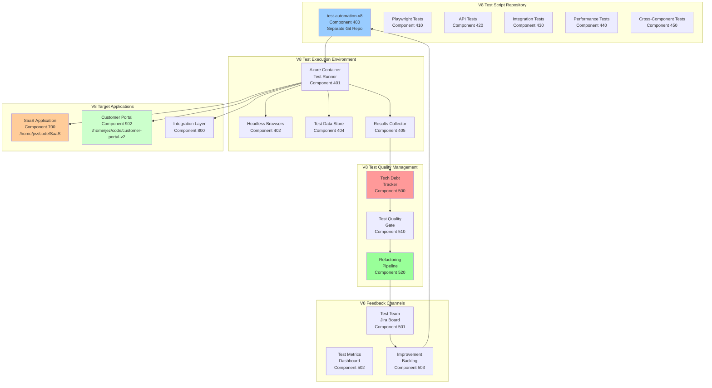

# Test Automation Strategy V8
## Comprehensive Testing Framework for SaaS & Customer Portal Integration

**Version:** 8.0  
**Date:** 2025-09-22  
**Author:** Winston - System Architect  
**Components:** 400-499 (Test Environment), 500-599 (Test Services)

---

## 🎭 Overview

This document defines the comprehensive V8 test automation strategy including:
- Playwright execution across integrated SaaS and Customer Portal environments
- Test script lifecycle management with V8 component tracking
- Technical debt tracking for component-aware test scripts
- Automated feedback loops between SaaS (/home/jez/code/SaaS) and Customer Portal (/home/jez/code/customer-portal-v2)
- Cross-component integration testing strategy

---

## 🏗️ V8 Test Automation Architecture



---

## 🎭 V8 Playwright Azure Integration

### Component 401: V8 Test Runner Container

```dockerfile
# Dockerfile.v8-test-runner
# V8 Playwright test runner for Azure environment
# Components: 401, 402

FROM mcr.microsoft.com/playwright:v1.40.0-focal

# Install V8-specific dependencies
RUN apt-get update && apt-get install -y \
    curl \
    jq \
    git \
    python3-pip \
    postgresql-client \
    && rm -rf /var/lib/apt/lists/*

# Install Azure CLI
RUN curl -sL https://aka.ms/InstallAzureCLIDeb | bash

# Create V8 test user
RUN useradd -m -s /bin/bash v8testrunner && \
    usermod -aG sudo v8testrunner

WORKDIR /tests/v8

# Copy V8 test framework
COPY package*.json ./
RUN npm ci

# Copy V8 test suites
COPY tests/ ./tests/
COPY scripts/ ./scripts/
COPY config/ ./config/
COPY v8-config/ ./v8-config/

# Install Playwright browsers with V8 extensions
RUN npx playwright install --with-deps

# Create V8 results directory
RUN mkdir -p /results/v8 && chown v8testrunner:v8testrunner /results/v8

# Set up V8 environment variables
ENV V8_ENVIRONMENT=test
ENV V8_COMPONENT_TRACKING=enabled
ENV V8_SAAS_PATH=/home/jez/code/SaaS
ENV V8_PORTAL_PATH=/home/jez/code/customer-portal-v2

USER v8testrunner

# Entry point for V8 test execution
ENTRYPOINT ["./scripts/v8-test-runner.sh"]
```

### Component 410: V8 Test Runner Deployment

```yaml
# azure-v8-test-runner-deployment.yaml
apiVersion: apps/v1
kind: Deployment
metadata:
  name: playwright-v8-test-runner
  namespace: test-automation-v8
  labels:
    component: "410"
    version: "8.0"
spec:
  replicas: 5  # Parallel test execution for V8 components
  selector:
    matchLabels:
      app: v8-test-runner
  template:
    metadata:
      labels:
        app: v8-test-runner
        component: "410"
    spec:
      containers:
      - name: playwright-v8-runner
        image: acrsecdevopsdev.azurecr.io/v8-test-runner:latest
        resources:
          requests:
            memory: "4Gi"
            cpu: "4"
          limits:
            memory: "8Gi"
            cpu: "8"
        env:
        - name: V8_TEST_ENV
          value: "azure"
        - name: V8_SAAS_URL
          value: "http://oversight-saas-test.azurecontainer.io"
        - name: V8_PORTAL_URL
          value: "http://oversight-portal-test.azurecontainer.io"
        - name: V8_INTEGRATION_URL
          value: "http://oversight-integration-test.azurecontainer.io"
        - name: V8_PARALLEL_WORKERS
          value: "8"
        - name: V8_COMPONENT_MODE
          value: "cross-component"
        - name: REPORT_PORTAL_URL
          value: "http://reportportal.oversight.io"
        volumeMounts:
        - name: v8-test-results
          mountPath: /results/v8
        - name: v8-test-configs
          mountPath: /config/v8
        - name: v8-codebase-saas
          mountPath: /mnt/saas
          readOnly: true
        - name: v8-codebase-portal
          mountPath: /mnt/portal
          readOnly: true
      - name: v8-results-uploader
        image: acrsecdevopsdev.azurecr.io/v8-results-uploader:latest
        env:
        - name: V8_COMPONENT_TRACKING
          value: "enabled"
        volumeMounts:
        - name: v8-test-results
          mountPath: /results/v8
      volumes:
      - name: v8-test-results
        azureFile:
          secretName: azure-storage-secret
          shareName: v8-test-results
      - name: v8-test-configs
        configMap:
          name: v8-test-configs
      - name: v8-codebase-saas
        gitRepo:
          repository: "https://github.com/organization/SaaS.git"
          revision: "main"
      - name: v8-codebase-portal
        gitRepo:
          repository: "https://github.com/organization/customer-portal-v2.git"
          revision: "main"
```

### Component 420: V8 Playwright Test Execution Script

```typescript
// scripts/playwright/v8-azure-test-executor.ts
// Components: 420, 430, 440
import { chromium, firefox, webkit, Browser, Page } from 'playwright';
import { V8TestConfig, V8TestResult, V8TestMetrics } from './types';
import { V8AzureReporter } from './reporters/v8-azure-reporter';

export class V8AzureTestExecutor {
    private config: V8TestConfig;
    private reporter: V8AzureReporter;
    private browsers: Browser[] = [];
    private v8Metrics: V8TestMetrics = {
        totalTests: 0,
        passed: 0,
        failed: 0,
        skipped: 0,
        flaky: 0,
        duration: 0,
        techDebtScore: 0,
        componentMetrics: {
            saas: { tests: 0, passed: 0, failed: 0, duration: 0 },
            portal: { tests: 0, passed: 0, failed: 0, duration: 0 },
            integration: { tests: 0, passed: 0, failed: 0, duration: 0 }
        }
    };

    constructor(config: V8TestConfig) {
        this.config = config;
        this.reporter = new V8AzureReporter(config);
    }

    async setupV8Environment() {
        console.log('🎭 Setting up V8 Playwright for Azure environment...');
        
        // Launch browsers based on V8 config
        if (this.config.browsers.includes('chromium')) {
            this.browsers.push(await chromium.launch({
                headless: true,
                args: [
                    '--no-sandbox', 
                    '--disable-setuid-sandbox',
                    '--disable-dev-shm-usage',  // V8 Azure optimization
                    '--v8-memory-fraction=0.8'   // V8 memory optimization
                ]
            }));
        }
        
        if (this.config.browsers.includes('firefox')) {
            this.browsers.push(await firefox.launch({ 
                headless: true,
                firefoxUserPrefs: {
                    'javascript.options.wasm': true  // V8 WebAssembly support
                }
            }));
        }
        
        if (this.config.browsers.includes('webkit')) {
            this.browsers.push(await webkit.launch({ headless: true }));
        }

        // Setup V8-specific configurations
        await this.setupV8AzureAuth();
        await this.setupV8TestData();
        await this.setupV8ComponentMapping();
    }

    async executeV8TestSuite(suitePath: string) {
        const suite = await import(suitePath);
        const results: V8TestResult[] = [];
        
        for (const testCase of suite.tests) {
            // V8 Component analysis
            const v8Component = this.identifyV8Component(testCase);
            const techDebtAnalysis = await this.analyzeV8TechDebt(testCase, v8Component);
            
            if (techDebtAnalysis.score > 7) {
                console.warn(`⚠️ High tech debt in V8 test: ${testCase.name} (Component ${v8Component})`);
                await this.createV8RefactorTicket(testCase, techDebtAnalysis, v8Component);
            }

            // Execute V8 test with component tracking
            const result = await this.runV8Test(testCase, v8Component);
            results.push(result);
            
            // Update V8 metrics
            this.updateV8Metrics(result, techDebtAnalysis, v8Component);
        }
        
        return results;
    }

    private identifyV8Component(testCase: any): string {
        // Identify which V8 component this test targets
        if (testCase.file.includes('/saas/') || testCase.name.includes('saas')) {
            return '700'; // SaaS component range
        } else if (testCase.file.includes('/portal/') || testCase.name.includes('portal')) {
            return '902'; // Customer Portal
        } else if (testCase.file.includes('/integration/')) {
            return '800'; // Integration layer
        } else {
            return '400'; // Default test component
        }
    }

    async analyzeV8TechDebt(testCase: any, component: string): Promise<V8TechDebtAnalysis> {
        const analysis: V8TechDebtAnalysis = {
            score: 0,
            issues: [],
            recommendations: [],
            component: component,
            affectedCodebases: []
        };

        // V8-specific tech debt checks
        
        // Check for hardcoded URLs between SaaS and Portal
        if (this.hasHardcodedV8URLs(testCase.code)) {
            analysis.score += 4;
            analysis.issues.push('Hardcoded URLs between SaaS and Portal detected');
            analysis.recommendations.push('Use V8 environment configuration for component URLs');
            analysis.affectedCodebases.push('SaaS', 'Portal');
        }

        // Check for missing V8 component isolation
        if (!testCase.code.includes('component:') && !testCase.code.includes('v8Component')) {
            analysis.score += 3;
            analysis.issues.push('Missing V8 component identification');
            analysis.recommendations.push('Add V8 component metadata to test');
        }

        // Check for cross-component dependencies not properly mocked
        if (this.hasCrossComponentDependencies(testCase.code, component)) {
            analysis.score += 2;
            analysis.issues.push('Unmanaged cross-component dependencies');
            analysis.recommendations.push('Mock external V8 component dependencies');
        }

        // Standard checks from original implementation
        if (this.hasHardcodedValues(testCase.code)) {
            analysis.score += 3;
            analysis.issues.push('Hardcoded values detected');
            analysis.recommendations.push('Extract values to V8 config files');
        }

        if (testCase.code.includes('waitForTimeout') || testCase.code.includes('sleep')) {
            analysis.score += 2;
            analysis.issues.push('Arbitrary waits detected');
            analysis.recommendations.push('Use proper V8 component wait conditions');
        }

        const assertionCount = (testCase.code.match(/expect\(/g) || []).length;
        if (assertionCount < 1) {
            analysis.score += 3;
            analysis.issues.push('No assertions found');
            analysis.recommendations.push('Add meaningful V8 component assertions');
        }

        // V8 specific: Check for proper error handling between components
        if (component !== '400' && !testCase.code.includes('try') && testCase.code.includes('await')) {
            analysis.score += 2;
            analysis.issues.push('Missing error handling for V8 component interactions');
            analysis.recommendations.push('Add try-catch for cross-component calls');
        }

        return analysis;
    }

    private hasHardcodedV8URLs(code: string): boolean {
        const hardcodedPatterns = [
            /http:\/\/localhost:\d+/g,
            /https?:\/\/.*\.azurecontainer\.io/g,
            /http:\/\/.*-saas-/g,
            /http:\/\/.*-portal-/g
        ];
        return hardcodedPatterns.some(pattern => pattern.test(code));
    }

    private hasCrossComponentDependencies(code: string, component: string): boolean {
        // Check if SaaS tests directly call Portal endpoints or vice versa
        if (component.startsWith('7') && code.includes('portal')) {
            return !code.includes('mock') && !code.includes('stub');
        }
        if (component.startsWith('9') && code.includes('saas')) {
            return !code.includes('mock') && !code.includes('stub');
        }
        return false;
    }

    async createV8RefactorTicket(testCase: any, analysis: V8TechDebtAnalysis, component: string) {
        const ticket = {
            project: 'V8_TEST_IMPROVEMENT',
            type: 'Technical Debt',
            priority: this.getPriorityFromScore(analysis.score),
            summary: `V8 Refactor test: ${testCase.name} (Component ${component})`,
            description: this.formatV8RefactorDescription(testCase, analysis, component),
            labels: ['v8-test-debt', 'automated-detection', 'playwright', `component-${component}`],
            customFields: {
                techDebtScore: analysis.score,
                testFile: testCase.file,
                testName: testCase.name,
                v8Component: component,
                affectedCodebases: analysis.affectedCodebases.join(',')
            }
        };

        await this.reporter.createJiraTicket(ticket);
    }

    private formatV8RefactorDescription(testCase: any, analysis: V8TechDebtAnalysis, component: string): string {
        return `
## V8 Test Requiring Refactor
**Test Name:** ${testCase.name}
**File:** ${testCase.file}
**V8 Component:** ${component}
**Tech Debt Score:** ${analysis.score}/10
**Affected Codebases:** ${analysis.affectedCodebases.join(', ')}

## Issues Detected
${analysis.issues.map(issue => `- ${issue}`).join('\n')}

## V8-Specific Recommendations
${analysis.recommendations.map(rec => `- ${rec}`).join('\n')}

## Current Test Code
\`\`\`typescript
${testCase.code}
\`\`\`

## Suggested V8 Refactored Structure
\`\`\`typescript
// V8 Component: ${component}
// Codebases: ${analysis.affectedCodebases.join(', ')}

test('${testCase.name}', async ({ page }) => {
  // V8 component identification
  const v8Component = '${component}';
  
  // Use V8 configuration
  const config = await getV8Config(v8Component);
  
  // Mock cross-component dependencies
  await mockV8ComponentDependencies(page, v8Component);
  
  // Execute test with proper V8 assertions
  // TODO: Apply recommendations above
});
\`\`\`
        `;
    }

    private updateV8Metrics(result: V8TestResult, techDebtAnalysis: V8TechDebtAnalysis, component: string) {
        this.v8Metrics.totalTests++;
        if (result.status === 'passed') {
            this.v8Metrics.passed++;
        } else {
            this.v8Metrics.failed++;
        }

        // Update component-specific metrics
        const componentType = this.getComponentType(component);
        if (this.v8Metrics.componentMetrics[componentType]) {
            this.v8Metrics.componentMetrics[componentType].tests++;
            if (result.status === 'passed') {
                this.v8Metrics.componentMetrics[componentType].passed++;
            } else {
                this.v8Metrics.componentMetrics[componentType].failed++;
            }
            this.v8Metrics.componentMetrics[componentType].duration += result.duration;
        }

        this.v8Metrics.techDebtScore += techDebtAnalysis.score;
    }

    private getComponentType(component: string): string {
        if (component.startsWith('7')) return 'saas';
        if (component.startsWith('9')) return 'portal';
        if (component.startsWith('8')) return 'integration';
        return 'test';
    }

    async setupV8AzureAuth() {
        // V8-specific Azure authentication setup
        console.log('🔐 Setting up V8 Azure authentication...');
        // Implementation for V8 Azure auth
    }

    async setupV8TestData() {
        // V8-specific test data setup
        console.log('📊 Setting up V8 test data...');
        // Implementation for V8 test data
    }

    async setupV8ComponentMapping() {
        // Setup V8 component mapping for cross-component tests
        console.log('🗺️ Setting up V8 component mapping...');
        // Implementation for V8 component mapping
    }

    async runV8Test(testCase: any, component: string): Promise<V8TestResult> {
        // Implementation for running V8 tests with component tracking
        const startTime = Date.now();
        
        try {
            // Execute test with V8 component context
            const result = await this.executeTestWithV8Context(testCase, component);
            
            return {
                name: testCase.name,
                status: 'passed',
                duration: Date.now() - startTime,
                component: component,
                assertions: result.assertions || 0,
                screenshots: result.screenshots || []
            };
        } catch (error) {
            return {
                name: testCase.name,
                status: 'failed',
                duration: Date.now() - startTime,
                component: component,
                error: error.message,
                assertions: 0,
                screenshots: []
            };
        }
    }

    private async executeTestWithV8Context(testCase: any, component: string): Promise<any> {
        // Implementation for executing test with V8 component context
        return { assertions: 1, screenshots: [] };
    }

    private getPriorityFromScore(score: number): string {
        if (score >= 8) return 'High';
        if (score >= 5) return 'Medium';
        return 'Low';
    }

    private hasHardcodedValues(code: string): boolean {
        return /(['"])[^'"]*\1/.test(code) && !/config|env|const/.test(code);
    }
}

// V8 Test Suite Analyzer for bulk analysis
export class V8TestSuiteAnalyzer {
    async analyzeV8Repository(repoPath: string) {
        console.log('📊 Analyzing V8 test repository for technical debt...');
        
        const report = {
            timestamp: new Date().toISOString(),
            version: '8.0',
            totalTests: 0,
            highDebtTests: [],
            mediumDebtTests: [],
            lowDebtTests: [],
            componentBreakdown: {
                saas: { total: 0, highDebt: 0, mediumDebt: 0, lowDebt: 0 },
                portal: { total: 0, highDebt: 0, mediumDebt: 0, lowDebt: 0 },
                integration: { total: 0, highDebt: 0, mediumDebt: 0, lowDebt: 0 }
            },
            topIssues: {},
            estimatedRefactorHours: 0,
            crossComponentIssues: []
        };

        // Scan all V8 test files
        const testFiles = await this.findV8TestFiles(repoPath);
        
        for (const file of testFiles) {
            const analysis = await this.analyzeV8TestFile(file);
            report.totalTests += analysis.testCount;
            
            // Categorize by debt level and component
            analysis.tests.forEach(test => {
                const componentType = this.getComponentType(test.component);
                report.componentBreakdown[componentType].total++;
                
                if (test.debtScore > 7) {
                    report.highDebtTests.push(test);
                    report.componentBreakdown[componentType].highDebt++;
                    report.estimatedRefactorHours += 6; // V8 refactoring is more complex
                } else if (test.debtScore > 4) {
                    report.mediumDebtTests.push(test);
                    report.componentBreakdown[componentType].mediumDebt++;
                    report.estimatedRefactorHours += 3;
                } else {
                    report.lowDebtTests.push(test);
                    report.componentBreakdown[componentType].lowDebt++;
                    report.estimatedRefactorHours += 1;
                }
                
                // Track top issues
                test.issues.forEach(issue => {
                    report.topIssues[issue] = (report.topIssues[issue] || 0) + 1;
                });

                // Track cross-component issues
                if (test.issues.some(issue => issue.includes('cross-component'))) {
                    report.crossComponentIssues.push({
                        test: test.name,
                        component: test.component,
                        issues: test.issues.filter(issue => issue.includes('cross-component'))
                    });
                }
            });
        }
        
        return report;
    }

    private async findV8TestFiles(repoPath: string): Promise<string[]> {
        // Implementation to find V8 test files
        return [];
    }

    private async analyzeV8TestFile(file: string): Promise<any> {
        // Implementation to analyze V8 test file
        return { testCount: 0, tests: [] };
    }

    private getComponentType(component: string): string {
        if (component.startsWith('7')) return 'saas';
        if (component.startsWith('9')) return 'portal';
        if (component.startsWith('8')) return 'integration';
        return 'test';
    }
}

// V8 Types
interface V8TestConfig {
    browsers: string[];
    environment: string;
    componentMode: string;
    saasUrl: string;
    portalUrl: string;
    integrationUrl: string;
}

interface V8TestResult {
    name: string;
    status: 'passed' | 'failed' | 'skipped';
    duration: number;
    component: string;
    error?: string;
    assertions: number;
    screenshots: string[];
}

interface V8TestMetrics {
    totalTests: number;
    passed: number;
    failed: number;
    skipped: number;
    flaky: number;
    duration: number;
    techDebtScore: number;
    componentMetrics: {
        saas: { tests: number; passed: number; failed: number; duration: number };
        portal: { tests: number; passed: number; failed: number; duration: number };
        integration: { tests: number; passed: number; failed: number; duration: number };
    };
}

interface V8TechDebtAnalysis {
    score: number;
    issues: string[];
    recommendations: string[];
    component: string;
    affectedCodebases: string[];
}
```

---

## 🔄 V8 Test Script Improvement Workflow

### Component 500: Separate V8 Test Script Repository

```yaml
# test-automation-v8-suite repository structure
test-automation-v8-suite/
├── .github/
│   └── workflows/
│       ├── v8-test-quality-check.yml
│       └── v8-test-promotion.yml
├── playwright/
│   ├── tests/
│   │   ├── saas/                    # Component 700-799 tests
│   │   │   ├── smoke/
│   │   │   ├── regression/
│   │   │   ├── e2e/
│   │   │   └── performance/
│   │   ├── portal/                  # Component 900-999 tests
│   │   │   ├── smoke/
│   │   │   ├── regression/
│   │   │   ├── e2e/
│   │   │   └── performance/
│   │   ├── integration/             # Component 800-899 tests
│   │   │   ├── saas-portal/
│   │   │   ├── api-integration/
│   │   │   └── data-flow/
│   │   └── cross-component/         # Multi-component tests
│   ├── pages/                       # V8 Page Object Models
│   │   ├── saas/
│   │   ├── portal/
│   │   └── shared/
│   ├── fixtures/                    # V8 Test data
│   │   ├── saas-data/
│   │   ├── portal-data/
│   │   └── integration-data/
│   └── utils/                       # V8 Helper functions
├── api-tests/
│   ├── saas-collections/
│   ├── portal-collections/
│   └── integration-collections/
├── performance/
│   ├── k6-scripts/
│   │   ├── saas-load/
│   │   ├── portal-load/
│   │   └── cross-component-load/
│   └── jmeter/
├── v8-test-management/
│   ├── v8-tech-debt-tracker.json
│   ├── v8-test-metrics.json
│   ├── v8-component-mapping.json
│   └── v8-improvement-backlog.md
├── config/
│   ├── v8-playwright.config.ts
│   ├── v8-environments.json
│   └── v8-component-config.json
└── scripts/
    ├── v8-analyze-debt.sh
    ├── v8-refactor-test.sh
    ├── v8-promote-tests.sh
    └── v8-cross-component-sync.sh
```

### Component 510: V8 Test Script Promotion Pipeline

```groovy
// Jenkinsfile.v8-test-automation
pipeline {
    agent any
    
    environment {
        V8_SAAS_REPO = '/home/jez/code/SaaS'
        V8_PORTAL_REPO = '/home/jez/code/customer-portal-v2'
        V8_TEST_SUITE = 'test-automation-v8-suite'
    }
    
    stages {
        stage('V8 Test Quality Analysis') {
            steps {
                script {
                    // Analyze V8 test scripts for tech debt
                    sh '''
                        npm run analyze:v8-tech-debt
                        npm run lint:v8-tests
                        npm run test:v8-dry-run
                    '''
                    
                    // Check V8 quality gates
                    def v8DebtReport = readJSON file: 'v8-tech-debt-report.json'
                    if (v8DebtReport.highDebtTests.size() > 10) {
                        error("Too many high-debt V8 tests. Refactoring required.")
                    }
                    
                    // Check cross-component compatibility
                    if (v8DebtReport.crossComponentIssues.size() > 5) {
                        error("Cross-component issues detected. Review required.")
                    }
                }
            }
        }
        
        stage('V8 Test Validation') {
            parallel {
                stage('V8 Syntax Check') {
                    steps {
                        sh 'npm run test:v8-syntax'
                    }
                }
                stage('V8 Selector Validation') {
                    steps {
                        sh 'npm run validate:v8-selectors'
                    }
                }
                stage('V8 Data Validation') {
                    steps {
                        sh 'npm run validate:v8-test-data'
                    }
                }
                stage('V8 Component Mapping') {
                    steps {
                        sh 'npm run validate:v8-component-mapping'
                    }
                }
            }
        }
        
        stage('V8 Codebase Sync Check') {
            steps {
                script {
                    // Check if SaaS and Portal codebases are in sync
                    sh '''
                        echo "Checking V8 codebase synchronization..."
                        
                        # Get latest commits from both repos
                        SAAS_COMMIT=$(cd ${V8_SAAS_REPO} && git rev-parse HEAD)
                        PORTAL_COMMIT=$(cd ${V8_PORTAL_REPO} && git rev-parse HEAD)
                        
                        echo "SaaS Commit: $SAAS_COMMIT"
                        echo "Portal Commit: $PORTAL_COMMIT"
                        
                        # Validate test compatibility with current codebases
                        npm run test:v8-codebase-compatibility
                    '''
                }
            }
        }
        
        stage('V8 Dry Run in Isolated Environment') {
            steps {
                script {
                    // Run V8 tests against mock environment
                    sh '''
                        docker-compose -f docker-compose.v8-test-isolation.yml up -d
                        npm run test:v8-isolated
                        docker-compose -f docker-compose.v8-test-isolation.yml down
                    '''
                }
            }
        }
        
        stage('Deploy V8 Tests to Environment') {
            when {
                branch 'main'
            }
            steps {
                script {
                    // Deploy V8 test scripts to Azure
                    sh '''
                        docker build -f Dockerfile.v8-test-runner -t v8-test-runner:${BUILD_NUMBER} .
                        docker tag v8-test-runner:${BUILD_NUMBER} ${ACR_NAME}/v8-test-runner:${BUILD_NUMBER}
                        docker push ${ACR_NAME}/v8-test-runner:${BUILD_NUMBER}
                        
                        kubectl set image deployment/playwright-v8-test-runner \
                            playwright-v8-runner=${ACR_NAME}/v8-test-runner:${BUILD_NUMBER} \
                            -n test-automation-v8
                    '''
                }
            }
        }
        
        stage('Execute V8 Test Suite') {
            parallel {
                stage('SaaS Component Tests') {
                    steps {
                        sh '''
                            kubectl exec -it deployment/playwright-v8-test-runner \
                                -n test-automation-v8 -- \
                                npm run test:v8-saas
                        '''
                    }
                }
                stage('Portal Component Tests') {
                    steps {
                        sh '''
                            kubectl exec -it deployment/playwright-v8-test-runner \
                                -n test-automation-v8 -- \
                                npm run test:v8-portal
                        '''
                    }
                }
                stage('Integration Tests') {
                    steps {
                        sh '''
                            kubectl exec -it deployment/playwright-v8-test-runner \
                                -n test-automation-v8 -- \
                                npm run test:v8-integration
                        '''
                    }
                }
                stage('Cross-Component Tests') {
                    steps {
                        sh '''
                            kubectl exec -it deployment/playwright-v8-test-runner \
                                -n test-automation-v8 -- \
                                npm run test:v8-cross-component
                        '''
                    }
                }
            }
        }
        
        stage('V8 Collect Feedback') {
            steps {
                script {
                    // Analyze V8 test execution results
                    sh '''
                        node scripts/collect-v8-test-feedback.js
                        node scripts/create-v8-improvement-tickets.js
                        node scripts/sync-v8-codebase-issues.js
                    '''
                }
            }
        }
    }
    
    post {
        always {
            // Archive V8 test reports and metrics
            archiveArtifacts artifacts: '**/v8-test-results/**'
            publishHTML([
                reportDir: 'v8-playwright-report',
                reportFiles: 'index.html',
                reportName: 'V8 Playwright Report'
            ])
            
            // Update V8 test metrics dashboard
            sh 'node scripts/update-v8-test-metrics.js'
        }
    }
}
```

---

## 📊 V8 Tech Debt Tracking System

### Component 500: V8 Test Debt Database Schema

```sql
-- V8 Test technical debt tracking
CREATE TABLE v8_test_tech_debt (
    id UUID PRIMARY KEY DEFAULT gen_random_uuid(),
    test_file VARCHAR(500),
    test_name VARCHAR(500),
    v8_component VARCHAR(10),
    debt_score INTEGER,
    issues JSONB,
    recommendations JSONB,
    affected_codebases JSONB,
    cross_component_issues JSONB,
    first_detected TIMESTAMP DEFAULT CURRENT_TIMESTAMP,
    last_analyzed TIMESTAMP DEFAULT CURRENT_TIMESTAMP,
    refactor_status VARCHAR(50) DEFAULT 'pending',
    assigned_to VARCHAR(100),
    estimated_hours DECIMAL(5,2),
    actual_hours DECIMAL(5,2),
    refactor_pr_url VARCHAR(500),
    notes TEXT
);

-- V8 Test execution metrics
CREATE TABLE v8_test_execution_metrics (
    id UUID PRIMARY KEY DEFAULT gen_random_uuid(),
    test_id VARCHAR(500),
    v8_component VARCHAR(10),
    execution_time_ms INTEGER,
    memory_usage_mb INTEGER,
    success_rate DECIMAL(5,2),
    flakiness_score DECIMAL(5,2),
    last_10_results JSONB,
    environment VARCHAR(50),
    browser VARCHAR(50),
    codebase_version JSONB,
    created_at TIMESTAMP DEFAULT CURRENT_TIMESTAMP
);

-- V8 Cross-component test tracking
CREATE TABLE v8_cross_component_tests (
    id UUID PRIMARY KEY DEFAULT gen_random_uuid(),
    test_name VARCHAR(500),
    involved_components JSONB,
    saas_version VARCHAR(50),
    portal_version VARCHAR(50),
    success_rate DECIMAL(5,2),
    avg_execution_time_ms INTEGER,
    last_run TIMESTAMP,
    issues JSONB,
    dependencies JSONB
);

-- V8 Component health tracking
CREATE TABLE v8_component_health (
    id UUID PRIMARY KEY DEFAULT gen_random_uuid(),
    component_id VARCHAR(10),
    component_type VARCHAR(50), -- saas, portal, integration
    codebase_path VARCHAR(500),
    test_coverage DECIMAL(5,2),
    debt_score DECIMAL(5,2),
    last_updated TIMESTAMP DEFAULT CURRENT_TIMESTAMP,
    issues_count INTEGER,
    blockers_count INTEGER
);

-- Create indexes for V8 performance
CREATE INDEX idx_v8_test_debt_component ON v8_test_tech_debt(v8_component);
CREATE INDEX idx_v8_test_debt_score ON v8_test_tech_debt(debt_score DESC);
CREATE INDEX idx_v8_test_debt_status ON v8_test_tech_debt(refactor_status);
CREATE INDEX idx_v8_test_metrics_component ON v8_test_execution_metrics(v8_component);
CREATE INDEX idx_v8_test_metrics_flaky ON v8_test_execution_metrics(flakiness_score DESC);
CREATE INDEX idx_v8_cross_component_success ON v8_cross_component_tests(success_rate);
```

### Component 502: V8 Tech Debt Dashboard

```typescript
// scripts/dashboard/v8-tech-debt-dashboard.ts
import { Dashboard, Panel, Query } from '@grafana/toolkit';

export class V8TechDebtDashboard {
    create(): Dashboard {
        return new Dashboard({
            title: 'V8 Test Automation Tech Debt',
            tags: ['v8', 'testing', 'tech-debt'],
            panels: [
                this.createV8DebtScorePanel(),
                this.createV8ComponentBreakdownPanel(),
                this.createV8CrossComponentIssuesPanel(),
                this.createV8CodebaseSyncPanel(),
                this.createV8FlakinessPanel(),
                this.createV8PerformancePanel()
            ]
        });
    }

    private createV8DebtScorePanel(): Panel {
        return new Panel({
            title: 'V8 Overall Tech Debt Score',
            type: 'gauge',
            query: `
                SELECT 
                    AVG(debt_score) as avg_score,
                    COUNT(*) FILTER (WHERE debt_score > 7) as high_debt_count,
                    COUNT(*) FILTER (WHERE debt_score BETWEEN 4 AND 7) as medium_debt_count,
                    COUNT(*) FILTER (WHERE debt_score < 4) as low_debt_count,
                    COUNT(*) FILTER (WHERE cross_component_issues IS NOT NULL) as cross_component_count
                FROM v8_test_tech_debt
                WHERE refactor_status != 'completed'
            `
        });
    }

    private createV8ComponentBreakdownPanel(): Panel {
        return new Panel({
            title: 'V8 Tech Debt by Component',
            type: 'bar',
            query: `
                SELECT 
                    CASE 
                        WHEN v8_component LIKE '7%' THEN 'SaaS'
                        WHEN v8_component LIKE '9%' THEN 'Portal'
                        WHEN v8_component LIKE '8%' THEN 'Integration'
                        ELSE 'Test'
                    END as component_type,
                    AVG(debt_score) as avg_debt_score,
                    COUNT(*) as test_count,
                    COUNT(*) FILTER (WHERE debt_score > 7) as high_debt_count
                FROM v8_test_tech_debt
                WHERE refactor_status = 'pending'
                GROUP BY component_type
                ORDER BY avg_debt_score DESC
            `
        });
    }

    private createV8CrossComponentIssuesPanel(): Panel {
        return new Panel({
            title: 'V8 Cross-Component Issues',
            type: 'table',
            query: `
                SELECT 
                    test_name,
                    involved_components,
                    success_rate,
                    avg_execution_time_ms,
                    last_run,
                    ARRAY_LENGTH(issues, 1) as issue_count
                FROM v8_cross_component_tests
                WHERE success_rate < 95 OR ARRAY_LENGTH(issues, 1) > 0
                ORDER BY success_rate ASC, issue_count DESC
                LIMIT 20
            `
        });
    }

    private createV8CodebaseSyncPanel(): Panel {
        return new Panel({
            title: 'V8 Codebase Synchronization Status',
            type: 'stat',
            query: `
                SELECT 
                    COUNT(*) FILTER (WHERE saas_version = portal_version) as synchronized_tests,
                    COUNT(*) FILTER (WHERE saas_version != portal_version) as out_of_sync_tests,
                    COUNT(*) as total_tests
                FROM v8_cross_component_tests
                WHERE last_run > NOW() - INTERVAL '24 hours'
            `
        });
    }

    private createV8FlakinessPanel(): Panel {
        return new Panel({
            title: 'V8 Flaky Tests by Component',
            type: 'table',
            query: `
                SELECT 
                    test_id,
                    v8_component,
                    flakiness_score,
                    success_rate,
                    execution_time_ms,
                    environment
                FROM v8_test_execution_metrics
                WHERE flakiness_score > 0.2
                ORDER BY flakiness_score DESC, v8_component
                LIMIT 30
            `
        });
    }

    private createV8PerformancePanel(): Panel {
        return new Panel({
            title: 'V8 Test Performance Trends',
            type: 'timeseries',
            query: `
                SELECT 
                    created_at,
                    v8_component,
                    AVG(execution_time_ms) as avg_execution_time,
                    AVG(memory_usage_mb) as avg_memory_usage
                FROM v8_test_execution_metrics
                WHERE created_at > NOW() - INTERVAL '7 days'
                GROUP BY created_at, v8_component
                ORDER BY created_at
            `
        });
    }
}
```

---

## 🔄 V8 Test Improvement Feedback Loop

### Component 503: V8 Automated Test Improvement Workflow

```bash
#!/bin/bash
# scripts/v8-test-improvement-workflow.sh
# V8 Test Improvement with Cross-Component Awareness

set -e

# V8 Configuration
V8_TEST_REPO="https://github.com/org/test-automation-v8-suite.git"
V8_SAAS_REPO="/home/jez/code/SaaS"
V8_PORTAL_REPO="/home/jez/code/customer-portal-v2"
V8_IMPROVEMENT_BRANCH="v8-improvement/automated-${BUILD_NUMBER}"

echo "🔄 Starting V8 Test Improvement Workflow"

# Step 1: Clone V8 test repository
git clone $V8_TEST_REPO v8-test-suite
cd v8-test-suite

# Step 2: Create V8 improvement branch
git checkout -b $V8_IMPROVEMENT_BRANCH

# Step 3: Check V8 codebase synchronization
echo "🔍 Checking V8 codebase synchronization..."
SAAS_COMMIT=$(cd $V8_SAAS_REPO && git rev-parse HEAD)
PORTAL_COMMIT=$(cd $V8_PORTAL_REPO && git rev-parse HEAD)

echo "SaaS Commit: $SAAS_COMMIT"
echo "Portal Commit: $PORTAL_COMMIT"

# Update V8 component configuration
cat > v8-config/codebase-versions.json << EOF
{
  "saas": {
    "commit": "$SAAS_COMMIT",
    "path": "$V8_SAAS_REPO",
    "components": ["700-799"]
  },
  "portal": {
    "commit": "$PORTAL_COMMIT", 
    "path": "$V8_PORTAL_REPO",
    "components": ["900-999"]
  },
  "updated_at": "$(date -Iseconds)"
}
EOF

# Step 4: Run V8 automated improvements
echo "🤖 Running V8 automated improvements..."

# Fix V8 hardcoded values
node scripts/refactor/extract-v8-hardcoded-values.js

# Convert arbitrary waits to proper V8 component conditions
node scripts/refactor/fix-v8-waits.js

# Add missing V8 component assertions
node scripts/refactor/add-v8-assertions.js

# Extract duplicate selectors to V8 page objects
node scripts/refactor/create-v8-page-objects.js

# Fix cross-component dependencies
node scripts/refactor/fix-v8-cross-component-deps.js

# Update V8 component mappings
node scripts/refactor/update-v8-component-mappings.js

# Step 5: Validate V8 improvements
echo "✅ Validating V8 improvements..."
npm run test:v8-syntax
npm run test:v8-dry-run
npm run validate:v8-component-mapping

# Step 6: Calculate V8 improvement metrics
BEFORE_METRICS=$(git show HEAD:v8-test-metrics.json)
AFTER_METRICS=$(npm run metrics:v8-calculate --silent)

node scripts/calculate-v8-improvement.js \
    --before "$BEFORE_METRICS" \
    --after "$AFTER_METRICS" \
    --saas-commit "$SAAS_COMMIT" \
    --portal-commit "$PORTAL_COMMIT" \
    > v8-improvement-report.json

# Step 7: Create V8 pull request
echo "📝 Creating V8 pull request..."
git add .
git commit -m "v8-test: Automated V8 test improvements

- Extracted V8 hardcoded values to component config
- Fixed arbitrary waits with proper V8 component conditions
- Added missing V8 component assertions
- Created V8 page objects for common patterns
- Fixed cross-component dependencies
- Updated V8 component mappings

SaaS Commit: $SAAS_COMMIT
Portal Commit: $PORTAL_COMMIT
Tech debt score improved by $(jq .improvement_percentage v8-improvement-report.json)%"

git push origin $V8_IMPROVEMENT_BRANCH

gh pr create \
    --title "V8 Automated Test Improvements - Build #${BUILD_NUMBER}" \
    --body "$(cat v8-improvement-report.json | jq -r .summary)" \
    --label "v8-test-improvement,automated,cross-component" \
    --reviewer "v8-test-team"

echo "✅ V8 test improvement workflow completed"
```

### V8 Test Improvement Metrics

```yaml
V8 Key Metrics:
  - V8 Tech Debt Score Trend (weekly)
  - Cross-Component Test Flakiness Rate
  - Average V8 Test Execution Time
  - V8 Test Maintenance Hours per Sprint
  - Automated vs Manual V8 Improvements
  - V8 Test Coverage vs Quality Score
  - SaaS-Portal Integration Test Success Rate
  - Component Isolation Score

V8 Success Criteria:
  - Tech debt score < 4 for 80% of V8 tests
  - Cross-component flakiness rate < 3%
  - Zero hardcoded values in V8 tests
  - All V8 tests use proper component identification
  - 100% of V8 tests have meaningful component assertions
  - SaaS-Portal integration success rate > 98%
  - Component isolation score > 95%
```

---

## 🚀 V8 Quick Reference

### Analyze V8 Test Tech Debt
```bash
# Full V8 repository analysis
npm run analyze:v8-tech-debt

# Single V8 file analysis
npm run analyze:v8-file tests/saas/login.spec.ts

# V8 component-specific analysis
npm run analyze:v8-component 700

# Generate V8 improvement plan
npm run generate:v8-improvement-plan

# Check V8 codebase sync status
npm run check:v8-codebase-sync
```

### Deploy V8 Test Updates
```bash
# Deploy V8 test runner
./scripts/deploy-v8-test-runner.sh

# Run V8 specific test suite
kubectl exec -it playwright-v8-test-runner -- npm run test:v8-saas
kubectl exec -it playwright-v8-test-runner -- npm run test:v8-portal
kubectl exec -it playwright-v8-test-runner -- npm run test:v8-integration

# Collect V8 results
./scripts/collect-v8-test-results.sh
```

### Track V8 Improvements
```bash
# View V8 tech debt dashboard
open http://grafana.oversight.io/d/v8-test-tech-debt

# Check V8 improvement metrics
psql -d v8_test_metrics -c "SELECT * FROM v8_test_improvements WHERE implementation_date > CURRENT_DATE - 30"

# Review V8 pending refactors
npm run report:v8-pending-refactors

# Monitor V8 cross-component health
npm run monitor:v8-cross-component-health
```

---

This comprehensive V8 test automation management strategy ensures that test scripts are properly managed across the integrated SaaS and Customer Portal codebase, with technical debt tracking, cross-component awareness, and automated improvements flowing through a dedicated pipeline that maintains synchronization between /home/jez/code/SaaS and /home/jez/code/customer-portal-v2.