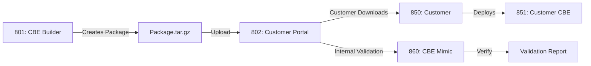

# Complete SecDevOps CI/CD Architecture - Version 3
## Numbered Components with Azure-Native Tools

**Version:** 3.0  
**Date:** 2025-09-21  
**Status:** Final Implementation Blueprint with Component IDs

---

## 🏗️ Complete System Architecture - Numbered Components

```mermaid
graph TB
    %% Development Layer [100-199]
    subgraph "Development Environments [100]"
        DEV1[101: Local Developer<br/>VSCode + .env.local]
        DEV2[102: Claude Code<br/>Development]
        AVD[103: Azure AVD Instance<br/>52.149.134.219]
        
        DEV1 -->|git push| GITHUB
        DEV2 -->|git push| GITHUB
        AVD -->|git push| GITHUB
    end

    %% Source Control & Test Automation [200-299]
    subgraph "Source Control [200]"
        GITHUB[201: GitHub Main Repo<br/>oversight-mvp]
        TEST_REPO[202: Test Automation Repo<br/>test-automation-suite<br/>Separate Lifecycle]
        TEST_CAT[203: Test Catalogue<br/>Jest, Playwright, Code Tests<br/>/Oversight-MVP-09-04]
        
        GITHUB -->|Webhook| JENKINS
        TEST_REPO -->|Separate Pipeline| TEST_JENKINS
        TEST_CAT --> TEST_JENKINS
    end

    %% CI/CD Pipeline [300-399]
    subgraph "Jenkins CI/CD Pipeline [300]"
        JENKINS[301: Jenkins Master<br/>vm-jenkins-dev]
        
        JENKINS --> STAGE1{302: Environment<br/>Config}
        STAGE1 -->|.env.test| VAULT_TEST[303: HashiCorp Vault<br/>Test Secrets]
        STAGE1 -->|.env.saas| ASM[304: Azure Secrets<br/>Manager]
        STAGE1 -->|.env.cbe| VAULT_CBE[305: HashiCorp Vault<br/>CBE Secrets]
        
        VAULT_TEST --> BUILD[306: Docker Build<br/>Multi-stage]
        ASM --> BUILD
        VAULT_CBE --> BUILD
        
        BUILD --> SEC_SUITE[307: Security Suite]
        
        subgraph "Security Scanning Tools [307]"
            TRUFFLEHOG[307.1: TruffleHog<br/>Secret Detection]
            SONARQUBE[307.2: SonarQube<br/>Code Quality]
            SNYK[307.3: Snyk<br/>Dependency Check]
            SEMGREP[307.4: Semgrep<br/>SAST]
            TRIVY[307.5: Trivy<br/>Container Scan]
            CHECKOV[307.6: Checkov<br/>IaC Scan]
            GITLEAKS[307.7: GitLeaks<br/>Git History]
        end
        
        SEC_SUITE --> ACR[308: Azure Container<br/>Registry<br/>acrsecdevopsdev]
    end

    %% Test Environment [400-499]
    subgraph "Test Environment - ACS [400]"
        ACR --> TEST_ENV[401: Azure Container<br/>Instance - Test]
        TEST_ENV <-->|Runtime Secrets| VAULT_TEST
        
        subgraph "Test Data Management [410]"
            DB_STATE1[411: DB State 1<br/>Schema Only]
            DB_STATE2[412: DB State 2<br/>Framework Data]
            DB_STATE3[413: DB State 3<br/>Full Test Data]
        end
        
        TEST_ENV --> DB_STATE1
        TEST_ENV --> DB_STATE2
        TEST_ENV --> DB_STATE3
        
        subgraph "File API Testing [420]"
            FILE_API[421: File Processing API]
            TEST_FILES[422: Test File Store]
            FILE_HARNESS[423: Test Harness]
        end
        
        TEST_ENV --> FILE_API
        FILE_API --> TEST_FILES
        FILE_HARNESS --> FILE_API
    end

    %% Test Execution & Feedback [500-599]
    subgraph "Test Execution & Feedback [500]"
        TEST_JENKINS[501: Test Automation<br/>Jenkins]
        
        subgraph "Test Types [510]"
            PLAYWRIGHT[511: Playwright Tests<br/>E2E/UI]
            JEST[512: Jest Tests<br/>Unit/Integration]
            CODE_TESTS[513: Code Tests<br/>Pure Functions]
            API_TESTS[514: API Tests<br/>REST/GraphQL]
        end
        
        TEST_JENKINS --> PLAYWRIGHT
        TEST_JENKINS --> JEST
        TEST_JENKINS --> CODE_TESTS
        TEST_JENKINS --> API_TESTS
        
        BROWSER_ACCESS[520: Browser Access<br/>VNC/NoVNC]
        CONSOLE_LOG[521: Console Access<br/>Fluent Bit + WebSocket]
        
        PLAYWRIGHT --> TEST_ENV
        JEST --> TEST_ENV
        CODE_TESTS --> TEST_ENV
        API_TESTS --> TEST_ENV
        BROWSER_ACCESS --> TEST_ENV
        CONSOLE_LOG --> TEST_ENV
        
        subgraph "Azure Feedback Tools [530]"
            TEST_FEEDBACK[531: Test Results<br/>Analyzer]
            DEVOPS_BOARDS[532: Azure DevOps<br/>Boards - App Bugs]
            DEVOPS_OPS[533: Azure DevOps<br/>Ops Issues]
            DEVOPS_TEST[534: Azure DevOps<br/>Test Debt]
        end
        
        PLAYWRIGHT --> TEST_FEEDBACK
        JEST --> TEST_FEEDBACK
        CODE_TESTS --> TEST_FEEDBACK
        API_TESTS --> TEST_FEEDBACK
        
        TEST_FEEDBACK --> DEVOPS_BOARDS
        TEST_FEEDBACK --> DEVOPS_OPS
        TEST_FEEDBACK --> DEVOPS_TEST
        
        DEVOPS_BOARDS -->|Fix in Code| GITHUB
        DEVOPS_OPS -->|Fix Environment| TEST_ENV
        DEVOPS_TEST -->|Refactor Tests| TEST_REPO
    end

    %% Deployment Gate [600]
    TEST_ENV -->|Approval| DEPLOY_GATE{600: Deployment<br/>Decision Gate}
    
    %% Track 1: SaaS Production [700-799]
    subgraph "Track 1: SaaS Production [700]"
        DEPLOY_GATE -->|SaaS Track| SAAS_BUILD[701: Azure App Service<br/>Environment]
        SAAS_BUILD <-->|Secrets| ASM_PROD[702: Azure Secrets<br/>Manager Prod]
        
        subgraph "SaaS Infrastructure [710]"
            PG_MANAGED[711: Azure PostgreSQL<br/>Managed Service]
            TENANT_ROUTER[712: Multi-Tenant<br/>Router]
            APP_GATEWAY[713: Application Gateway<br/>172.178.53.198]
            WAF[714: Web Application<br/>Firewall]
        end
        
        SAAS_BUILD --> PG_MANAGED
        SAAS_BUILD --> TENANT_ROUTER
        TENANT_ROUTER --> APP_GATEWAY
        APP_GATEWAY --> WAF
        
        subgraph "SaaS Access [720]"
            BASTION_SAAS[721: Azure Bastion<br/>Browser Access]
            CONSOLE_SAAS[722: Console Logs<br/>Log Analytics]
        end
        
        BASTION_SAAS --> SAAS_BUILD
        CONSOLE_SAAS --> SAAS_BUILD
    end
    
    %% Track 2: CBE Package & Customer Portal [800-899]
    subgraph "Track 2: CBE Package Creation [800]"
        DEPLOY_GATE -->|CBE Track| CBE_BUILDER[801: CBE Package<br/>Builder Service]
        
        CBE_BUILDER --> CUST_PORTAL[802: Customer Portal<br/>customer-portal-v2]
        
        subgraph "Package Components [810]"
            PKG_VAULT[811: Vault Config]
            PKG_PG[812: PostgreSQL Scripts]
            PKG_DOCKER[813: Docker Compose]
            PKG_SCRIPTS[814: Deploy Scripts]
        end
        
        CBE_BUILDER --> PKG_VAULT
        CBE_BUILDER --> PKG_PG
        CBE_BUILDER --> PKG_DOCKER
        CBE_BUILDER --> PKG_SCRIPTS
    end
    
    %% Customer Download & Deploy [850]
    CUST_PORTAL -->|Customer Downloads| CUSTOMER[850: Customer<br/>Downloads Package]
    CUSTOMER -->|Deploys| CBE_ACTUAL[851: Customer CBE<br/>Production]
    
    %% CBE Mimic for Validation [860]
    CUST_PORTAL -->|Internal Test| CBE_MIMIC[860: CBE Mimic<br/>Our Test Instance]
    
    subgraph "CBE Components [870]"
        VAULT_LOCAL[871: HashiCorp Vault<br/>Local Secrets]
        PG_LOCAL[872: PostgreSQL<br/>Container]
        PORTAL_LOCAL[873: Customer Portal<br/>Interface]
        NGINX[874: NGINX<br/>Reverse Proxy]
    end
    
    CBE_ACTUAL --> VAULT_LOCAL
    CBE_ACTUAL --> PG_LOCAL
    CBE_ACTUAL --> PORTAL_LOCAL
    PORTAL_LOCAL --> NGINX
    
    CBE_MIMIC --> VAULT_LOCAL
    CBE_MIMIC --> PG_LOCAL
    
    subgraph "CBE Access [880]"
        GUAC[881: Apache Guacamole<br/>Browser Access]
        CONSOLE_CBE[882: Console Access<br/>Docker Logs]
    end
    
    GUAC --> CBE_ACTUAL
    GUAC --> CBE_MIMIC
    CONSOLE_CBE --> CBE_ACTUAL
    CONSOLE_CBE --> CBE_MIMIC
    
    %% Security Testing [900-999]
    subgraph "Security Testing [900]"
        KALI[901: Kali Linux<br/>Local Machine]
        ZAP[902: OWASP ZAP<br/>Dynamic Testing]
        BURP[903: Burp Suite<br/>Manual Testing]
        
        KALI -->|Pentest| SAAS_BUILD
        KALI -->|Pentest| TEST_ENV
        KALI -->|Pentest| CBE_MIMIC
        ZAP -->|DAST| TEST_ENV
        BURP -->|Manual| SAAS_BUILD
        
        KALI -->|Report| SEC_TICKETS[910: Azure DevOps<br/>Security Work Items]
    end
    
    %% Monitoring & Observability [1000-1099]
    subgraph "Monitoring Stack [1000]"
        PROMETHEUS[1001: Prometheus<br/>Metrics]
        GRAFANA[1002: Grafana<br/>Dashboards]
        ALERTS[1003: AlertManager]
        APP_INSIGHTS[1004: Application<br/>Insights]
        LOG_ANALYTICS[1005: Log Analytics<br/>Workspace]
        
        TEST_ENV -.->|Metrics| PROMETHEUS
        SAAS_BUILD -.->|Metrics| PROMETHEUS
        CBE_MIMIC -.->|Metrics| PROMETHEUS
        
        PROMETHEUS --> GRAFANA
        PROMETHEUS --> ALERTS
        
        TEST_ENV -.->|Telemetry| APP_INSIGHTS
        SAAS_BUILD -.->|Telemetry| APP_INSIGHTS
        
        TEST_ENV -.->|Logs| LOG_ANALYTICS
        SAAS_BUILD -.->|Logs| LOG_ANALYTICS
    end
    
    %% Styling
    style GITHUB fill:#24292e,color:#fff
    style JENKINS fill:#d24939,color:#fff
    style ACR fill:#0078d4,color:#fff
    style VAULT_TEST fill:#000,color:#fff
    style VAULT_CBE fill:#000,color:#fff
    style VAULT_LOCAL fill:#000,color:#fff
    style ASM fill:#0078d4,color:#fff
    style ASM_PROD fill:#0078d4,color:#fff
    style SAAS_BUILD fill:#99ccff
    style CBE_BUILDER fill:#ffcc99
    style CUST_PORTAL fill:#cc99ff
    style CBE_MIMIC fill:#99ff99
    style KALI fill:#ff6666,color:#fff
    style TEST_FEEDBACK fill:#ffcc00
    style APP_GATEWAY fill:#40e0d0
    style WAF fill:#ff6b6b,color:#fff
    style DEVOPS_BOARDS fill:#0078d4,color:#fff
    style DEVOPS_OPS fill:#0078d4,color:#fff
    style DEVOPS_TEST fill:#0078d4,color:#fff
```



---

## 📋 Component Reference Table

| ID | Component | Type | Location/Details |
|----|-----------|------|------------------|
| **100-199** | **Development Layer** | | |
| 101 | Local Developer | Environment | VSCode + .env.local |
| 102 | Claude Code | Environment | Development environment |
| 103 | Azure AVD | Environment | 52.149.134.219 |
| **200-299** | **Source Control** | | |
| 201 | GitHub Main Repo | Repository | github.com/JezSurfaceIT/oversight-mvp |
| 202 | Test Automation Repo | Repository | Separate test lifecycle |
| 203 | Test Catalogue | Repository | /home/jez/code/Oversight-MVP-09-04 |
| **300-399** | **CI/CD Pipeline** | | |
| 301 | Jenkins Master | Orchestrator | vm-jenkins-dev |
| 302 | Environment Config | Stage | Dynamic .env generation |
| 303 | HashiCorp Vault Test | Secrets | Test environment secrets |
| 304 | Azure Secrets Manager | Secrets | SaaS secrets |
| 305 | HashiCorp Vault CBE | Secrets | CBE package secrets |
| 306 | Docker Build | Build | Multi-stage build |
| 307 | Security Suite | Scanning | Complete security toolset |
| 307.1 | TruffleHog | Security | Secret detection |
| 307.2 | SonarQube | Security | Code quality/SAST |
| 307.3 | Snyk | Security | Dependency vulnerabilities |
| 307.4 | Semgrep | Security | Custom SAST rules |
| 307.5 | Trivy | Security | Container scanning |
| 307.6 | Checkov | Security | IaC security |
| 307.7 | GitLeaks | Security | Git history secrets |
| 308 | Azure Container Registry | Registry | acrsecdevopsdev |
| **400-499** | **Test Environment** | | |
| 401 | Azure Container Instance | Compute | Test deployment |
| 411 | DB State 1 | Database | Schema only |
| 412 | DB State 2 | Database | Framework data |
| 413 | DB State 3 | Database | Full test data |
| 421 | File Processing API | API | File upload/process |
| 422 | Test File Store | Storage | Test file repository |
| 423 | Test Harness | Testing | File API test suite |
| **500-599** | **Test Execution** | | |
| 501 | Test Automation Jenkins | Orchestrator | Test pipeline |
| 511 | Playwright Tests | Testing | E2E/UI tests |
| 512 | Jest Tests | Testing | Unit/Integration |
| 513 | Code Tests | Testing | Pure function tests |
| 514 | API Tests | Testing | REST/GraphQL tests |
| 520 | Browser Access | Access | VNC/NoVNC |
| 521 | Console Access | Access | Log streaming |
| 531 | Test Results Analyzer | Analysis | Failure classification |
| 532 | Azure DevOps Boards | Tracking | App bugs |
| 533 | Azure DevOps Ops | Tracking | Environment issues |
| 534 | Azure DevOps Test | Tracking | Test tech debt |
| **600** | **Deployment Gate** | | |
| 600 | Deployment Decision | Gate | Manual approval |
| **700-799** | **SaaS Production** | | |
| 701 | Azure App Service | Compute | SaaS deployment |
| 702 | Azure Secrets Manager | Secrets | Production secrets |
| 711 | Azure PostgreSQL | Database | Managed service |
| 712 | Multi-Tenant Router | Routing | Subdomain routing |
| 713 | Application Gateway | Network | 172.178.53.198 |
| 714 | WAF | Security | Web firewall |
| 721 | Azure Bastion | Access | Browser access |
| 722 | Log Analytics | Monitoring | Console logs |
| **800-899** | **CBE Package & Portal** | | |
| 801 | CBE Package Builder | Service | Package creation |
| 802 | Customer Portal | Portal | customer-portal-v2 |
| 811-814 | Package Components | Artifacts | Vault, PG, Docker, Scripts |
| 850 | Customer Download | Process | Customer gets package |
| 851 | Customer CBE | Deployment | Customer's environment |
| 860 | CBE Mimic | Testing | Our validation instance |
| 871 | HashiCorp Vault Local | Secrets | CBE secrets |
| 872 | PostgreSQL Container | Database | CBE database |
| 873 | Customer Portal Interface | UI | CBE management |
| 874 | NGINX | Proxy | Reverse proxy |
| 881 | Apache Guacamole | Access | Browser access |
| 882 | Docker Logs | Monitoring | Console access |
| **900-999** | **Security Testing** | | |
| 901 | Kali Linux | Security | Penetration testing |
| 902 | OWASP ZAP | Security | Dynamic testing |
| 903 | Burp Suite | Security | Manual testing |
| 910 | Azure DevOps Security | Tracking | Security issues |
| **1000-1099** | **Monitoring** | | |
| 1001 | Prometheus | Metrics | Time series DB |
| 1002 | Grafana | Visualization | Dashboards |
| 1003 | AlertManager | Alerting | Incident alerts |
| 1004 | Application Insights | APM | Azure telemetry |
| 1005 | Log Analytics | Logging | Centralized logs |

---

## 🔧 Azure DevOps Configuration

### Replace Jira/ServiceNow with Azure DevOps

```yaml
# azure-devops-integration.yaml
Azure DevOps Organization: oversight-mvp
Projects:
  - oversight-development (App bugs - 532)
  - oversight-operations (Environment issues - 533)
  - oversight-testing (Test debt - 534)
  - oversight-security (Security findings - 910)

Work Item Types:
  App Bugs: Bug
  Environment Issues: Task
  Test Debt: Technical Debt
  Security Findings: Security Issue

Integration:
  API: Azure DevOps REST API
  Authentication: Personal Access Token (PAT)
  Webhooks: Pipeline notifications
```

### Azure DevOps Integration Script

```typescript
// scripts/feedback/azure-devops-integration.ts
import { WebApi } from 'azure-devops-node-api';

export class AzureDevOpsFeedback {
  private connection: WebApi;
  private organization = 'oversight-mvp';
  
  constructor() {
    const token = process.env.AZURE_DEVOPS_PAT;
    const authHandler = azdev.getPersonalAccessTokenHandler(token);
    this.connection = new WebApi(
      `https://dev.azure.com/${this.organization}`,
      authHandler
    );
  }
  
  async createWorkItem(type: string, data: any) {
    const wit = await this.connection.getWorkItemTrackingApi();
    
    switch(type) {
      case 'app-bug':
        return await this.createBug(wit, data, 'oversight-development');
      case 'env-issue':
        return await this.createTask(wit, data, 'oversight-operations');
      case 'test-debt':
        return await this.createTechDebt(wit, data, 'oversight-testing');
      case 'security':
        return await this.createSecurityIssue(wit, data, 'oversight-security');
    }
  }
  
  private async createBug(wit: any, data: any, project: string) {
    const workItem = [
      {
        op: 'add',
        path: '/fields/System.Title',
        value: data.title
      },
      {
        op: 'add',
        path: '/fields/System.Description',
        value: data.description
      },
      {
        op: 'add',
        path: '/fields/Microsoft.VSTS.Common.Priority',
        value: data.priority
      },
      {
        op: 'add',
        path: '/fields/System.Tags',
        value: 'automated,test-failure,build-' + process.env.BUILD_NUMBER
      }
    ];
    
    return await wit.createWorkItem(null, workItem, project, 'Bug');
  }
}
```

---

## 🔒 Complete Security Tool Suite (Component 307)

### Security Tools Configuration

```yaml
# security-tools-config.yaml
Security Pipeline Stages:
  
  Stage 1 - Secret Detection:
    - TruffleHog (307.1): Git history scanning
    - GitLeaks (307.7): Prevent secret commits
    
  Stage 2 - Static Analysis:
    - SonarQube (307.2): Code quality & security
    - Semgrep (307.4): Custom security rules
    - Checkov (307.6): Infrastructure as code
    
  Stage 3 - Dependency Scanning:
    - Snyk (307.3): Known vulnerabilities
    - OWASP Dependency Check: CVE detection
    
  Stage 4 - Container Scanning:
    - Trivy (307.5): Image vulnerabilities
    - Anchore: Policy compliance
    
  Stage 5 - Dynamic Testing:
    - OWASP ZAP (902): Automated DAST
    - Burp Suite (903): Manual testing
    
  Stage 6 - Penetration Testing:
    - Kali Linux (901): Weekly automated
```

---

## 📦 CBE Package Flow (Components 800-860)

### Correct CBE Package Process



### CBE Mimic Setup

```bash
#!/bin/bash
# scripts/cbe/setup-cbe-mimic.sh
# Component 860: CBE Mimic for validation

echo "🔧 Setting up CBE Mimic environment for package validation"

# Create isolated environment
docker network create cbe-mimic-network

# Deploy same as customer would
cd /tmp/cbe-validation
tar -xzf cbe-package-latest.tar.gz
cd cbe-package

# Run deployment with mimic flag
MIMIC_MODE=true ./deploy.sh

# Validate deployment
./validate-deployment.sh

echo "✅ CBE Mimic ready at http://localhost:8090"
```

---

## 🧪 Test Catalogue Integration (Component 203)

### Test Types from Oversight-MVP-09-04

```typescript
// test-catalogue-config.ts
export const TestCatalogue = {
  location: '/home/jez/code/Oversight-MVP-09-04',
  types: {
    playwright: {
      path: 'e2e-tests/playwright',
      runner: 'npx playwright test',
      componentId: 511
    },
    jest: {
      path: 'tests/unit',
      runner: 'npm run test:jest',
      componentId: 512
    },
    integration: {
      path: 'tests/integration',
      runner: 'npm run test:integration',
      componentId: 512
    },
    api: {
      path: 'tests/api',
      runner: 'npm run test:api',
      componentId: 514
    },
    pure: {
      path: 'tests/pure-functions',
      runner: 'npm run test:pure',
      componentId: 513
    }
  },
  total: '5000+ tests',
  categories: [
    'smoke',
    'regression',
    'security',
    'performance',
    'accessibility'
  ]
};
```

---

## 📊 Complete Data Flow with Component IDs

```
[101-103] Developers → [201] GitHub
[201] GitHub Webhook → [301] Jenkins
[301] Jenkins → [303-305] Fetch Secrets from Vaults
[306] Build Docker Image with .env
[307.1-307.7] Complete Security Scanning
[308] Push to ACR
[401] Deploy to Test with [303] Vault secrets
[511-514] Run All Test Types
[531] Analyze Results → [532-534] Azure DevOps
[600] Approval Gate
├── [701] SaaS: [702] Azure Secrets → [711-714] Infrastructure
└── [801] CBE: Package → [802] Portal → [850/860] Customer/Mimic
[901-903] Security Testing → [910] Azure DevOps Security
[1001-1005] All Monitoring & Logging
```

---

This updated architecture includes:
1. **Unique numbering** for every component
2. **Azure DevOps** instead of Jira/ServiceNow
3. **Complete security tool suite** (307.1-307.7)
4. **All test types** from the catalogue (Jest, Playwright, code tests)
5. **Correct CBE flow** through Customer Portal with Mimic environment
6. **Local test catalogue** integration from Oversight-MVP-09-04

Every component is numbered and can be referenced directly in implementation.