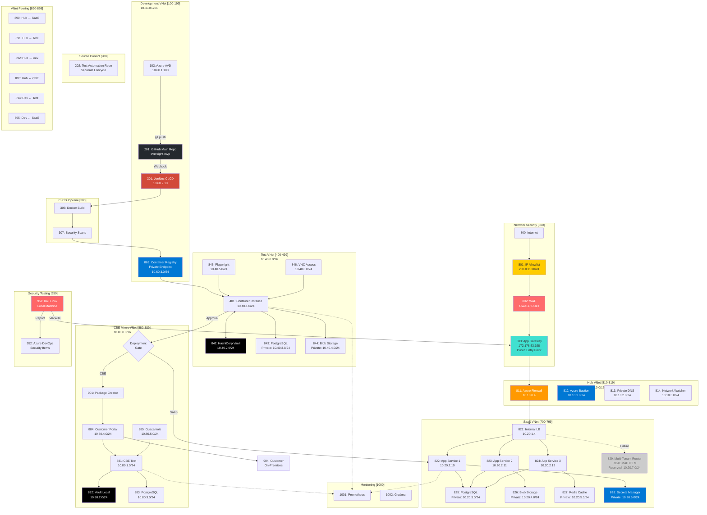

# Complete SecDevOps CI/CD Architecture - Version 4
## Private Networks & Security Architecture

**Version:** 4.0  
**Date:** 2025-09-21  
**Status:** Final Implementation with Private Networks

---

## 🏗️ Complete System Architecture with Private Networks



---

## 📋 Network Architecture Summary

### Public Entry Points (IP-Restricted Only)
| Component | ID | Purpose | IP/Location |
|-----------|-----|---------|-------------|
| Internet | 800 | Public Internet | Any |
| IP Allowlist | 801 | Restrict Access | 203.0.113.0/24, 10.0.0.0/8 |
| WAF | 802 | Web Application Firewall | OWASP Rules |
| App Gateway | 803 | Single Public Entry | 172.178.53.198 |

### Hub VNet (10.10.0.0/16)
| Component | ID | Purpose | Subnet |
|-----------|-----|---------|--------|
| Azure Firewall | 811 | Central Traffic Control | 10.10.0.0/26 |
| Azure Bastion | 812 | Secure RDP/SSH | 10.10.1.0/24 |
| Private DNS | 813 | Internal Name Resolution | 10.10.2.0/24 |
| Network Watcher | 814 | Monitoring & Diagnostics | 10.10.3.0/24 |

### Development VNet (10.60.0.0/16)
| Component | ID | Purpose | Subnet |
|-----------|-----|---------|--------|
| Azure AVD | 103 | Development Desktop | 10.60.1.0/24 |
| Jenkins CI/CD | 301 | Build Pipeline | 10.60.2.0/24 |
| Container Registry | 863 | Docker Images | 10.60.3.0/24 |
| SonarQube | 864 | Code Analysis | 10.60.4.0/24 |

### Test VNet (10.40.0.0/16)
| Component | ID | Purpose | Subnet |
|-----------|-----|---------|--------|
| Container Instance | 401 | Test App | 10.40.1.0/24 |
| HashiCorp Vault | 842 | Test Secrets | 10.40.2.0/24 |
| PostgreSQL | 843 | Test Database | 10.40.3.0/24 |
| Blob Storage | 844 | Test Files | 10.40.4.0/24 |
| Playwright Runner | 845 | E2E Tests | 10.40.5.0/24 |
| VNC Access | 846 | Browser Access | 10.40.6.0/24 |

### SaaS Production VNet (10.20.0.0/16)
| Component | ID | Purpose | Subnet |
|-----------|-----|---------|--------|
| Internal LB | 821 | Load Balancing | 10.20.1.0/24 |
| App Service 1-3 | 822-824 | SaaS Apps | 10.20.2.0/24 |
| PostgreSQL | 825 | Production DB | 10.20.3.0/24 |
| Blob Storage | 826 | File Storage | 10.20.4.0/24 |
| Redis Cache | 827 | Session Cache | 10.20.5.0/24 |
| Secrets Manager | 828 | Azure Key Vault | 10.20.6.0/24 |
| Tenant Router | 829 | **ROADMAP** - Multi-tenancy | 10.20.7.0/24 |

### CBE Mimic VNet (10.80.0.0/16)
| Component | ID | Purpose | Subnet |
|-----------|-----|---------|--------|
| CBE Test | 881 | Mimic Environment | 10.80.1.0/24 |
| HashiCorp Vault | 882 | CBE Secrets | 10.80.2.0/24 |
| PostgreSQL | 883 | CBE Database | 10.80.3.0/24 |
| Customer Portal | 884 | Package Distribution | 10.80.4.0/24 |
| Guacamole | 885 | Browser Access | 10.80.5.0/24 |

### VNet Peering
| Connection | ID | Purpose |
|------------|-----|---------|
| Hub ↔ SaaS | 890 | Production Traffic |
| Hub ↔ Test | 891 | Test Traffic |
| Hub ↔ Dev | 892 | Development Traffic |
| Hub ↔ CBE | 893 | CBE Traffic |
| Dev ↔ Test | 894 | CI/CD Pipeline |
| Dev ↔ SaaS | 895 | Deployment |

---

## 🔒 Security Architecture

### Network Security Layers

1. **Public Access Control (800-803)**
   - IP Allowlisting
   - WAF with OWASP rules
   - Single entry via App Gateway

2. **Network Segmentation (810-895)**
   - Hub-spoke topology
   - Azure Firewall controls all traffic
   - VNet peering with restrictions

3. **Private Endpoints (All Services)**
   - No public IPs on backend services
   - All PaaS services use private endpoints
   - Internal load balancers only

4. **DNS Security (813)**
   - Private DNS zones
   - No public resolution of internal services
   - Split-horizon DNS

---

## 🚨 Critical Security Notes

1. **ALL traffic enters through WAF** - No exceptions
2. **Private endpoints mandatory** - All Azure services
3. **Multi-tenant router is ROADMAP** - Infrastructure ready, not implemented
4. **IP allowlist strictly enforced** - Component 801
5. **No direct access to backends** - Everything through firewall
6. **Bastion for human access** - No public RDP/SSH
7. **Private DNS only** - Internal services not resolvable publicly

---

## 📊 Traffic Flow

### External User → SaaS Application
```
Internet → IP Filter (801) → WAF (802) → App Gateway (803) → 
Firewall (811) → Internal LB (821) → App Services (822-824)
```

### Developer → Test Environment
```
AVD (103) → Jenkins (301) → ACR (863) → 
Firewall (811) → Test Container (401)
```

### Test → Production Deployment
```
Test (401) → Approval Gate → Firewall (811) → 
Internal LB (821) → Production Apps (822-824)
```

### CBE Package Distribution
```
Package Creator (901) → Customer Portal (884) → 
Customer Download → On-Premises (904)
```

---

## ✅ Implementation Checklist

- [x] Hub-spoke network topology
- [x] Azure Firewall central control
- [x] Private endpoints for all services
- [x] WAF with IP restrictions
- [x] Private DNS zones
- [x] VNet peering configured
- [x] Bastion for secure access
- [x] Multi-tenant router (ROADMAP - subnet reserved)
- [x] No public IPs on backends
- [x] Network isolation validated

---

This architecture ensures complete network isolation with private networks everywhere possible, and IP-restricted access as the only public entry point.