# Complete SecDevOps CI/CD Architecture - Version 5
## Simplified IP-Restricted Architecture

**Version:** 5.0  
**Date:** 2025-09-21  
**Status:** Simplified with IP Restriction Focus

---

## 🔒 Complete System Architecture - IP Restricted Access Only

```mermaid
graph TB
    %% External Access - Everything goes through IP check
    subgraph "External Access"
        INTERNET[Internet<br/>Any IP]
        OFFICE[Office Network<br/>203.0.113.0/24]
        CUSTOMER1[Customer 1<br/>198.51.100.14]
        CUSTOMER2[Customer 2<br/>198.51.100.15]
        KALI[Kali Testing<br/>192.168.1.100]
        GITHUB[GitHub<br/>Webhooks]
    end
    
    %% The ONLY way in - IP Security Gateway
    subgraph "IP Security Gateway [800-803]"
        IP_CHECK{801: IP Allowlist Check<br/>━━━━━━━━━━<br/>✅ 203.0.113.0/24<br/>✅ 192.168.1.100<br/>✅ 198.51.100.14<br/>✅ 198.51.100.15<br/>━━━━━━━━━━}
        WAF[802: WAF + App Gateway<br/>172.178.53.198<br/>ONLY Public IP]
        BLOCKED[❌ ACCESS DENIED]
        
        INTERNET --> IP_CHECK
        OFFICE --> IP_CHECK
        CUSTOMER1 --> IP_CHECK
        CUSTOMER2 --> IP_CHECK
        KALI --> IP_CHECK
        GITHUB --> IP_CHECK
        
        IP_CHECK -->|Allowed| WAF
        IP_CHECK -->|Blocked| BLOCKED
    end
    
    %% Single Unified VNet with everything private
    subgraph "Unified Private VNet [10.0.0.0/16]"
        FIREWALL[811: Azure Firewall<br/>10.0.0.4<br/>Controls all internal traffic]
        
        WAF --> FIREWALL
        
        subgraph "Development & CI/CD [100-399]"
            AVD[103: Azure AVD<br/>10.0.3.10]
            JENKINS[301: Jenkins<br/>10.0.3.20]
            ACR[308: Container Registry<br/>10.0.3.30]
            SONAR[309: SonarQube<br/>10.0.3.40]
            
            AVD --> JENKINS
            JENKINS --> ACR
            JENKINS --> SONAR
        end
        
        subgraph "Test Environment [400-499]"
            TEST_APP[401: Test App<br/>10.0.1.10]
            TEST_DB[411: Test DB<br/>10.0.1.20]
            VAULT_TEST[403: HashiCorp Vault<br/>10.0.1.30]
            PLAYWRIGHT[511: Playwright<br/>10.0.1.40]
            
            TEST_APP --> TEST_DB
            TEST_APP --> VAULT_TEST
            PLAYWRIGHT --> TEST_APP
        end
        
        subgraph "SaaS Production [700-799]"
            LB[721: Load Balancer<br/>10.0.2.1]
            APP1[701: SaaS App 1<br/>10.0.2.10]
            APP2[702: SaaS App 2<br/>10.0.2.11]
            APP3[703: SaaS App 3<br/>10.0.2.12]
            
            PROD_DB[711: PostgreSQL<br/>10.0.5.10]
            STORAGE[712: Blob Storage<br/>10.0.6.10]
            REDIS[713: Redis Cache<br/>10.0.5.20]
            KV[714: Key Vault<br/>10.0.7.10]
            
            TENANT[729: Multi-Tenant Router<br/>ROADMAP ITEM<br/>10.0.2.100]
            
            LB --> APP1
            LB --> APP2
            LB --> APP3
            
            APP1 --> PROD_DB
            APP2 --> PROD_DB
            APP3 --> PROD_DB
            APP1 --> STORAGE
            APP2 --> REDIS
            APP3 --> KV
            
            LB -.->|Future| TENANT
        end
        
        subgraph "CBE Mimic [900-999]"
            CBE_APP[901: CBE Mimic<br/>10.0.4.10]
            CBE_DB[902: CBE DB<br/>10.0.4.20]
            VAULT_CBE[903: CBE Vault<br/>10.0.4.30]
            PORTAL[904: Customer Portal<br/>10.0.4.40]
            
            CBE_APP --> CBE_DB
            CBE_APP --> VAULT_CBE
            PORTAL --> CBE_APP
        end
        
        subgraph "Human Access [812]"
            BASTION[812: Azure Bastion<br/>10.0.8.1<br/>RDP/SSH Gateway]
            
            BASTION --> AVD
            BASTION --> TEST_APP
            BASTION --> APP1
            BASTION --> CBE_APP
        end
        
        subgraph "Monitoring [1000-1099]"
            PROMETHEUS[1001: Prometheus<br/>10.0.9.10]
            GRAFANA[1002: Grafana<br/>10.0.9.20]
            LOGS[1003: Log Analytics<br/>10.0.9.30]
            
            PROMETHEUS --> GRAFANA
        end
        
        %% Firewall controls all traffic
        FIREWALL --> TEST_APP
        FIREWALL --> LB
        FIREWALL --> JENKINS
        FIREWALL --> CBE_APP
        FIREWALL --> BASTION
        FIREWALL --> PROMETHEUS
        
        %% CI/CD Flow
        JENKINS -->|Deploy| TEST_APP
        TEST_APP -->|Approved| LB
        JENKINS -->|Package| PORTAL
        
        %% Monitoring connections
        TEST_APP -.->|Metrics| PROMETHEUS
        APP1 -.->|Metrics| PROMETHEUS
        APP2 -.->|Metrics| PROMETHEUS
        APP3 -.->|Metrics| PROMETHEUS
        CBE_APP -.->|Metrics| PROMETHEUS
        
        TEST_APP -.->|Logs| LOGS
        APP1 -.->|Logs| LOGS
    end
    
    %% Customer deployment (outside main network)
    PORTAL -->|Download| CUSTOMER_SITE[Customer On-Prem<br/>Their Network]
    
    %% Styling
    style IP_CHECK fill:#ff0000,color:#fff,stroke:#fff,stroke-width:4px
    style WAF fill:#ff6b6b,color:#fff
    style FIREWALL fill:#ff9900,color:#fff
    style BLOCKED fill:#000,color:#fff
    style BASTION fill:#0078d4,color:#fff
    style TENANT fill:#cccccc,color:#666
    style LB fill:#40e0d0
    style PORTAL fill:#9370db
```



---

## 📋 Simplified Architecture Components

### 🚨 Security Gateway (The ONLY way in)
| Component | ID | Purpose | Details |
|-----------|-----|---------|---------|
| IP Allowlist | 801 | Primary Security | ONLY these IPs can access |
| WAF | 802 | Web Security | OWASP rules, DDoS protection |
| App Gateway | 803 | Public Entry | 172.178.53.198 (ONLY public IP) |

### 🔒 IP Allowlist (Component 801)
```yaml
Allowed IPs:
  Office Network: 203.0.113.0/24
  Kali Testing: 192.168.1.100/32
  Customer 1: 198.51.100.14/32
  Customer 2: 198.51.100.15/32
  
Everyone Else: BLOCKED
```

### 🏢 Unified Private Network (10.0.0.0/16)
| Environment | Subnet | Components |
|-------------|--------|------------|
| Test | 10.0.1.0/24 | Test App, Test DB, Vault, Playwright |
| SaaS Production | 10.0.2.0/24 | Apps 1-3, Load Balancer, Future Tenant Router |
| Development | 10.0.3.0/24 | AVD, Jenkins, ACR, SonarQube |
| CBE Mimic | 10.0.4.0/24 | CBE App, DB, Vault, Portal |
| Databases | 10.0.5.0/24 | PostgreSQL, Redis |
| Storage | 10.0.6.0/24 | Blob Storage |
| Secrets | 10.0.7.0/24 | Key Vault, HashiCorp Vault |
| Human Access | 10.0.8.0/24 | Azure Bastion |
| Monitoring | 10.0.9.0/24 | Prometheus, Grafana, Logs |

---

## 🎯 Access Control Matrix

| Source | Destination | Access Level | Method |
|--------|-------------|--------------|--------|
| Office (203.0.113.0/24) | Everything | Full | Via WAF → Firewall |
| Kali (192.168.1.100) | Test & SaaS | Pentest | Via WAF → Firewall |
| Customer 1 (198.51.100.14) | SaaS App Only | User | Via WAF → LB → App |
| Customer 2 (198.51.100.15) | SaaS App Only | User | Via WAF → LB → App |
| GitHub Webhooks | Jenkins | CI/CD Trigger | Via WAF → Firewall |
| **Any Other IP** | **NOTHING** | **DENIED** | **Blocked at IP Check** |

---

## 📊 Deployment Flow

### 1. Code → Test → Production
```
Developer (AVD) → GitHub → Jenkins → Test Environment → 
Approval → SaaS Production
```

### 2. CBE Package Distribution
```
Jenkins → Package Creator → Customer Portal → 
Customer Downloads → On-Premises Deployment
```

### 3. Security Testing
```
Kali (192.168.1.100) → IP Check ✓ → WAF → Test/Production
                     → IP Check ✗ → BLOCKED
```

---

## 🚀 Quick Setup Commands

### Deploy Everything
```bash
# Create unified resource group
az group create --name rg-oversight-unified --location uksouth

# Create single VNet
az network vnet create \
    --name vnet-unified \
    --resource-group rg-oversight-unified \
    --address-prefix 10.0.0.0/16

# Configure IP restrictions (THIS IS CRITICAL)
./scripts/configure-ip-allowlist.sh

# Deploy components
./scripts/deploy-unified-architecture.sh
```

### Manage IP Allowlist
```bash
# Add new allowed IP
./scripts/add-allowed-ip.sh "1.2.3.4" "New Customer"

# Remove IP
./scripts/remove-allowed-ip.sh "1.2.3.4"

# View current allowlist
./scripts/view-allowlist.sh
```

---

## ⚠️ Critical Security Rules

1. **NO public IPs except App Gateway** (172.178.53.198)
2. **IP allowlist is mandatory** - No bypass possible
3. **All internal traffic through firewall** - Zero trust
4. **Bastion for human access** - No direct RDP/SSH
5. **Multi-tenant router is ROADMAP** - Infrastructure ready

---

## 💰 Cost Benefits of Simplified Architecture

| Component | Old Cost | New Cost | Savings |
|-----------|----------|----------|---------|
| Multiple VNets | $200 | $50 | $150 |
| VNet Peering | $100 | $0 | $100 |
| Multiple Firewalls | $900 | $450 | $450 |
| **Total Monthly** | **$1,500** | **$800** | **$700** |

---

## ✅ Security Checklist

- [ ] IP allowlist configured and tested
- [ ] WAF rules active
- [ ] Azure Firewall deployed
- [ ] All backends private (no public IPs)
- [ ] Bastion configured for admin access
- [ ] Monitoring active
- [ ] Multi-tenant router marked as ROADMAP
- [ ] Customer portal for CBE packages

---

This simplified architecture ensures **ONLY specific IPs can access ANYTHING** while maintaining all functionality in a single, manageable VNet.