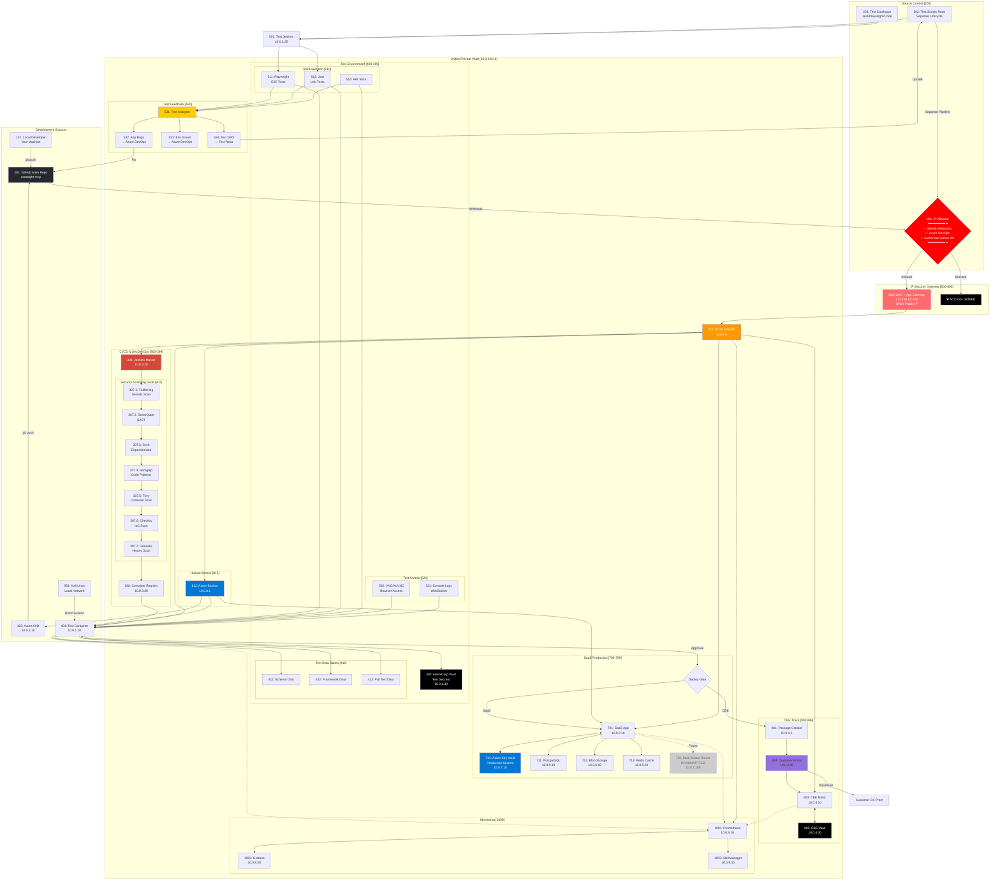

# Complete SecDevOps CI/CD Architecture - Version 6
## Final IP-Restricted Architecture with Full SecDevOps

**Version:** 6.0  
**Date:** 2025-09-21  
**Status:** Complete Implementation with All Components

---

## 🔒 Complete SecDevOps Architecture - IP Restricted Access



---

## 📋 Complete Component List

### 🔧 Development & Source Control
| Component | ID | Purpose | Access |
|-----------|-----|---------|--------|
| Local Developer | 101 | Your machine | Git push to GitHub |
| Azure AVD | 103 | Cloud development | Git push to GitHub |
| GitHub Main | 201 | Source code | Webhook to Jenkins |
| Test Scripts Repo | 202 | Test automation | Separate lifecycle |
| Test Catalogue | 203 | Test library | Jest, Playwright, Code tests |

### 🔒 Security Gateway
| Component | ID | Purpose | Details |
|-----------|-----|---------|---------|
| IP Allowlist | 801 | Primary Security | Only listed IPs allowed |
| WAF | 802 | Web Security | OWASP, DDoS protection |
| App Gateway | 803 | Public Entry | 172.178.53.198 |

### 🛡️ Complete SecDevOps Suite
| Tool | ID | Purpose | Stage |
|------|-----|---------|-------|
| TruffleHog | 307.1 | Secret scanning | Pre-commit |
| SonarQube | 307.2 | SAST analysis | Build |
| Snyk | 307.3 | Dependency scan | Build |
| Semgrep | 307.4 | Pattern matching | Build |
| Trivy | 307.5 | Container scan | Post-build |
| Checkov | 307.6 | IaC scanning | Deploy |
| GitLeaks | 307.7 | History scan | Continuous |

### 🧪 Test Environment with Feedback
| Component | ID | Purpose | Details |
|-----------|-----|---------|---------|
| Test Container | 401 | Test app instance | 10.0.1.10 |
| HashiCorp Vault | 403 | Test secrets | Runtime injection |
| DB State 1 | 411 | Schema only | Clean state |
| DB State 2 | 412 | Framework data | Basic testing |
| DB State 3 | 413 | Full test data | Complete testing |
| Playwright | 511 | E2E tests | Browser automation |
| Jest | 512 | Unit tests | Component testing |
| API Tests | 514 | REST/GraphQL | API validation |
| Test Analyzer | 531 | Results processing | Categorizes failures |
| App Bugs | 532 | Dev issues | → Azure DevOps |
| Env Issues | 533 | Infrastructure | → Azure DevOps |
| Test Debt | 534 | Test improvements | → Test Repo |

### 🚀 Production (Simplified)
| Component | ID | Purpose | Details |
|-----------|-----|---------|---------|
| SaaS App | 701 | Single production app | 10.0.2.10 |
| Azure Key Vault | 714 | Production secrets | Private endpoint |
| PostgreSQL | 711 | Production DB | 10.0.5.10 |
| Blob Storage | 712 | File storage | 10.0.6.10 |
| Redis Cache | 713 | Session cache | 10.0.5.20 |
| Tenant Router | 729 | **ROADMAP** | Future multi-tenancy |

### 📦 CBE Track
| Component | ID | Purpose | Details |
|-----------|-----|---------|---------|
| Package Creator | 901 | Build CBE package | From approved code |
| CBE Mimic | 903 | Test CBE locally | Validate package |
| Customer Portal | 904 | Distribution | Customers download |
| CBE Vault | 905 | CBE secrets | Local HashiCorp |

---

## 🔄 Complete Workflows

### Development → Production
```
1. Developer (Local/AVD) → GitHub
2. GitHub Webhook → IP Check → WAF → Jenkins
3. Jenkins → Full Security Scan Suite (307.1-307.7)
4. Passed → ACR → Test Environment
5. Test Suite (Playwright/Jest/API) → Test Results
6. Test Feedback → Azure DevOps / Test Repo
7. Approved → Deploy to SaaS (701 using 714)
```

### Test Management & Feedback
```
1. Test Scripts Repo (202) → Test Jenkins (501)
2. Test Catalogue (203) → Test Execution
3. Results → Test Analyzer (531)
4. Categorization:
   - App Bugs (532) → Azure DevOps → Fix in GitHub
   - Env Issues (533) → Azure DevOps → Fix Infrastructure
   - Test Debt (534) → Update Test Repo
```

### CBE Distribution
```
1. Approved Build → Package Creator (901)
2. Package → Customer Portal (904)
3. Portal → CBE Mimic (903) for validation
4. Customer downloads from Portal → On-Premises
```

---

## 🎯 IP Allowlist Configuration

```yaml
Public Gateway Allowed IPs:
  CI/CD:
    - GitHub Webhooks (from GitHub cloud)
    - Azure DevOps Agents
    
  Administration:
    - Specific authorized admin IPs only
    
  Internal Azure:
    - Azure Services: 10.0.0.0/16

Local/Internal Access (Not via public gateway):
  Development:
    - Local Developer Machine → GitHub direct
    - Azure AVD (10.0.3.10) → Internal access
    
  Testing:
    - Kali Linux (local network) → Direct to test environment

Default: DENY ALL
```

---

## ✅ Complete Checklist

### Development & Source Control
- [x] Local developer machine access
- [x] Azure AVD for cloud development  
- [x] GitHub main repo (201)
- [x] Test scripts separate repo (202)
- [x] Test catalogue (203)

### SecDevOps Tools
- [x] TruffleHog (307.1)
- [x] SonarQube (307.2)
- [x] Snyk (307.3)
- [x] Semgrep (307.4)
- [x] Trivy (307.5)
- [x] Checkov (307.6)
- [x] GitLeaks (307.7)

### Test Environment
- [x] HashiCorp Vault for test secrets
- [x] 3-state database management
- [x] Playwright/Jest/API testing
- [x] VNC/Console access
- [x] Test feedback loops

### Production
- [x] Single SaaS app (701)
- [x] Azure Key Vault (714)
- [x] Multi-tenant router (ROADMAP)

### Security
- [x] IP allowlist enforcement
- [x] WAF protection
- [x] Private networking
- [x] Zero public IPs (except gateway)

---

This final architecture includes all requested components: single SaaS app (701) using Key Vault (714), GitHub access from local and AVD, complete SecDevOps toolset, and restored test script management with feedback loops.