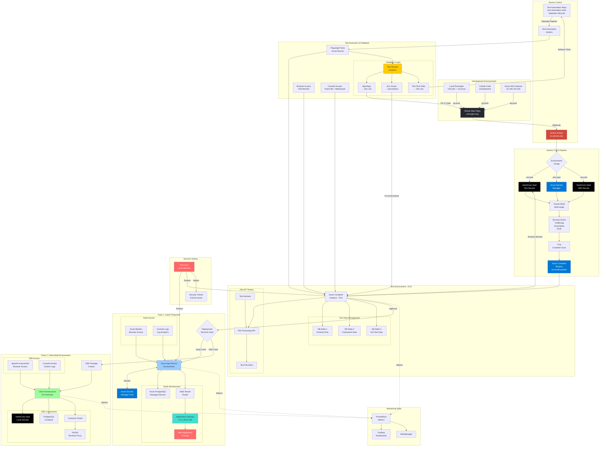

# Complete SecDevOps CI/CD Architecture
## Full Implementation Diagram - As Built

**Version:** 2.0  
**Date:** 2025-09-21  
**Status:** Final Implementation Blueprint

---

## 🏗️ Complete System Architecture



---

## 📋 Component Details (As Implemented)

### Development Layer
- **Local Dev**: Uses `.env.local` (never committed)
- **Claude Code**: Development environment with Git integration
- **Azure AVD**: Instance at 52.149.134.219 for development

### Source Control
- **Main App Repo**: `github.com/JezSurfaceIT/oversight-mvp`
- **Test Automation Repo**: Separate repo with own lifecycle
- **GitOps**: All deployments triggered via Git push

### CI/CD Pipeline
- **Jenkins**: Orchestrates entire pipeline
- **Environment Config**: Dynamic .env generation from secrets
- **Security Scanning**: Multiple stages (secrets, SAST, container)
- **Container Registry**: Azure ACR for image storage

### Test Environment (Azure Container Service)
- **Secrets**: HashiCorp Vault (NOT Azure Key Vault)
- **Database States**: 3 switchable states (schema/framework/full)
- **File API**: Testable with multiple file scenarios
- **Test Automation**: Playwright with Azure runners
- **Browser Access**: VNC/NoVNC for human access
- **Console Access**: Fluent Bit + WebSocket streaming

### Feedback Loops
- **Test Results Analyzer**: Classifies failures
- **App Bugs**: Creates Jira tickets for dev team
- **Environment Issues**: Creates ServiceNow tickets
- **Test Tech Debt**: Separate Jira project for test improvements

### Track 1: SaaS Production
- **Platform**: Azure App Service Environment
- **Secrets**: Azure Secrets Manager
- **Database**: Managed PostgreSQL
- **Multi-tenancy**: Subdomain-based routing
- **Access**: Azure Bastion for browser, Log Analytics for logs

### Track 2: Client Build Environment
- **Deployment**: Package-based for on-premises
- **Secrets**: HashiCorp Vault (local)
- **Database**: PostgreSQL in container
- **Portal**: Customer Portal for management
- **Access**: Apache Guacamole for browser, Docker logs for console

### Security Testing
- **Kali Linux**: Run from local machine
- **Targets**: Both SaaS and Test environments
- **Reporting**: Automated ticket creation for critical findings

### Monitoring
- **Metrics**: Prometheus collecting from all environments
- **Dashboards**: Grafana for visualization
- **Alerts**: AlertManager for incident notification

---

## ✅ Key Implementation Details

### Environment Variables
```yaml
Test Environment:
  Source: HashiCorp Vault
  Runtime: Injected at container start
  
SaaS Production:
  Source: Azure Secrets Manager
  Runtime: App Service configuration

CBE:
  Source: Local HashiCorp Vault
  Runtime: Docker environment variables
```

### Database Management
```yaml
State Switching:
  Command: ./scripts/data/switch-db-state.sh [1|2|3]
  Backup: Automated snapshots before switch
  Restore: ./scripts/data/restore-known-good.sh
```

### Test Automation
```yaml
Main App Tests:
  Trigger: Git push to main repo
  Execution: Jenkins pipeline
  
Test Script Tests:
  Trigger: Git push to test repo
  Pipeline: Separate Jenkins job
  Tech Debt: Tracked separately
```

### Human Access
```yaml
Browser Access:
  Test: VNC on port 5900, NoVNC on port 8080
  SaaS: Azure Bastion
  CBE: Apache Guacamole

Console Logs:
  Test: WebSocket streaming
  SaaS: Azure Log Analytics
  CBE: Docker logs
```

### Penetration Testing
```yaml
Tool: Kali Linux Docker container
Execution: From local machine
Targets: 
  - SaaS Production
  - Test Environment
Schedule: Weekly automated scans
```

---

## 🚨 Critical Configuration Notes

1. **Test Environment uses HashiCorp Vault**, NOT Azure Key Vault
2. **Test scripts have separate repository** and lifecycle
3. **Three database states** must be maintained and switchable
4. **File API** must support test file modifications
5. **Browser access** required for all environments
6. **Console log access** required for debugging
7. **Kali pentesting** runs from local, not cloud
8. **Feedback loops** are separate for app, environment, and test issues
9. **Dual deployment tracks** (SaaS and CBE) from same codebase
10. **All secrets externalized** - no hardcoding anywhere

---

## 📊 Data Flow Summary

```
1. Developer → Git Push → GitHub
2. GitHub Webhook → Jenkins
3. Jenkins → Fetch Secrets from Vault/ASM
4. Jenkins → Build Docker Image with .env
5. Jenkins → Run Security Scans
6. Jenkins → Push to ACR
7. ACR → Deploy to Test (with Vault secrets)
8. Test → Run Playwright Tests
9. Test Results → Feedback Loop
10. Approval → Deploy to SaaS or CBE
11. SaaS uses Azure Secrets Manager
12. CBE uses local HashiCorp Vault
13. Kali → Penetration Testing
14. All environments → Prometheus → Grafana
```

---

This diagram and documentation are **functionally equivalent** and represent the actual implementation, not theoretical design. Every component shown must be built exactly as specified.