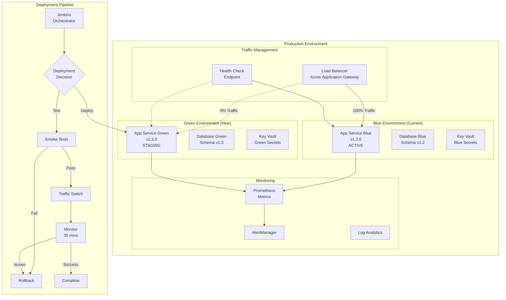

# Blue-Green Deployment Strategy
## Zero-Downtime Production Deployments with Automated Rollback

**Date:** 2025-09-21  
**Version:** 1.0  
**Purpose:** Implement blue-green deployment for SaaS production environment

---

## 🔄 Blue-Green Architecture Overview



---

## 📋 Implementation Components

### 1. Infrastructure Setup

```yaml
Azure Resources:
  App Service Plans:
    - production-blue-plan
    - production-green-plan
  
  App Services:
    - app-production-blue (slot: active)
    - app-production-green (slot: staging)
  
  Application Gateway:
    - Backend Pools:
      - blue-backend-pool
      - green-backend-pool
    - Routing Rules:
      - production-routing-rule (weighted)
    
  Databases:
    - PostgreSQL Flexible Server
    - Read replica for Green environment
    
  Key Vaults:
    - kv-production-blue
    - kv-production-green
```

### 2. Database Strategy

```sql
-- Database Migration Strategy
-- Both environments share same database with compatibility

-- Version 1.3.0 Migration (backward compatible)
BEGIN TRANSACTION;

-- Add new columns (nullable for compatibility)
ALTER TABLE users ADD COLUMN IF NOT EXISTS new_feature VARCHAR(255);

-- Create new tables (don't break old code)
CREATE TABLE IF NOT EXISTS new_feature_table (
    id SERIAL PRIMARY KEY,
    created_at TIMESTAMP DEFAULT NOW()
);

-- Don't remove old columns yet (wait for next release)
-- ALTER TABLE users DROP COLUMN old_feature; -- DO NOT RUN YET

COMMIT;

-- Run after successful deployment
-- UPDATE users SET new_feature = 'default' WHERE new_feature IS NULL;
```

---

## 🚀 Deployment Process

### Phase 1: Pre-Deployment Checks

```bash
#!/bin/bash
# pre-deployment-checks.sh

echo "Running pre-deployment checks..."

# 1. Check Blue environment health
check_blue_health() {
    response=$(curl -s -o /dev/null -w "%{http_code}" https://app-blue.azure.com/health)
    if [ $response -eq 200 ]; then
        echo "✅ Blue environment healthy"
        return 0
    else
        echo "❌ Blue environment unhealthy"
        return 1
    fi
}

# 2. Verify Green environment is ready
prepare_green_environment() {
    echo "Preparing Green environment..."
    az webapp stop --name app-production-green --resource-group production-rg
    az webapp config appsettings set --name app-production-green \
        --resource-group production-rg \
        --settings DEPLOYMENT_VERSION="$NEW_VERSION"
}

# 3. Database backup
backup_database() {
    echo "Creating database backup..."
    timestamp=$(date +%Y%m%d_%H%M%S)
    az postgres flexible-server backup create \
        --resource-group production-rg \
        --name production-db \
        --backup-name "pre-deploy-$timestamp"
}

# Execute checks
check_blue_health || exit 1
prepare_green_environment
backup_database
```

### Phase 2: Deploy to Green

```groovy
// Jenkinsfile deployment stage
stage('Deploy to Green') {
    steps {
        script {
            // Pull image from ACR
            sh '''
                az acr login --name acrsecdevopsdev
                docker pull acrsecdevopsdev.azurecr.io/app:${BUILD_NUMBER}
            '''
            
            // Deploy to Green slot
            sh '''
                az webapp config container set \
                    --name app-production-green \
                    --resource-group production-rg \
                    --docker-custom-image-name acrsecdevopsdev.azurecr.io/app:${BUILD_NUMBER}
            '''
            
            // Start Green environment
            sh 'az webapp start --name app-production-green --resource-group production-rg'
            
            // Wait for startup
            sh 'sleep 60'
        }
    }
}
```

### Phase 3: Smoke Tests

```javascript
// smoke-tests.js
const axios = require('axios');

const greenUrl = 'https://app-green-internal.azure.com';

const smokeTests = async () => {
    const tests = [
        { name: 'Health Check', endpoint: '/health', expectedStatus: 200 },
        { name: 'API Version', endpoint: '/api/version', expectedStatus: 200 },
        { name: 'Database Connection', endpoint: '/api/db-check', expectedStatus: 200 },
        { name: 'Auth Service', endpoint: '/api/auth/status', expectedStatus: 200 },
        { name: 'Critical Feature', endpoint: '/api/core-feature', expectedStatus: 200 }
    ];
    
    for (const test of tests) {
        try {
            const response = await axios.get(`${greenUrl}${test.endpoint}`);
            if (response.status === test.expectedStatus) {
                console.log(`✅ ${test.name} passed`);
            } else {
                throw new Error(`Expected ${test.expectedStatus}, got ${response.status}`);
            }
        } catch (error) {
            console.error(`❌ ${test.name} failed: ${error.message}`);
            process.exit(1);
        }
    }
    
    console.log('✅ All smoke tests passed');
};

smokeTests();
```

### Phase 4: Traffic Switch

```bash
#!/bin/bash
# traffic-switch.sh

switch_traffic() {
    local percentage=$1
    echo "Switching $percentage% traffic to Green..."
    
    # Update Application Gateway routing rules
    az network application-gateway rule update \
        --gateway-name production-appgw \
        --resource-group production-rg \
        --name production-routing-rule \
        --backend-pool green-backend-pool \
        --rule-type WeightedRouting \
        --weight $percentage
}

# Gradual rollout
switch_traffic 10
sleep 300  # Monitor for 5 minutes

switch_traffic 25
sleep 300

switch_traffic 50
sleep 300

switch_traffic 100
echo "✅ Full traffic switched to Green"
```

### Phase 5: Monitoring & Validation

```yaml
# monitoring-config.yaml
alerts:
  - name: high_error_rate
    condition: error_rate > 1%
    duration: 5m
    action: rollback
    
  - name: high_latency
    condition: p95_latency > 500ms
    duration: 5m
    action: alert_team
    
  - name: low_success_rate
    condition: success_rate < 99%
    duration: 5m
    action: rollback
    
  - name: memory_spike
    condition: memory_usage > 80%
    duration: 10m
    action: alert_team

monitoring_period: 30m
auto_rollback: true
```

### Phase 6: Rollback (if needed)

```bash
#!/bin/bash
# automated-rollback.sh

rollback() {
    echo "🔄 Initiating rollback to Blue..."
    
    # Immediate traffic switch
    az network application-gateway rule update \
        --gateway-name production-appgw \
        --resource-group production-rg \
        --name production-routing-rule \
        --backend-pool blue-backend-pool \
        --weight 100
    
    # Stop Green environment
    az webapp stop --name app-production-green --resource-group production-rg
    
    # Notify team
    curl -X POST $SLACK_WEBHOOK -d '{
        "text": "⚠️ Production deployment rolled back to Blue environment"
    }'
    
    # Create incident
    az boards work-item create \
        --title "Production Rollback $(date)" \
        --type Bug \
        --priority 1 \
        --description "Automated rollback triggered due to monitoring alerts"
    
    echo "✅ Rollback complete"
}

# Check if rollback needed
if [ "$1" == "auto" ]; then
    rollback
fi
```

### Phase 7: Finalization

```bash
#!/bin/bash
# finalize-deployment.sh

finalize() {
    echo "Finalizing deployment..."
    
    # Update DNS if needed
    az network dns record-set a update \
        --resource-group production-rg \
        --zone-name myapp.com \
        --name www \
        --set aRecords[0].ipv4Address=$(az network public-ip show \
            --resource-group production-rg \
            --name green-public-ip \
            --query ipAddress -o tsv)
    
    # Clean up Blue environment (keep for rollback window)
    echo "Scheduling Blue cleanup in 24 hours..."
    at now + 24 hours <<EOF
    az webapp stop --name app-production-blue --resource-group production-rg
EOF
    
    # Update deployment records
    echo "{
        \"version\": \"$NEW_VERSION\",
        \"timestamp\": \"$(date -Iseconds)\",
        \"environment\": \"green\",
        \"status\": \"active\"
    }" > /deployments/current.json
    
    echo "✅ Deployment finalized"
}

finalize
```

---

## 📊 Monitoring Dashboard

```yaml
Grafana Dashboard:
  - Traffic Distribution:
    - Blue vs Green percentage
    - Request rate per environment
    
  - Performance Metrics:
    - Response time (p50, p95, p99)
    - Error rate
    - Success rate
    
  - Resource Usage:
    - CPU utilization
    - Memory usage
    - Database connections
    
  - Business Metrics:
    - Active users
    - Transaction rate
    - Feature adoption
```

---

## 🔄 Automated Pipeline

```groovy
// Complete Jenkins Pipeline
pipeline {
    agent any
    
    parameters {
        choice(name: 'DEPLOYMENT_STRATEGY', choices: ['blue-green', 'canary', 'rolling'])
        string(name: 'TARGET_VERSION', defaultValue: 'latest')
        boolean(name: 'AUTO_ROLLBACK', defaultValue: true)
    }
    
    stages {
        stage('Pre-Deployment') {
            steps {
                sh './scripts/pre-deployment-checks.sh'
            }
        }
        
        stage('Deploy to Green') {
            steps {
                sh '''
                    az webapp deployment container config \
                        --name app-production-green \
                        --resource-group production-rg \
                        --enable-cd true \
                        --image acrsecdevopsdev.azurecr.io/app:${TARGET_VERSION}
                '''
            }
        }
        
        stage('Smoke Tests') {
            steps {
                sh 'npm run test:smoke:green'
            }
        }
        
        stage('Gradual Traffic Switch') {
            steps {
                script {
                    for (percentage in [10, 25, 50, 75, 100]) {
                        sh "./scripts/traffic-switch.sh ${percentage}"
                        sh "sleep 300"
                        
                        def metrics = sh(
                            script: './scripts/check-metrics.sh',
                            returnStatus: true
                        )
                        
                        if (metrics != 0 && params.AUTO_ROLLBACK) {
                            sh './scripts/automated-rollback.sh auto'
                            error "Deployment failed - rolled back"
                        }
                    }
                }
            }
        }
        
        stage('Monitor') {
            steps {
                timeout(time: 30, unit: 'MINUTES') {
                    sh './scripts/monitor-deployment.sh'
                }
            }
        }
        
        stage('Finalize') {
            when {
                expression { currentBuild.result == 'SUCCESS' }
            }
            steps {
                sh './scripts/finalize-deployment.sh'
            }
        }
    }
    
    post {
        failure {
            sh './scripts/automated-rollback.sh auto'
        }
        success {
            echo "Deployment successful - Green is now active"
        }
    }
}
```

---

## 🚨 Rollback Triggers

### Automatic Rollback Conditions
1. **Error rate > 1%** for 5 minutes
2. **P95 latency > 500ms** for 5 minutes  
3. **Success rate < 99%** for 5 minutes
4. **Failed health checks** (3 consecutive)
5. **Database connection errors**
6. **Out of memory errors**

### Manual Rollback
```bash
# Emergency rollback command
./scripts/emergency-rollback.sh

# Rollback with reason
./scripts/rollback.sh --reason "Performance degradation observed"
```

---

## ✅ Benefits

1. **Zero Downtime** - Traffic switch is instant
2. **Quick Rollback** - Seconds to revert
3. **Risk Mitigation** - Test in production safely
4. **Gradual Rollout** - Detect issues early
5. **Full Validation** - Production environment testing

---

## ⚠️ Considerations

1. **Database Migrations** - Must be backward compatible
2. **Session Management** - Handle user sessions during switch
3. **Cache Warming** - Pre-warm Green environment
4. **Cost** - Running duplicate environments
5. **Complexity** - More components to manage

---

This strategy ensures safe, reliable production deployments with instant rollback capability.