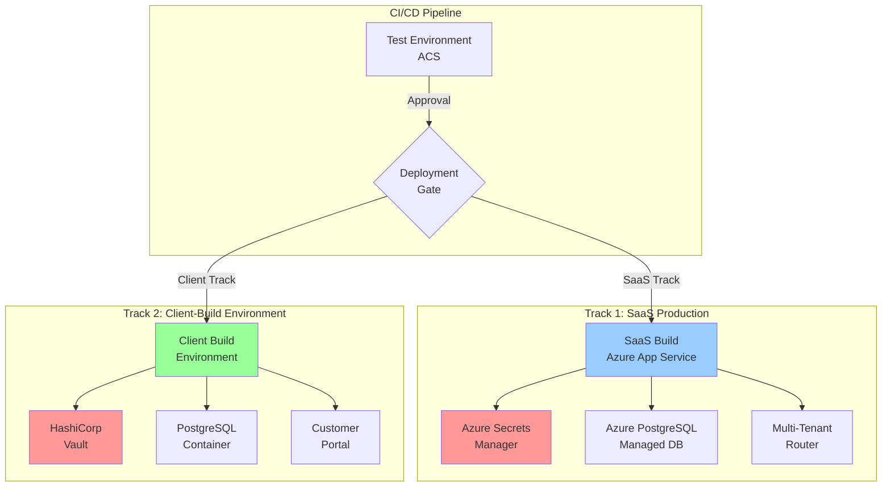
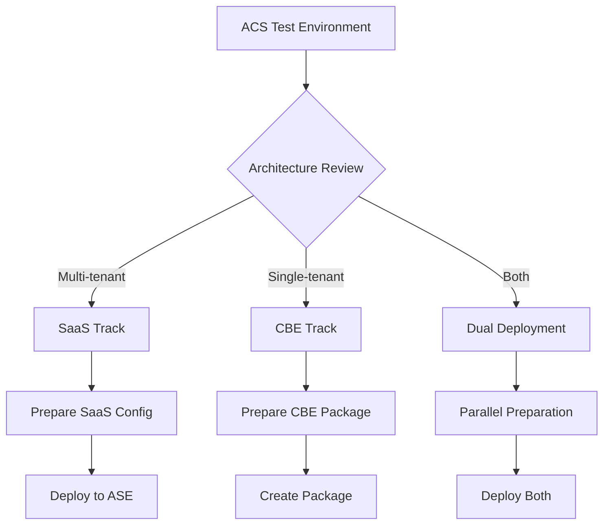

# Dual-Track Deployment Strategy
## SaaS Production & Client-Build Environment (CBE)

**Version:** 1.0  
**Date:** 2025-09-21  
**Author:** Winston - System Architect

---

## 🎯 Overview

This document defines the dual-track deployment strategy from the test environment to:
1. **SaaS Production** - Multi-tenant Azure-hosted platform using Azure Secrets Manager
2. **Client-Build Environment (CBE)** - On-premises customer deployments with HashiCorp Vault

Both tracks deploy from the same codebase with environment-specific configurations.

---

## 🏗️ Architecture Overview



---

## 📦 Track 1: SaaS Production Deployment

### Architecture Components

```yaml
Infrastructure:
  Platform: Azure App Service Environment (ASE)
  Database: Azure Database for PostgreSQL (Managed)
  Secrets: Azure Key Vault / Secrets Manager
  Storage: Azure Blob Storage
  CDN: Azure Front Door
  Monitoring: Azure Monitor + Application Insights

Multi-Tenancy:
  Strategy: Database-per-tenant isolation
  Router: SaaS Platform Layer
  Provisioning: Automated via Terraform
  Billing: Usage-based tracking
```

### Deployment Pipeline for SaaS

```bash
#!/bin/bash
# scripts/deploy/deploy-to-saas.sh
# Deploy from ACS Test to SaaS Production

set -e

# Configuration
APP_NAME="oversight-mvp"
SOURCE_IMAGE="acrsecdevopsdev.azurecr.io/${APP_NAME}:${VERSION}"
SAAS_RESOURCE_GROUP="saas-platform-rg"
SAAS_ACR="saasplatformacr"
ASE_NAME="ase-saas-production"
APP_SERVICE_PLAN="asp-saas-premium"

echo "========================================="
echo "Deploying to SaaS Production Environment"
echo "========================================="

# Step 1: Tag image for SaaS registry
echo "Step 1: Preparing image for SaaS deployment..."
docker pull $SOURCE_IMAGE
docker tag $SOURCE_IMAGE ${SAAS_ACR}.azurecr.io/${APP_NAME}:${VERSION}
docker tag $SOURCE_IMAGE ${SAAS_ACR}.azurecr.io/${APP_NAME}:latest

# Step 2: Push to SaaS ACR
echo "Step 2: Pushing to SaaS Container Registry..."
az acr login --name $SAAS_ACR
docker push ${SAAS_ACR}.azurecr.io/${APP_NAME}:${VERSION}
docker push ${SAAS_ACR}.azurecr.io/${APP_NAME}:latest

# Step 3: Deploy to App Service Environment
echo "Step 3: Deploying to App Service Environment..."
az webapp config container set \
    --name ${APP_NAME}-saas \
    --resource-group $SAAS_RESOURCE_GROUP \
    --docker-custom-image-name ${SAAS_ACR}.azurecr.io/${APP_NAME}:${VERSION} \
    --docker-registry-server-url https://${SAAS_ACR}.azurecr.io

# Step 4: Configure environment from Azure Secrets Manager
echo "Step 4: Configuring environment variables from Azure Secrets..."
SECRETS_JSON=$(az keyvault secret list --vault-name saas-kv-prod --query "[].name" -o json)

for secret in $(echo $SECRETS_JSON | jq -r '.[]'); do
    SECRET_VALUE=$(az keyvault secret show --vault-name saas-kv-prod --name $secret --query value -o tsv)
    ENV_VAR_NAME=$(echo $secret | tr '[:lower:]' '[:upper:]' | tr '-' '_')
    
    az webapp config appsettings set \
        --name ${APP_NAME}-saas \
        --resource-group $SAAS_RESOURCE_GROUP \
        --settings ${ENV_VAR_NAME}=${SECRET_VALUE} \
        --output none
done

# Step 5: Configure database connection
echo "Step 5: Configuring managed database connection..."
DB_CONNECTION=$(az keyvault secret show \
    --vault-name saas-kv-prod \
    --name database-connection-string \
    --query value -o tsv)

az webapp config connection-string set \
    --name ${APP_NAME}-saas \
    --resource-group $SAAS_RESOURCE_GROUP \
    --connection-string-type PostgreSQL \
    --settings DefaultConnection="${DB_CONNECTION}"

# Step 6: Enable multi-tenant routing
echo "Step 6: Configuring multi-tenant routing..."
az webapp config appsettings set \
    --name ${APP_NAME}-saas \
    --resource-group $SAAS_RESOURCE_GROUP \
    --settings \
        DEPLOYMENT_MODE=saas \
        ENABLE_MULTI_TENANCY=true \
        TENANT_DETECTION_MODE=subdomain \
        PLATFORM_DATABASE_URL="${DB_CONNECTION}"

# Step 7: Configure Application Gateway
echo "Step 7: Updating Application Gateway for SaaS..."
az network application-gateway address-pool update \
    --gateway-name appgw-saas-prod \
    --resource-group $SAAS_RESOURCE_GROUP \
    --name backend-pool \
    --servers ${APP_NAME}-saas.azurewebsites.net

# Step 8: Run database migrations
echo "Step 8: Running database migrations..."
az webapp ssh \
    --name ${APP_NAME}-saas \
    --resource-group $SAAS_RESOURCE_GROUP \
    --command "npm run migrate:production"

echo "✅ SaaS deployment complete!"
echo "URL: https://${APP_NAME}.saasplatform.io"
```

### SaaS Environment Configuration

```yaml
# .env.saas-production
NODE_ENV=production
DEPLOYMENT_MODE=saas

# Multi-tenancy
ENABLE_MULTI_TENANCY=true
TENANT_DETECTION_MODE=subdomain
TENANT_ISOLATION_LEVEL=database

# Azure Secrets Manager (runtime injection)
AZURE_KEY_VAULT_URI=https://saas-kv-prod.vault.azure.net
USE_MANAGED_IDENTITY=true

# Database (Managed PostgreSQL)
DATABASE_HOST=saas-postgres-prod.postgres.database.azure.com
DATABASE_PORT=5432
DATABASE_SSL=require
DATABASE_POOL_MIN=5
DATABASE_POOL_MAX=20

# Platform Features
ENABLE_USAGE_TRACKING=true
ENABLE_BILLING=true
ENABLE_TENANT_PROVISIONING=true
ENABLE_SSO=true

# Monitoring
APPLICATION_INSIGHTS_KEY=${SECRET:app-insights-key}
LOG_ANALYTICS_WORKSPACE=${SECRET:log-analytics-id}
```

---

## 🏭 Track 2: Client-Build Environment (CBE)

### CBE Architecture

```yaml
Infrastructure:
  Platform: Customer Infrastructure (On-premises/Private Cloud)
  Database: PostgreSQL in Container
  Secrets: HashiCorp Vault
  Storage: Local/MinIO
  Proxy: NGINX/HAProxy
  Monitoring: Prometheus + Grafana

Deployment:
  Strategy: Single-tenant isolated
  Portal: Customer Portal for management
  Updates: Controlled release channel
  Support: Remote access capability
```

### CBE Deployment Pipeline

```bash
#!/bin/bash
# scripts/deploy/deploy-to-cbe.sh
# Deploy to Client-Build Environment

set -e

# Configuration
APP_NAME="oversight-mvp"
SOURCE_IMAGE="acrsecdevopsdev.azurecr.io/${APP_NAME}:${VERSION}"
CBE_REGISTRY="${CBE_REGISTRY:-localhost:5000}"
VAULT_ADDR="${VAULT_ADDR:-http://localhost:8200}"
VAULT_TOKEN="${VAULT_TOKEN}"

echo "========================================="
echo "Deploying to Client-Build Environment"
echo "========================================="

# Step 1: Package for CBE
echo "Step 1: Creating CBE deployment package..."
mkdir -p cbe-package-${VERSION}
cd cbe-package-${VERSION}

# Copy deployment artifacts
cp -r ../scripts/cbe/* .
cp ../docker-compose.cbe.yml .
cp ../.env.cbe.template .

# Step 2: Setup HashiCorp Vault
echo "Step 2: Configuring HashiCorp Vault..."
cat > setup-vault.sh << 'EOF'
#!/bin/bash
# Initialize Vault for CBE

export VAULT_ADDR=http://localhost:8200

# Enable KV secrets engine
vault secrets enable -path=oversight kv-v2

# Store application secrets
vault kv put oversight/config \
    jwt_secret=$(openssl rand -base64 32) \
    session_secret=$(openssl rand -base64 32) \
    db_password=$(openssl rand -base64 16) \
    api_key=$(uuidgen)

# Create policy for application
vault policy write oversight-app - <<EOH
path "oversight/*" {
  capabilities = ["read", "list"]
}
EOH

# Create token for application
vault token create -policy=oversight-app -format=json | jq -r '.auth.client_token' > app-token.txt

echo "✅ Vault configured successfully"
EOF

chmod +x setup-vault.sh

# Step 3: Create PostgreSQL initialization script
echo "Step 3: Creating PostgreSQL setup..."
cat > init-db.sql << 'EOF'
-- Initialize CBE database
CREATE DATABASE oversight_cbe;
CREATE USER oversight_app WITH ENCRYPTED PASSWORD ':DB_PASSWORD';
GRANT ALL PRIVILEGES ON DATABASE oversight_cbe TO oversight_app;

\c oversight_cbe

-- Create schema based on deployment state
-- This will be replaced with actual schema during deployment
EOF

# Step 4: Create docker-compose for CBE
echo "Step 4: Creating Docker Compose configuration..."
cat > docker-compose.yml << 'EOF'
version: '3.8'

services:
  vault:
    image: vault:1.13.3
    cap_add:
      - IPC_LOCK
    environment:
      VAULT_DEV_ROOT_TOKEN_ID: root
      VAULT_DEV_LISTEN_ADDRESS: 0.0.0.0:8200
    ports:
      - "8200:8200"
    volumes:
      - vault-data:/vault/file
    healthcheck:
      test: ["CMD", "vault", "status"]
      interval: 10s
      timeout: 5s
      retries: 5

  postgres:
    image: postgres:14-alpine
    environment:
      POSTGRES_PASSWORD: admin
      POSTGRES_DB: postgres
    volumes:
      - postgres-data:/var/lib/postgresql/data
      - ./init-db.sql:/docker-entrypoint-initdb.d/init.sql
    ports:
      - "5432:5432"
    healthcheck:
      test: ["CMD-SHELL", "pg_isready -U postgres"]
      interval: 10s
      timeout: 5s
      retries: 5

  oversight-app:
    image: ${CBE_REGISTRY}/oversight-mvp:${VERSION}
    depends_on:
      vault:
        condition: service_healthy
      postgres:
        condition: service_healthy
    environment:
      NODE_ENV: production
      DEPLOYMENT_MODE: cbe
      VAULT_ADDR: http://vault:8200
      DATABASE_HOST: postgres
      DATABASE_PORT: 5432
      DATABASE_NAME: oversight_cbe
      DATABASE_USER: oversight_app
      PORT: 3000
    env_file:
      - .env.cbe
    ports:
      - "3000:3000"
    volumes:
      - app-data:/app/data
      - app-logs:/app/logs
    healthcheck:
      test: ["CMD", "curl", "-f", "http://localhost:3000/health"]
      interval: 30s
      timeout: 10s
      retries: 3

  customer-portal:
    image: ${CBE_REGISTRY}/customer-portal:latest
    depends_on:
      - oversight-app
    environment:
      API_URL: http://oversight-app:3000
      PORTAL_MODE: cbe
    ports:
      - "8080:8080"
    volumes:
      - portal-data:/app/data

  nginx:
    image: nginx:alpine
    depends_on:
      - oversight-app
      - customer-portal
    ports:
      - "80:80"
      - "443:443"
    volumes:
      - ./nginx.conf:/etc/nginx/nginx.conf:ro
      - ./certs:/etc/nginx/certs:ro
    healthcheck:
      test: ["CMD", "nginx", "-t"]
      interval: 30s
      timeout: 10s
      retries: 3

volumes:
  vault-data:
  postgres-data:
  app-data:
  app-logs:
  portal-data:
EOF

# Step 5: Create deployment script
echo "Step 5: Creating deployment script..."
cat > deploy.sh << 'EOF'
#!/bin/bash
# Deploy CBE Package

set -e

echo "🚀 Starting Client-Build Environment Deployment"

# Check prerequisites
command -v docker >/dev/null 2>&1 || { echo "Docker is required"; exit 1; }
command -v docker-compose >/dev/null 2>&1 || { echo "Docker Compose is required"; exit 1; }

# Pull images
echo "📦 Pulling Docker images..."
docker-compose pull

# Start Vault and PostgreSQL first
echo "🔐 Starting Vault and PostgreSQL..."
docker-compose up -d vault postgres

# Wait for services to be ready
echo "⏳ Waiting for services..."
sleep 10

# Configure Vault
echo "🔧 Configuring Vault..."
docker exec -it cbe_vault_1 sh -c "
  vault secrets enable -path=oversight kv-v2
  vault kv put oversight/config \
    jwt_secret=\$(openssl rand -base64 32) \
    session_secret=\$(openssl rand -base64 32) \
    db_password=\$(openssl rand -base64 16)
"

# Get Vault token
VAULT_TOKEN=$(docker exec cbe_vault_1 vault token create -policy=oversight-app -format=json | jq -r '.auth.client_token')
echo "VAULT_TOKEN=${VAULT_TOKEN}" >> .env.cbe

# Start application
echo "🎯 Starting Oversight application..."
docker-compose up -d oversight-app

# Wait for app to be ready
sleep 20

# Start Customer Portal and NGINX
echo "🌐 Starting Customer Portal and NGINX..."
docker-compose up -d customer-portal nginx

echo "✅ Deployment complete!"
echo ""
echo "Access points:"
echo "  Application: http://localhost"
echo "  Customer Portal: http://localhost:8080"
echo "  Vault UI: http://localhost:8200"
echo "  Database: localhost:5432"
echo ""
echo "Default credentials are in .env.cbe"
EOF

chmod +x deploy.sh

# Step 6: Create tarball
cd ..
tar -czf cbe-package-${VERSION}.tar.gz cbe-package-${VERSION}/

echo "✅ CBE package created: cbe-package-${VERSION}.tar.gz"
echo ""
echo "Deployment instructions:"
echo "1. Copy package to customer environment"
echo "2. Extract: tar -xzf cbe-package-${VERSION}.tar.gz"
echo "3. Navigate: cd cbe-package-${VERSION}"
echo "4. Deploy: ./deploy.sh"
```

### CBE Environment Configuration

```yaml
# .env.cbe.template
NODE_ENV=production
DEPLOYMENT_MODE=cbe

# Single-tenant mode
ENABLE_MULTI_TENANCY=false
TENANT_ID=customer-001

# HashiCorp Vault
VAULT_ADDR=http://vault:8200
VAULT_TOKEN=${VAULT_TOKEN}
VAULT_PATH=oversight

# PostgreSQL (Local)
DATABASE_HOST=postgres
DATABASE_PORT=5432
DATABASE_NAME=oversight_cbe
DATABASE_SSL=false

# Customer Portal
ENABLE_CUSTOMER_PORTAL=true
PORTAL_ADMIN_EMAIL=admin@customer.com

# Features
ENABLE_LOCAL_BACKUPS=true
ENABLE_OFFLINE_MODE=true
ENABLE_REMOTE_SUPPORT=false

# Monitoring (Local)
PROMETHEUS_ENABLED=true
GRAFANA_ENABLED=true
```

---

## 🔄 Migration from ACS to Production Tracks

### Decision Flow



### Migration Scripts

```bash
#!/bin/bash
# scripts/migrate/acs-to-production.sh
# Migrate from ACS test to production tracks

DEPLOYMENT_TARGET="${1:-saas}"  # saas, cbe, or both
VERSION="${2:-latest}"

case $DEPLOYMENT_TARGET in
    saas)
        echo "Migrating to SaaS Production..."
        ./scripts/deploy/deploy-to-saas.sh $VERSION
        ;;
    cbe)
        echo "Creating CBE Package..."
        ./scripts/deploy/deploy-to-cbe.sh $VERSION
        ;;
    both)
        echo "Deploying to both tracks..."
        ./scripts/deploy/deploy-to-saas.sh $VERSION &
        PID1=$!
        ./scripts/deploy/deploy-to-cbe.sh $VERSION &
        PID2=$!
        wait $PID1 $PID2
        ;;
    *)
        echo "Invalid target. Use: saas, cbe, or both"
        exit 1
        ;;
esac
```

---

## 📊 Comparison Matrix

| Feature | SaaS Production | Client-Build Environment |
|---------|-----------------|-------------------------|
| **Infrastructure** | Azure ASE | Customer Infrastructure |
| **Database** | Managed PostgreSQL | PostgreSQL Container |
| **Secrets** | Azure Secrets Manager | HashiCorp Vault |
| **Multi-tenancy** | Yes (subdomain routing) | No (single tenant) |
| **Updates** | Continuous deployment | Controlled releases |
| **Scaling** | Auto-scaling | Manual scaling |
| **Backup** | Automated Azure Backup | Local backup scripts |
| **Monitoring** | Azure Monitor | Prometheus/Grafana |
| **Portal** | SaaS Admin Portal | Customer Portal |
| **Support** | Direct access | Remote support tools |
| **Compliance** | SOC2, ISO27001 | Customer-specific |
| **Cost Model** | Usage-based | License-based |

---

## 🔐 Security Considerations

### SaaS Production
- Multi-tenant isolation via database separation
- Azure AD integration for authentication
- Managed certificates via Azure
- WAF protection via Application Gateway
- Automated security patching

### Client-Build Environment
- Air-gapped deployment capability
- Local certificate management
- Customer-controlled access
- Optional remote support tunnel
- Manual security updates

---

## 📈 Monitoring & Operations

### SaaS Monitoring Stack
```yaml
Metrics: Azure Monitor + Application Insights
Logs: Log Analytics Workspace
Alerts: Azure Alerts + PagerDuty
Dashboards: Azure Dashboard + Grafana
APM: Application Insights
```

### CBE Monitoring Stack
```yaml
Metrics: Prometheus
Logs: Loki/ELK Stack
Alerts: AlertManager
Dashboards: Grafana
APM: OpenTelemetry (optional)
```

---

## 🚀 Quick Reference

### Deploy to SaaS
```bash
./scripts/migrate/acs-to-production.sh saas v1.0
```

### Create CBE Package
```bash
./scripts/migrate/acs-to-production.sh cbe v1.0
```

### Deploy to Both
```bash
./scripts/migrate/acs-to-production.sh both v1.0
```

### Check Status
```bash
# SaaS
az webapp show --name oversight-mvp-saas --resource-group saas-platform-rg

# CBE (on customer site)
docker-compose ps
curl http://localhost:3000/health
```

---

This dual-track strategy ensures flexibility for both SaaS and on-premises deployments while maintaining a single codebase.