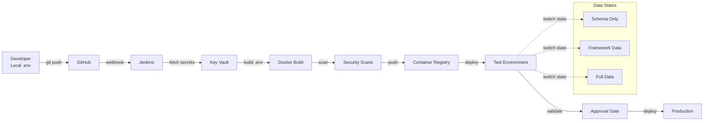

# E2E Pipeline Quick Reference Guide
## Complete Dev-to-Test-to-Production Flow

**Last Updated:** 2025-09-21  
**Purpose:** Quick reference for the complete E2E process including environment configuration and data management

---

## 🚀 Complete E2E Flow



---

## 📋 Developer Workflow

### 1. Local Development Setup
```bash
# Clone repository
git clone https://github.com/JezSurfaceIT/oversight-mvp.git
cd oversight-mvp

# Setup local environment
cp .env.example .env.local
# Edit .env.local with your local values (never commit this!)

# Install dependencies
npm install

# Start development
npm run dev
```

### 2. Make Changes & Test
```bash
# Create feature branch
git checkout -b feature/my-feature

# Make changes
code .

# Test locally with different DB states
./scripts/data/switch-db-state.sh 1  # Schema only for unit tests
npm test

./scripts/data/switch-db-state.sh 2  # Framework data for integration
npm run test:integration

# Test file API
npm run test:file-api
```

### 3. Push to GitHub (Triggers Everything)
```bash
# Commit changes
git add .
git commit -m "feat: Add new feature"

# Push to GitHub - this triggers the entire pipeline
git push origin feature/my-feature

# Create PR in GitHub
# Pipeline runs automatically on PR
```

---

## 🔧 Jenkins Pipeline Stages

| Stage | Duration | What Happens | Config Source |
|-------|----------|--------------|---------------|
| **1. Checkout** | 30s | Pull code from GitHub | - |
| **2. Configure Environment** | 1-2m | Build .env from Key Vault | Azure Key Vault |
| **3. Security Scan** | 2-3m | TruffleHog, Snyk | - |
| **4. Build** | 3-5m | Docker build with .env | Dynamic .env |
| **5. Test** | 5-10m | Run tests with DB states | Test configs |
| **6. Container Scan** | 2m | Trivy scan | - |
| **7. Push to Registry** | 1m | Push to ACR | - |
| **8. Deploy to Test** | 2-3m | Deploy with env injection | Test .env |
| **9. File API Tests** | 3-5m | Test file processing | Test files |
| **10. Security Test** | 5m | OWASP ZAP | - |
| **11. Approval Gate** | Manual | Human review | - |
| **12. Production Deploy** | 3m | Blue-Green deployment | Prod .env |

---

## 🗄️ Database State Management

### Quick Commands
```bash
# Switch database states in test environment
./scripts/data/switch-db-state.sh 1  # Empty schema
./scripts/data/switch-db-state.sh 2  # Framework data only
./scripts/data/switch-db-state.sh 3  # Full test data

# Create snapshots
./scripts/data/create-all-snapshots.sh

# Restore to known-good
./scripts/data/restore-known-good.sh 2  # Restore framework state
```

### When to Use Each State

| State | Use Case | Data Contents |
|-------|----------|---------------|
| **1: Schema Only** | Unit tests, Clean testing | Empty tables |
| **2: Framework** | Integration tests, API testing | Reference data, configs |
| **3: Full Data** | UAT, Performance testing | Complete test dataset |

---

## 🔐 Environment Configuration

### No Hardcoding Policy
```yaml
Never Hardcode:
  - Database passwords
  - API keys
  - JWT secrets
  - Connection strings
  - Service URLs (use environment-specific)

Always Use:
  - .env.example as template
  - Azure Key Vault for secrets
  - ConfigMaps for non-sensitive config
  - Environment-specific overrides
```

### Environment Files
```bash
# Local development
.env.local  # Your local overrides (never commit)

# Test environment (built by Jenkins)
.env.test   # Fetched from Key Vault

# Production (built by Jenkins)
.env.prod   # Fetched from Key Vault
```

---

## 📁 File API Testing

### Test Different File Scenarios
```bash
# Run all file API tests
npm run test:file-api

# Test specific scenarios
npm run test:file-api:valid      # Valid files
npm run test:file-api:invalid    # Invalid formats
npm run test:file-api:large      # Large files (100MB+)
npm run test:file-api:security   # Security payloads
```

### File Processing Flow
```
Upload → Validate → Queue → Process → Store → Notify
         ↓ (fail)
         Reject
```

---

## 🚨 Common Tasks

### Deploy to Test Environment
```bash
# Everything is automated via git push!
git push origin feature/my-feature
# Creates PR → Jenkins runs → Auto-deploys to test
```

### Emergency Hotfix
```bash
# Create hotfix branch from main
git checkout -b hotfix/critical-fix main

# Make fix
# ...

# Push (triggers expedited pipeline)
git push origin hotfix/critical-fix
# Create PR with HOTFIX label for priority review
```

### Rollback Deployment
```bash
# Rollback in test
./scripts/deployment/rollback-test.sh

# Rollback in production (requires approval)
./scripts/deployment/blue-green-rollback.sh oversight-mvp blue
```

### Update Environment Variable
```bash
# Update in Key Vault (for test/staging/prod)
az keyvault secret set \
    --vault-name oversight-kv-test \
    --name jwt-secret \
    --value "new-secret-value"

# Restart container to pick up new value
az container restart \
    --resource-group rg-secdevops-cicd-dev \
    --name oversight-mvp-test
```

---

## 📊 Monitoring

### Key Dashboards
- **Jenkins Pipeline**: http://vm-jenkins-dev:8080/job/oversight-mvp
- **Application Logs**: Azure Portal → Container Instances → Logs
- **Metrics**: http://grafana.oversight.io:3000/d/oversight
- **Application Gateway**: http://172.178.53.198

### Useful Commands
```bash
# Check deployment status
az container show \
    --resource-group rg-secdevops-cicd-dev \
    --name oversight-mvp-test \
    --query instanceView.state

# View logs
az container logs \
    --resource-group rg-secdevops-cicd-dev \
    --name oversight-mvp-test \
    --follow

# Check file processing queue
az storage queue peek-messages \
    --queue-name file-processing \
    --account-name oversightstorage
```

---

## ❌ What NOT to Do

```bash
# DON'T: Bypass Git
docker build -t myapp .           # ❌
docker push acr/myapp             # ❌

# DON'T: Hardcode secrets
DATABASE_URL="postgresql://..."   # ❌

# DON'T: Commit .env files
git add .env                      # ❌
git commit -m "Add env"           # ❌

# DON'T: Deploy directly
az container create ...           # ❌
```

---

## ✅ Always Remember

1. **Git push triggers everything** - No manual deployments
2. **Secrets in Key Vault** - Never in code
3. **Test with appropriate DB state** - Use state switcher
4. **File API needs test files** - Use test harness
5. **Monitor the pipeline** - Check Jenkins for status
6. **.env files are dynamic** - Built at deploy time

---

## 🆘 Getting Help

| Issue | Solution | Contact |
|-------|----------|---------|
| Pipeline failed | Check Jenkins console | #devops-help |
| Can't access test env | Check .env configuration | #platform-team |
| DB state issues | Use restore-known-good | #data-team |
| File API errors | Check test harness logs | #api-team |
| Security scan failures | Review scan reports | #security-team |

---

**Golden Rule:** If you can't trace it back to a Git commit, it shouldn't be deployed!