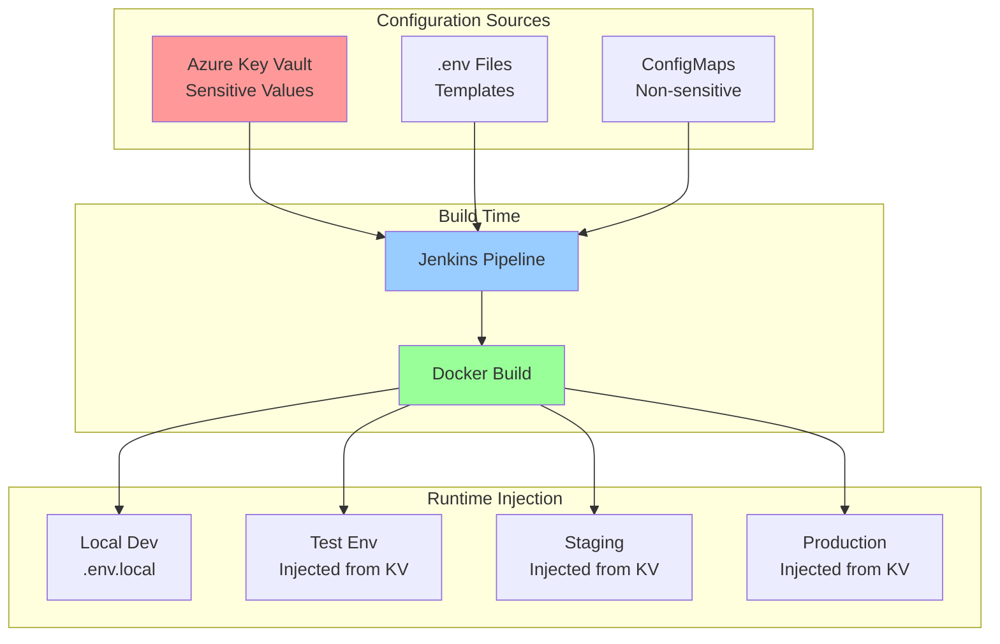

# Environment Configuration Management
## Dynamic .env File Management for All Environments

**Version:** 1.0  
**Date:** 2025-09-21  
**Author:** Winston - System Architect

---

## 🔐 Overview

This document defines how environment variables and `.env` files are managed across development, test, and production environments without any hardcoding. All sensitive values are stored in Azure Key Vault and injected at runtime.

---

## 📁 Environment File Structure

### Current .env Files (from local development)

```bash
# Location on local development machine
/home/jez/code/Oversight-MVP-09-04/
├── .env                    # Base configuration (never committed)
├── .env.local              # Local development overrides
├── .env.development        # Development environment
├── .env.test               # Test environment
├── .env.staging            # Staging environment
├── .env.production         # Production environment
└── .env.example            # Template (committed to Git)
```

### Environment Variable Categories

```yaml
Database Configuration:
  - DATABASE_URL
  - DB_HOST
  - DB_PORT
  - DB_NAME
  - DB_USER
  - DB_PASSWORD
  - DB_SSL_MODE

Azure Services:
  - AZURE_STORAGE_CONNECTION_STRING
  - AZURE_KEY_VAULT_URI
  - AZURE_TENANT_ID
  - AZURE_CLIENT_ID
  - AZURE_CLIENT_SECRET
  - AZURE_SUBSCRIPTION_ID

Application Settings:
  - NODE_ENV
  - PORT
  - API_URL
  - FRONTEND_URL
  - SESSION_SECRET
  - JWT_SECRET
  - CORS_ORIGINS

File Processing API:
  - FILE_UPLOAD_PATH
  - FILE_PROCESSING_QUEUE
  - MAX_FILE_SIZE
  - ALLOWED_FILE_TYPES
  - FILE_STORAGE_CONTAINER

Monitoring & Logging:
  - LOG_LEVEL
  - APPLICATION_INSIGHTS_KEY
  - SENTRY_DSN
  - GRAFANA_API_KEY

Third-Party Services:
  - SMTP_HOST
  - SMTP_PORT
  - SMTP_USER
  - SMTP_PASSWORD
  - SLACK_WEBHOOK_URL
  - TEAMS_WEBHOOK_URL
```

---

## 🏗️ Architecture for Environment Management



---

## 📝 Environment Template (.env.example)

```bash
# .env.example - Template for all environments
# Copy this file to .env and fill in values
# NEVER commit .env files with real values

# ============================================
# APPLICATION CONFIGURATION
# ============================================
NODE_ENV=development
PORT=3000
API_URL=http://localhost:3000
FRONTEND_URL=http://localhost:3000
APP_NAME=oversight-mvp

# ============================================
# DATABASE CONFIGURATION
# ============================================
DATABASE_URL=postgresql://${DB_USER}:${DB_PASSWORD}@${DB_HOST}:${DB_PORT}/${DB_NAME}?sslmode=${DB_SSL_MODE}
DB_HOST=localhost
DB_PORT=5432
DB_NAME=oversight_dev
DB_USER=
DB_PASSWORD=
DB_SSL_MODE=prefer
DB_POOL_MIN=2
DB_POOL_MAX=10

# ============================================
# AZURE SERVICES
# ============================================
AZURE_STORAGE_CONNECTION_STRING=
AZURE_KEY_VAULT_URI=https://${KEY_VAULT_NAME}.vault.azure.net
AZURE_TENANT_ID=
AZURE_CLIENT_ID=
AZURE_CLIENT_SECRET=
AZURE_SUBSCRIPTION_ID=

# ============================================
# SECURITY & AUTHENTICATION
# ============================================
SESSION_SECRET=
JWT_SECRET=
JWT_EXPIRY=24h
REFRESH_TOKEN_EXPIRY=7d
BCRYPT_ROUNDS=10
CORS_ORIGINS=http://localhost:3000
SECURE_COOKIES=false
TRUST_PROXY=false

# ============================================
# FILE PROCESSING API
# ============================================
FILE_UPLOAD_PATH=/tmp/uploads
FILE_PROCESSING_QUEUE=file-processing
MAX_FILE_SIZE=104857600  # 100MB in bytes
ALLOWED_FILE_TYPES=csv,xlsx,json,xml
FILE_STORAGE_CONTAINER=oversight-files
FILE_RETENTION_DAYS=30

# ============================================
# MONITORING & LOGGING
# ============================================
LOG_LEVEL=info
LOG_FORMAT=json
APPLICATION_INSIGHTS_KEY=
SENTRY_DSN=
SENTRY_ENVIRONMENT=${NODE_ENV}
GRAFANA_API_KEY=
PROMETHEUS_METRICS_PORT=9090

# ============================================
# EMAIL CONFIGURATION
# ============================================
SMTP_HOST=smtp.sendgrid.net
SMTP_PORT=587
SMTP_SECURE=false
SMTP_USER=
SMTP_PASSWORD=
EMAIL_FROM=noreply@oversight-mvp.com

# ============================================
# NOTIFICATION WEBHOOKS
# ============================================
SLACK_WEBHOOK_URL=
TEAMS_WEBHOOK_URL=
DISCORD_WEBHOOK_URL=

# ============================================
# FEATURE FLAGS
# ============================================
ENABLE_DEBUG_MODE=false
ENABLE_API_DOCS=true
ENABLE_METRICS=true
ENABLE_RATE_LIMITING=true
RATE_LIMIT_WINDOW=15m
RATE_LIMIT_MAX_REQUESTS=100

# ============================================
# CACHE CONFIGURATION
# ============================================
REDIS_URL=redis://localhost:6379
CACHE_TTL=3600
ENABLE_CACHE=true
```

---

## 🔧 Environment Configuration Scripts

### 1. Environment Builder Script

```bash
#!/bin/bash
# scripts/env/build-env-file.sh
# Builds environment-specific .env file from templates and Key Vault

set -e

ENVIRONMENT="${1:-development}"
OUTPUT_FILE="${2:-.env}"
KEY_VAULT_NAME="${KEY_VAULT_NAME:-oversight-kv-${ENVIRONMENT}}"

# Colors
GREEN='\033[0;32m'
YELLOW='\033[1;33m'
RED='\033[0;31m'
NC='\033[0m'

log_info() { echo -e "${GREEN}[INFO]${NC} $1"; }
log_warn() { echo -e "${YELLOW}[WARN]${NC} $1"; }
log_error() { echo -e "${RED}[ERROR]${NC} $1"; }

# Load base template
load_template() {
    local template_file=".env.example"
    
    if [ ! -f "$template_file" ]; then
        log_error "Template file $template_file not found"
        exit 1
    fi
    
    cp "$template_file" "$OUTPUT_FILE"
    log_info "Loaded template from $template_file"
}

# Fetch secrets from Azure Key Vault
fetch_from_keyvault() {
    log_info "Fetching secrets from Azure Key Vault: $KEY_VAULT_NAME"
    
    # List of secrets to fetch
    local secrets=(
        "db-password"
        "session-secret"
        "jwt-secret"
        "azure-client-secret"
        "smtp-password"
        "application-insights-key"
        "sentry-dsn"
        "slack-webhook-url"
        "teams-webhook-url"
    )
    
    for secret in "${secrets[@]}"; do
        log_info "Fetching secret: $secret"
        
        # Convert secret name to env var name (db-password -> DB_PASSWORD)
        local env_var=$(echo "$secret" | tr '[:lower:]' '[:upper:]' | tr '-' '_')
        
        # Fetch from Key Vault
        local value=$(az keyvault secret show \
            --vault-name "$KEY_VAULT_NAME" \
            --name "$secret" \
            --query value -o tsv 2>/dev/null || echo "")
        
        if [ -n "$value" ]; then
            # Replace in .env file
            sed -i "s|^${env_var}=.*|${env_var}=${value}|" "$OUTPUT_FILE"
            log_info "✓ Set ${env_var}"
        else
            log_warn "Secret $secret not found in Key Vault"
        fi
    done
}

# Apply environment-specific overrides
apply_environment_overrides() {
    log_info "Applying $ENVIRONMENT environment overrides"
    
    case "$ENVIRONMENT" in
        development)
            sed -i 's|NODE_ENV=.*|NODE_ENV=development|' "$OUTPUT_FILE"
            sed -i 's|DB_HOST=.*|DB_HOST=localhost|' "$OUTPUT_FILE"
            sed -i 's|API_URL=.*|API_URL=http://localhost:3000|' "$OUTPUT_FILE"
            sed -i 's|SECURE_COOKIES=.*|SECURE_COOKIES=false|' "$OUTPUT_FILE"
            ;;
        test)
            sed -i 's|NODE_ENV=.*|NODE_ENV=test|' "$OUTPUT_FILE"
            sed -i 's|DB_HOST=.*|DB_HOST=postgres-oversight-test.postgres.database.azure.com|' "$OUTPUT_FILE"
            sed -i 's|DB_NAME=.*|DB_NAME=oversight_test|' "$OUTPUT_FILE"
            sed -i 's|API_URL=.*|API_URL=http://oversight-mvp-test.azurecontainer.io|' "$OUTPUT_FILE"
            sed -i 's|LOG_LEVEL=.*|LOG_LEVEL=debug|' "$OUTPUT_FILE"
            ;;
        staging)
            sed -i 's|NODE_ENV=.*|NODE_ENV=staging|' "$OUTPUT_FILE"
            sed -i 's|DB_HOST=.*|DB_HOST=postgres-oversight-staging.postgres.database.azure.com|' "$OUTPUT_FILE"
            sed -i 's|DB_NAME=.*|DB_NAME=oversight_staging|' "$OUTPUT_FILE"
            sed -i 's|API_URL=.*|API_URL=https://staging.oversight-mvp.com|' "$OUTPUT_FILE"
            sed -i 's|SECURE_COOKIES=.*|SECURE_COOKIES=true|' "$OUTPUT_FILE"
            ;;
        production)
            sed -i 's|NODE_ENV=.*|NODE_ENV=production|' "$OUTPUT_FILE"
            sed -i 's|DB_HOST=.*|DB_HOST=postgres-oversight-prod.postgres.database.azure.com|' "$OUTPUT_FILE"
            sed -i 's|DB_NAME=.*|DB_NAME=oversight_prod|' "$OUTPUT_FILE"
            sed -i 's|API_URL=.*|API_URL=https://api.oversight-mvp.com|' "$OUTPUT_FILE"
            sed -i 's|SECURE_COOKIES=.*|SECURE_COOKIES=true|' "$OUTPUT_FILE"
            sed -i 's|LOG_LEVEL=.*|LOG_LEVEL=error|' "$OUTPUT_FILE"
            ;;
    esac
}

# Validate required variables
validate_env_file() {
    log_info "Validating environment file"
    
    local required_vars=(
        "NODE_ENV"
        "DATABASE_URL"
        "JWT_SECRET"
        "SESSION_SECRET"
    )
    
    local missing=()
    
    for var in "${required_vars[@]}"; do
        if ! grep -q "^${var}=.\+" "$OUTPUT_FILE"; then
            missing+=("$var")
        fi
    done
    
    if [ ${#missing[@]} -gt 0 ]; then
        log_error "Missing required variables: ${missing[*]}"
        return 1
    fi
    
    log_info "✓ All required variables present"
    return 0
}

# Main execution
main() {
    log_info "Building .env file for $ENVIRONMENT environment"
    
    # Step 1: Load template
    load_template
    
    # Step 2: Fetch secrets from Key Vault
    if [ "$ENVIRONMENT" != "development" ]; then
        fetch_from_keyvault
    else
        log_info "Development environment - skipping Key Vault fetch"
    fi
    
    # Step 3: Apply environment overrides
    apply_environment_overrides
    
    # Step 4: Validate
    if validate_env_file; then
        log_info "✅ Environment file created successfully: $OUTPUT_FILE"
    else
        log_error "❌ Environment file validation failed"
        exit 1
    fi
    
    # Step 5: Secure the file
    chmod 600 "$OUTPUT_FILE"
    log_info "File permissions set to 600"
}

# Run main function
main
```

### 2. Jenkins Pipeline Integration

```groovy
// Jenkinsfile - Environment configuration stage

stage('Configure Environment') {
    steps {
        script {
            def environment = params.ENVIRONMENT ?: 'test'
            
            // Fetch .env template from repository
            sh 'cp .env.example .env.temp'
            
            // Build environment-specific .env file
            withCredentials([
                azureServicePrincipal(
                    credentialsId: 'azure-sp',
                    clientIdVariable: 'AZURE_CLIENT_ID',
                    clientSecretVariable: 'AZURE_CLIENT_SECRET',
                    tenantIdVariable: 'AZURE_TENANT_ID'
                )
            ]) {
                sh """
                    # Login to Azure
                    az login --service-principal \
                        -u \$AZURE_CLIENT_ID \
                        -p \$AZURE_CLIENT_SECRET \
                        --tenant \$AZURE_TENANT_ID
                    
                    # Build .env file
                    ./scripts/env/build-env-file.sh ${environment} .env
                    
                    # Validate
                    ./scripts/env/validate-env.sh .env
                """
            }
        }
    }
}

stage('Docker Build with Env') {
    steps {
        script {
            // Build with .env file
            sh """
                # Create Docker build args from .env
                export \$(cat .env | grep -v '^#' | xargs)
                
                docker build \
                    --build-arg NODE_ENV=\$NODE_ENV \
                    --build-arg API_URL=\$API_URL \
                    -t oversight-mvp:\${BUILD_NUMBER} \
                    .
            """
        }
    }
}

stage('Deploy with Environment Config') {
    steps {
        script {
            // Deploy to Azure Container Instance with env vars
            sh """
                # Source .env file
                export \$(cat .env | grep -v '^#' | xargs)
                
                az container create \
                    --resource-group rg-secdevops-cicd-dev \
                    --name oversight-mvp-test-\${BUILD_NUMBER} \
                    --image acrsecdevopsdev.azurecr.io/oversight-mvp:\${BUILD_NUMBER} \
                    --environment-variables \
                        NODE_ENV=\$NODE_ENV \
                        DATABASE_URL=\$DATABASE_URL \
                        API_URL=\$API_URL \
                        LOG_LEVEL=\$LOG_LEVEL \
                    --secure-environment-variables \
                        JWT_SECRET=\$JWT_SECRET \
                        SESSION_SECRET=\$SESSION_SECRET \
                        DB_PASSWORD=\$DB_PASSWORD
            """
        }
    }
}
```

### 3. Docker Integration

```dockerfile
# Dockerfile - Multi-stage build with environment config

# Build stage
FROM node:20-alpine AS builder

WORKDIR /app

# Copy package files
COPY package*.json ./
RUN npm ci

# Copy source
COPY . .

# Build application
RUN npm run build

# Runtime stage
FROM node:20-alpine AS runtime

WORKDIR /app

# Copy built application
COPY --from=builder /app/.next/standalone ./
COPY --from=builder /app/.next/static ./.next/static
COPY --from=builder /app/public ./public

# Copy environment configuration script
COPY scripts/env/runtime-env.sh ./scripts/

# Create non-root user
RUN addgroup -g 1001 -S nodejs && \
    adduser -S nextjs -u 1001 && \
    chown -R nextjs:nodejs /app

USER nextjs

# Runtime environment injection script
ENTRYPOINT ["./scripts/runtime-env.sh"]
CMD ["node", "server.js"]
```

### 4. Runtime Environment Injection

```bash
#!/bin/sh
# scripts/env/runtime-env.sh
# Injects environment variables at container runtime

set -e

echo "🔧 Configuring runtime environment..."

# If running in Azure, fetch from Key Vault
if [ -n "$AZURE_KEY_VAULT_URI" ]; then
    echo "📦 Fetching configuration from Azure Key Vault..."
    
    # Use managed identity to access Key Vault
    ACCESS_TOKEN=$(curl -s 'http://169.254.169.254/metadata/identity/oauth2/token?api-version=2018-02-01&resource=https://vault.azure.net' \
        -H Metadata:true | jq -r .access_token)
    
    # Fetch secrets
    for secret in db-password jwt-secret session-secret; do
        VALUE=$(curl -s "${AZURE_KEY_VAULT_URI}/secrets/${secret}?api-version=7.3" \
            -H "Authorization: Bearer ${ACCESS_TOKEN}" | jq -r .value)
        
        # Convert to env var name
        ENV_VAR=$(echo "$secret" | tr '[:lower:]' '[:upper:]' | tr '-' '_')
        export "$ENV_VAR=$VALUE"
        echo "✓ Loaded $ENV_VAR from Key Vault"
    done
fi

# Use environment-specific defaults if not set
export NODE_ENV="${NODE_ENV:-production}"
export PORT="${PORT:-3000}"
export LOG_LEVEL="${LOG_LEVEL:-info}"

# Validate required environment variables
REQUIRED_VARS="NODE_ENV DATABASE_URL JWT_SECRET SESSION_SECRET"
for var in $REQUIRED_VARS; do
    if [ -z "$(eval echo \$$var)" ]; then
        echo "❌ ERROR: Required environment variable $var is not set"
        exit 1
    fi
done

echo "✅ Environment configuration complete"
echo "🚀 Starting application in $NODE_ENV mode..."

# Execute the main command
exec "$@"
```

---

## 🔄 Environment Synchronization

### Sync Local to Test Environment

```bash
#!/bin/bash
# scripts/env/sync-env-to-test.sh
# Syncs local .env configuration to test environment

LOCAL_ENV_FILE="${1:-.env.local}"
ENVIRONMENT="${2:-test}"
KEY_VAULT_NAME="oversight-kv-${ENVIRONMENT}"

echo "📤 Syncing local environment to $ENVIRONMENT"

# Parse local .env file
while IFS='=' read -r key value; do
    # Skip comments and empty lines
    [[ "$key" =~ ^#.*$ ]] && continue
    [[ -z "$key" ]] && continue
    
    # Skip non-secret values (these are in ConfigMaps)
    if [[ "$key" =~ (PASSWORD|SECRET|KEY|TOKEN) ]]; then
        # Convert to Key Vault secret name
        secret_name=$(echo "$key" | tr '[:upper:]' '[:lower:]' | tr '_' '-')
        
        echo "Updating secret: $secret_name"
        az keyvault secret set \
            --vault-name "$KEY_VAULT_NAME" \
            --name "$secret_name" \
            --value "$value" \
            --output none
    fi
done < "$LOCAL_ENV_FILE"

echo "✅ Environment sync complete"
```

---

## 🎯 Environment Management Best Practices

### Do's ✅
- Use `.env.example` as the template for all environments
- Store all sensitive values in Azure Key Vault
- Use managed identities for Key Vault access
- Validate environment variables before application start
- Use separate Key Vaults for each environment
- Rotate secrets regularly
- Audit all environment changes

### Don'ts ❌
- Never hardcode sensitive values
- Never commit `.env` files with real values
- Don't use production secrets in test environments
- Don't share Key Vault access across environments
- Don't log environment variables with sensitive data

---

## 📊 Environment Variable Matrix

| Variable | Dev | Test | Staging | Production | Source |
|----------|-----|------|---------|------------|--------|
| NODE_ENV | development | test | staging | production | ConfigMap |
| DATABASE_URL | Local | Test DB | Staging DB | Prod DB | Key Vault |
| JWT_SECRET | Random | KV | KV | KV | Key Vault |
| API_URL | localhost | test URL | staging URL | prod URL | ConfigMap |
| LOG_LEVEL | debug | debug | info | error | ConfigMap |
| SECURE_COOKIES | false | false | true | true | ConfigMap |

---

## 🚀 Quick Commands

### For Developers

```bash
# Build local .env file
./scripts/env/build-env-file.sh development .env.local

# Validate environment file
./scripts/env/validate-env.sh .env.local

# Sync to test environment
./scripts/env/sync-env-to-test.sh .env.local test

# View current test environment config
az keyvault secret list --vault-name oversight-kv-test
```

### For DevOps

```bash
# Update test environment secret
az keyvault secret set \
    --vault-name oversight-kv-test \
    --name db-password \
    --value "new-password"

# Rotate all secrets
./scripts/env/rotate-secrets.sh test

# Export environment config
./scripts/env/export-env-config.sh test > test-config.json

# Import environment config
./scripts/env/import-env-config.sh test test-config.json
```

---

## 🔐 Security Considerations

1. **Key Vault Access**: Use RBAC with minimal permissions
2. **Secret Rotation**: Automated monthly rotation
3. **Audit Logging**: All Key Vault access is logged
4. **Environment Isolation**: No cross-environment access
5. **Encryption**: All secrets encrypted at rest and in transit
6. **CI/CD Integration**: Secrets never stored in pipeline logs

---

This comprehensive environment configuration management ensures no hardcoding while maintaining flexibility across all environments.