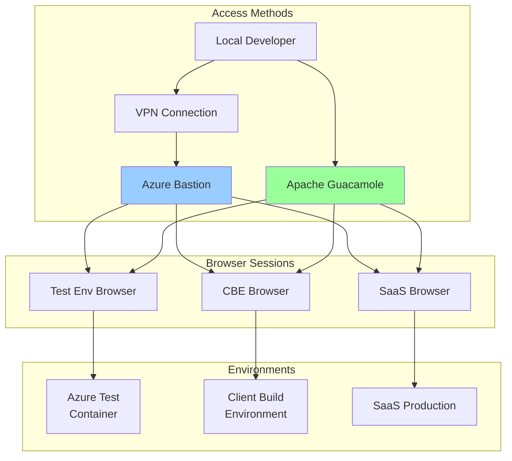

# Human Access & Penetration Testing Strategy
## Browser Access, Console Logs, and Security Testing

**Version:** 1.0  
**Date:** 2025-09-21  
**Author:** Winston - System Architect

---

## 🖥️ Overview

This document defines strategies for:
1. Human browser access in Azure Test, CBE, and SaaS environments
2. Developer console log access across all environments
3. Kali Linux penetration testing for SaaS build
4. Troubleshooting and debugging capabilities

---

## 🌐 Human Browser Access Architecture



---

## 🖥️ Browser Access Implementation

### 1. Azure Test Environment - Browser Access

```yaml
# azure-test-browser-deployment.yaml
apiVersion: apps/v1
kind: Deployment
metadata:
  name: browser-access-test
  namespace: test-environment
spec:
  replicas: 1
  selector:
    matchLabels:
      app: browser-access
  template:
    metadata:
      labels:
        app: browser-access
    spec:
      containers:
      # Main application container
      - name: oversight-app
        image: acrsecdevopsdev.azurecr.io/oversight-mvp:latest
        ports:
        - containerPort: 3000
        
      # Browser access container with VNC
      - name: browser-vnc
        image: selenium/standalone-chrome-debug:latest
        ports:
        - containerPort: 4444  # Selenium
        - containerPort: 5900  # VNC
        environment:
        - name: VNC_NO_PASSWORD
          value: "1"
        - name: SE_NODE_MAX_SESSIONS
          value: "5"
        - name: SE_NODE_SESSION_TIMEOUT
          value: "3600"
        - name: SCREEN_WIDTH
          value: "1920"
        - name: SCREEN_HEIGHT
          value: "1080"
        resources:
          requests:
            memory: "2Gi"
            cpu: "1"
          limits:
            memory: "4Gi"
            cpu: "2"
            
      # NoVNC web interface
      - name: novnc
        image: theasp/novnc:latest
        ports:
        - containerPort: 8080
        environment:
        - name: DISPLAY_WIDTH
          value: "1920"
        - name: DISPLAY_HEIGHT
          value: "1080"
        - name: RUN_XTERM
          value: "yes"
        command:
        - /bin/bash
        - -c
        - |
          # Start NoVNC server
          websockify --web /usr/share/novnc 8080 localhost:5900

---
apiVersion: v1
kind: Service
metadata:
  name: browser-access-service
  namespace: test-environment
spec:
  type: LoadBalancer
  ports:
  - name: app
    port: 3000
    targetPort: 3000
  - name: selenium
    port: 4444
    targetPort: 4444
  - name: vnc
    port: 5900
    targetPort: 5900
  - name: novnc
    port: 8080
    targetPort: 8080
  selector:
    app: browser-access
```

### 2. Apache Guacamole Setup (Centralized Access)

```yaml
# docker-compose.guacamole.yml
version: '3.8'

services:
  guacd:
    image: guacamole/guacd:latest
    restart: always
    networks:
      - guac-network
    volumes:
      - guacd-drive:/drive:rw
      - guacd-record:/record:rw

  postgres:
    image: postgres:14-alpine
    restart: always
    environment:
      POSTGRES_DB: guacamole_db
      POSTGRES_USER: guacamole_user
      POSTGRES_PASSWORD: ${GUAC_DB_PASSWORD}
    networks:
      - guac-network
    volumes:
      - postgres-data:/var/lib/postgresql/data

  guacamole:
    image: guacamole/guacamole:latest
    restart: always
    ports:
      - "8080:8080"
    environment:
      GUACD_HOSTNAME: guacd
      POSTGRES_DATABASE: guacamole_db
      POSTGRES_HOSTNAME: postgres
      POSTGRES_PASSWORD: ${GUAC_DB_PASSWORD}
      POSTGRES_USER: guacamole_user
      RECORDING_SEARCH_PATH: /record
    networks:
      - guac-network
    depends_on:
      - guacd
      - postgres

networks:
  guac-network:
    driver: bridge

volumes:
  guacd-drive:
  guacd-record:
  postgres-data:
```

### 3. Browser Access Configuration Script

```bash
#!/bin/bash
# scripts/access/setup-browser-access.sh

set -e

ENVIRONMENT="${1:-test}"
ACCESS_TYPE="${2:-vnc}"  # vnc, rdp, or ssh

echo "🌐 Setting up browser access for $ENVIRONMENT environment"

case $ENVIRONMENT in
  test)
    # Azure Test Environment
    echo "Configuring Azure Test browser access..."
    
    # Deploy browser access pod
    kubectl apply -f azure-test-browser-deployment.yaml
    
    # Get access URL
    BROWSER_URL=$(kubectl get service browser-access-service \
      -n test-environment \
      -o jsonpath='{.status.loadBalancer.ingress[0].ip}')
    
    echo "Browser VNC Access: vnc://$BROWSER_URL:5900"
    echo "Web Browser Access: http://$BROWSER_URL:8080"
    ;;
    
  cbe)
    # Client Build Environment
    echo "Configuring CBE browser access..."
    
    # Add browser container to CBE docker-compose
    cat >> docker-compose.cbe.yml << 'EOF'
  browser-access:
    image: selenium/standalone-chrome-debug:latest
    ports:
      - "4444:4444"
      - "5900:5900"
      - "7900:7900"  # NoVNC
    environment:
      - SE_VNC_NO_PASSWORD=1
      - SE_NODE_MAX_SESSIONS=5
    shm_size: 2gb
    networks:
      - cbe-network
EOF
    
    docker-compose -f docker-compose.cbe.yml up -d browser-access
    echo "CBE Browser Access: http://localhost:7900"
    ;;
    
  saas)
    # SaaS Production
    echo "Configuring SaaS browser access..."
    
    # Use Azure Bastion for SaaS
    az network bastion create \
      --name bastion-saas-prod \
      --public-ip-address bastion-pip \
      --resource-group saas-platform-rg \
      --vnet-name vnet-saas-prod \
      --location uksouth
    
    echo "SaaS Browser Access via Azure Portal Bastion"
    ;;
esac

# Configure Guacamole connections
configure_guacamole() {
  echo "Adding $ENVIRONMENT to Guacamole..."
  
  # Create connection configuration
  cat > guacamole-$ENVIRONMENT.json << EOF
{
  "name": "$ENVIRONMENT Browser Access",
  "protocol": "$ACCESS_TYPE",
  "parameters": {
    "hostname": "$BROWSER_URL",
    "port": "5900",
    "password": "${VNC_PASSWORD:-}",
    "recording-path": "/record",
    "recording-name": "$ENVIRONMENT-\${GUAC_DATE}-\${GUAC_USERNAME}",
    "enable-clipboard": "true",
    "enable-drive": "true"
  }
}
EOF
  
  # Import to Guacamole
  curl -X POST http://localhost:8080/api/session/data/postgresql/connections \
    -H "Content-Type: application/json" \
    -d @guacamole-$ENVIRONMENT.json
}

configure_guacamole

echo "✅ Browser access configured for $ENVIRONMENT"
```

---

## 📝 Console Log Access

### 1. Centralized Logging Architecture

```yaml
# logging-stack.yaml
apiVersion: v1
kind: ConfigMap
metadata:
  name: fluent-bit-config
  namespace: logging
data:
  fluent-bit.conf: |
    [SERVICE]
        Flush         5
        Log_Level     info
        Daemon        off

    [INPUT]
        Name              tail
        Path              /var/log/containers/*.log
        Parser            docker
        Tag               kube.*
        Refresh_Interval  5

    [OUTPUT]
        Name              azure_loganalytics
        Match             *
        Customer_ID       ${LOG_ANALYTICS_WORKSPACE_ID}
        Shared_Key        ${LOG_ANALYTICS_WORKSPACE_KEY}
        Log_Type          ContainerLog

    [OUTPUT]
        Name              stdout
        Match             *
        Format            json_lines

---
apiVersion: apps/v1
kind: DaemonSet
metadata:
  name: fluent-bit
  namespace: logging
spec:
  selector:
    matchLabels:
      name: fluent-bit
  template:
    metadata:
      labels:
        name: fluent-bit
    spec:
      containers:
      - name: fluent-bit
        image: fluent/fluent-bit:latest
        volumeMounts:
        - name: varlog
          mountPath: /var/log
        - name: config
          mountPath: /fluent-bit/etc/
      volumes:
      - name: varlog
        hostPath:
          path: /var/log
      - name: config
        configMap:
          name: fluent-bit-config
```

### 2. Developer Console Access Tool

```typescript
// scripts/console/dev-console-access.ts
import { WebSocket } from 'ws';
import { createInterface } from 'readline';
import chalk from 'chalk';
import blessed from 'blessed';

export class DevConsoleAccess {
  private environments = {
    test: 'wss://console-test.oversight.io/ws',
    cbe: 'wss://console-cbe.oversight.io/ws',
    saas: 'wss://console-saas.oversight.io/ws'
  };
  
  private screen: any;
  private logBox: any;
  private commandBox: any;
  private ws: WebSocket;
  
  async connect(environment: string) {
    console.log(chalk.green(`🔌 Connecting to ${environment} console...`));
    
    // Create blessed terminal UI
    this.setupUI();
    
    // Connect to WebSocket
    this.ws = new WebSocket(this.environments[environment], {
      headers: {
        'Authorization': `Bearer ${process.env.CONSOLE_TOKEN}`,
        'X-Environment': environment
      }
    });
    
    this.ws.on('open', () => {
      this.logBox.log(chalk.green('✅ Connected to console'));
      this.screen.render();
    });
    
    this.ws.on('message', (data) => {
      const log = JSON.parse(data.toString());
      this.displayLog(log);
    });
    
    this.ws.on('error', (err) => {
      this.logBox.log(chalk.red(`❌ Error: ${err.message}`));
      this.screen.render();
    });
  }
  
  private setupUI() {
    // Create blessed screen
    this.screen = blessed.screen({
      smartCSR: true,
      title: 'Developer Console Access'
    });
    
    // Create log display box
    this.logBox = blessed.log({
      parent: this.screen,
      top: 0,
      left: 0,
      width: '100%',
      height: '80%',
      border: {
        type: 'line'
      },
      label: ' Console Logs ',
      scrollable: true,
      alwaysScroll: true,
      mouse: true,
      keys: true,
      vi: true,
      scrollbar: {
        ch: ' ',
        inverse: true
      }
    });
    
    // Create command input box
    this.commandBox = blessed.textbox({
      parent: this.screen,
      bottom: 0,
      left: 0,
      width: '100%',
      height: '20%',
      border: {
        type: 'line'
      },
      label: ' Commands (type "help" for commands) ',
      inputOnFocus: true,
      mouse: true
    });
    
    // Setup keybindings
    this.screen.key(['q', 'C-c'], () => {
      this.disconnect();
      process.exit(0);
    });
    
    this.screen.key('/', () => {
      // Search in logs
      this.commandBox.focus();
      this.commandBox.setValue('/');
      this.screen.render();
    });
    
    this.screen.key('f', () => {
      // Filter logs
      this.showFilterDialog();
    });
    
    this.commandBox.on('submit', (value) => {
      this.executeCommand(value);
      this.commandBox.clearValue();
      this.commandBox.focus();
      this.screen.render();
    });
    
    // Focus on command box initially
    this.commandBox.focus();
    this.screen.render();
  }
  
  private displayLog(log: any) {
    const timestamp = new Date(log.timestamp).toISOString();
    const level = this.colorizeLevel(log.level);
    const message = log.message;
    const metadata = log.metadata ? chalk.gray(JSON.stringify(log.metadata)) : '';
    
    const formatted = `${chalk.gray(timestamp)} ${level} ${message} ${metadata}`;
    this.logBox.log(formatted);
    this.screen.render();
  }
  
  private colorizeLevel(level: string): string {
    switch (level.toLowerCase()) {
      case 'error':
        return chalk.red('[ERROR]');
      case 'warn':
        return chalk.yellow('[WARN]');
      case 'info':
        return chalk.blue('[INFO]');
      case 'debug':
        return chalk.gray('[DEBUG]');
      default:
        return `[${level.toUpperCase()}]`;
    }
  }
  
  private executeCommand(command: string) {
    if (command.startsWith('/')) {
      // Search command
      const searchTerm = command.substring(1);
      this.searchLogs(searchTerm);
    } else if (command === 'help') {
      this.showHelp();
    } else if (command === 'clear') {
      this.logBox.setContent('');
    } else if (command.startsWith('filter ')) {
      const filter = command.substring(7);
      this.applyFilter(filter);
    } else if (command === 'export') {
      this.exportLogs();
    } else {
      // Send command to remote console
      this.ws.send(JSON.stringify({
        type: 'command',
        command: command
      }));
    }
  }
  
  private showHelp() {
    const help = `
Available Commands:
  /search_term  - Search for term in logs
  filter level  - Filter by log level (error, warn, info, debug)
  clear        - Clear console display
  export       - Export logs to file
  tail n       - Show last n lines
  follow       - Follow log stream (default)
  pause        - Pause log streaming
  resume       - Resume log streaming
  q            - Quit console
    `;
    this.logBox.log(chalk.cyan(help));
  }
  
  private searchLogs(term: string) {
    // Highlight search results
    const content = this.logBox.getLines();
    const highlighted = content.map(line => {
      if (line.includes(term)) {
        return line.replace(term, chalk.bgYellow.black(term));
      }
      return line;
    });
    this.logBox.setContent(highlighted.join('\n'));
  }
  
  private applyFilter(filter: string) {
    this.ws.send(JSON.stringify({
      type: 'filter',
      filter: filter
    }));
  }
  
  private exportLogs() {
    const fs = require('fs');
    const filename = `console-logs-${Date.now()}.txt`;
    fs.writeFileSync(filename, this.logBox.getContent());
    this.logBox.log(chalk.green(`✅ Logs exported to ${filename}`));
  }
  
  disconnect() {
    if (this.ws) {
      this.ws.close();
    }
    this.screen.destroy();
  }
}

// CLI Interface
const program = require('commander');

program
  .command('connect <environment>')
  .description('Connect to environment console')
  .action(async (environment) => {
    const console = new DevConsoleAccess();
    await console.connect(environment);
  });

program.parse(process.argv);
```

### 3. Azure Log Access Script

```bash
#!/bin/bash
# scripts/access/azure-log-access.sh

ENVIRONMENT="${1:-test}"
FOLLOW="${2:-true}"
RESOURCE_GROUP="rg-secdevops-cicd-dev"

echo "📝 Accessing logs for $ENVIRONMENT environment"

case $ENVIRONMENT in
  test)
    # Azure Container Instance logs
    if [ "$FOLLOW" = "true" ]; then
      az container logs \
        --resource-group $RESOURCE_GROUP \
        --name oversight-mvp-test \
        --follow
    else
      az container logs \
        --resource-group $RESOURCE_GROUP \
        --name oversight-mvp-test \
        --tail 1000
    fi
    ;;
    
  saas)
    # App Service logs
    az webapp log tail \
      --name oversight-mvp-saas \
      --resource-group saas-platform-rg
    ;;
    
  cbe)
    # Docker compose logs
    docker-compose -f docker-compose.cbe.yml logs -f
    ;;
    
  *)
    echo "Unknown environment: $ENVIRONMENT"
    exit 1
    ;;
esac
```

---

## 🔒 Kali Linux Penetration Testing

### 1. Kali Setup for SaaS Testing

```bash
#!/bin/bash
# scripts/pentesting/setup-kali-pentest.sh

set -e

echo "🐉 Setting up Kali Linux penetration testing environment"

# Pull Kali Docker image
docker pull kalilinux/kali-rolling:latest

# Create Kali container with tools
docker run -it -d \
  --name kali-pentest \
  --network host \
  --cap-add NET_ADMIN \
  --cap-add SYS_PTRACE \
  -v $(pwd)/pentest-results:/results \
  -v $(pwd)/scripts/pentesting:/scripts \
  kalilinux/kali-rolling:latest

# Install required tools
docker exec kali-pentest bash -c "
  apt-get update && apt-get install -y \
    nmap \
    nikto \
    sqlmap \
    metasploit-framework \
    burpsuite \
    zaproxy \
    gobuster \
    hydra \
    john \
    hashcat \
    aircrack-ng \
    wfuzz \
    dirb \
    ffuf \
    subfinder \
    amass \
    masscan \
    git \
    python3-pip
  
  # Install additional Python tools
  pip3 install impacket crackmapexec bloodhound
"

echo "✅ Kali environment ready"
```

### 2. Automated Penetration Testing Suite

```python
#!/usr/bin/env python3
# scripts/pentesting/automated-pentest.py

import subprocess
import json
import datetime
import os
from typing import Dict, List
import concurrent.futures

class SaaSPenTest:
    def __init__(self, target_url: str, output_dir: str = "./pentest-results"):
        self.target_url = target_url
        self.output_dir = output_dir
        self.timestamp = datetime.datetime.now().strftime("%Y%m%d_%H%M%S")
        self.results_dir = f"{output_dir}/{self.timestamp}"
        os.makedirs(self.results_dir, exist_ok=True)
        self.results = {}
    
    def run_all_tests(self):
        """Execute complete penetration testing suite"""
        print(f"🔍 Starting penetration testing against {self.target_url}")
        
        tests = [
            ("reconnaissance", self.run_reconnaissance),
            ("vulnerability_scanning", self.run_vulnerability_scan),
            ("web_application_testing", self.run_web_app_tests),
            ("authentication_testing", self.run_auth_tests),
            ("api_testing", self.run_api_tests),
            ("ssl_testing", self.run_ssl_tests),
            ("injection_testing", self.run_injection_tests),
            ("privilege_escalation", self.run_privesc_tests)
        ]
        
        with concurrent.futures.ThreadPoolExecutor(max_workers=4) as executor:
            futures = {executor.submit(test_func): test_name 
                      for test_name, test_func in tests}
            
            for future in concurrent.futures.as_completed(futures):
                test_name = futures[future]
                try:
                    result = future.result()
                    self.results[test_name] = result
                    print(f"✅ Completed: {test_name}")
                except Exception as e:
                    print(f"❌ Failed: {test_name} - {e}")
                    self.results[test_name] = {"error": str(e)}
        
        self.generate_report()
    
    def run_reconnaissance(self) -> Dict:
        """Reconnaissance phase"""
        print("🔍 Running reconnaissance...")
        results = {}
        
        # Nmap scan
        nmap_output = subprocess.run([
            "nmap", "-sV", "-sC", "-O", "-A",
            "-oX", f"{self.results_dir}/nmap.xml",
            self.target_url.replace("http://", "").replace("https://", "")
        ], capture_output=True, text=True)
        results["nmap"] = nmap_output.stdout
        
        # DNS enumeration
        dns_output = subprocess.run([
            "dnsrecon", "-d", 
            self.target_url.replace("http://", "").replace("https://", "")
        ], capture_output=True, text=True)
        results["dns"] = dns_output.stdout
        
        # Subdomain enumeration
        subdomain_output = subprocess.run([
            "subfinder", "-d",
            self.target_url.replace("http://", "").replace("https://", ""),
            "-o", f"{self.results_dir}/subdomains.txt"
        ], capture_output=True, text=True)
        results["subdomains"] = subdomain_output.stdout
        
        return results
    
    def run_vulnerability_scan(self) -> Dict:
        """Vulnerability scanning"""
        print("🔍 Running vulnerability scan...")
        results = {}
        
        # Nikto scan
        nikto_output = subprocess.run([
            "nikto", "-h", self.target_url,
            "-output", f"{self.results_dir}/nikto.txt"
        ], capture_output=True, text=True)
        results["nikto"] = nikto_output.stdout
        
        # OpenVAS scan (if available)
        # This would require OpenVAS setup
        
        return results
    
    def run_web_app_tests(self) -> Dict:
        """Web application testing"""
        print("🔍 Testing web application...")
        results = {}
        
        # Directory brute forcing
        gobuster_output = subprocess.run([
            "gobuster", "dir",
            "-u", self.target_url,
            "-w", "/usr/share/wordlists/dirb/common.txt",
            "-o", f"{self.results_dir}/gobuster.txt"
        ], capture_output=True, text=True, timeout=300)
        results["directory_bruteforce"] = gobuster_output.stdout
        
        # OWASP ZAP baseline scan
        zap_output = subprocess.run([
            "docker", "run", "--rm",
            "-v", f"{self.results_dir}:/zap/reports",
            "owasp/zap2docker-stable",
            "zap-baseline.py",
            "-t", self.target_url,
            "-r", "/zap/reports/zap-report.html"
        ], capture_output=True, text=True)
        results["owasp_zap"] = zap_output.stdout
        
        return results
    
    def run_auth_tests(self) -> Dict:
        """Authentication testing"""
        print("🔍 Testing authentication...")
        results = {}
        
        # Test for default credentials
        # Test for weak passwords
        # Test for session management issues
        
        # Example Hydra brute force (be careful with this!)
        # hydra_output = subprocess.run([
        #     "hydra", "-L", "users.txt", "-P", "passwords.txt",
        #     f"{self.target_url}", "http-post-form",
        #     "/login:username=^USER^&password=^PASS^:Invalid"
        # ], capture_output=True, text=True)
        
        return results
    
    def run_api_tests(self) -> Dict:
        """API security testing"""
        print("🔍 Testing API endpoints...")
        results = {}
        
        # API fuzzing with wfuzz
        wfuzz_output = subprocess.run([
            "wfuzz", "-c", "-z", "file,/usr/share/wordlists/wfuzz/general/common.txt",
            "--hc", "404", f"{self.target_url}/api/FUZZ"
        ], capture_output=True, text=True, timeout=300)
        results["api_fuzzing"] = wfuzz_output.stdout
        
        return results
    
    def run_ssl_tests(self) -> Dict:
        """SSL/TLS testing"""
        print("🔍 Testing SSL/TLS...")
        results = {}
        
        # SSLyze scan
        sslyze_output = subprocess.run([
            "python3", "-m", "sslyze",
            "--regular", self.target_url.replace("http://", "").replace("https://", "")
        ], capture_output=True, text=True)
        results["sslyze"] = sslyze_output.stdout
        
        # testssl.sh (if available)
        
        return results
    
    def run_injection_tests(self) -> Dict:
        """Injection testing (SQL, XSS, etc.)"""
        print("🔍 Testing for injection vulnerabilities...")
        results = {}
        
        # SQLMap for SQL injection
        sqlmap_output = subprocess.run([
            "sqlmap", "-u", f"{self.target_url}/api/search?q=test",
            "--batch", "--random-agent",
            "--output-dir", f"{self.results_dir}/sqlmap"
        ], capture_output=True, text=True, timeout=600)
        results["sql_injection"] = sqlmap_output.stdout
        
        return results
    
    def run_privesc_tests(self) -> Dict:
        """Privilege escalation testing"""
        print("🔍 Testing for privilege escalation...")
        results = {}
        
        # This would typically require authenticated access
        # and would test for horizontal and vertical privilege escalation
        
        return results
    
    def generate_report(self):
        """Generate penetration testing report"""
        print("📊 Generating report...")
        
        report = {
            "timestamp": self.timestamp,
            "target": self.target_url,
            "summary": self.generate_summary(),
            "findings": self.analyze_results(),
            "recommendations": self.generate_recommendations(),
            "raw_results": self.results
        }
        
        # Save JSON report
        with open(f"{self.results_dir}/pentest-report.json", "w") as f:
            json.dump(report, f, indent=2)
        
        # Generate HTML report
        self.generate_html_report(report)
        
        print(f"✅ Report saved to {self.results_dir}/")
    
    def generate_summary(self) -> Dict:
        """Generate executive summary"""
        critical_findings = 0
        high_findings = 0
        medium_findings = 0
        low_findings = 0
        
        # Analyze results and count findings by severity
        # This would parse the actual tool outputs
        
        return {
            "critical": critical_findings,
            "high": high_findings,
            "medium": medium_findings,
            "low": low_findings,
            "total_tests_run": len(self.results)
        }
    
    def analyze_results(self) -> List[Dict]:
        """Analyze test results and extract findings"""
        findings = []
        
        # Parse each tool's output and extract vulnerabilities
        # This would be customized based on tool output formats
        
        return findings
    
    def generate_recommendations(self) -> List[str]:
        """Generate security recommendations"""
        recommendations = [
            "Implement Web Application Firewall (WAF)",
            "Enable rate limiting on API endpoints",
            "Implement proper input validation",
            "Use parameterized queries to prevent SQL injection",
            "Implement Content Security Policy (CSP)",
            "Enable HSTS and other security headers",
            "Regular security updates and patching",
            "Implement least privilege access control",
            "Enable audit logging and monitoring",
            "Conduct regular security assessments"
        ]
        
        return recommendations
    
    def generate_html_report(self, report: Dict):
        """Generate HTML report"""
        html_template = """
<!DOCTYPE html>
<html>
<head>
    <title>Penetration Test Report - {timestamp}</title>
    <style>
        body {{ font-family: Arial, sans-serif; margin: 40px; }}
        h1 {{ color: #333; }}
        h2 {{ color: #666; border-bottom: 2px solid #ddd; padding-bottom: 5px; }}
        .critical {{ color: #d9534f; font-weight: bold; }}
        .high {{ color: #f0ad4e; font-weight: bold; }}
        .medium {{ color: #5bc0de; }}
        .low {{ color: #5cb85c; }}
        table {{ width: 100%; border-collapse: collapse; margin: 20px 0; }}
        th, td {{ border: 1px solid #ddd; padding: 12px; text-align: left; }}
        th {{ background-color: #f5f5f5; }}
        .summary-box {{ background: #f9f9f9; padding: 20px; border-radius: 5px; margin: 20px 0; }}
    </style>
</head>
<body>
    <h1>Penetration Test Report</h1>
    <p><strong>Target:</strong> {target}</p>
    <p><strong>Date:</strong> {timestamp}</p>
    
    <div class="summary-box">
        <h2>Executive Summary</h2>
        <p>Total Tests Run: {total_tests}</p>
        <p class="critical">Critical Findings: {critical}</p>
        <p class="high">High Findings: {high}</p>
        <p class="medium">Medium Findings: {medium}</p>
        <p class="low">Low Findings: {low}</p>
    </div>
    
    <h2>Recommendations</h2>
    <ul>
        {recommendations}
    </ul>
    
    <h2>Detailed Findings</h2>
    {findings}
    
</body>
</html>
        """
        
        recommendations_html = "\n".join([f"<li>{r}</li>" for r in report["recommendations"]])
        
        html_content = html_template.format(
            timestamp=report["timestamp"],
            target=report["target"],
            total_tests=report["summary"]["total_tests_run"],
            critical=report["summary"]["critical"],
            high=report["summary"]["high"],
            medium=report["summary"]["medium"],
            low=report["summary"]["low"],
            recommendations=recommendations_html,
            findings="<p>See detailed findings in individual tool reports</p>"
        )
        
        with open(f"{self.results_dir}/pentest-report.html", "w") as f:
            f.write(html_content)

if __name__ == "__main__":
    import sys
    
    if len(sys.argv) < 2:
        print("Usage: python3 automated-pentest.py <target_url>")
        sys.exit(1)
    
    target = sys.argv[1]
    pentest = SaaSPenTest(target)
    pentest.run_all_tests()
```

### 3. Continuous Security Testing Pipeline

```yaml
# jenkins-security-testing.yml
pipeline {
    agent any
    
    triggers {
        cron('0 2 * * 0')  # Weekly on Sunday at 2 AM
    }
    
    stages {
        stage('Prepare Kali Environment') {
            steps {
                script {
                    sh '''
                        docker pull kalilinux/kali-rolling:latest
                        ./scripts/pentesting/setup-kali-pentest.sh
                    '''
                }
            }
        }
        
        stage('Reconnaissance') {
            steps {
                script {
                    sh '''
                        docker exec kali-pentest \
                            python3 /scripts/automated-pentest.py \
                            https://saas.oversight-mvp.io
                    '''
                }
            }
        }
        
        stage('Vulnerability Assessment') {
            parallel {
                stage('Web Scanning') {
                    steps {
                        sh 'docker exec kali-pentest nikto -h https://saas.oversight-mvp.io'
                    }
                }
                stage('SSL Testing') {
                    steps {
                        sh 'docker exec kali-pentest testssl.sh https://saas.oversight-mvp.io'
                    }
                }
                stage('API Testing') {
                    steps {
                        sh 'docker exec kali-pentest wfuzz -c -z file,/wordlists/api.txt https://saas.oversight-mvp.io/api/FUZZ'
                    }
                }
            }
        }
        
        stage('Generate Report') {
            steps {
                script {
                    sh '''
                        docker exec kali-pentest \
                            python3 /scripts/generate-pentest-report.py
                    '''
                    
                    // Archive results
                    archiveArtifacts artifacts: 'pentest-results/**/*'
                    
                    // Publish HTML report
                    publishHTML([
                        reportDir: 'pentest-results',
                        reportFiles: 'pentest-report.html',
                        reportName: 'Penetration Test Report'
                    ])
                }
            }
        }
        
        stage('Create Security Tickets') {
            when {
                expression { 
                    def report = readJSON file: 'pentest-results/pentest-report.json'
                    return report.summary.critical > 0 || report.summary.high > 0
                }
            }
            steps {
                script {
                    sh '''
                        python3 scripts/create-security-tickets.py \
                            pentest-results/pentest-report.json
                    '''
                }
            }
        }
    }
    
    post {
        always {
            // Clean up Kali container
            sh 'docker stop kali-pentest || true'
            sh 'docker rm kali-pentest || true'
        }
        success {
            emailext(
                subject: "Security Test Passed",
                body: "Penetration testing completed successfully. View report: ${BUILD_URL}",
                to: 'security-team@company.com'
            )
        }
        failure {
            emailext(
                subject: "Critical Security Issues Found",
                body: "Critical vulnerabilities detected. Immediate action required: ${BUILD_URL}",
                to: 'security-team@company.com, dev-team@company.com'
            )
        }
    }
}
```

---

## 🚀 Quick Access Commands

### Browser Access
```bash
# Azure Test Environment
kubectl port-forward service/browser-access-service 7900:7900 -n test-environment
open http://localhost:7900

# CBE Environment
docker-compose -f docker-compose.cbe.yml up browser-access
open http://localhost:7900

# SaaS via Bastion
az network bastion rdp --resource-group saas-platform-rg --name bastion-saas-prod
```

### Console Logs
```bash
# Connect to test console
node scripts/console/dev-console-access.ts connect test

# Stream Azure logs
./scripts/access/azure-log-access.sh test true

# Export last hour of logs
./scripts/access/export-logs.sh test 1h
```

### Penetration Testing
```bash
# Run full pentest suite
docker exec kali-pentest python3 /scripts/automated-pentest.py https://saas.oversight-mvp.io

# Quick vulnerability scan
docker exec kali-pentest nikto -h https://saas.oversight-mvp.io

# API security test
docker exec kali-pentest wfuzz -c -z file,/wordlists/api.txt https://saas.oversight-mvp.io/api/FUZZ
```

---

This comprehensive strategy provides human access to all environments with browser and console capabilities, plus automated penetration testing for the SaaS build using Kali Linux.