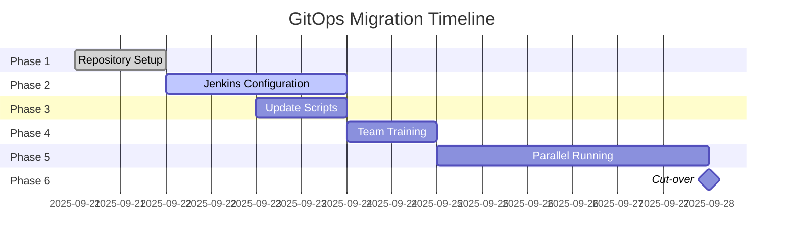

# Migration Guide: From Direct Deployment to GitOps

## 🔄 Migration Overview

This guide helps transition from direct deployment methods to proper GitOps workflows.

---

## ⚠️ Current State (TO BE DEPRECATED)

### What We're Moving Away From:
```bash
# ❌ OLD METHOD - Direct deployment from local
./deploy-oversight-single-script.sh v1.0

# ❌ OLD METHOD - Manual Docker commands
docker build -t oversight-mvp .
docker push acrsecdevopsdev.azurecr.io/oversight-mvp

# ❌ OLD METHOD - Direct Azure CLI deployment
az container create --name oversight-mvp ...
```

### Problems with Current Approach:
- No audit trail of who deployed what
- No security scanning before deployment
- No automated testing
- No rollback capability
- No peer review process
- Inconsistent deployments
- Security vulnerabilities may be deployed

---

## ✅ Target State (GITOPS)

### New Deployment Flow:
```bash
# ✅ NEW METHOD - Everything through Git
git push origin feature/new-feature
# Creates PR → Review → Merge → Auto-deploy
```

### Benefits:
- Full audit trail with Git history
- Automated security scanning at every stage
- Peer review via Pull Requests
- Automated testing (5000+ tests)
- Easy rollback to any previous version
- Consistent, reproducible deployments
- Security gates prevent vulnerable code

---

## 📋 Migration Steps

### Phase 1: Repository Setup (Day 1)
```bash
# 1. Initialize GitHub repository
cd /home/jez/code/Oversight-MVP-09-04
git init
git remote add origin https://github.com/JezSurfaceIT/oversight-mvp.git

# 2. Create proper .gitignore
cat > .gitignore << 'EOF'
node_modules/
.next/
.env
.env.local
*.key
*.pem
ssl/
coverage/
EOF

# 3. Initial commit
git add .
git commit -m "feat: Initial Oversight MVP migration to GitOps"
git push -u origin main
```

### Phase 2: Jenkins Configuration (Day 1-2)
```groovy
// 1. Create Jenkins job
// Name: oversight-mvp
// Type: Multibranch Pipeline
// Source: GitHub
// Repository: https://github.com/JezSurfaceIT/oversight-mvp.git

// 2. Configure webhook
// GitHub → Settings → Webhooks
// URL: http://<jenkins-url>/github-webhook/
// Events: Push, Pull Request
```

### Phase 3: Update Scripts (Day 2)
```bash
# Replace old deployment scripts
mv deploy-oversight-single-script.sh deploy-oversight-single-script.sh.deprecated
ln -s deploy-from-github.sh deploy-oversight.sh

# Update documentation
echo "⚠️ DEPRECATED - Use deploy-from-github.sh instead" > DEPRECATED_SCRIPTS.md
```

### Phase 4: Team Training (Day 3)
```markdown
Training Topics:
1. Git workflow (feature branches, PRs)
2. Jenkins pipeline overview
3. Security scanning results interpretation
4. Monitoring deployments
5. Rollback procedures
```

### Phase 5: Parallel Running (Days 4-7)
```yaml
Transition Period:
  - Both methods available but GitOps preferred
  - Monitor both deployment methods
  - Document any issues
  - Gather feedback from team
```

### Phase 6: Cut-over (Day 8)
```bash
# Disable old deployment methods
chmod -x deploy-oversight-single-script.sh.deprecated
echo "#!/bin/bash
echo 'ERROR: This script is deprecated. Use deploy-from-github.sh'
exit 1" > deploy-oversight-single-script.sh
```

---

## 🔍 Validation Checklist

### Before Migration:
- [ ] All code committed to GitHub
- [ ] Jenkins job configured
- [ ] Webhook tested
- [ ] Security scanning tools installed
- [ ] Team trained on new process

### After Migration:
- [ ] First deployment via GitOps successful
- [ ] Security scans running
- [ ] Tests passing
- [ ] Monitoring active
- [ ] Rollback tested

---

## 📊 Comparison Matrix

| Aspect | Old Method | GitOps Method |
|--------|------------|---------------|
| **Deployment Time** | 5 minutes | 15-20 minutes |
| **Security Scans** | None | Automated |
| **Testing** | Manual | Automated (5000+ tests) |
| **Approval Process** | None | PR Review + Manual Gate |
| **Rollback Time** | 30+ minutes | 2 minutes |
| **Audit Trail** | None | Complete Git history |
| **Consistency** | Variable | 100% reproducible |
| **Risk Level** | High | Low |

---

## 🚨 Emergency Procedures

### If GitOps Pipeline Fails:
```bash
# 1. Check Jenkins logs
tail -f /var/log/jenkins/jenkins.log

# 2. Check GitHub webhook
curl -X POST http://<jenkins-url>/github-webhook/

# 3. Manual trigger (emergency only)
curl -X POST http://<jenkins-url>/job/oversight-mvp/build

# 4. Rollback to previous version
git revert HEAD
git push origin main
```

### Temporary Fallback (Emergency Only):
```bash
# Only use in critical situations with approval
# Document why GitOps couldn't be used
echo "Emergency deployment reason: <REASON>" >> emergency-deployments.log
# Then contact DevOps team immediately
```

---

## 📈 Success Metrics

Track these metrics during migration:

| Metric | Target | Measurement |
|--------|--------|-------------|
| Deployment Success Rate | >95% | Jenkins metrics |
| Security Scan Pass Rate | >90% | SonarQube dashboard |
| Mean Time to Deploy | <30 min | Pipeline duration |
| Rollback Success Rate | 100% | Incident reports |
| Team Adoption Rate | 100% | GitHub commits |

---

## 🗓️ Migration Timeline



---

## 📚 Training Resources

### For Developers:
- [Git Workflow Guide](./docs/git-workflow.md)
- [Creating Pull Requests](./docs/pull-requests.md)
- [Understanding Pipeline Failures](./docs/pipeline-debugging.md)

### For DevOps:
- [Jenkins Administration](./docs/jenkins-admin.md)
- [Security Scan Configuration](./docs/security-scanning.md)
- [Monitoring Setup](./docs/monitoring.md)

---

## ❓ FAQ

**Q: Why is GitOps deployment slower?**
A: The additional time ensures security scanning, automated testing, and peer review. This prevents issues in production.

**Q: Can I still deploy directly in emergencies?**
A: Emergency procedures exist but require documentation and immediate DevOps team notification.

**Q: What if GitHub is down?**
A: We maintain local Git mirrors and can temporarily use GitLab as backup.

**Q: How do I rollback a bad deployment?**
A: Simply revert the commit in GitHub and push. The pipeline automatically handles the rest.

---

## 📞 Support

During migration:
- Slack: #gitops-migration
- Email: devops-team@oversight.com
- Office Hours: Daily 10am-11am for questions

---

**Remember:** The goal is not just to change tools, but to improve our deployment quality, security, and reliability. The extra steps in GitOps save hours of debugging and prevent security incidents.