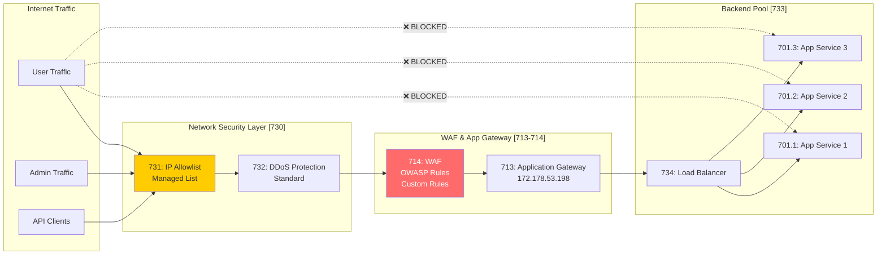

# Network Security Architecture
## WAF Traffic Flow & IP Restrictions

**Version:** 1.0  
**Date:** 2025-09-21  
**Component IDs:** 713-714, 730-739

---

## 🔒 SaaS Traffic Flow - All Through WAF



---

## 📋 IP Restriction Configuration

### Component 731: IP Allowlist Management

```typescript
// scripts/network/ip-restriction-manager.ts
export interface IPRestrictionConfig {
  environment: string;
  componentId: string;
  allowedIPs: IPRange[];
  blockMode: 'allowlist' | 'blocklist';
}

export const IPRestrictions: IPRestrictionConfig[] = [
  {
    environment: 'SaaS Production',
    componentId: '713-714',
    blockMode: 'allowlist',
    allowedIPs: [
      { name: 'Office Network', cidr: '203.0.113.0/24' },
      { name: 'VPN Range', cidr: '10.0.0.0/8' },
      { name: 'Azure DevOps', cidr: '13.107.6.0/24' },
      { name: 'CloudFlare', cidr: '173.245.48.0/20' },
      { name: 'Customer 1', cidr: '198.51.100.14/32' }
    ]
  },
  {
    environment: 'Test Environment',
    componentId: '401',
    blockMode: 'allowlist',
    allowedIPs: [
      { name: 'Development Team', cidr: '203.0.113.0/24' },
      { name: 'CI/CD Pipeline', cidr: '10.0.1.0/24' },
      { name: 'Kali Testing', cidr: '192.168.1.100/32' }
    ]
  },
  {
    environment: 'CBE Mimic',
    componentId: '860',
    blockMode: 'allowlist',
    allowedIPs: [
      { name: 'Internal Only', cidr: '10.0.0.0/8' },
      { name: 'Customer Portal', cidr: '10.0.2.0/24' }
    ]
  }
];
```

### Azure Implementation Scripts

```bash
#!/bin/bash
# scripts/network/configure-waf-ip-restrictions.sh
# Components: 713-714, 731

set -e

RESOURCE_GROUP="saas-platform-rg"
APP_GW_NAME="appgw-saas-prod"
WAF_POLICY_NAME="waf-policy-saas"

echo "🔒 Configuring WAF and IP Restrictions for SaaS"

# Step 1: Create WAF Policy
echo "Creating WAF Policy..."
az network application-gateway waf-policy create \
    --name $WAF_POLICY_NAME \
    --resource-group $RESOURCE_GROUP \
    --location uksouth \
    --type OWASP \
    --version 3.2

# Step 2: Configure WAF Rules
echo "Configuring WAF rules..."
az network application-gateway waf-policy managed-rule set add \
    --policy-name $WAF_POLICY_NAME \
    --resource-group $RESOURCE_GROUP \
    --type OWASP \
    --version 3.2 \
    --rule-group-name REQUEST-931-APPLICATION-ATTACK-RFI \
    --rules 931100 931110 931120

# Step 3: Add Custom Rules for IP Restrictions
echo "Adding IP restriction rules..."
cat > ip-restriction-rule.json << 'EOF'
{
  "name": "IPAllowlistRule",
  "priority": 1,
  "ruleType": "MatchRule",
  "matchConditions": [
    {
      "matchVariables": [
        {
          "variableName": "RemoteAddr"
        }
      ],
      "operator": "IPMatch",
      "negationCondition": true,
      "matchValues": [
        "203.0.113.0/24",
        "10.0.0.0/8",
        "13.107.6.0/24",
        "173.245.48.0/20"
      ]
    }
  ],
  "action": "Block"
}
EOF

az network application-gateway waf-policy custom-rule create \
    --policy-name $WAF_POLICY_NAME \
    --resource-group $RESOURCE_GROUP \
    --name IPAllowlistRule \
    --priority 1 \
    --action Block \
    --rule-type MatchRule

# Step 4: Associate WAF Policy with Application Gateway
echo "Associating WAF with Application Gateway..."
az network application-gateway update \
    --name $APP_GW_NAME \
    --resource-group $RESOURCE_GROUP \
    --waf-policy $WAF_POLICY_NAME \
    --sku WAF_v2 \
    --capacity 2

# Step 5: Configure Backend Pool to App Services
echo "Configuring backend pool..."
az network application-gateway address-pool update \
    --gateway-name $APP_GW_NAME \
    --resource-group $RESOURCE_GROUP \
    --name appServiceBackendPool \
    --servers \
        oversight-mvp-saas-1.azurewebsites.net \
        oversight-mvp-saas-2.azurewebsites.net \
        oversight-mvp-saas-3.azurewebsites.net

# Step 6: Block Direct Access to App Services
echo "Blocking direct access to App Services..."
for i in 1 2 3; do
    az webapp config access-restriction add \
        --name oversight-mvp-saas-$i \
        --resource-group $RESOURCE_GROUP \
        --rule-name "AllowOnlyFromAppGateway" \
        --priority 100 \
        --action Allow \
        --ip-address 172.178.53.198/32 \
        --description "Only allow traffic from Application Gateway"
    
    # Deny all other traffic
    az webapp config access-restriction add \
        --name oversight-mvp-saas-$i \
        --resource-group $RESOURCE_GROUP \
        --rule-name "DenyAll" \
        --priority 65000 \
        --action Deny \
        --ip-address 0.0.0.0/0 \
        --description "Deny all other traffic"
done

echo "✅ WAF and IP restrictions configured"
```

### Test Environment IP Restrictions

```bash
#!/bin/bash
# scripts/network/configure-test-ip-restrictions.sh
# Component: 401, 731

RESOURCE_GROUP="rg-secdevops-cicd-dev"
CONTAINER_NAME="oversight-mvp-test"
NSG_NAME="nsg-test-environment"

echo "🔒 Configuring IP restrictions for Test Environment"

# Create Network Security Group
az network nsg create \
    --resource-group $RESOURCE_GROUP \
    --name $NSG_NAME \
    --location eastus

# Add IP restriction rules
az network nsg rule create \
    --resource-group $RESOURCE_GROUP \
    --nsg-name $NSG_NAME \
    --name AllowDevelopmentTeam \
    --priority 100 \
    --source-address-prefixes "203.0.113.0/24" \
    --destination-port-ranges 3000 443 80 \
    --access Allow \
    --protocol Tcp \
    --description "Allow development team"

az network nsg rule create \
    --resource-group $RESOURCE_GROUP \
    --nsg-name $NSG_NAME \
    --name AllowCICD \
    --priority 110 \
    --source-address-prefixes "10.0.1.0/24" \
    --destination-port-ranges '*' \
    --access Allow \
    --protocol '*' \
    --description "Allow CI/CD pipeline"

az network nsg rule create \
    --resource-group $RESOURCE_GROUP \
    --nsg-name $NSG_NAME \
    --name AllowKaliTesting \
    --priority 120 \
    --source-address-prefixes "192.168.1.100/32" \
    --destination-port-ranges '*' \
    --access Allow \
    --protocol '*' \
    --description "Allow Kali penetration testing"

# Deny all other traffic
az network nsg rule create \
    --resource-group $RESOURCE_GROUP \
    --nsg-name $NSG_NAME \
    --name DenyAll \
    --priority 65000 \
    --source-address-prefixes '*' \
    --destination-port-ranges '*' \
    --access Deny \
    --protocol '*' \
    --description "Deny all other traffic"

# Associate NSG with container subnet
az network vnet subnet update \
    --resource-group $RESOURCE_GROUP \
    --vnet-name vnet-secdevops-test \
    --name subnet-containers \
    --network-security-group $NSG_NAME

echo "✅ Test environment IP restrictions configured"
```

---

## 🌐 WAF Configuration Details

### Component 714: WAF Rules Configuration

```yaml
# waf-configuration.yaml
WAF Policy Settings:
  Mode: Prevention  # Block malicious requests
  State: Enabled
  
  Managed Rules:
    OWASP Core Rule Set: 3.2
    Bot Protection: Enabled
    
    Rule Groups:
      - REQUEST-911-METHOD-ENFORCEMENT
      - REQUEST-913-SCANNER-DETECTION
      - REQUEST-920-PROTOCOL-ENFORCEMENT
      - REQUEST-921-PROTOCOL-ATTACK
      - REQUEST-930-APPLICATION-ATTACK-LFI
      - REQUEST-931-APPLICATION-ATTACK-RFI
      - REQUEST-932-APPLICATION-ATTACK-RCE
      - REQUEST-933-APPLICATION-ATTACK-PHP
      - REQUEST-941-APPLICATION-ATTACK-XSS
      - REQUEST-942-APPLICATION-ATTACK-SQLI
      - REQUEST-943-APPLICATION-ATTACK-SESSION-FIXATION
      - REQUEST-944-APPLICATION-ATTACK-JAVA
  
  Custom Rules:
    - Name: BlockCountries
      Priority: 5
      Action: Block
      MatchCondition:
        Variable: GeoLocation
        Operator: GeoMatch
        Values: [CN, RU, KP, IR]  # Blocked countries
    
    - Name: RateLimiting
      Priority: 10
      Action: Block
      RateLimit: 100  # requests per minute
      MatchCondition:
        Variable: RemoteAddr
        Operator: Any
    
    - Name: BlockSuspiciousUserAgents
      Priority: 15
      Action: Block
      MatchCondition:
        Variable: RequestHeaders
        Selector: User-Agent
        Operator: Contains
        Values: [sqlmap, nikto, scanner, bot]
  
  Exclusions:
    - Variable: RequestBodyPostArgs
      Selector: token
      SelectorMatchOperator: Equals
    - Variable: RequestCookieNames  
      Selector: session_id
      SelectorMatchOperator: StartsWith
```

### Traffic Routing Enforcement

```typescript
// scripts/network/verify-waf-routing.ts
import axios from 'axios';

export class WAFRoutingVerifier {
  async verifyAllTrafficThroughWAF() {
    const tests = [
      {
        name: 'Direct App Service Access',
        url: 'https://oversight-mvp-saas-1.azurewebsites.net',
        expectedResult: 'blocked'
      },
      {
        name: 'Through Application Gateway',
        url: 'https://172.178.53.198',
        expectedResult: 'allowed'
      },
      {
        name: 'Through Domain Name',
        url: 'https://app.oversight-mvp.com',
        expectedResult: 'allowed'
      }
    ];
    
    for (const test of tests) {
      try {
        const response = await axios.get(test.url, { timeout: 5000 });
        
        if (test.expectedResult === 'blocked' && response.status === 200) {
          console.error(`❌ SECURITY ISSUE: Direct access not blocked for ${test.name}`);
        } else if (test.expectedResult === 'allowed' && response.status === 200) {
          console.log(`✅ ${test.name}: Correctly routed through WAF`);
        }
      } catch (error) {
        if (test.expectedResult === 'blocked') {
          console.log(`✅ ${test.name}: Correctly blocked`);
        } else {
          console.error(`❌ ${test.name}: Failed when should be allowed`);
        }
      }
    }
  }
}
```

---

## 📊 Network Security Monitoring

### Component 735: Traffic Analytics

```yaml
# traffic-monitoring.yaml
Monitoring Configuration:
  
  WAF Logs:
    Destination: Log Analytics Workspace (1005)
    Retention: 90 days
    
    Queries:
      - Blocked Requests by Rule
      - Top Attacking IPs
      - Geographic Distribution
      - Request Rate Patterns
  
  DDoS Protection Metrics:
    - Packets Dropped
    - Packets Forwarded
    - TCP SYN Packets
    - Attack Mitigation Flows
  
  Application Gateway Metrics:
    - Total Requests
    - Failed Requests
    - Response Time
    - Throughput
    - Connection Count
    - Healthy/Unhealthy Hosts
  
  Alerts:
    - WAF Block Rate > 100/min
    - DDoS Attack Detected
    - Backend Pool Unhealthy
    - Certificate Expiry < 30 days
    - Suspicious Geographic Access
```

---

## 🚀 Quick Commands

### Update IP Allowlist
```bash
# Add new IP to allowlist
./scripts/network/add-ip-allowlist.sh "Customer Name" "198.51.100.15/32"

# Remove IP from allowlist
./scripts/network/remove-ip-allowlist.sh "198.51.100.15/32"

# View current allowlist
az network application-gateway waf-policy custom-rule show \
    --policy-name waf-policy-saas \
    --resource-group saas-platform-rg \
    --name IPAllowlistRule
```

### Verify WAF Protection
```bash
# Test WAF is blocking attacks
./scripts/network/test-waf-protection.sh

# Verify no direct access to App Services
./scripts/network/verify-backend-isolation.sh

# Check traffic flow
./scripts/network/trace-traffic-path.sh
```

---

## ⚠️ Critical Security Notes

1. **ALL SaaS traffic MUST go through WAF** - No exceptions
2. **Direct App Service URLs must be blocked** - Only accessible via App Gateway
3. **IP Allowlist must be maintained** - Regular audit required
4. **WAF rules must stay in Prevention mode** - Not just Detection
5. **DDoS Protection Standard required** - Basic is insufficient
6. **Regular penetration testing** - Verify WAF effectiveness
7. **Certificate management** - Auto-renewal for App Gateway SSL
8. **Backup IP allowlist** - In case of accidental deletion

---

This configuration ensures:
- All SaaS user traffic flows through WAF (Component 714)
- No direct access to backend App Services
- IP restrictions on all Azure environments (Component 731)
- Complete traffic visibility and monitoring