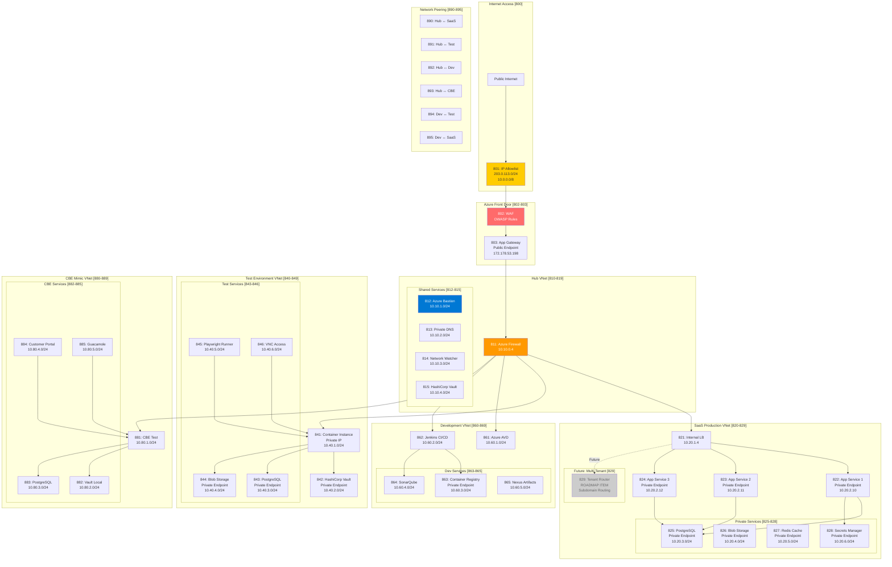

# Private Network Architecture
## Secure Network Isolation for All Environments

**Version:** 1.0  
**Date:** 2025-09-21  
**Component IDs:** 800-899

---

## 🔒 Private Network Overview



---

## 📋 Network Configuration Scripts

### Create Hub VNet with Firewall

```bash
#!/bin/bash
# scripts/network/create-hub-vnet.sh
# Components: 810-819

set -e

RESOURCE_GROUP="rg-network-hub"
LOCATION="uksouth"
HUB_VNET="vnet-hub"
FIREWALL_NAME="fw-hub-central"

echo "🔒 Creating Hub VNet with Azure Firewall"

# Create resource group
az group create --name $RESOURCE_GROUP --location $LOCATION

# Create Hub VNet
az network vnet create \
    --name $HUB_VNET \
    --resource-group $RESOURCE_GROUP \
    --location $LOCATION \
    --address-prefix 10.10.0.0/16

# Create Firewall Subnet (must be named AzureFirewallSubnet)
az network vnet subnet create \
    --name AzureFirewallSubnet \
    --resource-group $RESOURCE_GROUP \
    --vnet-name $HUB_VNET \
    --address-prefix 10.10.0.0/26

# Create Bastion Subnet (must be named AzureBastionSubnet)
az network vnet subnet create \
    --name AzureBastionSubnet \
    --resource-group $RESOURCE_GROUP \
    --vnet-name $HUB_VNET \
    --address-prefix 10.10.1.0/24

# Create Private DNS Subnet
az network vnet subnet create \
    --name subnet-private-dns \
    --resource-group $RESOURCE_GROUP \
    --vnet-name $HUB_VNET \
    --address-prefix 10.10.2.0/24

# Create Monitoring Subnet
az network vnet subnet create \
    --name subnet-monitoring \
    --resource-group $RESOURCE_GROUP \
    --vnet-name $HUB_VNET \
    --address-prefix 10.10.3.0/24

# Create Vault Subnet
az network vnet subnet create \
    --name subnet-vault \
    --resource-group $RESOURCE_GROUP \
    --vnet-name $HUB_VNET \
    --address-prefix 10.10.4.0/24

# Create Public IP for Firewall
az network public-ip create \
    --name pip-firewall \
    --resource-group $RESOURCE_GROUP \
    --location $LOCATION \
    --allocation-method Static \
    --sku Standard

# Create Azure Firewall
az network firewall create \
    --name $FIREWALL_NAME \
    --resource-group $RESOURCE_GROUP \
    --location $LOCATION

# Configure Firewall IP
az network firewall ip-config create \
    --firewall-name $FIREWALL_NAME \
    --name fw-ipconfig \
    --public-ip-address pip-firewall \
    --resource-group $RESOURCE_GROUP \
    --vnet-name $HUB_VNET

# Create Azure Bastion
az network public-ip create \
    --name pip-bastion \
    --resource-group $RESOURCE_GROUP \
    --location $LOCATION \
    --sku Standard

az network bastion create \
    --name bastion-hub \
    --public-ip-address pip-bastion \
    --resource-group $RESOURCE_GROUP \
    --vnet-name $HUB_VNET \
    --location $LOCATION

echo "✅ Hub VNet created with Firewall and Bastion"
```

### Create SaaS Production VNet with Private Endpoints

```bash
#!/bin/bash
# scripts/network/create-saas-vnet-private.sh
# Components: 820-829

set -e

RESOURCE_GROUP="rg-saas-production"
LOCATION="uksouth"
SAAS_VNET="vnet-saas-prod"

echo "🔒 Creating SaaS Production VNet with Private Endpoints"

# Create SaaS VNet
az network vnet create \
    --name $SAAS_VNET \
    --resource-group $RESOURCE_GROUP \
    --location $LOCATION \
    --address-prefix 10.20.0.0/16

# Create subnets with service endpoints disabled for private endpoints
az network vnet subnet create \
    --name subnet-app-services \
    --resource-group $RESOURCE_GROUP \
    --vnet-name $SAAS_VNET \
    --address-prefix 10.20.2.0/24 \
    --disable-private-endpoint-network-policies true

az network vnet subnet create \
    --name subnet-postgresql \
    --resource-group $RESOURCE_GROUP \
    --vnet-name $SAAS_VNET \
    --address-prefix 10.20.3.0/24 \
    --disable-private-endpoint-network-policies true

az network vnet subnet create \
    --name subnet-storage \
    --resource-group $RESOURCE_GROUP \
    --vnet-name $SAAS_VNET \
    --address-prefix 10.20.4.0/24 \
    --disable-private-endpoint-network-policies true

az network vnet subnet create \
    --name subnet-redis \
    --resource-group $RESOURCE_GROUP \
    --vnet-name $SAAS_VNET \
    --address-prefix 10.20.5.0/24 \
    --disable-private-endpoint-network-policies true

az network vnet subnet create \
    --name subnet-keyvault \
    --resource-group $RESOURCE_GROUP \
    --vnet-name $SAAS_VNET \
    --address-prefix 10.20.6.0/24 \
    --disable-private-endpoint-network-policies true

# Future: Subnet for multi-tenant router (ROADMAP)
az network vnet subnet create \
    --name subnet-tenant-router \
    --resource-group $RESOURCE_GROUP \
    --vnet-name $SAAS_VNET \
    --address-prefix 10.20.7.0/24 \
    --disable-private-endpoint-network-policies true

echo "✅ SaaS VNet created with private endpoint subnets"
echo "ℹ️  Note: Multi-tenant router subnet created for future use (ROADMAP)"
```

### Configure Private Endpoints for Azure Services

```bash
#!/bin/bash
# scripts/network/configure-private-endpoints.sh
# Components: 822-828

set -e

RESOURCE_GROUP="rg-saas-production"
VNET_NAME="vnet-saas-prod"
LOCATION="uksouth"

echo "🔐 Configuring Private Endpoints for Azure Services"

# 1. PostgreSQL Private Endpoint
PG_SERVER="pg-oversight-saas"
az postgres server create \
    --name $PG_SERVER \
    --resource-group $RESOURCE_GROUP \
    --location $LOCATION \
    --sku-name B_Gen5_2 \
    --version 11 \
    --admin-user oversight_admin \
    --admin-password "$(openssl rand -base64 32)"

# Create private endpoint for PostgreSQL
az network private-endpoint create \
    --name pe-postgresql \
    --resource-group $RESOURCE_GROUP \
    --vnet-name $VNET_NAME \
    --subnet subnet-postgresql \
    --private-connection-resource-id $(az postgres server show --name $PG_SERVER --resource-group $RESOURCE_GROUP --query id -o tsv) \
    --group-id postgresqlServer \
    --connection-name postgres-connection

# 2. Storage Account Private Endpoint
STORAGE_ACCOUNT="stoversightprod"
az storage account create \
    --name $STORAGE_ACCOUNT \
    --resource-group $RESOURCE_GROUP \
    --location $LOCATION \
    --sku Standard_LRS \
    --kind StorageV2 \
    --allow-blob-public-access false

# Create private endpoint for Storage
az network private-endpoint create \
    --name pe-storage \
    --resource-group $RESOURCE_GROUP \
    --vnet-name $VNET_NAME \
    --subnet subnet-storage \
    --private-connection-resource-id $(az storage account show --name $STORAGE_ACCOUNT --resource-group $RESOURCE_GROUP --query id -o tsv) \
    --group-id blob \
    --connection-name storage-connection

# 3. Redis Cache Private Endpoint
REDIS_NAME="redis-oversight-prod"
az redis create \
    --name $REDIS_NAME \
    --resource-group $RESOURCE_GROUP \
    --location $LOCATION \
    --sku Basic \
    --vm-size c0 \
    --enable-non-ssl-port false

# Create private endpoint for Redis
az network private-endpoint create \
    --name pe-redis \
    --resource-group $RESOURCE_GROUP \
    --vnet-name $VNET_NAME \
    --subnet subnet-redis \
    --private-connection-resource-id $(az redis show --name $REDIS_NAME --resource-group $RESOURCE_GROUP --query id -o tsv) \
    --group-id redisCache \
    --connection-name redis-connection

# 4. Azure Key Vault Private Endpoint (for Secrets Manager)
KEYVAULT_NAME="kv-oversight-prod"
az keyvault create \
    --name $KEYVAULT_NAME \
    --resource-group $RESOURCE_GROUP \
    --location $LOCATION \
    --sku standard \
    --public-network-access Disabled

# Create private endpoint for Key Vault
az network private-endpoint create \
    --name pe-keyvault \
    --resource-group $RESOURCE_GROUP \
    --vnet-name $VNET_NAME \
    --subnet subnet-keyvault \
    --private-connection-resource-id $(az keyvault show --name $KEYVAULT_NAME --resource-group $RESOURCE_GROUP --query id -o tsv) \
    --group-id vault \
    --connection-name keyvault-connection

# 5. App Services with Private Endpoints
for i in 1 2 3; do
    APP_NAME="app-oversight-saas-$i"
    
    # Create App Service Plan if not exists
    if [ $i -eq 1 ]; then
        az appservice plan create \
            --name asp-oversight-prod \
            --resource-group $RESOURCE_GROUP \
            --location $LOCATION \
            --sku P1v2 \
            --is-linux
    fi
    
    # Create Web App
    az webapp create \
        --name $APP_NAME \
        --resource-group $RESOURCE_GROUP \
        --plan asp-oversight-prod \
        --runtime "NODE|18-lts"
    
    # Create private endpoint for App Service
    az network private-endpoint create \
        --name pe-app-$i \
        --resource-group $RESOURCE_GROUP \
        --vnet-name $VNET_NAME \
        --subnet subnet-app-services \
        --private-connection-resource-id $(az webapp show --name $APP_NAME --resource-group $RESOURCE_GROUP --query id -o tsv) \
        --group-id sites \
        --connection-name app-connection-$i
done

echo "✅ All private endpoints configured"
```

### Configure VNet Peering Between Environments

```bash
#!/bin/bash
# scripts/network/configure-vnet-peering.sh
# Components: 890-895

set -e

echo "🔗 Configuring VNet Peering Between Environments"

# VNet Details
HUB_VNET="vnet-hub"
HUB_RG="rg-network-hub"

SAAS_VNET="vnet-saas-prod"
SAAS_RG="rg-saas-production"

TEST_VNET="vnet-test"
TEST_RG="rg-test-environment"

DEV_VNET="vnet-dev"
DEV_RG="rg-development"

CBE_VNET="vnet-cbe-mimic"
CBE_RG="rg-cbe-mimic"

# 890: Hub ↔ SaaS Peering
echo "Creating Hub to SaaS peering..."
az network vnet peering create \
    --name hub-to-saas \
    --resource-group $HUB_RG \
    --vnet-name $HUB_VNET \
    --remote-vnet $(az network vnet show --resource-group $SAAS_RG --name $SAAS_VNET --query id -o tsv) \
    --allow-vnet-access \
    --allow-forwarded-traffic \
    --allow-gateway-transit

az network vnet peering create \
    --name saas-to-hub \
    --resource-group $SAAS_RG \
    --vnet-name $SAAS_VNET \
    --remote-vnet $(az network vnet show --resource-group $HUB_RG --name $HUB_VNET --query id -o tsv) \
    --allow-vnet-access \
    --allow-forwarded-traffic \
    --use-remote-gateways

# 891: Hub ↔ Test Peering
echo "Creating Hub to Test peering..."
az network vnet peering create \
    --name hub-to-test \
    --resource-group $HUB_RG \
    --vnet-name $HUB_VNET \
    --remote-vnet $(az network vnet show --resource-group $TEST_RG --name $TEST_VNET --query id -o tsv) \
    --allow-vnet-access \
    --allow-forwarded-traffic \
    --allow-gateway-transit

az network vnet peering create \
    --name test-to-hub \
    --resource-group $TEST_RG \
    --vnet-name $TEST_VNET \
    --remote-vnet $(az network vnet show --resource-group $HUB_RG --name $HUB_VNET --query id -o tsv) \
    --allow-vnet-access \
    --allow-forwarded-traffic \
    --use-remote-gateways

# 892: Hub ↔ Dev Peering
echo "Creating Hub to Dev peering..."
az network vnet peering create \
    --name hub-to-dev \
    --resource-group $HUB_RG \
    --vnet-name $HUB_VNET \
    --remote-vnet $(az network vnet show --resource-group $DEV_RG --name $DEV_VNET --query id -o tsv) \
    --allow-vnet-access \
    --allow-forwarded-traffic \
    --allow-gateway-transit

az network vnet peering create \
    --name dev-to-hub \
    --resource-group $DEV_RG \
    --vnet-name $DEV_VNET \
    --remote-vnet $(az network vnet show --resource-group $HUB_RG --name $HUB_VNET --query id -o tsv) \
    --allow-vnet-access \
    --allow-forwarded-traffic \
    --use-remote-gateways

# 893: Hub ↔ CBE Peering
echo "Creating Hub to CBE Mimic peering..."
az network vnet peering create \
    --name hub-to-cbe \
    --resource-group $HUB_RG \
    --vnet-name $HUB_VNET \
    --remote-vnet $(az network vnet show --resource-group $CBE_RG --name $CBE_VNET --query id -o tsv) \
    --allow-vnet-access \
    --allow-forwarded-traffic \
    --allow-gateway-transit

az network vnet peering create \
    --name cbe-to-hub \
    --resource-group $CBE_RG \
    --vnet-name $CBE_VNET \
    --remote-vnet $(az network vnet show --resource-group $HUB_RG --name $HUB_VNET --query id -o tsv) \
    --allow-vnet-access \
    --allow-forwarded-traffic \
    --use-remote-gateways

# 894: Dev ↔ Test Peering (for CI/CD)
echo "Creating Dev to Test peering..."
az network vnet peering create \
    --name dev-to-test \
    --resource-group $DEV_RG \
    --vnet-name $DEV_VNET \
    --remote-vnet $(az network vnet show --resource-group $TEST_RG --name $TEST_VNET --query id -o tsv) \
    --allow-vnet-access \
    --allow-forwarded-traffic

az network vnet peering create \
    --name test-to-dev \
    --resource-group $TEST_RG \
    --vnet-name $TEST_VNET \
    --remote-vnet $(az network vnet show --resource-group $DEV_RG --name $DEV_VNET --query id -o tsv) \
    --allow-vnet-access \
    --allow-forwarded-traffic

# 895: Dev ↔ SaaS Peering (for deployment)
echo "Creating Dev to SaaS peering..."
az network vnet peering create \
    --name dev-to-saas \
    --resource-group $DEV_RG \
    --vnet-name $DEV_VNET \
    --remote-vnet $(az network vnet show --resource-group $SAAS_RG --name $SAAS_VNET --query id -o tsv) \
    --allow-vnet-access \
    --allow-forwarded-traffic

az network vnet peering create \
    --name saas-to-dev \
    --resource-group $SAAS_RG \
    --vnet-name $SAAS_VNET \
    --remote-vnet $(az network vnet show --resource-group $DEV_RG --name $DEV_VNET --query id -o tsv) \
    --allow-vnet-access \
    --allow-forwarded-traffic

echo "✅ All VNet peerings configured"
```

### Setup Private DNS Zones

```bash
#!/bin/bash
# scripts/network/setup-private-dns.sh
# Component: 813

set -e

HUB_RG="rg-network-hub"
HUB_VNET="vnet-hub"

echo "🌐 Setting up Private DNS Zones"

# Create Private DNS Zones for each service type
declare -a DNS_ZONES=(
    "privatelink.postgres.database.azure.com"
    "privatelink.blob.core.windows.net"
    "privatelink.redis.cache.windows.net"
    "privatelink.vaultcore.azure.net"
    "privatelink.azurewebsites.net"
    "privatelink.azurecr.io"
)

for ZONE in "${DNS_ZONES[@]}"; do
    echo "Creating DNS zone: $ZONE"
    
    # Create the private DNS zone
    az network private-dns zone create \
        --resource-group $HUB_RG \
        --name $ZONE
    
    # Link to Hub VNet
    az network private-dns link vnet create \
        --resource-group $HUB_RG \
        --zone-name $ZONE \
        --name link-hub \
        --virtual-network $HUB_VNET \
        --registration-enabled false
    
    # Link to other VNets (they'll resolve through hub)
    for ENV in saas test dev cbe; do
        case $ENV in
            saas)
                VNET_ID=$(az network vnet show --resource-group rg-saas-production --name vnet-saas-prod --query id -o tsv)
                ;;
            test)
                VNET_ID=$(az network vnet show --resource-group rg-test-environment --name vnet-test --query id -o tsv)
                ;;
            dev)
                VNET_ID=$(az network vnet show --resource-group rg-development --name vnet-dev --query id -o tsv)
                ;;
            cbe)
                VNET_ID=$(az network vnet show --resource-group rg-cbe-mimic --name vnet-cbe-mimic --query id -o tsv)
                ;;
        esac
        
        if [ ! -z "$VNET_ID" ]; then
            az network private-dns link vnet create \
                --resource-group $HUB_RG \
                --zone-name $ZONE \
                --name link-$ENV \
                --virtual-network $VNET_ID \
                --registration-enabled false
        fi
    done
done

echo "✅ Private DNS zones configured and linked"
```

### Firewall Rules Configuration

```bash
#!/bin/bash
# scripts/network/configure-firewall-rules.sh
# Component: 811

set -e

RESOURCE_GROUP="rg-network-hub"
FIREWALL_NAME="fw-hub-central"

echo "🔥 Configuring Azure Firewall Rules"

# Create application rule collection for outbound HTTPS
az network firewall application-rule create \
    --firewall-name $FIREWALL_NAME \
    --resource-group $RESOURCE_GROUP \
    --collection-name AllowOutboundHTTPS \
    --name AllowHTTPS \
    --protocols Https=443 \
    --source-addresses "10.0.0.0/8" \
    --target-fqdns "*.azurewebsites.net" "*.blob.core.windows.net" \
    --action Allow \
    --priority 100

# Create network rule collection for internal communication
az network firewall network-rule create \
    --firewall-name $FIREWALL_NAME \
    --resource-group $RESOURCE_GROUP \
    --collection-name AllowInternalTraffic \
    --name AllowVNetToVNet \
    --protocols Any \
    --source-addresses "10.0.0.0/8" \
    --destination-addresses "10.0.0.0/8" \
    --destination-ports "*" \
    --action Allow \
    --priority 100

# Create NAT rule for inbound traffic from App Gateway
az network firewall nat-rule create \
    --firewall-name $FIREWALL_NAME \
    --resource-group $RESOURCE_GROUP \
    --collection-name InboundFromAppGateway \
    --name AllowAppGateway \
    --protocols Tcp \
    --source-addresses "172.178.53.198/32" \
    --destination-addresses "*" \
    --destination-ports 443 80 \
    --translated-address "10.20.1.4" \
    --translated-port 443 \
    --action Dnat \
    --priority 100

echo "✅ Firewall rules configured"
```

---

## 📐 Network Security Architecture Overview

### Security Layers

```yaml
Layer 1 - Public Access Control:
  Component: 800-803
  Controls:
    - IP Allowlisting (Component 801)
    - WAF with OWASP rules (Component 802)
    - Application Gateway as single entry (Component 803)
  
Layer 2 - Network Segmentation:
  Component: 810-895
  Controls:
    - Hub-spoke topology with Azure Firewall
    - VNet peering with controlled traffic flow
    - Network Security Groups on all subnets
  
Layer 3 - Service Isolation:
  Component: 822-828, 842-846
  Controls:
    - Private endpoints for all PaaS services
    - No public IPs on backend services
    - Service endpoints disabled
  
Layer 4 - DNS Security:
  Component: 813
  Controls:
    - Private DNS zones for all services
    - No public DNS resolution for internal services
    - Split-horizon DNS configuration
```

### Private Network Summary

```yaml
Hub VNet (10.10.0.0/16):
  Azure Firewall: 10.10.0.0/26
  Bastion: 10.10.1.0/24
  Private DNS: 10.10.2.0/24
  Monitoring: 10.10.3.0/24
  Vault: 10.10.4.0/24

SaaS Production (10.20.0.0/16):
  Internal LB: 10.20.1.0/24
  App Services: 10.20.2.0/24
  PostgreSQL: 10.20.3.0/24
  Storage: 10.20.4.0/24
  Redis: 10.20.5.0/24
  Key Vault: 10.20.6.0/24
  Future Tenant Router: 10.20.7.0/24 (ROADMAP)

Test Environment (10.40.0.0/16):
  Container Instances: 10.40.1.0/24
  HashiCorp Vault: 10.40.2.0/24
  PostgreSQL: 10.40.3.0/24
  Storage: 10.40.4.0/24
  Playwright Runners: 10.40.5.0/24
  VNC Access: 10.40.6.0/24

Development (10.60.0.0/16):
  Azure AVD: 10.60.1.0/24
  Jenkins CI/CD: 10.60.2.0/24
  Container Registry: 10.60.3.0/24
  SonarQube: 10.60.4.0/24
  Nexus: 10.60.5.0/24

CBE Mimic (10.80.0.0/16):
  CBE Test Environment: 10.80.1.0/24
  Local Vault: 10.80.2.0/24
  PostgreSQL: 10.80.3.0/24
  Customer Portal: 10.80.4.0/24
  Guacamole: 10.80.5.0/24
```

---

## 🚀 Deployment Sequence

### Phase 1: Core Infrastructure
```bash
# 1. Create Hub VNet with Firewall and Bastion
./scripts/network/create-hub-vnet.sh

# 2. Create environment-specific VNets
./scripts/network/create-saas-vnet-private.sh
./scripts/network/create-test-vnet-private.sh
./scripts/network/create-dev-vnet-private.sh
./scripts/network/create-cbe-vnet-private.sh
```

### Phase 2: Network Connectivity
```bash
# 3. Configure VNet peerings
./scripts/network/configure-vnet-peering.sh

# 4. Setup Private DNS zones
./scripts/network/setup-private-dns.sh

# 5. Configure Firewall rules
./scripts/network/configure-firewall-rules.sh
```

### Phase 3: Service Deployment
```bash
# 6. Deploy services with private endpoints
./scripts/network/configure-private-endpoints.sh

# 7. Configure WAF and IP restrictions
./scripts/network/configure-waf-ip-restrictions.sh

# 8. Validate network isolation
./scripts/network/validate-network-isolation.sh
```

---

## 🔍 Network Isolation Validation

```bash
#!/bin/bash
# scripts/network/validate-network-isolation.sh

echo "🔍 Validating Network Isolation"

# Test 1: Verify no public IPs on backend services
echo "Checking for public IPs on backend services..."
az network public-ip list --resource-group rg-saas-production \
    --query "[?contains(name, 'app-') || contains(name, 'pg-') || contains(name, 'redis-')]" \
    --output table

# Test 2: Verify private endpoints are configured
echo "Checking private endpoints..."
az network private-endpoint list --resource-group rg-saas-production \
    --output table

# Test 3: Verify VNet peerings are established
echo "Checking VNet peerings..."
az network vnet peering list --resource-group rg-network-hub \
    --vnet-name vnet-hub \
    --output table

# Test 4: Test DNS resolution
echo "Testing private DNS resolution..."
nslookup pg-oversight-saas.postgres.database.azure.com
# Should resolve to 10.20.x.x address

# Test 5: Verify firewall is blocking unauthorized traffic
echo "Testing firewall rules..."
az network firewall show --name fw-hub-central \
    --resource-group rg-network-hub \
    --query "networkRuleCollections[].rules[]" \
    --output table

echo "✅ Network isolation validation complete"
```

---

## 🛡️ Security Benefits

1. **Zero Trust Network Architecture**
   - No trust between network segments
   - All traffic inspected by firewall
   - Explicit allow rules only

2. **Defense in Depth**
   - Multiple security layers
   - WAF → Firewall → NSG → Private Endpoints
   - IP restrictions at every level

3. **Reduced Attack Surface**
   - No public IPs on backend services
   - Private endpoints only
   - DNS resolution stays internal

4. **Compliance Ready**
   - Network segmentation for PCI-DSS
   - Audit trails via Azure Firewall logs
   - Encryption in transit enforced

5. **Operational Benefits**
   - Centralized security management
   - Consistent network policies
   - Simplified troubleshooting with hub-spoke

---

## 📊 Cost Optimization

```yaml
Monthly Cost Estimates:
  Azure Firewall: $900
  Application Gateway WAF: $350
  Bastion Host: $140
  Private Endpoints: $10/endpoint
  VNet Peering: $0.01/GB
  
Cost Savings:
  - Shared Bastion (vs per-VM public IPs)
  - Centralized Firewall (vs distributed NSGs)
  - Private endpoints (vs ExpressRoute)
  
Total Estimated: ~$1,500/month for complete network security
```

---

## ⚠️ Important Notes

1. **Multi-Tenant Router is ROADMAP** - Subnet and infrastructure prepared but not implemented
2. **All public access via IP-restricted WAF** - No exceptions
3. **Private endpoints mandatory** - For all PaaS services
4. **Hub-spoke topology** - All traffic flows through hub firewall
5. **DNS stays private** - No public resolution of internal services
6. **Bastion for human access** - No direct RDP/SSH to VMs
7. **Network Watcher enabled** - For troubleshooting and monitoring

---

This private network architecture ensures all Azure environments use private networks where possible, with IP-restricted access as the only public entry point, exactly as requested.