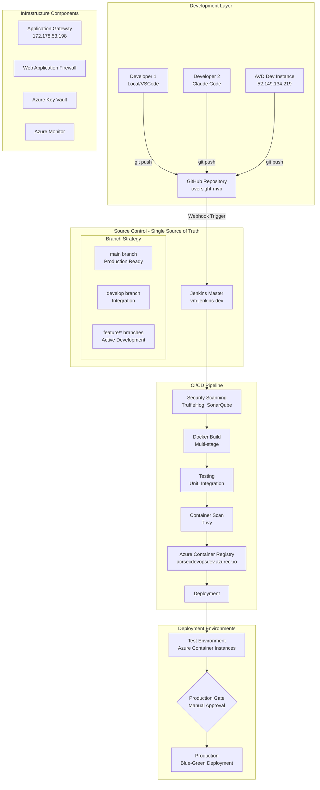

# SecDevOps CI/CD Architecture Document
## Oversight-MVP Platform

**Document Version:** 1.0  
**Date:** 2025-09-20  
**Author:** Winston - System Architect  
**Status:** Ready for Sprint Planning

---

## Executive Summary

This document outlines the complete SecDevOps CI/CD architecture for the Oversight-MVP platform, designed to establish a professional, secure, and automated deployment pipeline following GitOps principles. The solution enforces GitHub as the single source of truth, with all deployments flowing through automated pipelines with comprehensive security gates. The architecture leverages Azure cloud services, GitHub for source control, Jenkins for orchestration, and comprehensive security tooling to meet enterprise-grade security standards.

**Key Principle**: All code deployments MUST originate from GitHub repositories. Local or development instance deployments are strictly prohibited in the CI/CD flow.

### Key Objectives
- Establish automated CI/CD pipeline with security-first approach
- Implement comprehensive security scanning at every stage
- Enable parallel development with Claude Code integration
- Automate testing of 5,000+ test cases
- Provide containerized deployment for customer infrastructure
- Ensure highest security standards compliance (CIS, OWASP, NIST)

### Technology Stack
- **Application:** Next.js 15 (Full-stack monolith)
- **Database:** PostgreSQL
- **Secret Management:** Azure Key Vault / HashiCorp Vault
- **Environment Config:** Dynamic .env files (no hardcoding)
- **Container Registry:** Azure Container Registry (ACR)
- **CI/CD Orchestration:** Jenkins on Azure VM
- **Source Control:** GitHub
- **Testing Environment:** Azure Container Instances
- **Security Tools:** Snyk, SonarQube, Trivy, OWASP ZAP, TruffleHog
- **Data Management:** 3-state database system (schema/framework/full)

---

## System Architecture Overview

### GitOps Architecture Flow



### Critical Architecture Principles

1. **GitOps First**: All deployments MUST originate from GitHub
2. **No Direct Deployments**: Development environments cannot deploy directly to test/production
3. **Automated Security Gates**: Every commit passes through security scanning
4. **Immutable Infrastructure**: Containers are never modified, only replaced
5. **Zero-Trust Networking**: All communication encrypted and authenticated

### Environment Architecture

| Environment | Infrastructure | Purpose | Access Control | Deployment Method |
|------------|---------------|---------|----------------|-------------------|
| Development | Local/AVD/Azure VM | Active development only | SSH (Developers) | git push only |
| CI/CD | Jenkins on Azure VM | Pipeline orchestration | Service Principal | Webhook from GitHub |
| Testing | Azure Container Instances | Automated testing | Managed Identity | Pipeline deployment |
| Staging | Azure Container Instances | Pre-production validation | Managed Identity | Pipeline deployment |
| Production | Customer Infrastructure | Production deployment | Customer Managed | Pipeline with approval |

### Deployment Flow Enforcement

```yaml
Allowed Flow:
  1. Developer → GitHub (git push)
  2. GitHub → Jenkins (webhook)
  3. Jenkins → Build .env from Key Vault
  4. Jenkins → Security Scans
  5. Jenkins → Docker Build with env config
  6. Jenkins → ACR (after all scans pass)
  7. ACR → Test Environment (with env injection)
  8. Test → Production (with approval)

Prohibited Flows:
  ❌ Local → Direct Docker Build → ACR
  ❌ AVD Instance → Direct Deployment
  ❌ Manual Docker Push → Production
  ❌ Bypassing Jenkins Pipeline
  ❌ Hardcoded environment values
  ❌ .env files in Git repository
```

### Configuration Management

| Aspect | Implementation | Documentation |
|--------|---------------|---------------|
| **Environment Variables** | Azure Key Vault + ConfigMaps | [Environment Config Guide](./ENVIRONMENT-CONFIG-MANAGEMENT.md) |
| **Database States** | 3-state system (schema/framework/full) | [Data Management Strategy](./DATA-MANAGEMENT-STRATEGY.md) |
| **File API Testing** | Automated test harness | [Data Management Strategy](./DATA-MANAGEMENT-STRATEGY.md#file-api-management) |
| **Secret Rotation** | Monthly automated rotation | [Security Policies](./docs/SECURITY-POLICIES.md) |

---

## Epic Breakdown for Scrum Implementation

## EPIC 1: Infrastructure Foundation
**Goal:** Establish core Azure infrastructure and networking

### User Stories

#### Story 1.1: Azure Infrastructure Setup
**As a** DevOps Engineer  
**I want to** provision Azure infrastructure using IaC  
**So that** we have reproducible and version-controlled infrastructure

**Acceptance Criteria:**
- [ ] Terraform/ARM templates created for all resources
- [ ] Azure VM for Jenkins provisioned (Standard_D4s_v3)
- [ ] Virtual Network configured with proper subnets
- [ ] Network Security Groups configured
- [ ] Azure Container Registry created
- [ ] Resource tagging strategy implemented

**Technical Tasks:**
```yaml
- Create Terraform modules for:
  - Azure Resource Group
  - Virtual Network (10.0.0.0/16)
  - Jenkins VM Subnet (10.0.1.0/24)
  - Container Instances Subnet (10.0.2.0/24)
  - Network Security Groups with rules
  - Azure Container Registry
  - Azure Key Vault
```

#### Story 1.2: Jenkins Master Installation
**As a** DevOps Engineer  
**I want to** install and configure Jenkins on Azure VM  
**So that** we have a CI/CD orchestration platform

**Acceptance Criteria:**
- [ ] Jenkins installed with latest LTS version
- [ ] SSL/TLS configured with valid certificates
- [ ] Authentication integrated with Azure AD
- [ ] Backup strategy implemented
- [ ] Monitoring configured with Azure Monitor

**Technical Implementation:**
```bash
#!/bin/bash
# Jenkins installation script
sudo apt update && sudo apt upgrade -y
sudo apt install -y openjdk-17-jdk
wget -q -O - https://pkg.jenkins.io/debian-stable/jenkins.io.key | sudo apt-key add -
sudo sh -c 'echo deb https://pkg.jenkins.io/debian-stable binary/ > /etc/apt/sources.list.d/jenkins.list'
sudo apt update && sudo apt install -y jenkins
sudo systemctl enable jenkins
```

#### Story 1.3: Azure Key Vault Configuration
**As a** Security Engineer  
**I want to** configure Azure Key Vault for secrets management  
**So that** sensitive data is securely stored and accessed

**Acceptance Criteria:**
- [ ] Key Vault provisioned with proper access policies
- [ ] Service Principal created for Jenkins access
- [ ] Secrets rotation policy configured
- [ ] Audit logging enabled
- [ ] Disaster recovery configured

**Story Points:** 5  
**Dependencies:** Azure subscription, proper RBAC permissions

---

## EPIC 2: Source Control & Version Management
**Goal:** Establish GitHub repository structure and branching strategy

### User Stories

#### Story 2.1: GitHub Repository Configuration
**As a** Development Team  
**I want to** configure GitHub repository with proper structure  
**So that** we have organized and protected code management

**Acceptance Criteria:**
- [ ] Repository created with proper .gitignore
- [ ] Branch protection rules configured
- [ ] CODEOWNERS file created
- [ ] PR templates configured
- [ ] GitHub Actions for pre-commit checks

**Branch Protection Rules:**
```yaml
main:
  - Require pull request reviews: 2
  - Dismiss stale reviews
  - Require review from CODEOWNERS
  - Require status checks
  - Require branches up to date
  - Include administrators
  - Restrict force pushes

develop:
  - Require pull request reviews: 1
  - Require status checks
  - Automated merge for approved PRs
```

#### Story 2.2: Git Hooks Implementation
**As a** Developer  
**I want to** have pre-commit hooks for code quality  
**So that** code issues are caught before committing

**Acceptance Criteria:**
- [ ] Pre-commit hooks configured for all developers
- [ ] Security scanning in pre-commit
- [ ] Code formatting validation
- [ ] Commit message validation
- [ ] Documentation updated

---

## EPIC 3: CI/CD Pipeline Implementation
**Goal:** Build comprehensive Jenkins pipeline with security integration

### User Stories

#### Story 3.1: Jenkins Pipeline Foundation
**As a** DevOps Engineer  
**I want to** create base Jenkins pipeline  
**So that** we have automated build and test processes

**Acceptance Criteria:**
- [ ] Jenkinsfile created with all stages
- [ ] Pipeline as Code implemented
- [ ] Parallel execution configured
- [ ] Error handling implemented
- [ ] Notifications configured

**Pipeline Stages:**
```groovy
pipeline {
    agent any
    
    stages {
        stage('Checkout') { }
        stage('Security Scans') { 
            parallel {
                stage('SAST') { }
                stage('Dependency Scan') { }
                stage('Secret Scan') { }
                stage('License Check') { }
            }
        }
        stage('Build') { }
        stage('Test') { }
        stage('Container Build') { }
        stage('Container Scan') { }
        stage('Deploy to Test') { }
        stage('Integration Tests') { }
        stage('DAST') { }
        stage('Quality Gates') { }
    }
}
```

#### Story 3.2: Security Tool Integration
**As a** Security Engineer  
**I want to** integrate all security scanning tools  
**So that** vulnerabilities are detected early

**Acceptance Criteria:**
- [ ] SonarQube server configured and integrated
- [ ] Snyk CLI configured with API token
- [ ] Trivy integrated for container scanning
- [ ] OWASP ZAP configured for DAST
- [ ] TruffleHog integrated for secret scanning
- [ ] All reports aggregated in Jenkins

**Tool Configuration:**
```yaml
Security Tools:
  SAST:
    - SonarQube (Code Quality)
    - Semgrep (Security Patterns)
  
  SCA:
    - Snyk (Dependencies)
    - OWASP Dependency Check
  
  Container:
    - Trivy (Vulnerabilities)
    - Anchore (Compliance)
  
  Secrets:
    - TruffleHog
    - GitLeaks
  
  DAST:
    - OWASP ZAP
    - Nuclei
```

#### Story 3.3: Automated Testing Integration
**As a** QA Engineer  
**I want to** integrate 5000+ automated tests  
**So that** application quality is maintained

**Acceptance Criteria:**
- [ ] Unit tests integrated (Jest)
- [ ] Integration tests configured
- [ ] E2E tests with Playwright
- [ ] Performance tests baseline
- [ ] Test reports in Jenkins
- [ ] Test failure analysis automated

**Test Execution Strategy:**
```javascript
// test-orchestrator.js
const testSuites = {
  unit: {
    command: 'npm run test:unit',
    timeout: 300000,
    parallel: true
  },
  integration: {
    command: 'npm run test:integration',
    timeout: 600000,
    parallel: false
  },
  e2e: {
    command: 'npm run test:e2e',
    timeout: 1200000,
    parallel: true
  },
  security: {
    command: 'npm run test:security',
    timeout: 900000,
    parallel: false
  }
};
```

---

## EPIC 4: Container Strategy & Deployment
**Goal:** Implement secure containerization and deployment

### User Stories

#### Story 4.1: Container Image Building
**As a** DevOps Engineer  
**I want to** create secure container images  
**So that** applications are properly containerized

**Acceptance Criteria:**
- [ ] Multi-stage Dockerfiles created
- [ ] Non-root user configured
- [ ] Security hardening applied
- [ ] Image size optimized (<100MB)
- [ ] Health checks implemented
- [ ] SBOM generation configured

**Dockerfile Structure:**
```dockerfile
# Build Stage
FROM node:20-alpine AS builder
RUN addgroup -g 1001 -S nodejs && adduser -S nextjs -u 1001
WORKDIR /app
COPY --chown=nextjs:nodejs . .
RUN npm ci --only=production
RUN npm run build

# Production Stage
FROM node:20-alpine
RUN apk add --no-cache dumb-init
USER nextjs
COPY --from=builder --chown=nextjs:nodejs /app/.next ./.next
COPY --from=builder --chown=nextjs:nodejs /app/public ./public
ENTRYPOINT ["dumb-init", "--"]
CMD ["node", "server.js"]
```

#### Story 4.2: Azure Container Registry Management
**As a** DevOps Engineer  
**I want to** manage container images in ACR  
**So that** images are securely stored and versioned

**Acceptance Criteria:**
- [ ] ACR configured with vulnerability scanning
- [ ] Image retention policies configured
- [ ] Geo-replication enabled
- [ ] RBAC configured for access control
- [ ] Image signing implemented

#### Story 4.3: Container Deployment Automation
**As a** DevOps Engineer  
**I want to** automate container deployments  
**So that** deployments are consistent and reliable

**Acceptance Criteria:**
- [ ] Azure Container Instances deployment automated
- [ ] Environment variables managed via Key Vault
- [ ] Health checks configured
- [ ] Auto-scaling configured
- [ ] Rollback mechanism implemented

---

## EPIC 5: Database Migration & Management
**Goal:** Implement database versioning and migration strategy

### User Stories

#### Story 5.1: Database Migration Framework
**As a** Database Administrator  
**I want to** implement database migration framework  
**So that** schema changes are versioned and controlled

**Acceptance Criteria:**
- [ ] Flyway/Liquibase configured
- [ ] Migration scripts versioned
- [ ] Rollback scripts created
- [ ] Migration testing automated
- [ ] Documentation maintained

**Migration Structure:**
```sql
-- migrations/V1.0__initial_schema.sql
CREATE TABLE IF NOT EXISTS users (
    id UUID PRIMARY KEY DEFAULT gen_random_uuid(),
    email VARCHAR(255) UNIQUE NOT NULL,
    created_at TIMESTAMP DEFAULT CURRENT_TIMESTAMP
);

-- migrations/V1.1__add_audit_tables.sql
CREATE TABLE IF NOT EXISTS audit_logs (
    id UUID PRIMARY KEY DEFAULT gen_random_uuid(),
    user_id UUID REFERENCES users(id),
    action VARCHAR(100),
    timestamp TIMESTAMP DEFAULT CURRENT_TIMESTAMP
);
```

#### Story 5.2: Database Backup & Recovery
**As a** DBA  
**I want to** implement automated backup and recovery  
**So that** data is protected against loss

**Acceptance Criteria:**
- [ ] Automated daily backups configured
- [ ] Point-in-time recovery tested
- [ ] Backup retention policy (30 days)
- [ ] Restore procedures documented
- [ ] Monitoring alerts configured

---

## EPIC 6: Security Implementation
**Goal:** Implement comprehensive security measures

### User Stories

#### Story 6.1: Security Scanning Pipeline
**As a** Security Engineer  
**I want to** implement comprehensive security scanning  
**So that** vulnerabilities are detected and remediated

**Acceptance Criteria:**
- [ ] All security tools integrated
- [ ] Quality gates configured
- [ ] Automated remediation for known fixes
- [ ] Security dashboard created
- [ ] Compliance reports automated

**Security Gates Configuration:**
```javascript
// security-gates.js
const securityGates = {
  critical: {
    threshold: 0,
    action: 'block',
    notification: 'immediate'
  },
  high: {
    threshold: 5,
    action: 'warn',
    notification: 'daily'
  },
  medium: {
    threshold: 20,
    action: 'log',
    notification: 'weekly'
  }
};
```

#### Story 6.2: Runtime Security Monitoring
**As a** Security Engineer  
**I want to** implement runtime security monitoring  
**So that** threats are detected in real-time

**Acceptance Criteria:**
- [ ] Azure Security Center configured
- [ ] Container runtime protection enabled
- [ ] Network policies implemented
- [ ] WAF rules configured
- [ ] Incident response playbook created

#### Story 6.3: Compliance Automation
**As a** Compliance Officer  
**I want to** automate compliance checking  
**So that** we maintain security standards

**Acceptance Criteria:**
- [ ] CIS Benchmark scanning automated
- [ ] OWASP Top 10 validation
- [ ] NIST compliance checks
- [ ] Audit reports automated
- [ ] Evidence collection automated

---

## EPIC 7: Claude Code Integration
**Goal:** Integrate Claude Code for automated issue resolution

### User Stories

#### Story 7.1: Claude Code Prompt Generator
**As a** Developer  
**I want to** generate Claude Code prompts automatically  
**So that** issues are quickly resolved

**Acceptance Criteria:**
- [ ] Prompt generator script created
- [ ] Security issue parser implemented
- [ ] Priority ranking algorithm
- [ ] Context gathering automated
- [ ] GitHub issue creation automated

**Prompt Generator Implementation:**
```javascript
// claude-prompt-generator.js
class ClaudePromptGenerator {
  generateSecurityFixPrompt(scanResults) {
    return {
      context: this.gatherContext(scanResults),
      issues: this.parseIssues(scanResults),
      priority: this.calculatePriority(scanResults),
      suggestedFixes: this.generateSuggestions(scanResults),
      testCases: this.generateTestCases(scanResults)
    };
  }
  
  gatherContext(scanResults) {
    return {
      buildNumber: process.env.BUILD_NUMBER,
      branch: process.env.BRANCH_NAME,
      commitHash: process.env.GIT_COMMIT,
      timestamp: new Date().toISOString(),
      failedChecks: scanResults.failedChecks,
      affectedFiles: scanResults.affectedFiles
    };
  }
}
```

#### Story 7.2: Automated Issue Creation
**As a** Developer  
**I want to** automatically create issues from failures  
**So that** problems are tracked and resolved

**Acceptance Criteria:**
- [ ] GitHub API integration
- [ ] Issue templates configured
- [ ] Auto-assignment logic
- [ ] Priority labeling
- [ ] Claude Code instructions included

---

## EPIC 8: Monitoring & Observability
**Goal:** Implement comprehensive monitoring and alerting

### User Stories

#### Story 8.1: Application Monitoring
**As a** Operations Engineer  
**I want to** monitor application performance  
**So that** issues are detected proactively

**Acceptance Criteria:**
- [ ] Application Insights configured
- [ ] Custom metrics implemented
- [ ] Dashboards created
- [ ] Alert rules configured
- [ ] Log aggregation implemented

**Monitoring Configuration:**
```yaml
Metrics:
  Application:
    - Response Time (P50, P95, P99)
    - Error Rate
    - Request Rate
    - Active Users
    
  Infrastructure:
    - CPU Usage
    - Memory Usage
    - Disk I/O
    - Network Traffic
    
  Security:
    - Failed Auth Attempts
    - Vulnerability Count
    - Compliance Score
    - Security Events
```

#### Story 8.2: CI/CD Pipeline Monitoring
**As a** DevOps Engineer  
**I want to** monitor pipeline performance  
**So that** bottlenecks are identified

**Acceptance Criteria:**
- [ ] Build metrics tracked
- [ ] Test execution times monitored
- [ ] Failure analysis automated
- [ ] Trend analysis implemented
- [ ] Performance dashboards created

---

## EPIC 9: Documentation & Training
**Goal:** Ensure comprehensive documentation and team training

### User Stories

#### Story 9.1: Technical Documentation
**As a** Developer  
**I want to** have comprehensive documentation  
**So that** system is maintainable

**Acceptance Criteria:**
- [ ] Architecture documentation complete
- [ ] API documentation generated
- [ ] Runbook created
- [ ] Troubleshooting guides written
- [ ] Configuration documented

#### Story 9.2: Team Training
**As a** Team Member  
**I want to** receive training on the new pipeline  
**So that** I can effectively use the system

**Acceptance Criteria:**
- [ ] Training materials created
- [ ] Workshop sessions conducted
- [ ] Video tutorials recorded
- [ ] Knowledge base established
- [ ] Certification process defined

---

## Technical Specifications

### Jenkins Pipeline Configuration

```groovy
// Complete Jenkinsfile.secdevops
@Library('shared-security-library') _

pipeline {
    agent any
    
    options {
        buildDiscarder(logRotator(numToKeepStr: '20'))
        timeout(time: 2, unit: 'HOURS')
        timestamps()
        parallelsAlwaysFailFast()
    }
    
    environment {
        // Azure Configuration
        AZURE_SUBSCRIPTION_ID = credentials('azure-subscription-id')
        AZURE_RESOURCE_GROUP = 'itms-test-rg'
        AZURE_KEY_VAULT = 'kv-oversight-secdevops'
        ACR_REGISTRY = 'saasplatformacr1756121216.azurecr.io'
        
        // Tool Tokens
        GITHUB_TOKEN = credentials('github-token')
        SONARQUBE_TOKEN = credentials('sonarqube-token')
        SNYK_TOKEN = credentials('snyk-token')
        
        // Build Configuration
        NODE_ENV = 'production'
        CI = 'true'
        DISABLE_JWT_AUTH = 'false'
    }
    
    stages {
        stage('Initialize') {
            steps {
                script {
                    // Set build description
                    currentBuild.description = "Branch: ${env.BRANCH_NAME}"
                    
                    // Clean workspace
                    cleanWs()
                    
                    // Checkout code
                    checkout scm
                    
                    // Validate environment
                    sh 'node scripts/validate-environment.js'
                }
            }
        }
        
        stage('Pre-Flight Security Checks') {
            steps {
                parallel(
                    'Secret Scanning': {
                        sh '''
                            echo "🔍 Scanning for secrets..."
                            trufflehog git file://. --json > reports/secrets-scan.json
                            if [ $(jq '.[] | select(.verified==true)' reports/secrets-scan.json | wc -l) -gt 0 ]; then
                                echo "❌ Verified secrets found!"
                                exit 1
                            fi
                        '''
                    },
                    'Security Headers': {
                        sh '''
                            echo "🔍 Checking security headers..."
                            node scripts/validate-security-headers.js
                        '''
                    },
                    'Dependency License Check': {
                        sh '''
                            echo "📋 Checking licenses..."
                            npx license-checker --json --out reports/license-report.json
                            node scripts/validate-licenses.js
                        '''
                    }
                )
            }
        }
        
        stage('Build & Unit Test') {
            steps {
                sh '''
                    echo "📦 Installing dependencies..."
                    npm ci --legacy-peer-deps
                    
                    echo "🔨 Building application..."
                    npm run build:production
                    
                    echo "🧪 Running unit tests..."
                    npm run test:unit -- --coverage
                '''
            }
            post {
                always {
                    junit 'reports/junit.xml'
                    publishHTML([
                        reportDir: 'coverage',
                        reportFiles: 'index.html',
                        reportName: 'Coverage Report'
                    ])
                }
            }
        }
        
        stage('Static Analysis') {
            parallel {
                stage('SonarQube Analysis') {
                    steps {
                        withSonarQubeEnv('SonarQube') {
                            sh '''
                                sonar-scanner \
                                    -Dsonar.projectKey=oversight-mvp \
                                    -Dsonar.sources=. \
                                    -Dsonar.exclusions=node_modules/**,coverage/** \
                                    -Dsonar.javascript.lcov.reportPaths=coverage/lcov.info
                            '''
                        }
                    }
                }
                
                stage('Snyk Security Scan') {
                    steps {
                        sh '''
                            echo "🛡️ Running Snyk scan..."
                            snyk test --severity-threshold=high --json > reports/snyk-report.json
                            snyk monitor
                        '''
                    }
                }
                
                stage('Semgrep SAST') {
                    steps {
                        sh '''
                            echo "🔍 Running Semgrep..."
                            semgrep --config=auto --json -o reports/semgrep-report.json
                        '''
                    }
                }
            }
        }
        
        stage('Container Build') {
            steps {
                script {
                    def imageTag = "${env.BUILD_NUMBER}-${env.GIT_COMMIT.take(7)}"
                    
                    // Build application container
                    sh """
                        echo "🐳 Building application container..."
                        docker build \
                            --build-arg BUILD_NUMBER=${env.BUILD_NUMBER} \
                            --build-arg GIT_COMMIT=${env.GIT_COMMIT} \
                            -t oversight-app:${imageTag} \
                            -f Dockerfile .
                    """
                    
                    // Build database container
                    sh """
                        echo "🐳 Building database container..."
                        docker build \
                            -t oversight-db:${imageTag} \
                            -f Dockerfile.postgres .
                    """
                    
                    // Build vault container
                    sh """
                        echo "🐳 Building vault container..."
                        docker build \
                            -t oversight-vault:${imageTag} \
                            -f Dockerfile.vault .
                    """
                }
            }
        }
        
        stage('Container Security Scan') {
            parallel {
                stage('Trivy Scan') {
                    steps {
                        sh '''
                            echo "🔍 Scanning with Trivy..."
                            trivy image \
                                --severity HIGH,CRITICAL \
                                --exit-code 1 \
                                --format json \
                                --output reports/trivy-report.json \
                                oversight-app:${BUILD_NUMBER}-${GIT_COMMIT:0:7}
                        '''
                    }
                }
                
                stage('Anchore Scan') {
                    steps {
                        sh '''
                            echo "🔍 Scanning with Anchore..."
                            anchore-cli image add oversight-app:${BUILD_NUMBER}-${GIT_COMMIT:0:7}
                            anchore-cli image wait oversight-app:${BUILD_NUMBER}-${GIT_COMMIT:0:7}
                            anchore-cli image vuln oversight-app:${BUILD_NUMBER}-${GIT_COMMIT:0:7} all
                        '''
                    }
                }
            }
        }
        
        stage('Push to Registry') {
            steps {
                script {
                    def imageTag = "${env.BUILD_NUMBER}-${env.GIT_COMMIT.take(7)}"
                    
                    sh """
                        echo "📤 Pushing to Azure Container Registry..."
                        az acr login --name saasplatformacr1756121216
                        
                        docker tag oversight-app:${imageTag} ${ACR_REGISTRY}/oversight-app:${imageTag}
                        docker tag oversight-app:${imageTag} ${ACR_REGISTRY}/oversight-app:latest
                        
                        docker push ${ACR_REGISTRY}/oversight-app:${imageTag}
                        docker push ${ACR_REGISTRY}/oversight-app:latest
                    """
                }
            }
        }
        
        stage('Deploy to Test') {
            steps {
                script {
                    def imageTag = "${env.BUILD_NUMBER}-${env.GIT_COMMIT.take(7)}"
                    
                    sh """
                        echo "🚀 Deploying to test environment..."
                        
                        # Create/Update container instance
                        az container create \
                            --resource-group ${AZURE_RESOURCE_GROUP} \
                            --name oversight-test-${BUILD_NUMBER} \
                            --image ${ACR_REGISTRY}/oversight-app:${imageTag} \
                            --cpu 2 \
                            --memory 4 \
                            --ports 443 \
                            --environment-variables \
                                NODE_ENV=test \
                                BUILD_NUMBER=${BUILD_NUMBER} \
                            --secure-environment-variables \
                                DATABASE_URL=\$(az keyvault secret show --vault-name ${AZURE_KEY_VAULT} --name db-url-test --query value -o tsv) \
                                JWT_SECRET=\$(az keyvault secret show --vault-name ${AZURE_KEY_VAULT} --name jwt-secret --query value -o tsv) \
                            --restart-policy OnFailure
                        
                        # Wait for deployment
                        sleep 30
                        
                        # Health check
                        CONTAINER_IP=\$(az container show --resource-group ${AZURE_RESOURCE_GROUP} --name oversight-test-${BUILD_NUMBER} --query ipAddress.ip -o tsv)
                        curl -f https://\${CONTAINER_IP}/health || exit 1
                    """
                }
            }
        }
        
        stage('Integration Testing') {
            parallel {
                stage('API Tests') {
                    steps {
                        sh '''
                            echo "🧪 Running API tests..."
                            npm run test:api
                        '''
                    }
                }
                
                stage('E2E Tests') {
                    steps {
                        sh '''
                            echo "🧪 Running E2E tests..."
                            npm run test:e2e
                        '''
                    }
                }
                
                stage('Performance Tests') {
                    steps {
                        sh '''
                            echo "⚡ Running performance tests..."
                            npm run test:performance
                        '''
                    }
                }
            }
        }
        
        stage('DAST Security Testing') {
            steps {
                sh '''
                    echo "🔒 Running OWASP ZAP scan..."
                    CONTAINER_IP=$(az container show --resource-group ${AZURE_RESOURCE_GROUP} --name oversight-test-${BUILD_NUMBER} --query ipAddress.ip -o tsv)
                    
                    docker run --rm -v $(pwd)/reports:/zap/wrk/:rw \
                        owasp/zap2docker-stable zap-full-scan.py \
                        -t https://${CONTAINER_IP} \
                        -r zap-report.html \
                        -J zap-report.json
                '''
            }
        }
        
        stage('Quality Gates') {
            steps {
                script {
                    // Check SonarQube Quality Gate
                    timeout(time: 1, unit: 'HOURS') {
                        def qg = waitForQualityGate()
                        if (qg.status != 'OK') {
                            error "Quality gate failed: ${qg.status}"
                        }
                    }
                    
                    // Check security thresholds
                    sh '''
                        echo "🎯 Checking quality gates..."
                        node scripts/quality-gate-checker.js \
                            --snyk reports/snyk-report.json \
                            --trivy reports/trivy-report.json \
                            --zap reports/zap-report.json \
                            --sonar reports/sonar-report.json
                    '''
                }
            }
        }
        
        stage('Generate Reports') {
            steps {
                sh '''
                    echo "📊 Generating comprehensive report..."
                    node scripts/generate-security-report.js
                    node scripts/generate-test-report.js
                    node scripts/generate-deployment-report.js
                '''
            }
        }
    }
    
    post {
        success {
            script {
                // Notify success
                sh '''
                    echo "✅ Pipeline completed successfully!"
                    node scripts/notify-success.js
                '''
                
                // Tag successful build
                sh """
                    git tag -a "test-${BUILD_NUMBER}" -m "Successful test deployment ${BUILD_NUMBER}"
                    git push origin "test-${BUILD_NUMBER}"
                """
            }
        }
        
        failure {
            script {
                // Generate Claude Code fix prompt
                sh '''
                    echo "❌ Pipeline failed - generating Claude Code prompt..."
                    node scripts/generate-claude-prompt.js \
                        --build ${BUILD_NUMBER} \
                        --reports reports/ \
                        --output claude-fix-${BUILD_NUMBER}.md
                '''
                
                // Create GitHub issue
                sh '''
                    gh issue create \
                        --title "Build ${BUILD_NUMBER} Failed - Security Issues Detected" \
                        --body-file claude-fix-${BUILD_NUMBER}.md \
                        --label "security,automated,build-failure" \
                        --assignee "@me"
                '''
                
                // Cleanup failed deployment
                sh '''
                    az container delete \
                        --resource-group ${AZURE_RESOURCE_GROUP} \
                        --name oversight-test-${BUILD_NUMBER} \
                        --yes
                '''
            }
        }
        
        always {
            // Archive artifacts
            archiveArtifacts artifacts: 'reports/**/*', allowEmptyArchive: true
            
            // Cleanup workspace
            cleanWs()
        }
    }
}
```

### Security Configuration

```yaml
# security-config.yaml
security:
  scanning:
    sast:
      sonarqube:
        url: https://sonar.internal.azure
        qualityGate: STRICT
        coverage: 80
      
      semgrep:
        rules:
          - auto
          - security-audit
          - owasp-top-10
    
    sca:
      snyk:
        severityThreshold: high
        failOnVulnerability: true
        monitorProject: true
      
      dependencyCheck:
        suppressionFile: .dependency-check-suppressions.xml
        failBuildOnCVSS: 7
    
    secrets:
      truffleHog:
        verifyKeys: true
        entropy: true
      
      gitLeaks:
        config: .gitleaks.toml
    
    container:
      trivy:
        severity: HIGH,CRITICAL
        ignoreUnfixed: false
        exitCode: 1
      
      anchore:
        policyBundle: strict-policy.json
    
    dast:
      owaspZap:
        scanType: full
        context: oversight-context
        alertThreshold: Medium
      
      nuclei:
        templates:
          - cves
          - security-misconfiguration
          - exposed-panels

  compliance:
    frameworks:
      - CIS_Docker_Benchmark_v1.6.0
      - OWASP_Top_10_2021
      - NIST_800-53
      - ISO_27001
    
    reporting:
      frequency: weekly
      format: json,html,pdf
      distribution:
        - security-team@company.com
        - compliance@company.com
```

### Database Migration Configuration

```yaml
# flyway.conf
flyway.url=jdbc:postgresql://localhost:5432/oversight
flyway.user=${DB_USER}
flyway.password=${DB_PASSWORD}
flyway.schemas=public
flyway.locations=filesystem:./migrations
flyway.baselineOnMigrate=true
flyway.validateOnMigrate=true
flyway.cleanDisabled=true

# Migration naming convention
# V<VERSION>__<DESCRIPTION>.sql
# Example: V1.0__initial_schema.sql
```

### Monitoring Configuration

```yaml
# monitoring-config.yaml
monitoring:
  metrics:
    application:
      - name: http_request_duration_seconds
        type: histogram
        help: HTTP request latencies
        labels: [method, route, status]
      
      - name: business_errors_total
        type: counter
        help: Total number of business errors
        labels: [error_type, severity]
    
    pipeline:
      - name: jenkins_build_duration_seconds
        type: histogram
        help: Jenkins build duration
        labels: [job, result]
      
      - name: security_vulnerabilities_total
        type: gauge
        help: Total vulnerabilities found
        labels: [severity, tool]
    
  alerts:
    - name: HighErrorRate
      expr: rate(http_requests_total{status=~"5.."}[5m]) > 0.05
      severity: critical
      
    - name: SecurityVulnerabilities
      expr: security_vulnerabilities_total{severity="critical"} > 0
      severity: critical
      
    - name: BuildFailureRate
      expr: rate(jenkins_build_total{result="failure"}[1h]) > 0.3
      severity: warning
```

---

## Implementation Timeline

### Sprint Planning (4-Week Sprints)

#### Sprint 1: Foundation (Week 1-4)
- **Goal:** Establish core infrastructure and Jenkins setup
- **Epics:** 1 (Infrastructure), 2 (Source Control)
- **Key Deliverables:**
  - Azure infrastructure provisioned
  - Jenkins operational
  - GitHub repository configured
  - Basic pipeline structure

#### Sprint 2: Security Integration (Week 5-8)
- **Goal:** Integrate all security tools
- **Epics:** 3 (Pipeline), 6 (Security)
- **Key Deliverables:**
  - Security tools integrated
  - Quality gates configured
  - First successful security scan

#### Sprint 3: Containerization (Week 9-12)
- **Goal:** Complete containerization and deployment
- **Epics:** 4 (Containers), 5 (Database)
- **Key Deliverables:**
  - Container images built and scanned
  - Test environment deployment working
  - Database migrations automated

#### Sprint 4: Automation & Polish (Week 13-16)
- **Goal:** Complete automation and documentation
- **Epics:** 7 (Claude Integration), 8 (Monitoring), 9 (Documentation)
- **Key Deliverables:**
  - Claude Code integration complete
  - Monitoring dashboards operational
  - Documentation and training complete
  - Production-ready pipeline

---

## Risk Management

### Identified Risks

| Risk | Probability | Impact | Mitigation |
|------|------------|--------|------------|
| Security tool false positives | High | Medium | Implement intelligent filtering and suppression rules |
| Pipeline performance issues | Medium | High | Implement parallel execution and caching strategies |
| Azure service limits | Low | High | Monitor quotas and implement resource governance |
| Integration complexity | Medium | Medium | Incremental implementation with thorough testing |
| Team adoption resistance | Low | Medium | Comprehensive training and documentation |

---

## Success Metrics

### KPIs to Track

1. **Deployment Frequency**
   - Target: Daily deployments to test environment
   - Measure: Deployments per week

2. **Lead Time for Changes**
   - Target: < 2 hours from commit to test deployment
   - Measure: Average time from commit to deployment

3. **Mean Time to Recovery (MTTR)**
   - Target: < 1 hour
   - Measure: Average recovery time from failure

4. **Change Failure Rate**
   - Target: < 5%
   - Measure: Failed deployments / Total deployments

5. **Security Vulnerability Resolution**
   - Target: Critical - 24 hours, High - 72 hours
   - Measure: Time from detection to resolution

6. **Test Coverage**
   - Target: > 80%
   - Measure: Code coverage percentage

7. **Security Scan Pass Rate**
   - Target: > 95%
   - Measure: Successful scans / Total scans

---

## Appendix A: Tool Installation Scripts

```bash
#!/bin/bash
# tools-installation.sh

# Update system
sudo apt update && sudo apt upgrade -y

# Install Java for Jenkins
sudo apt install -y openjdk-17-jdk

# Install Jenkins
wget -q -O - https://pkg.jenkins.io/debian/jenkins.io.key | sudo apt-key add -
sudo sh -c 'echo deb http://pkg.jenkins.io/debian-stable binary/ > /etc/apt/sources.list.d/jenkins.list'
sudo apt update && sudo apt install -y jenkins

# Install Docker
curl -fsSL https://download.docker.com/linux/ubuntu/gpg | sudo apt-key add -
sudo add-apt-repository "deb [arch=amd64] https://download.docker.com/linux/ubuntu $(lsb_release -cs) stable"
sudo apt update && sudo apt install -y docker-ce docker-ce-cli containerd.io

# Install Azure CLI
curl -sL https://aka.ms/InstallAzureCLIDeb | sudo bash

# Install security tools
sudo apt install -y git-secrets
npm install -g snyk
wget https://github.com/trufflesecurity/trufflehog/releases/latest/download/trufflehog_linux_amd64
chmod +x trufflehog_linux_amd64 && sudo mv trufflehog_linux_amd64 /usr/local/bin/trufflehog

# Install Trivy
wget https://github.com/aquasecurity/trivy/releases/latest/download/trivy_Linux-64bit.tar.gz
tar zxvf trivy_Linux-64bit.tar.gz
sudo mv trivy /usr/local/bin/

# Configure Jenkins user for Docker
sudo usermod -aG docker jenkins
sudo systemctl restart jenkins
```

---

## Appendix B: Claude Code Integration Script

```javascript
// scripts/generate-claude-prompt.js
const fs = require('fs');
const path = require('path');

class ClaudePromptGenerator {
  constructor(buildNumber, reports) {
    this.buildNumber = buildNumber;
    this.reports = reports;
  }

  generatePrompt() {
    const context = this.gatherContext();
    const issues = this.parseAllReports();
    const prioritizedIssues = this.prioritizeIssues(issues);
    
    return `
# Security Issue Resolution Required

## Build Context
- **Build Number:** ${this.buildNumber}
- **Branch:** ${process.env.BRANCH_NAME}
- **Commit:** ${process.env.GIT_COMMIT}
- **Timestamp:** ${new Date().toISOString()}

## Critical Security Issues (Immediate Action Required)

${this.formatCriticalIssues(prioritizedIssues.critical)}

## High Priority Issues

${this.formatHighPriorityIssues(prioritizedIssues.high)}

## Affected Files

\`\`\`
${prioritizedIssues.affectedFiles.join('\n')}
\`\`\`

## Suggested Resolution Steps

${this.generateResolutionSteps(prioritizedIssues)}

## Testing Requirements

After implementing fixes, ensure:
1. All security scans pass
2. Unit tests maintain 80% coverage
3. Integration tests pass
4. No regression in functionality

## Commands to Run

\`\`\`bash
# Validate fixes locally
npm run security:check
npm run test:unit
npm run build:production

# Commit with message
git add .
git commit -m "fix: Resolve security issues from build ${this.buildNumber}"
git push origin fix/security-build-${this.buildNumber}
\`\`\`

Please implement these fixes following secure coding best practices and create a PR when complete.
`;
  }

  parseAllReports() {
    const issues = {
      critical: [],
      high: [],
      medium: [],
      low: [],
      affectedFiles: new Set()
    };

    // Parse Snyk report
    if (this.reports.snyk) {
      const snykData = JSON.parse(fs.readFileSync(this.reports.snyk));
      snykData.vulnerabilities?.forEach(vuln => {
        issues[vuln.severity.toLowerCase()].push({
          tool: 'Snyk',
          type: 'Dependency Vulnerability',
          package: vuln.packageName,
          version: vuln.version,
          description: vuln.title,
          remediation: vuln.fixedIn
        });
      });
    }

    // Parse Trivy report
    if (this.reports.trivy) {
      const trivyData = JSON.parse(fs.readFileSync(this.reports.trivy));
      trivyData.Results?.forEach(result => {
        result.Vulnerabilities?.forEach(vuln => {
          issues[vuln.Severity.toLowerCase()].push({
            tool: 'Trivy',
            type: 'Container Vulnerability',
            package: vuln.PkgName,
            version: vuln.InstalledVersion,
            cve: vuln.VulnerabilityID,
            description: vuln.Title
          });
        });
      });
    }

    // Parse SonarQube report
    if (this.reports.sonar) {
      const sonarData = JSON.parse(fs.readFileSync(this.reports.sonar));
      sonarData.issues?.forEach(issue => {
        issues[issue.severity.toLowerCase()].push({
          tool: 'SonarQube',
          type: 'Code Quality',
          file: issue.component,
          line: issue.line,
          description: issue.message,
          rule: issue.rule
        });
        issues.affectedFiles.add(issue.component);
      });
    }

    return {
      ...issues,
      affectedFiles: Array.from(issues.affectedFiles)
    };
  }

  prioritizeIssues(issues) {
    // Sort by severity and exploitability
    return {
      critical: issues.critical.sort((a, b) => this.getExploitabilityScore(b) - this.getExploitabilityScore(a)),
      high: issues.high.slice(0, 10), // Top 10 high issues
      affectedFiles: issues.affectedFiles
    };
  }

  getExploitabilityScore(issue) {
    // Simple scoring based on issue characteristics
    let score = 0;
    if (issue.cve) score += 5;
    if (issue.type === 'Dependency Vulnerability') score += 3;
    if (issue.remediation) score += 2;
    return score;
  }

  formatCriticalIssues(issues) {
    return issues.map((issue, index) => `
### ${index + 1}. ${issue.type} - ${issue.description}

- **Tool:** ${issue.tool}
- **Package:** ${issue.package || 'N/A'}
- **File:** ${issue.file || 'N/A'}
- **Line:** ${issue.line || 'N/A'}
- **CVE:** ${issue.cve || 'N/A'}

**Remediation:** ${issue.remediation || 'Manual review required'}
`).join('\n');
  }

  formatHighPriorityIssues(issues) {
    return issues.map((issue, index) => 
      `${index + 1}. **${issue.type}** - ${issue.description} (${issue.tool})`
    ).join('\n');
  }

  generateResolutionSteps(issues) {
    const steps = [];
    
    if (issues.critical.some(i => i.type === 'Dependency Vulnerability')) {
      steps.push('1. Update vulnerable dependencies using `npm update` or specific version pins');
    }
    
    if (issues.critical.some(i => i.type === 'Container Vulnerability')) {
      steps.push('2. Update base image in Dockerfile to latest secure version');
    }
    
    if (issues.critical.some(i => i.type === 'Code Quality')) {
      steps.push('3. Refactor code to address SonarQube issues');
    }
    
    steps.push('4. Re-run security scans to validate fixes');
    steps.push('5. Update tests to cover security fixes');
    
    return steps.join('\n');
  }

  gatherContext() {
    return {
      environment: process.env.NODE_ENV,
      node_version: process.version,
      timestamp: new Date().toISOString()
    };
  }
}

// Main execution
const generator = new ClaudePromptGenerator(
  process.env.BUILD_NUMBER,
  {
    snyk: 'reports/snyk-report.json',
    trivy: 'reports/trivy-report.json',
    sonar: 'reports/sonar-report.json',
    zap: 'reports/zap-report.json'
  }
);

const prompt = generator.generatePrompt();
fs.writeFileSync(`claude-fix-${process.env.BUILD_NUMBER}.md`, prompt);
console.log(`Claude Code prompt generated: claude-fix-${process.env.BUILD_NUMBER}.md`);
```

---

## Appendix C: Quality Gate Configuration

```javascript
// scripts/quality-gate-checker.js
const fs = require('fs');

const THRESHOLDS = {
  critical: 0,
  high: 5,
  medium: 20,
  low: 100
};

function checkQualityGates(reports) {
  const results = {
    passed: true,
    failures: [],
    summary: {}
  };

  // Check each report
  Object.entries(reports).forEach(([tool, reportPath]) => {
    if (fs.existsSync(reportPath)) {
      const report = JSON.parse(fs.readFileSync(reportPath));
      const issues = analyzeReport(tool, report);
      
      Object.entries(issues).forEach(([severity, count]) => {
        if (count > THRESHOLDS[severity]) {
          results.passed = false;
          results.failures.push({
            tool,
            severity,
            count,
            threshold: THRESHOLDS[severity]
          });
        }
      });
      
      results.summary[tool] = issues;
    }
  });

  return results;
}

function analyzeReport(tool, report) {
  const issues = {
    critical: 0,
    high: 0,
    medium: 0,
    low: 0
  };

  switch(tool) {
    case 'snyk':
      report.vulnerabilities?.forEach(v => {
        issues[v.severity.toLowerCase()]++;
      });
      break;
    
    case 'trivy':
      report.Results?.forEach(r => {
        r.Vulnerabilities?.forEach(v => {
          issues[v.Severity.toLowerCase()]++;
        });
      });
      break;
    
    case 'sonar':
      report.issues?.forEach(i => {
        issues[i.severity.toLowerCase()]++;
      });
      break;
  }

  return issues;
}

// Main execution
const reports = {
  snyk: 'reports/snyk-report.json',
  trivy: 'reports/trivy-report.json',
  sonar: 'reports/sonar-report.json'
};

const results = checkQualityGates(reports);

if (!results.passed) {
  console.error('❌ Quality gates failed:');
  results.failures.forEach(f => {
    console.error(`  - ${f.tool}: ${f.count} ${f.severity} issues (threshold: ${f.threshold})`);
  });
  process.exit(1);
} else {
  console.log('✅ All quality gates passed');
  console.log('Summary:', JSON.stringify(results.summary, null, 2));
}
```

---

## Document Control

| Version | Date | Author | Changes |
|---------|------|--------|---------|
| 1.0 | 2025-09-20 | Winston - System Architect | Initial architecture document |

---

**End of Document**