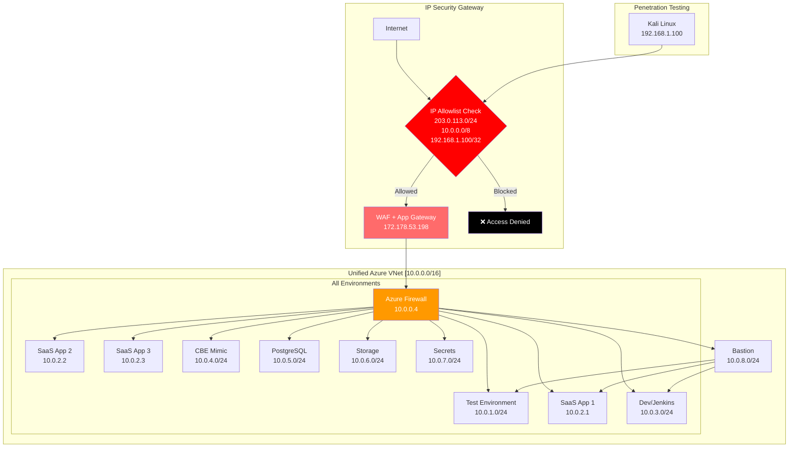

# Simplified IP-Restricted Architecture
## Everything Behind IP Allowlist

**Version:** 1.0  
**Date:** 2025-09-21  
**Status:** Simplified Security Architecture

---

## 🔒 Core Security Principle: IP Restriction First

**NOTHING is accessible without being on the IP allowlist**



---

## 📋 Simplified IP Restriction Configuration

### Master IP Allowlist (The ONLY way in)

```bash
#!/bin/bash
# scripts/network/configure-ip-allowlist.sh

# THE ONLY IPS THAT CAN ACCESS ANYTHING
ALLOWED_IPS=(
    "203.0.113.0/24"     # Office Network
    "10.0.0.0/8"         # Internal Azure
    "192.168.1.100/32"   # Kali Testing Machine
    "198.51.100.14/32"   # Customer 1
    "198.51.100.15/32"   # Customer 2
)

RESOURCE_GROUP="rg-unified"
APP_GW_NAME="appgw-main"
NSG_NAME="nsg-master"

echo "🔒 Configuring Master IP Allowlist"

# Step 1: Create Network Security Group with IP restrictions
az network nsg create \
    --resource-group $RESOURCE_GROUP \
    --name $NSG_NAME \
    --location uksouth

# Step 2: Add allow rules ONLY for specific IPs
PRIORITY=100
for IP in "${ALLOWED_IPS[@]}"; do
    RULE_NAME="Allow_$(echo $IP | tr './' '_')"
    
    az network nsg rule create \
        --resource-group $RESOURCE_GROUP \
        --nsg-name $NSG_NAME \
        --name $RULE_NAME \
        --priority $PRIORITY \
        --source-address-prefixes "$IP" \
        --destination-port-ranges '*' \
        --access Allow \
        --protocol '*' \
        --description "Allow $IP"
    
    PRIORITY=$((PRIORITY + 10))
done

# Step 3: DENY EVERYTHING ELSE
az network nsg rule create \
    --resource-group $RESOURCE_GROUP \
    --nsg-name $NSG_NAME \
    --name DenyAll \
    --priority 4096 \
    --source-address-prefixes '*' \
    --destination-port-ranges '*' \
    --access Deny \
    --protocol '*' \
    --description "Deny all other traffic"

# Step 4: Apply NSG to Application Gateway subnet
az network vnet subnet update \
    --resource-group $RESOURCE_GROUP \
    --vnet-name vnet-main \
    --name subnet-appgw \
    --network-security-group $NSG_NAME

echo "✅ IP Allowlist configured - ONLY specified IPs can access"
```

### WAF Rules (Second Layer)

```bash
#!/bin/bash
# scripts/network/configure-waf-simple.sh

WAF_POLICY="waf-policy-main"
RESOURCE_GROUP="rg-unified"

echo "🛡️ Configuring WAF with IP restrictions"

# Create WAF policy
az network application-gateway waf-policy create \
    --name $WAF_POLICY \
    --resource-group $RESOURCE_GROUP \
    --location uksouth

# Add custom rule for IP allowlist (backup to NSG)
az network application-gateway waf-policy custom-rule create \
    --policy-name $WAF_POLICY \
    --resource-group $RESOURCE_GROUP \
    --name IPAllowlistBackup \
    --priority 1 \
    --rule-type MatchRule \
    --match-conditions @- << 'EOF'
[
  {
    "matchVariables": [{"variableName": "RemoteAddr"}],
    "operator": "IPMatch",
    "negationCondition": true,
    "matchValues": [
      "203.0.113.0/24",
      "10.0.0.0/8",
      "192.168.1.100/32",
      "198.51.100.14/32",
      "198.51.100.15/32"
    ]
  }
]
EOF
    --action Block

echo "✅ WAF configured as backup IP filter"
```

---

## 🎯 Simplified Access Matrix

| Who/What | IP Address | Can Access | Cannot Access |
|----------|------------|------------|---------------|
| Office Network | 203.0.113.0/24 | Everything | - |
| Kali Testing | 192.168.1.100 | Test/SaaS via WAF | Direct backend |
| Customer 1 | 198.51.100.14 | SaaS App Only | Admin/Test |
| Customer 2 | 198.51.100.15 | SaaS App Only | Admin/Test |
| Internal Azure | 10.0.0.0/8 | Everything | - |
| **Anyone Else** | * | **NOTHING** | **EVERYTHING** |

---

## 🚀 Quick Deployment

```bash
#!/bin/bash
# scripts/deploy-simplified-architecture.sh

echo "🚀 Deploying Simplified IP-Restricted Architecture"

# 1. Create single resource group
az group create --name rg-unified --location uksouth

# 2. Create single VNet
az network vnet create \
    --name vnet-main \
    --resource-group rg-unified \
    --address-prefix 10.0.0.0/16

# 3. Create subnets
SUBNETS=(
    "subnet-firewall:10.0.0.0/24"
    "subnet-test:10.0.1.0/24"
    "subnet-saas:10.0.2.0/24"
    "subnet-dev:10.0.3.0/24"
    "subnet-cbe:10.0.4.0/24"
    "subnet-db:10.0.5.0/24"
    "subnet-storage:10.0.6.0/24"
    "subnet-vault:10.0.7.0/24"
    "subnet-bastion:10.0.8.0/24"
)

for SUBNET in "${SUBNETS[@]}"; do
    NAME="${SUBNET%%:*}"
    PREFIX="${SUBNET#*:}"
    
    az network vnet subnet create \
        --name $NAME \
        --resource-group rg-unified \
        --vnet-name vnet-main \
        --address-prefix $PREFIX
done

# 4. Deploy Application Gateway with public IP
az network public-ip create \
    --name pip-appgw \
    --resource-group rg-unified \
    --allocation-method Static \
    --sku Standard

az network application-gateway create \
    --name appgw-main \
    --resource-group rg-unified \
    --vnet-name vnet-main \
    --subnet subnet-appgw \
    --public-ip-address pip-appgw \
    --sku WAF_v2 \
    --capacity 2

# 5. Configure IP restrictions
./scripts/network/configure-ip-allowlist.sh

# 6. Deploy Azure Firewall
./scripts/network/deploy-firewall.sh

echo "✅ Simplified architecture deployed"
echo "⚠️  ONLY IPs in allowlist can access ANYTHING"
```

---

## 🔍 Testing IP Restrictions

```bash
#!/bin/bash
# scripts/test-ip-restrictions.sh

echo "🔍 Testing IP Restrictions"

# Test from allowed IP
echo "Testing from allowed IP (203.0.113.10)..."
curl -H "X-Forwarded-For: 203.0.113.10" https://172.178.53.198
# Expected: 200 OK

# Test from blocked IP
echo "Testing from blocked IP (1.2.3.4)..."
curl -H "X-Forwarded-For: 1.2.3.4" https://172.178.53.198
# Expected: 403 Forbidden

# Test direct backend access (should fail)
echo "Testing direct backend access..."
curl https://10.0.2.1
# Expected: Connection timeout (not routable)
```

---

## 📊 Management Commands

### Add New IP to Allowlist
```bash
# scripts/add-ip-to-allowlist.sh
NEW_IP="$1"
DESCRIPTION="$2"

az network nsg rule create \
    --resource-group rg-unified \
    --nsg-name nsg-master \
    --name "Allow_$(echo $NEW_IP | tr './' '_')" \
    --priority $(($(az network nsg rule list --resource-group rg-unified --nsg-name nsg-master --query "length([])") * 10 + 100)) \
    --source-address-prefixes "$NEW_IP" \
    --destination-port-ranges '*' \
    --access Allow \
    --protocol '*' \
    --description "$DESCRIPTION"

echo "✅ Added $NEW_IP to allowlist"
```

### Remove IP from Allowlist
```bash
# scripts/remove-ip-from-allowlist.sh
IP_TO_REMOVE="$1"
RULE_NAME="Allow_$(echo $IP_TO_REMOVE | tr './' '_')"

az network nsg rule delete \
    --resource-group rg-unified \
    --nsg-name nsg-master \
    --name $RULE_NAME

echo "✅ Removed $IP_TO_REMOVE from allowlist"
```

### View Current Allowlist
```bash
# scripts/view-allowlist.sh
az network nsg rule list \
    --resource-group rg-unified \
    --nsg-name nsg-master \
    --query "[?access=='Allow'].{IP:sourceAddressPrefix, Description:description}" \
    --output table
```

---

## ⚠️ Critical Security Points

1. **NOTHING is accessible without IP allowlist** - No exceptions
2. **Single point of entry** - Through App Gateway only
3. **No public IPs on any backend service** - Everything private
4. **Azure Firewall inspects all internal traffic** - Zero trust
5. **Bastion for human access** - No direct SSH/RDP
6. **IP allowlist is THE security boundary** - Manage carefully

---

## 💰 Cost Optimization

By simplifying to a single VNet with IP restrictions:
- **Reduced VNet peering costs** 
- **Single firewall instead of multiple**
- **Simplified NSG management**
- **Easier to audit and maintain**

Estimated monthly cost: **~$800** (vs $1,500 for complex architecture)

---

## ✅ Implementation Checklist

- [ ] Deploy single unified VNet
- [ ] Configure master IP allowlist
- [ ] Deploy Application Gateway with WAF
- [ ] Configure Azure Firewall
- [ ] Test IP restrictions work
- [ ] Document approved IPs
- [ ] Setup IP change process
- [ ] Configure monitoring alerts

---

This simplified architecture ensures **ONLY specific IPs can access ANYTHING** in the entire infrastructure.