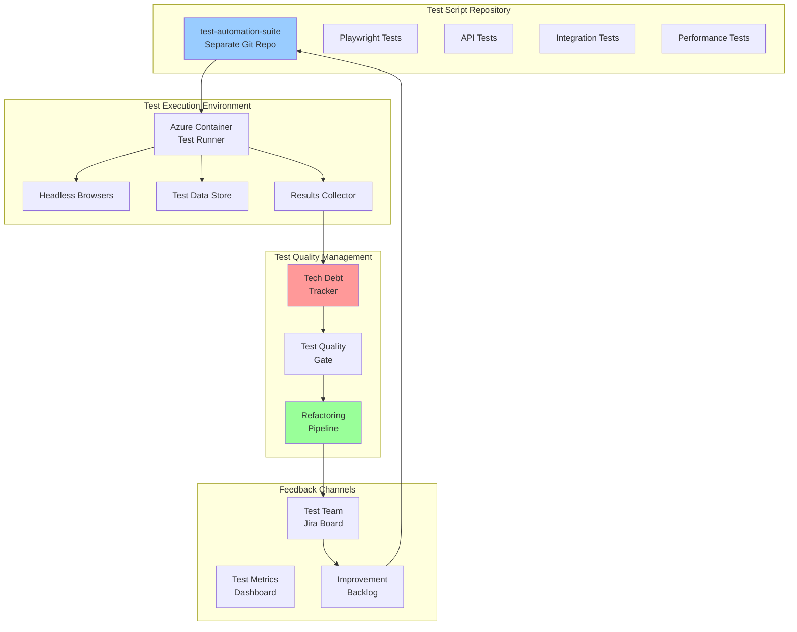

# Test Automation Management Strategy
## Playwright & Test Script Lifecycle Management

**Version:** 1.0  
**Date:** 2025-09-21  
**Author:** Winston - System Architect

---

## 🎭 Overview

This document defines the complete test automation management strategy including:
- Playwright execution in Azure test environment
- Test script lifecycle management (separate from app code)
- Technical debt tracking for "vibe-coded" test scripts
- Test script improvement workflow
- Dedicated feedback and promotion processes

---

## 🏗️ Test Automation Architecture



---

## 🎭 Playwright Azure Integration

### Azure Test Runner Container

```dockerfile
# Dockerfile.test-runner
# Playwright test runner for Azure environment

FROM mcr.microsoft.com/playwright:v1.40.0-focal

# Install additional dependencies
RUN apt-get update && apt-get install -y \
    curl \
    jq \
    git \
    python3-pip \
    && rm -rf /var/lib/apt/lists/*

# Install Azure CLI
RUN curl -sL https://aka.ms/InstallAzureCLIDeb | bash

# Create test user
RUN useradd -m -s /bin/bash testrunner && \
    usermod -aG sudo testrunner

WORKDIR /tests

# Copy test framework
COPY package*.json ./
RUN npm ci

# Copy test suites
COPY tests/ ./tests/
COPY scripts/ ./scripts/
COPY config/ ./config/

# Install Playwright browsers
RUN npx playwright install --with-deps

# Create results directory
RUN mkdir -p /results && chown testrunner:testrunner /results

USER testrunner

# Entry point for test execution
ENTRYPOINT ["./scripts/test-runner.sh"]
```

### Test Runner Deployment

```yaml
# azure-test-runner-deployment.yaml
apiVersion: apps/v1
kind: Deployment
metadata:
  name: playwright-test-runner
  namespace: test-automation
spec:
  replicas: 3  # Parallel test execution
  selector:
    matchLabels:
      app: test-runner
  template:
    metadata:
      labels:
        app: test-runner
    spec:
      containers:
      - name: playwright-runner
        image: acrsecdevopsdev.azurecr.io/test-runner:latest
        resources:
          requests:
            memory: "2Gi"
            cpu: "2"
          limits:
            memory: "4Gi"
            cpu: "4"
        env:
        - name: TEST_ENV
          value: "azure"
        - name: APP_URL
          value: "http://oversight-mvp-test.azurecontainer.io"
        - name: PARALLEL_WORKERS
          value: "4"
        - name: REPORT_PORTAL_URL
          value: "http://reportportal.oversight.io"
        volumeMounts:
        - name: test-results
          mountPath: /results
        - name: test-configs
          mountPath: /config
      - name: results-uploader
        image: acrsecdevopsdev.azurecr.io/results-uploader:latest
        volumeMounts:
        - name: test-results
          mountPath: /results
      volumes:
      - name: test-results
        azureFile:
          secretName: azure-storage-secret
          shareName: test-results
      - name: test-configs
        configMap:
          name: test-configs
```

### Playwright Test Execution Script

```typescript
// scripts/playwright/azure-test-executor.ts
import { chromium, firefox, webkit, Browser, Page } from 'playwright';
import { TestConfig, TestResult, TestMetrics } from './types';
import { AzureReporter } from './reporters/azure-reporter';

export class AzureTestExecutor {
    private config: TestConfig;
    private reporter: AzureReporter;
    private browsers: Browser[] = [];
    private metrics: TestMetrics = {
        totalTests: 0,
        passed: 0,
        failed: 0,
        skipped: 0,
        flaky: 0,
        duration: 0,
        techDebtScore: 0
    };

    constructor(config: TestConfig) {
        this.config = config;
        this.reporter = new AzureReporter(config);
    }

    async setup() {
        console.log('🎭 Setting up Playwright for Azure environment...');
        
        // Launch browsers based on config
        if (this.config.browsers.includes('chromium')) {
            this.browsers.push(await chromium.launch({
                headless: true,
                args: ['--no-sandbox', '--disable-setuid-sandbox']
            }));
        }
        
        if (this.config.browsers.includes('firefox')) {
            this.browsers.push(await firefox.launch({ headless: true }));
        }
        
        if (this.config.browsers.includes('webkit')) {
            this.browsers.push(await webkit.launch({ headless: true }));
        }

        // Setup Azure-specific configurations
        await this.setupAzureAuth();
        await this.setupTestData();
    }

    async executeTestSuite(suitePath: string) {
        const suite = await import(suitePath);
        const results: TestResult[] = [];
        
        for (const testCase of suite.tests) {
            // Analyze test for tech debt
            const techDebtAnalysis = await this.analyzeTechDebt(testCase);
            
            if (techDebtAnalysis.score > 7) {
                console.warn(`⚠️ High tech debt in test: ${testCase.name}`);
                await this.createRefactorTicket(testCase, techDebtAnalysis);
            }

            // Execute test
            const result = await this.runTest(testCase);
            results.push(result);
            
            // Update metrics
            this.updateMetrics(result, techDebtAnalysis);
        }
        
        return results;
    }

    async analyzeTechDebt(testCase: any): Promise<TechDebtAnalysis> {
        const analysis: TechDebtAnalysis = {
            score: 0,
            issues: [],
            recommendations: []
        };

        // Check for hardcoded values
        if (this.hasHardcodedValues(testCase.code)) {
            analysis.score += 3;
            analysis.issues.push('Hardcoded values detected');
            analysis.recommendations.push('Extract values to config or data files');
        }

        // Check for arbitrary waits
        if (testCase.code.includes('waitForTimeout') || 
            testCase.code.includes('sleep')) {
            analysis.score += 2;
            analysis.issues.push('Arbitrary waits detected');
            analysis.recommendations.push('Use proper wait conditions');
        }

        // Check for missing assertions
        const assertionCount = (testCase.code.match(/expect\(/g) || []).length;
        if (assertionCount < 1) {
            analysis.score += 3;
            analysis.issues.push('No assertions found');
            analysis.recommendations.push('Add meaningful assertions');
        }

        // Check for try-catch without proper handling
        if (testCase.code.includes('catch') && 
            !testCase.code.includes('throw')) {
            analysis.score += 2;
            analysis.issues.push('Swallowed exceptions detected');
            analysis.recommendations.push('Handle or rethrow exceptions properly');
        }

        // Check for duplicate selectors
        const selectors = this.extractSelectors(testCase.code);
        const duplicates = this.findDuplicates(selectors);
        if (duplicates.length > 0) {
            analysis.score += 1;
            analysis.issues.push(`Duplicate selectors: ${duplicates.join(', ')}`);
            analysis.recommendations.push('Extract selectors to page objects');
        }

        // Check test length (too long = unmaintainable)
        const lineCount = testCase.code.split('\n').length;
        if (lineCount > 100) {
            analysis.score += 2;
            analysis.issues.push('Test is too long');
            analysis.recommendations.push('Break down into smaller, focused tests');
        }

        return analysis;
    }

    async createRefactorTicket(testCase: any, analysis: TechDebtAnalysis) {
        const ticket = {
            project: 'TEST_IMPROVEMENT',
            type: 'Technical Debt',
            priority: this.getPriorityFromScore(analysis.score),
            summary: `Refactor test: ${testCase.name}`,
            description: this.formatRefactorDescription(testCase, analysis),
            labels: ['test-debt', 'automated-detection', 'playwright'],
            customFields: {
                techDebtScore: analysis.score,
                testFile: testCase.file,
                testName: testCase.name
            }
        };

        await this.reporter.createJiraTicket(ticket);
    }

    private formatRefactorDescription(testCase: any, analysis: TechDebtAnalysis): string {
        return `
## Test Requiring Refactor
**Test Name:** ${testCase.name}
**File:** ${testCase.file}
**Tech Debt Score:** ${analysis.score}/10

## Issues Detected
${analysis.issues.map(issue => `- ${issue}`).join('\n')}

## Recommendations
${analysis.recommendations.map(rec => `- ${rec}`).join('\n')}

## Current Test Code
\`\`\`typescript
${testCase.code}
\`\`\`

## Suggested Refactored Structure
\`\`\`typescript
// TODO: Apply recommendations above
// Use Page Object Model
// Extract test data
// Add proper waits and assertions
\`\`\`
        `;
    }
}

// Test suite analyzer for bulk analysis
export class TestSuiteAnalyzer {
    async analyzeRepository(repoPath: string) {
        console.log('📊 Analyzing test repository for technical debt...');
        
        const report = {
            timestamp: new Date().toISOString(),
            totalTests: 0,
            highDebtTests: [],
            mediumDebtTests: [],
            lowDebtTests: [],
            topIssues: {},
            estimatedRefactorHours: 0
        };

        // Scan all test files
        const testFiles = await this.findTestFiles(repoPath);
        
        for (const file of testFiles) {
            const analysis = await this.analyzeTestFile(file);
            report.totalTests += analysis.testCount;
            
            // Categorize by debt level
            analysis.tests.forEach(test => {
                if (test.debtScore > 7) {
                    report.highDebtTests.push(test);
                    report.estimatedRefactorHours += 4;
                } else if (test.debtScore > 4) {
                    report.mediumDebtTests.push(test);
                    report.estimatedRefactorHours += 2;
                } else {
                    report.lowDebtTests.push(test);
                    report.estimatedRefactorHours += 0.5;
                }
                
                // Track top issues
                test.issues.forEach(issue => {
                    report.topIssues[issue] = (report.topIssues[issue] || 0) + 1;
                });
            });
        }
        
        return report;
    }
}
```

---

## 🔄 Test Script Improvement Workflow

### Separate Test Script Repository

```yaml
# test-automation-suite repository structure
test-automation-suite/
├── .github/
│   └── workflows/
│       ├── test-quality-check.yml
│       └── test-promotion.yml
├── playwright/
│   ├── tests/
│   │   ├── smoke/
│   │   ├── regression/
│   │   ├── e2e/
│   │   └── performance/
│   ├── pages/           # Page Object Models
│   ├── fixtures/        # Test data
│   └── utils/           # Helper functions
├── api-tests/
│   ├── collections/
│   └── environments/
├── performance/
│   ├── k6-scripts/
│   └── jmeter/
├── test-management/
│   ├── tech-debt-tracker.json
│   ├── test-metrics.json
│   └── improvement-backlog.md
├── config/
│   ├── playwright.config.ts
│   └── environments.json
└── scripts/
    ├── analyze-debt.sh
    ├── refactor-test.sh
    └── promote-tests.sh
```

### Test Script Promotion Pipeline

```groovy
// Jenkinsfile.test-automation
pipeline {
    agent any
    
    stages {
        stage('Test Quality Analysis') {
            steps {
                script {
                    // Analyze test scripts for tech debt
                    sh '''
                        npm run analyze:tech-debt
                        npm run lint:tests
                        npm run test:dry-run
                    '''
                    
                    // Check quality gates
                    def debtReport = readJSON file: 'tech-debt-report.json'
                    if (debtReport.highDebtTests.size() > 5) {
                        error("Too many high-debt tests. Refactoring required.")
                    }
                }
            }
        }
        
        stage('Test Validation') {
            parallel {
                stage('Syntax Check') {
                    steps {
                        sh 'npm run test:syntax'
                    }
                }
                stage('Selector Validation') {
                    steps {
                        sh 'npm run validate:selectors'
                    }
                }
                stage('Data Validation') {
                    steps {
                        sh 'npm run validate:test-data'
                    }
                }
            }
        }
        
        stage('Dry Run in Isolated Environment') {
            steps {
                script {
                    // Run tests against mock environment
                    sh '''
                        docker-compose -f docker-compose.test-isolation.yml up -d
                        npm run test:isolated
                        docker-compose -f docker-compose.test-isolation.yml down
                    '''
                }
            }
        }
        
        stage('Deploy to Test Environment') {
            when {
                branch 'main'
            }
            steps {
                script {
                    // Deploy test scripts to Azure
                    sh '''
                        docker build -f Dockerfile.test-runner -t test-runner:${BUILD_NUMBER} .
                        docker tag test-runner:${BUILD_NUMBER} ${ACR_NAME}/test-runner:${BUILD_NUMBER}
                        docker push ${ACR_NAME}/test-runner:${BUILD_NUMBER}
                        
                        kubectl set image deployment/playwright-test-runner \
                            playwright-runner=${ACR_NAME}/test-runner:${BUILD_NUMBER} \
                            -n test-automation
                    '''
                }
            }
        }
        
        stage('Execute Test Suite') {
            steps {
                script {
                    // Run tests in Azure
                    sh '''
                        kubectl exec -it deployment/playwright-test-runner \
                            -n test-automation -- \
                            npm run test:azure
                    '''
                }
            }
        }
        
        stage('Collect Feedback') {
            steps {
                script {
                    // Analyze test execution results
                    sh '''
                        node scripts/collect-test-feedback.js
                        node scripts/create-improvement-tickets.js
                    '''
                }
            }
        }
    }
    
    post {
        always {
            // Archive test reports and metrics
            archiveArtifacts artifacts: '**/test-results/**'
            publishHTML([
                reportDir: 'playwright-report',
                reportFiles: 'index.html',
                reportName: 'Playwright Report'
            ])
            
            // Update test metrics dashboard
            sh 'node scripts/update-test-metrics.js'
        }
    }
}
```

---

## 📊 Tech Debt Tracking System

### Test Debt Database Schema

```sql
-- Test technical debt tracking
CREATE TABLE test_tech_debt (
    id UUID PRIMARY KEY DEFAULT gen_random_uuid(),
    test_file VARCHAR(500),
    test_name VARCHAR(500),
    debt_score INTEGER,
    issues JSONB,
    recommendations JSONB,
    first_detected TIMESTAMP DEFAULT CURRENT_TIMESTAMP,
    last_analyzed TIMESTAMP DEFAULT CURRENT_TIMESTAMP,
    refactor_status VARCHAR(50) DEFAULT 'pending',
    assigned_to VARCHAR(100),
    estimated_hours DECIMAL(5,2),
    actual_hours DECIMAL(5,2),
    refactor_pr_url VARCHAR(500),
    notes TEXT
);

-- Test execution metrics
CREATE TABLE test_execution_metrics (
    id UUID PRIMARY KEY DEFAULT gen_random_uuid(),
    test_id VARCHAR(500),
    execution_time_ms INTEGER,
    memory_usage_mb INTEGER,
    success_rate DECIMAL(5,2),
    flakiness_score DECIMAL(5,2),
    last_10_results JSONB,
    environment VARCHAR(50),
    browser VARCHAR(50),
    created_at TIMESTAMP DEFAULT CURRENT_TIMESTAMP
);

-- Test improvement tracking
CREATE TABLE test_improvements (
    id UUID PRIMARY KEY DEFAULT gen_random_uuid(),
    test_id VARCHAR(500),
    improvement_type VARCHAR(100),
    before_metrics JSONB,
    after_metrics JSONB,
    improvement_percentage DECIMAL(5,2),
    implemented_by VARCHAR(100),
    pr_url VARCHAR(500),
    implementation_date DATE,
    verified BOOLEAN DEFAULT FALSE
);

-- Create indexes for performance
CREATE INDEX idx_test_debt_score ON test_tech_debt(debt_score DESC);
CREATE INDEX idx_test_debt_status ON test_tech_debt(refactor_status);
CREATE INDEX idx_test_metrics_flaky ON test_execution_metrics(flakiness_score DESC);
```

### Tech Debt Dashboard

```typescript
// scripts/dashboard/tech-debt-dashboard.ts
import { Dashboard, Panel, Query } from '@grafana/toolkit';

export class TechDebtDashboard {
    create(): Dashboard {
        return new Dashboard({
            title: 'Test Automation Tech Debt',
            panels: [
                this.createDebtScorePanel(),
                this.createTopIssuesPanel(),
                this.createRefactorProgressPanel(),
                this.createFlakinessPanel(),
                this.createPerformancePanel()
            ]
        });
    }

    private createDebtScorePanel(): Panel {
        return new Panel({
            title: 'Overall Tech Debt Score',
            type: 'gauge',
            query: `
                SELECT 
                    AVG(debt_score) as avg_score,
                    COUNT(*) FILTER (WHERE debt_score > 7) as high_debt_count,
                    COUNT(*) FILTER (WHERE debt_score BETWEEN 4 AND 7) as medium_debt_count,
                    COUNT(*) FILTER (WHERE debt_score < 4) as low_debt_count
                FROM test_tech_debt
                WHERE refactor_status != 'completed'
            `
        });
    }

    private createTopIssuesPanel(): Panel {
        return new Panel({
            title: 'Top Tech Debt Issues',
            type: 'table',
            query: `
                SELECT 
                    jsonb_array_elements_text(issues) as issue,
                    COUNT(*) as occurrence_count
                FROM test_tech_debt
                WHERE refactor_status = 'pending'
                GROUP BY issue
                ORDER BY occurrence_count DESC
                LIMIT 10
            `
        });
    }

    private createFlakinessPanel(): Panel {
        return new Panel({
            title: 'Flaky Tests Requiring Attention',
            type: 'table',
            query: `
                SELECT 
                    test_id,
                    flakiness_score,
                    success_rate,
                    execution_time_ms
                FROM test_execution_metrics
                WHERE flakiness_score > 0.2
                ORDER BY flakiness_score DESC
                LIMIT 20
            `
        });
    }
}
```

---

## 🔄 Test Improvement Feedback Loop

### Automated Test Improvement Workflow

```bash
#!/bin/bash
# scripts/test-improvement-workflow.sh

set -e

# Configuration
TEST_REPO="https://github.com/org/test-automation-suite.git"
IMPROVEMENT_BRANCH="improvement/automated-${BUILD_NUMBER}"

echo "🔄 Starting Test Improvement Workflow"

# Step 1: Clone test repository
git clone $TEST_REPO test-suite
cd test-suite

# Step 2: Create improvement branch
git checkout -b $IMPROVEMENT_BRANCH

# Step 3: Run automated improvements
echo "🤖 Running automated improvements..."

# Fix hardcoded values
node scripts/refactor/extract-hardcoded-values.js

# Convert arbitrary waits to proper conditions
node scripts/refactor/fix-waits.js

# Add missing assertions
node scripts/refactor/add-assertions.js

# Extract duplicate selectors to page objects
node scripts/refactor/create-page-objects.js

# Step 4: Validate improvements
echo "✅ Validating improvements..."
npm run test:syntax
npm run test:dry-run

# Step 5: Calculate improvement metrics
BEFORE_METRICS=$(git show HEAD:test-metrics.json)
AFTER_METRICS=$(npm run metrics:calculate --silent)

node scripts/calculate-improvement.js \
    --before "$BEFORE_METRICS" \
    --after "$AFTER_METRICS" \
    > improvement-report.json

# Step 6: Create pull request
echo "📝 Creating pull request..."
git add .
git commit -m "test: Automated test improvements

- Extracted hardcoded values to config
- Fixed arbitrary waits
- Added missing assertions
- Created page objects for common patterns

Tech debt score improved by $(jq .improvement_percentage improvement-report.json)%"

git push origin $IMPROVEMENT_BRANCH

gh pr create \
    --title "Automated Test Improvements - Build #${BUILD_NUMBER}" \
    --body "$(cat improvement-report.json | jq -r .summary)" \
    --label "test-improvement,automated" \
    --reviewer "test-team"

echo "✅ Test improvement workflow completed"
```

### Test Improvement Metrics

```yaml
Key Metrics:
  - Tech Debt Score Trend (weekly)
  - Test Flakiness Rate
  - Average Test Execution Time
  - Test Maintenance Hours per Sprint
  - Automated vs Manual Improvements
  - Test Coverage vs Quality Score

Success Criteria:
  - Tech debt score < 4 for 80% of tests
  - Flakiness rate < 5%
  - Zero hardcoded values in tests
  - All tests use Page Object Model
  - 100% of tests have meaningful assertions
```

---

## 🚀 Quick Reference

### Analyze Test Tech Debt
```bash
# Full repository analysis
npm run analyze:tech-debt

# Single file analysis
npm run analyze:file tests/e2e/login.spec.ts

# Generate improvement plan
npm run generate:improvement-plan
```

### Deploy Test Updates
```bash
# Deploy to test environment
./scripts/deploy-test-runner.sh

# Run specific test suite
kubectl exec -it playwright-test-runner -- npm run test:smoke

# Collect results
./scripts/collect-test-results.sh
```

### Track Improvements
```bash
# View tech debt dashboard
open http://grafana.oversight.io/d/test-tech-debt

# Check improvement metrics
psql -d test_metrics -c "SELECT * FROM test_improvements WHERE implementation_date > CURRENT_DATE - 30"

# Review pending refactors
npm run report:pending-refactors
```

---

This comprehensive test automation management strategy ensures that test scripts are properly managed, technical debt is tracked and reduced, and improvements flow through a dedicated pipeline separate from application code.