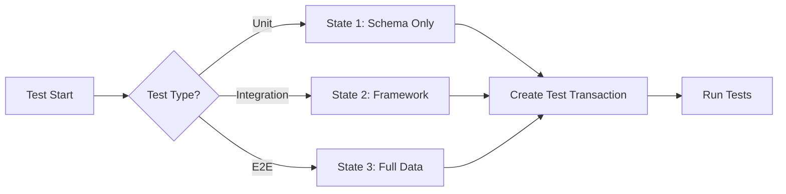

# Test Data Management Procedures
## Database State Switching & Test Data Lifecycle

**Date:** 2025-09-21  
**Version:** 1.0  
**Purpose:** Define procedures for managing test data states and transitions

---

## 📊 Database State Architecture

### Three-State Model

```yaml
State 1 - Schema Only (411):
  Purpose: Structure validation, migration testing
  Contents:
    - Empty tables with full schema
    - All constraints and indexes
    - No data records
  Use Cases:
    - Schema migration tests
    - Database structure validation
    - Clean slate testing

State 2 - Framework Data (412):
  Purpose: Basic functionality testing
  Contents:
    - Essential reference data
    - System configuration records
    - Minimal test users (admin, user, guest)
    - Basic permissions and roles
  Use Cases:
    - Authentication/authorization tests
    - Basic CRUD operations
    - Framework functionality

State 3 - Full Test Data (413):
  Purpose: Comprehensive testing
  Contents:
    - Complete dataset for all features
    - Multiple test scenarios
    - Edge cases and boundary data
    - Performance testing datasets
  Use Cases:
    - Full regression testing
    - Performance testing
    - User acceptance testing
    - Complex workflow validation
```

---

## 🔄 State Transition Procedures

### Manual State Switching (Current)

```bash
# Switch to State 1 (Schema Only)
./scripts/test-data/switch-db-state.sh --state schema-only

# Switch to State 2 (Framework Data)
./scripts/test-data/switch-db-state.sh --state framework

# Switch to State 3 (Full Test Data)
./scripts/test-data/switch-db-state.sh --state full
```

### Programmatic State Switching (Recommended)

```yaml
API Endpoints:
  GET /api/test/db-state:
    Description: Get current database state
    Response: { "state": "schema-only|framework|full" }

  POST /api/test/db-state:
    Description: Switch database state
    Body: { "state": "schema-only|framework|full" }
    Response: { "success": true, "previousState": "...", "newState": "..." }

  POST /api/test/db-reset:
    Description: Reset current state to clean version
    Response: { "success": true, "state": "..." }
```

---

## 🔄 Test Data Lifecycle

### Pre-Test Setup



### During Test Execution

```yaml
Test Isolation Strategy:
  Database Transactions:
    - Each test runs in transaction
    - Automatic rollback after test
    - No data persistence between tests

  Test Data Factories:
    - Dynamic data generation
    - Unique identifiers per test
    - Cleanup tracking

  Parallel Execution:
    - Separate schemas for parallel tests
    - Schema naming: test_<timestamp>_<worker_id>
    - Automatic cleanup after suite
```

### Post-Test Cleanup

```bash
# Automated cleanup script
#!/bin/bash

cleanup_test_data() {
    # Remove test-generated files
    rm -rf /tmp/test-files-*
    
    # Reset database to original state
    case $TEST_SUITE in
        "unit")
            reset_to_state 1
            ;;
        "integration")
            reset_to_state 2
            ;;
        "e2e")
            reset_to_state 3
            ;;
    esac
    
    # Clear Redis cache
    redis-cli FLUSHDB
    
    # Clean up Docker volumes
    docker volume prune -f
}
```

---

## 📁 File Test Data Management

### File Storage Structure

```
/test-data/
├── files/
│   ├── valid/
│   │   ├── images/
│   │   ├── documents/
│   │   └── data/
│   ├── invalid/
│   │   ├── corrupted/
│   │   ├── oversized/
│   │   └── malformed/
│   └── edge-cases/
│       ├── empty/
│       ├── special-chars/
│       └── unicode/
├── fixtures/
│   └── api-responses/
└── snapshots/
    └── ui-screenshots/
```

### File Lifecycle Management

```yaml
Before Test Suite:
  - Copy test files to temp directory
  - Generate unique file names
  - Set appropriate permissions

During Tests:
  - Track created files
  - Monitor disk usage
  - Validate file operations

After Test Suite:
  - Delete temporary files
  - Clean upload directories
  - Reset file permissions
  - Archive important results
```

---

## 🔄 State Switching Implementation

### Database State Manager Service

```javascript
class DatabaseStateManager {
    constructor() {
        this.states = {
            'schema-only': '/sql/states/schema-only.sql',
            'framework': '/sql/states/framework.sql',
            'full': '/sql/states/full.sql'
        };
        this.currentState = null;
    }

    async switchState(newState) {
        // Validate state
        if (!this.states[newState]) {
            throw new Error(`Invalid state: ${newState}`);
        }

        // Backup current if needed
        if (this.currentState) {
            await this.backupCurrentState();
        }

        // Load new state
        await this.loadState(newState);
        this.currentState = newState;
        
        // Log state change
        console.log(`Database state switched to: ${newState}`);
        return true;
    }

    async resetCurrentState() {
        if (!this.currentState) {
            throw new Error('No current state to reset');
        }
        return this.switchState(this.currentState);
    }
}
```

---

## 🚦 Test Data Rules

### Data Generation Rules

1. **Deterministic Generation**
   - Use seeds for random data
   - Reproducible test scenarios
   - Consistent across environments

2. **Data Privacy**
   - No real user data in tests
   - Anonymized production samples
   - GDPR compliant test data

3. **Data Boundaries**
   - Test minimum values (0, 1, -1)
   - Test maximum values
   - Test null/undefined
   - Test special characters

### State Transition Rules

1. **State Independence**
   - Each state self-contained
   - No dependencies between states
   - Clean transitions

2. **Performance**
   - State switch < 30 seconds
   - Parallel test support
   - Efficient cleanup

3. **Consistency**
   - Same state = same results
   - Version controlled states
   - Automated validation

---

## 📊 Test Data Metrics

### Monitoring Points

```yaml
Metrics to Track:
  State Switches:
    - Switch frequency
    - Switch duration
    - Switch failures
    
  Data Volume:
    - Records per table
    - Database size
    - File storage usage
    
  Test Performance:
    - Setup time
    - Cleanup time
    - Data generation time
    
  Data Quality:
    - Coverage percentage
    - Edge case coverage
    - Data validity
```

### Health Checks

```bash
# Daily test data health check
check_test_data_health() {
    echo "Checking test database states..."
    for state in schema-only framework full; do
        validate_state $state || alert_team "State $state corrupted"
    done
    
    echo "Checking file test data..."
    check_file_integrity || alert_team "Test files corrupted"
    
    echo "Checking data volume..."
    check_data_size || cleanup_old_data
}
```

---

## 🔄 Jenkins Pipeline Integration

### Pipeline Configuration

```groovy
pipeline {
    agent any
    
    parameters {
        choice(
            name: 'DB_STATE',
            choices: ['schema-only', 'framework', 'full'],
            description: 'Database state for tests'
        )
    }
    
    stages {
        stage('Setup Test Data') {
            steps {
                script {
                    // Switch to requested state
                    sh "curl -X POST ${TEST_API}/db-state -d '{\"state\": \"${params.DB_STATE}\"}'"
                    
                    // Verify state
                    def currentState = sh(
                        script: "curl ${TEST_API}/db-state | jq -r .state",
                        returnStdout: true
                    ).trim()
                    
                    if (currentState != params.DB_STATE) {
                        error "Failed to switch to ${params.DB_STATE}"
                    }
                }
            }
        }
        
        stage('Run Tests') {
            parallel {
                stage('Unit Tests') {
                    when { expression { params.DB_STATE == 'schema-only' } }
                    steps { sh 'npm run test:unit' }
                }
                stage('Integration Tests') {
                    when { expression { params.DB_STATE == 'framework' } }
                    steps { sh 'npm run test:integration' }
                }
                stage('E2E Tests') {
                    when { expression { params.DB_STATE == 'full' } }
                    steps { sh 'npm run test:e2e' }
                }
            }
        }
        
        stage('Cleanup') {
            always {
                sh 'curl -X POST ${TEST_API}/db-reset'
                sh './scripts/cleanup-test-files.sh'
            }
        }
    }
}
```

---

## 🚀 Quick Start Commands

```bash
# Initialize all test data states
./scripts/test-data/init-all-states.sh

# Switch to specific state
./scripts/test-data/switch-state.sh --state full

# Reset current state
./scripts/test-data/reset-state.sh

# Clean all test data
./scripts/test-data/clean-all.sh

# Validate state integrity
./scripts/test-data/validate-states.sh

# Backup current state
./scripts/test-data/backup-state.sh --name "backup-$(date +%Y%m%d)"

# Restore from backup
./scripts/test-data/restore-state.sh --name "backup-20250921"
```

---

## ⚠️ Important Considerations

1. **Never mix test and production data**
2. **Always cleanup after test runs**
3. **Version control test data schemas**
4. **Monitor test data growth**
5. **Implement data retention policies**
6. **Regular test data audits**
7. **Document data dependencies**

---

This document provides comprehensive procedures for managing test data throughout the testing lifecycle, ensuring consistent, reliable, and efficient test execution.