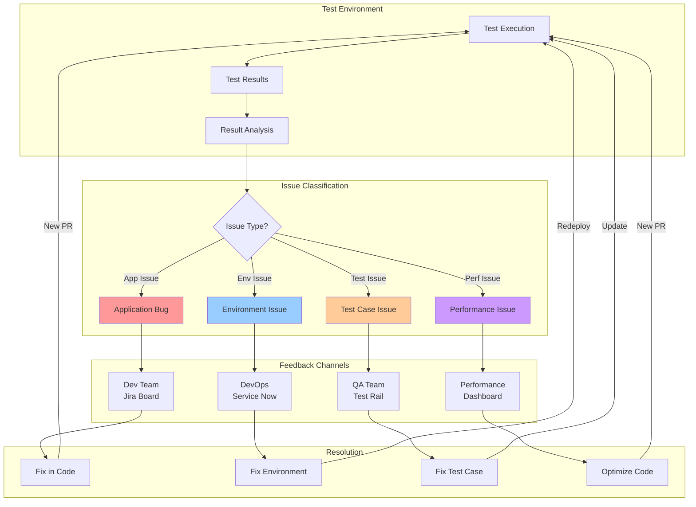

# Test Feedback Loop Strategy
## Continuous Improvement from Test Outcomes

**Version:** 1.0  
**Date:** 2025-09-21  
**Author:** Winston - System Architect

---

## 🔄 Overview

This document defines the feedback loop mechanism from test environment outcomes back to development, including:
- Automated test result collection and analysis
- Issue categorization (app bugs vs environment issues)
- Feedback routing to appropriate teams
- Test environment fix procedures
- Continuous improvement tracking

---

## 📊 Feedback Loop Architecture



---

## 🎯 Test Result Collection

### Automated Test Result Aggregator

```javascript
// scripts/feedback/test-result-aggregator.js
const fs = require('fs');
const path = require('path');
const axios = require('axios');

class TestResultAggregator {
    constructor() {
        this.results = {
            timestamp: new Date().toISOString(),
            buildNumber: process.env.BUILD_NUMBER,
            environment: process.env.TEST_ENV || 'test',
            summary: {
                total: 0,
                passed: 0,
                failed: 0,
                skipped: 0,
                errors: []
            },
            categories: {
                unit: [],
                integration: [],
                e2e: [],
                security: [],
                performance: []
            },
            issues: []
        };
    }

    // Collect all test results
    async collectResults() {
        console.log('📊 Collecting test results...');
        
        // Unit test results
        await this.collectJestResults();
        
        // Integration test results
        await this.collectIntegrationResults();
        
        // E2E test results
        await this.collectE2EResults();
        
        // Security scan results
        await this.collectSecurityResults();
        
        // Performance test results
        await this.collectPerformanceResults();
        
        // Analyze and classify issues
        await this.classifyIssues();
        
        return this.results;
    }

    // Classify issues based on failure patterns
    async classifyIssues() {
        console.log('🔍 Classifying issues...');
        
        for (const error of this.results.summary.errors) {
            const classification = await this.classifyError(error);
            
            this.results.issues.push({
                id: `ISSUE-${Date.now()}-${Math.random().toString(36).substr(2, 9)}`,
                type: classification.type,
                severity: classification.severity,
                component: classification.component,
                description: error.message,
                stackTrace: error.stack,
                testFile: error.testFile,
                recommendation: classification.recommendation,
                autoFixAvailable: classification.autoFixAvailable
            });
        }
    }

    // Error classification logic
    async classifyError(error) {
        const classification = {
            type: 'unknown',
            severity: 'medium',
            component: 'unknown',
            recommendation: '',
            autoFixAvailable: false
        };

        // Environment issues
        if (error.message.includes('ECONNREFUSED') || 
            error.message.includes('ETIMEDOUT')) {
            classification.type = 'environment';
            classification.severity = 'high';
            classification.component = 'infrastructure';
            classification.recommendation = 'Check service connectivity and configuration';
        }
        // Database issues
        else if (error.message.includes('database') || 
                 error.message.includes('postgres')) {
            classification.type = 'environment';
            classification.severity = 'high';
            classification.component = 'database';
            classification.recommendation = 'Verify database state and connectivity';
        }
        // Application bugs
        else if (error.message.includes('TypeError') || 
                 error.message.includes('ReferenceError')) {
            classification.type = 'application';
            classification.severity = 'high';
            classification.component = 'code';
            classification.recommendation = 'Fix code error in application';
        }
        // Test case issues
        else if (error.message.includes('Expected') || 
                 error.message.includes('Assertion')) {
            classification.type = 'test';
            classification.severity = 'low';
            classification.component = 'test-case';
            classification.recommendation = 'Review and update test expectations';
        }
        // Performance issues
        else if (error.message.includes('timeout') || 
                 error.message.includes('slow')) {
            classification.type = 'performance';
            classification.severity = 'medium';
            classification.component = 'performance';
            classification.recommendation = 'Optimize code or increase timeouts';
        }

        return classification;
    }

    // Create feedback tickets
    async createFeedbackTickets() {
        console.log('🎫 Creating feedback tickets...');
        
        for (const issue of this.results.issues) {
            switch (issue.type) {
                case 'application':
                    await this.createJiraTicket(issue);
                    break;
                case 'environment':
                    await this.createServiceNowTicket(issue);
                    break;
                case 'test':
                    await this.createTestRailIssue(issue);
                    break;
                case 'performance':
                    await this.updatePerformanceDashboard(issue);
                    break;
            }
        }
    }

    // Create Jira ticket for dev team
    async createJiraTicket(issue) {
        const ticket = {
            fields: {
                project: { key: 'OVST' },
                summary: `[TEST-FAILURE] ${issue.description.substring(0, 100)}`,
                description: this.formatJiraDescription(issue),
                issuetype: { name: 'Bug' },
                priority: this.mapSeverityToPriority(issue.severity),
                labels: ['test-feedback', 'automated', issue.component],
                customfield_10001: issue.id, // Test issue ID
                customfield_10002: process.env.BUILD_NUMBER // Build number
            }
        };

        try {
            const response = await axios.post(
                `${process.env.JIRA_URL}/rest/api/2/issue`,
                ticket,
                {
                    auth: {
                        username: process.env.JIRA_USER,
                        password: process.env.JIRA_TOKEN
                    }
                }
            );
            
            console.log(`✅ Created Jira ticket: ${response.data.key}`);
            return response.data.key;
        } catch (error) {
            console.error(`❌ Failed to create Jira ticket: ${error.message}`);
        }
    }

    // Format description for Jira
    formatJiraDescription(issue) {
        return `
h3. Test Failure Details
* *Issue ID:* ${issue.id}
* *Build Number:* ${process.env.BUILD_NUMBER}
* *Environment:* ${this.results.environment}
* *Component:* ${issue.component}
* *Test File:* ${issue.testFile}

h3. Error Description
{code}
${issue.description}
{code}

h3. Stack Trace
{code}
${issue.stackTrace}
{code}

h3. Recommendation
${issue.recommendation}

h3. Jenkins Build
[View Build|${process.env.JENKINS_URL}/job/${process.env.JOB_NAME}/${process.env.BUILD_NUMBER}]

h3. Auto-Fix Available
${issue.autoFixAvailable ? 'Yes - Run auto-fix script' : 'No - Manual fix required'}
        `;
    }

    // Generate feedback report
    async generateReport() {
        const report = {
            ...this.results,
            metrics: {
                passRate: (this.results.summary.passed / this.results.summary.total * 100).toFixed(2),
                failuresByType: this.groupIssuesByType(),
                criticalIssues: this.results.issues.filter(i => i.severity === 'high'),
                environmentIssues: this.results.issues.filter(i => i.type === 'environment'),
                applicationBugs: this.results.issues.filter(i => i.type === 'application')
            },
            recommendations: this.generateRecommendations()
        };

        // Save report
        fs.writeFileSync(
            `test-feedback-${process.env.BUILD_NUMBER}.json`,
            JSON.stringify(report, null, 2)
        );

        return report;
    }

    // Generate recommendations based on patterns
    generateRecommendations() {
        const recommendations = [];
        
        // Check for environment issues
        const envIssues = this.results.issues.filter(i => i.type === 'environment');
        if (envIssues.length > 3) {
            recommendations.push({
                type: 'environment',
                priority: 'high',
                action: 'Reset test environment to known-good state',
                script: './scripts/data/restore-known-good.sh 2'
            });
        }

        // Check for test flakiness
        const testIssues = this.results.issues.filter(i => i.type === 'test');
        if (testIssues.length > 5) {
            recommendations.push({
                type: 'test-quality',
                priority: 'medium',
                action: 'Review and stabilize flaky tests',
                script: './scripts/test/identify-flaky-tests.sh'
            });
        }

        // Check for performance degradation
        const perfIssues = this.results.issues.filter(i => i.type === 'performance');
        if (perfIssues.length > 0) {
            recommendations.push({
                type: 'performance',
                priority: 'medium',
                action: 'Run performance profiling',
                script: './scripts/performance/profile-app.sh'
            });
        }

        return recommendations;
    }
}

// Execute
const aggregator = new TestResultAggregator();
aggregator.collectResults()
    .then(() => aggregator.createFeedbackTickets())
    .then(() => aggregator.generateReport())
    .then(report => {
        console.log('📋 Test Feedback Report Generated');
        console.log(`Pass Rate: ${report.metrics.passRate}%`);
        console.log(`Critical Issues: ${report.metrics.criticalIssues.length}`);
        console.log(`Environment Issues: ${report.metrics.environmentIssues.length}`);
    });
```

---

## 🔧 Environment-Specific Fix Procedures

### Environment Issue Resolution Flow

```bash
#!/bin/bash
# scripts/feedback/fix-environment-issues.sh
# Automated environment issue resolution

set -e

ISSUE_TYPE="${1:-auto}"
ENVIRONMENT="${2:-test}"

# Colors
RED='\033[0;31m'
GREEN='\033[0;32m'
YELLOW='\033[1;33m'
NC='\033[0m'

log_info() { echo -e "${GREEN}[INFO]${NC} $1"; }
log_warn() { echo -e "${YELLOW}[WARN]${NC} $1"; }
log_error() { echo -e "${RED}[ERROR]${NC} $1"; }

# Diagnose environment issues
diagnose_environment() {
    log_info "🔍 Diagnosing environment issues..."
    
    # Check service health
    log_info "Checking service health..."
    az container show \
        --resource-group rg-secdevops-cicd-dev \
        --name oversight-mvp-test \
        --query instanceView.state
    
    # Check database connectivity
    log_info "Checking database connectivity..."
    pg_isready -h $DB_HOST -p $DB_PORT || {
        log_error "Database not responding"
        FIX_REQUIRED="database"
    }
    
    # Check API endpoints
    log_info "Checking API endpoints..."
    curl -f http://oversight-mvp-test.azurecontainer.io/health || {
        log_error "API health check failed"
        FIX_REQUIRED="application"
    }
    
    # Check file storage
    log_info "Checking file storage..."
    az storage container exists \
        --name oversight-files \
        --account-name oversightstorage || {
        log_error "File storage not accessible"
        FIX_REQUIRED="storage"
    }
}

# Fix database issues
fix_database() {
    log_warn "Fixing database issues..."
    
    # Restore to known-good state
    ./scripts/data/restore-known-good.sh 2
    
    # Verify fix
    pg_isready -h $DB_HOST -p $DB_PORT && {
        log_info "✅ Database fixed"
    } || {
        log_error "❌ Database fix failed - escalating"
        create_escalation_ticket "database"
    }
}

# Fix application issues
fix_application() {
    log_warn "Fixing application issues..."
    
    # Restart container
    az container restart \
        --resource-group rg-secdevops-cicd-dev \
        --name oversight-mvp-test
    
    # Wait for healthy state
    sleep 30
    
    # Verify fix
    curl -f http://oversight-mvp-test.azurecontainer.io/health && {
        log_info "✅ Application fixed"
    } || {
        log_error "❌ Application fix failed - redeploying"
        redeploy_application
    }
}

# Redeploy application
redeploy_application() {
    log_warn "Redeploying application..."
    
    # Get last known good version
    LAST_GOOD=$(az container show \
        --resource-group rg-secdevops-cicd-dev \
        --name oversight-mvp-test-stable \
        --query "containers[0].image" -o tsv)
    
    # Deploy last known good
    az container create \
        --resource-group rg-secdevops-cicd-dev \
        --name oversight-mvp-test \
        --image $LAST_GOOD \
        --restart-policy Always
}

# Create escalation ticket
create_escalation_ticket() {
    local issue_type=$1
    
    log_error "Creating escalation ticket for $issue_type"
    
    # Create ServiceNow incident
    curl -X POST \
        -H "Content-Type: application/json" \
        -u "${SNOW_USER}:${SNOW_PASS}" \
        -d "{
            \"short_description\": \"Test environment $issue_type failure\",
            \"urgency\": \"1\",
            \"impact\": \"2\",
            \"assignment_group\": \"DevOps\",
            \"description\": \"Automated fix failed for $issue_type in test environment\"
        }" \
        "${SNOW_URL}/api/now/table/incident"
}

# Main execution
main() {
    log_info "🚀 Starting environment issue resolution"
    
    # Diagnose issues
    diagnose_environment
    
    # Apply fixes based on diagnosis
    case $FIX_REQUIRED in
        database)
            fix_database
            ;;
        application)
            fix_application
            ;;
        storage)
            fix_storage
            ;;
        *)
            log_info "No environment issues detected"
            ;;
    esac
    
    # Verify all services
    log_info "Running final health check..."
    ./scripts/test/health-check-all.sh && {
        log_info "✅ Environment healthy"
    } || {
        log_error "❌ Environment still has issues"
        create_escalation_ticket "multiple"
    }
}

main
```

---

## 📈 Feedback Metrics Dashboard

### Jenkins Pipeline Integration

```groovy
// Jenkinsfile - Feedback loop stages

stage('Test Execution') {
    steps {
        script {
            try {
                sh 'npm test'
                sh 'npm run test:integration'
                sh 'npm run test:e2e'
            } catch (Exception e) {
                currentBuild.result = 'UNSTABLE'
            }
        }
    }
}

stage('Collect Test Feedback') {
    when {
        expression { 
            currentBuild.result == 'UNSTABLE' || 
            currentBuild.result == 'FAILURE' 
        }
    }
    steps {
        script {
            // Collect and analyze test results
            sh 'node scripts/feedback/test-result-aggregator.js'
            
            // Check if environment fix is needed
            def report = readJSON file: "test-feedback-${BUILD_NUMBER}.json"
            
            if (report.metrics.environmentIssues.size() > 0) {
                echo "Environment issues detected - attempting auto-fix"
                sh './scripts/feedback/fix-environment-issues.sh auto test'
                
                // Retry tests after environment fix
                sh 'npm test || true'
            }
        }
    }
}

stage('Create Feedback Tickets') {
    when {
        expression { currentBuild.result == 'UNSTABLE' }
    }
    steps {
        script {
            // Create tickets for different teams
            sh '''
                # Parse feedback report
                REPORT="test-feedback-${BUILD_NUMBER}.json"
                
                # Create Jira tickets for app bugs
                jq -r '.issues[] | select(.type=="application") | .id' $REPORT | while read id; do
                    ./scripts/feedback/create-jira-ticket.sh "$id"
                done
                
                # Create ServiceNow tickets for env issues
                jq -r '.issues[] | select(.type=="environment") | .id' $REPORT | while read id; do
                    ./scripts/feedback/create-snow-ticket.sh "$id"
                done
            '''
        }
    }
}

stage('Notify Teams') {
    when {
        always()
    }
    steps {
        script {
            def report = readJSON file: "test-feedback-${BUILD_NUMBER}.json"
            
            // Slack notification
            slackSend(
                channel: '#test-feedback',
                color: currentBuild.result == 'SUCCESS' ? 'good' : 'danger',
                message: """
Test Feedback Report - Build #${BUILD_NUMBER}
Pass Rate: ${report.metrics.passRate}%
Critical Issues: ${report.metrics.criticalIssues.size()}
Environment Issues: ${report.metrics.environmentIssues.size()}
Application Bugs: ${report.metrics.applicationBugs.size()}

View Report: ${JENKINS_URL}/job/${JOB_NAME}/${BUILD_NUMBER}/testReport
                """
            )
            
            // Email to stakeholders
            emailext(
                subject: "Test Feedback Report - ${currentBuild.result}",
                body: '${FILE,path="test-feedback-email.html"}',
                to: 'dev-team@company.com, qa-team@company.com',
                attachmentsPattern: '**/test-feedback-*.json'
            )
        }
    }
}
```

---

## 🔄 Continuous Improvement Tracking

### Feedback Loop Metrics

```yaml
Metrics to Track:
  - Mean Time to Resolve (MTTR) by issue type
  - Recurring issue patterns
  - Environment stability score
  - Test flakiness rate
  - Auto-fix success rate
  - Feedback cycle time

KPIs:
  - MTTR < 2 hours for environment issues
  - Auto-fix success rate > 80%
  - Test pass rate > 95%
  - Environment stability > 99%
```

### Improvement Actions Database

```sql
-- Create feedback tracking tables
CREATE TABLE test_feedback_issues (
    id UUID PRIMARY KEY DEFAULT gen_random_uuid(),
    issue_id VARCHAR(50) UNIQUE,
    issue_type VARCHAR(20),
    severity VARCHAR(10),
    component VARCHAR(50),
    description TEXT,
    first_occurrence TIMESTAMP,
    last_occurrence TIMESTAMP,
    occurrence_count INTEGER DEFAULT 1,
    resolution_status VARCHAR(20),
    resolution_time_hours DECIMAL(10,2),
    auto_fixed BOOLEAN DEFAULT FALSE,
    created_at TIMESTAMP DEFAULT CURRENT_TIMESTAMP
);

CREATE TABLE improvement_actions (
    id UUID PRIMARY KEY DEFAULT gen_random_uuid(),
    issue_pattern VARCHAR(100),
    action_taken TEXT,
    implemented_date DATE,
    effectiveness_score DECIMAL(3,2),
    prevented_issues_count INTEGER,
    created_by VARCHAR(100),
    created_at TIMESTAMP DEFAULT CURRENT_TIMESTAMP
);

-- Track patterns
CREATE VIEW recurring_issues AS
SELECT 
    issue_type,
    component,
    COUNT(*) as occurrence_count,
    AVG(resolution_time_hours) as avg_resolution_time,
    STRING_AGG(DISTINCT description, '; ') as descriptions
FROM test_feedback_issues
WHERE last_occurrence > CURRENT_DATE - INTERVAL '30 days'
GROUP BY issue_type, component
HAVING COUNT(*) > 3
ORDER BY occurrence_count DESC;
```

---

## 📊 Feedback Reports

### Daily Test Feedback Summary

```html
<!-- test-feedback-email.html -->
<!DOCTYPE html>
<html>
<head>
    <style>
        .summary { background: #f0f0f0; padding: 15px; }
        .critical { color: red; font-weight: bold; }
        .warning { color: orange; }
        .success { color: green; }
        table { width: 100%; border-collapse: collapse; }
        th, td { padding: 10px; border: 1px solid #ddd; }
    </style>
</head>
<body>
    <h2>Test Feedback Summary - ${BUILD_DATE}</h2>
    
    <div class="summary">
        <h3>Overall Statistics</h3>
        <ul>
            <li>Total Tests: ${TOTAL_TESTS}</li>
            <li class="${PASS_RATE_CLASS}">Pass Rate: ${PASS_RATE}%</li>
            <li>Build Duration: ${BUILD_DURATION}</li>
        </ul>
    </div>
    
    <h3>Issues by Category</h3>
    <table>
        <tr>
            <th>Type</th>
            <th>Count</th>
            <th>Severity</th>
            <th>Action Required</th>
        </tr>
        ${ISSUE_ROWS}
    </table>
    
    <h3>Recommended Actions</h3>
    <ol>
        ${RECOMMENDATIONS}
    </ol>
    
    <h3>Automated Fixes Applied</h3>
    <ul>
        ${AUTO_FIXES}
    </ul>
    
    <p>
        <a href="${JENKINS_URL}">View Full Report in Jenkins</a> |
        <a href="${JIRA_FILTER}">View Created Tickets</a>
    </p>
</body>
</html>
```

---

## 🚀 Quick Reference

### Handle Test Failures

```bash
# Analyze test failures
node scripts/feedback/test-result-aggregator.js

# Auto-fix environment issues
./scripts/feedback/fix-environment-issues.sh auto test

# Reset test data
./scripts/data/restore-known-good.sh 2

# Rerun specific test suite
npm run test:integration -- --testNamePattern="API"

# Check environment health
./scripts/test/health-check-all.sh
```

### Monitor Feedback Loop

```bash
# View feedback metrics
curl http://grafana.oversight.io:3000/d/feedback-metrics

# Check issue trends
psql -h $DB_HOST -d oversight_metrics -c "SELECT * FROM recurring_issues;"

# Review improvement actions
./scripts/feedback/review-improvements.sh --last-30-days
```

---

This comprehensive feedback loop ensures that test failures are quickly identified, classified, and routed to the appropriate teams for resolution, with automated fixes where possible.