# Complete SecDevOps CI/CD Architecture - Version 8
## Comprehensive Architecture with Full Component Detail

**Version:** 8.0  
**Date:** 2025-09-22  
**Status:** Complete Implementation with All Components

---

## 🔒 Complete SecDevOps Architecture - Fully Detailed

```mermaid
graph TB
    %% Development Layer [100-199]
    subgraph "Development Environments [100]"
        DEV1[101: Local Developer<br/>VSCode + .env.local]
        DEV2[102: Claude Code<br/>Development]
        AVD[103: Azure AVD Instance<br/>10.60.1.100]
        KALI_LOCAL[104: Kali Linux<br/>Local Network<br/>192.168.1.100]
        
        DEV1 -->|git push| GITHUB
        DEV2 -->|git push| GITHUB
        AVD -->|git push| GITHUB
    end
    
    %% Source Control & Test Automation [200-299]
    subgraph "Source Control [200]"
        GITHUB[201: GitHub Main Repo<br/>oversight-mvp]
        TEST_REPO[202: Test Automation Repo<br/>test-automation-suite<br/>Separate Lifecycle]
        TEST_CAT[203: Test Catalogue<br/>Jest, Playwright, Code Tests<br/>/Oversight-MVP-09-04]
        
        GITHUB -->|Webhook| IP_CHECK
        TEST_REPO -->|Separate Pipeline| TEST_JENKINS
        TEST_CAT --> TEST_JENKINS
    end
    
    %% IP Security Gateway [800-803]
    subgraph "IP Security Gateway [800-803]"
        IP_CHECK{801: IP Allowlist<br/>━━━━━━━━━━<br/>✅ GitHub Webhooks<br/>✅ Azure DevOps<br/>✅ Admin IPs Only<br/>━━━━━━━━━━}
        WAF[802: WAF<br/>OWASP Rules]
        APPGW[803: App Gateway<br/>172.178.53.198<br/>ONLY Public IP]
        BLOCKED[❌ ACCESS DENIED]
        
        IP_CHECK -->|Allowed| WAF
        WAF --> APPGW
        IP_CHECK -->|Blocked| BLOCKED
    end
    
    %% Unified Private VNet [10.0.0.0/16]
    subgraph "Unified Private VNet [10.0.0.0/16]"
        FIREWALL[811: Azure Firewall<br/>10.10.0.4]
        APPGW --> FIREWALL
        
        %% CI/CD Pipeline [300-399]
        subgraph "Jenkins CI/CD Pipeline [300]"
            JENKINS[301: Jenkins Master<br/>vm-jenkins-dev<br/>10.60.2.10]
            
            JENKINS --> STAGE1{302: Environment<br/>Config}
            STAGE1 -->|.env.test| VAULT_TEST[303: HashiCorp Vault<br/>Test Secrets]
            STAGE1 -->|.env.saas| ASM[304: Azure Secrets<br/>Manager]
            STAGE1 -->|.env.cbe| VAULT_CBE[305: HashiCorp Vault<br/>CBE Secrets]
            
            VAULT_TEST --> BUILD[306: Docker Build<br/>Multi-stage]
            ASM --> BUILD
            VAULT_CBE --> BUILD
            
            BUILD --> SEC_SUITE[307: Security Suite]
            
            subgraph "Security Scanning Tools [307]"
                TRUFFLEHOG[307.1: TruffleHog<br/>Secret Detection]
                SONARQUBE[307.2: SonarQube<br/>Code Quality]
                SNYK[307.3: Snyk<br/>Dependency Check]
                SEMGREP[307.4: Semgrep<br/>SAST]
                TRIVY[307.5: Trivy<br/>Container Scan]
                CHECKOV[307.6: Checkov<br/>IaC Scan]
                GITLEAKS[307.7: GitLeaks<br/>Git History]
            end
            
            SEC_SUITE --> TRUFFLEHOG
            TRUFFLEHOG --> SONARQUBE
            SONARQUBE --> SNYK
            SNYK --> SEMGREP
            SEMGREP --> TRIVY
            TRIVY --> CHECKOV
            CHECKOV --> GITLEAKS
            
            GITLEAKS --> ACR[308: Azure Container<br/>Registry<br/>acrsecdevopsdev<br/>10.60.3.0/24]
        end
        
        %% Test Environment [400-499]
        subgraph "Test Environment - ACS [400]"
            ACR --> TEST_ENV[401: Azure Container<br/>Instance - Test<br/>10.40.1.0/24]
            TEST_ENV <-->|Runtime Secrets| VAULT_TEST
            
            subgraph "Test Data Management [410]"
                DB_STATE1[411: DB State 1<br/>Schema Only]
                DB_STATE2[412: DB State 2<br/>Framework Data]
                DB_STATE3[413: DB State 3<br/>Full Test Data]
            end
            
            TEST_ENV --> DB_STATE1
            TEST_ENV --> DB_STATE2
            TEST_ENV --> DB_STATE3
            
            subgraph "File API Testing [420]"
                FILE_API[421: File Processing API]
                TEST_FILES[422: Test File Store]
                FILE_HARNESS[423: Test Harness]
            end
            
            TEST_ENV --> FILE_API
            FILE_API --> TEST_FILES
            FILE_HARNESS --> FILE_API
        end
        
        %% Test Execution & Feedback [500-599]
        subgraph "Test Execution & Feedback [500]"
            TEST_JENKINS[501: Test Automation<br/>Jenkins<br/>10.60.2.20]
            
            subgraph "Test Types [510]"
                PLAYWRIGHT[511: Playwright Tests<br/>E2E/UI]
                JEST[512: Jest Tests<br/>Unit/Integration]
                CODE_TESTS[513: Code Tests<br/>Pure Functions]
                API_TESTS[514: API Tests<br/>REST/GraphQL]
            end
            
            TEST_JENKINS --> PLAYWRIGHT
            TEST_JENKINS --> JEST
            TEST_JENKINS --> CODE_TESTS
            TEST_JENKINS --> API_TESTS
            
            subgraph "Human Access [520]"
                BROWSER_ACCESS[520: Browser Access<br/>VNC/NoVNC]
                CONSOLE_LOG[521: Console Access<br/>Fluent Bit + WebSocket]
            end
            
            PLAYWRIGHT --> TEST_ENV
            JEST --> TEST_ENV
            CODE_TESTS --> TEST_ENV
            API_TESTS --> TEST_ENV
            BROWSER_ACCESS --> TEST_ENV
            CONSOLE_LOG --> TEST_ENV
            
            subgraph "Azure Feedback Tools [530]"
                TEST_FEEDBACK[531: Test Results<br/>Analyzer]
                DEVOPS_BOARDS[532: Azure DevOps<br/>Boards - App Bugs]
                DEVOPS_OPS[533: Azure DevOps<br/>Ops Issues]
                DEVOPS_TEST[534: Azure DevOps<br/>Test Debt]
            end
            
            PLAYWRIGHT --> TEST_FEEDBACK
            JEST --> TEST_FEEDBACK
            CODE_TESTS --> TEST_FEEDBACK
            API_TESTS --> TEST_FEEDBACK
            
            TEST_FEEDBACK --> DEVOPS_BOARDS
            TEST_FEEDBACK --> DEVOPS_OPS
            TEST_FEEDBACK --> DEVOPS_TEST
            
            DEVOPS_BOARDS -->|Fix in Code| GITHUB
            DEVOPS_OPS -->|Fix Environment| TEST_ENV
            DEVOPS_TEST -->|Refactor Tests| TEST_REPO
        end
        
        %% Deployment Gate [600]
        TEST_ENV -->|Approval| DEPLOY_GATE{600: Deployment<br/>Decision Gate}
        
        %% Track 1: SaaS Production [700-799]
        subgraph "Track 1: SaaS Production [700]"
            DEPLOY_GATE -->|SaaS Track| SAAS_APP[701: Azure App Service<br/>Single App<br/>Using: /home/jez/code/SaaS<br/>10.20.2.10]
            
            subgraph "SaaS Infrastructure [710]"
                PG_MANAGED[711: Azure PostgreSQL<br/>Managed Service<br/>10.20.3.0/24]
                STORAGE_SAAS[712: Blob Storage<br/>10.20.4.0/24]
                REDIS_SAAS[713: Redis Cache<br/>10.20.5.0/24]
                KV_PROD[714: Azure Key Vault<br/>Production Secrets<br/>10.20.6.0/24]
                TENANT_ROUTER[729: Multi-Tenant Router<br/>ROADMAP ITEM<br/>10.20.7.0/24]
            end
            
            SAAS_APP <-->|Secrets| KV_PROD
            SAAS_APP --> PG_MANAGED
            SAAS_APP --> STORAGE_SAAS
            SAAS_APP --> REDIS_SAAS
            SAAS_APP -.->|Future| TENANT_ROUTER
            
            subgraph "SaaS Access [720]"
                BASTION_SAAS[721: Azure Bastion<br/>Browser Access<br/>10.10.1.0/24]
                CONSOLE_SAAS[722: Console Logs<br/>Log Analytics]
            end
            
            BASTION_SAAS --> SAAS_APP
            CONSOLE_SAAS --> SAAS_APP
        end
        
        %% Track 2: CBE Package & Customer Portal [800-899]
        subgraph "Track 2: CBE Package Creation [900]"
            DEPLOY_GATE -->|CBE Track| CBE_BUILDER[901: CBE Package<br/>Builder Service]
            
            CBE_BUILDER --> CUST_PORTAL[902: Customer Portal<br/>Using: /home/jez/code/customer-portal-v2<br/>10.80.4.0/24]
            
            subgraph "Package Components [910]"
                PKG_VAULT[911: Vault Config]
                PKG_PG[912: PostgreSQL Scripts]
                PKG_DOCKER[913: Docker Compose]
                PKG_SCRIPTS[914: Deploy Scripts]
            end
            
            CBE_BUILDER --> PKG_VAULT
            CBE_BUILDER --> PKG_PG
            CBE_BUILDER --> PKG_DOCKER
            CBE_BUILDER --> PKG_SCRIPTS
        end
        
        %% CBE Mimic for Validation [860]
        CUST_PORTAL -->|Internal Test| CBE_MIMIC[860: CBE Mimic<br/>Our Test Instance<br/>10.80.1.0/24]
        
        subgraph "CBE Components [870]"
            VAULT_LOCAL[871: HashiCorp Vault<br/>Local Secrets<br/>10.80.2.0/24]
            PG_LOCAL[872: PostgreSQL<br/>Container<br/>10.80.3.0/24]
            GUAC[873: Apache Guacamole<br/>Browser Access<br/>10.80.5.0/24]
            NGINX[874: NGINX<br/>Reverse Proxy]
        end
        
        CBE_MIMIC --> VAULT_LOCAL
        CBE_MIMIC --> PG_LOCAL
        CBE_MIMIC --> NGINX
        GUAC --> CBE_MIMIC
        
        %% Monitoring [1000-1099]
        subgraph "Monitoring Stack [1000]"
            PROMETHEUS[1001: Prometheus<br/>Metrics<br/>10.90.1.0/24]
            GRAFANA[1002: Grafana<br/>Dashboards<br/>10.90.2.0/24]
            LOKI[1003: Loki<br/>Log Aggregation]
            ALERTS[1004: AlertManager]
            LOG_ANALYTICS[1005: Azure Log<br/>Analytics Workspace]
        end
        
        TEST_ENV -.->|Metrics| PROMETHEUS
        SAAS_APP -.->|Metrics| PROMETHEUS
        CBE_MIMIC -.->|Metrics| PROMETHEUS
        
        PROMETHEUS --> GRAFANA
        PROMETHEUS --> ALERTS
        CONSOLE_LOG --> LOKI
        LOKI --> LOG_ANALYTICS
        
        %% Firewall controls all traffic
        FIREWALL --> JENKINS
        FIREWALL --> TEST_ENV
        FIREWALL --> SAAS_APP
        FIREWALL --> CBE_MIMIC
        FIREWALL --> BASTION_SAAS
        FIREWALL --> PROMETHEUS
        
        %% Kali local access
        KALI_LOCAL -->|Direct Test| TEST_ENV
    end
    
    %% Customer Download & Deploy [950]
    CUST_PORTAL -->|Customer Downloads| CUSTOMER[950: Customer<br/>Downloads Package]
    CUSTOMER -->|Deploys| CBE_ACTUAL[951: Customer CBE<br/>Production]
    
    %% Styling
    style IP_CHECK fill:#ff0000,color:#fff,stroke:#fff,stroke-width:4px
    style WAF fill:#ff6b6b,color:#fff
    style FIREWALL fill:#ff9900,color:#fff
    style BLOCKED fill:#000,color:#fff
    style GITHUB fill:#24292e,color:#fff
    style JENKINS fill:#d24939,color:#fff
    style ACR fill:#0078d4,color:#fff
    style VAULT_TEST fill:#000,color:#fff
    style VAULT_CBE fill:#000,color:#fff
    style VAULT_LOCAL fill:#000,color:#fff
    style KV_PROD fill:#0078d4,color:#fff
    style SAAS_APP fill:#f4a200,color:#000
    style CBE_MIMIC fill:#f4a200,color:#000
    style KALI_LOCAL fill:#ff6666,color:#fff
    style TEST_FEEDBACK fill:#ffcc00
    style BASTION_SAAS fill:#0078d4,color:#fff
    style TENANT_ROUTER fill:#cccccc,color:#666
    style CUST_PORTAL fill:#f4a200,color:#000
    style CBE_BUILDER fill:#f4a200,color:#000
    style TEST_ENV fill:#f4a200,color:#000
    style TEST_JENKINS fill:#f4a200,color:#000
    style PROMETHEUS fill:#f4a200,color:#000
    style GRAFANA fill:#f4a200,color:#000
```



---

## 🏗️ Resource Group Organization (V8)

### Hierarchical Naming Standard
Pattern: `rg-oversight-{env}-{component}-{region}`

| Resource Group | Components | Network Range | Purpose |
|----------------|------------|---------------|---------|
| **rg-oversight-shared-network-eastus** | Azure Firewall (811), App Gateway (803), WAF (802) | 10.10.0.0/16 | Core networking & security |
| **rg-oversight-shared-monitoring-eastus** | Prometheus (1001), Grafana (1002), Loki (1003) | 10.90.0.0/16 | Centralized monitoring |
| **rg-oversight-dev-jenkins-eastus** | Jenkins Master (301), ACR (308) | 10.60.0.0/16 | CI/CD infrastructure |
| **rg-oversight-test-acs-eastus** | Test Container (401), Test DB States (411-413) | 10.40.0.0/16 | Test environment |
| **rg-oversight-prod-saas-eastus** | SaaS App (701), PostgreSQL (711), Storage (712) | 10.20.0.0/16 | Production SaaS (/home/jez/code/SaaS) |
| **rg-oversight-prod-cbe-eastus** | CBE Mimic (860), Customer Portal (902), Vault (871) | 10.80.0.0/16 | CBE components (/home/jez/code/customer-portal-v2) |

---

## 📋 Complete Component Reference (V3 + V6 Combined)

### Development Layer [100-199]
| ID | Component | Purpose | Network/Location |
|----|-----------|---------|------------------|
| 101 | Local Developer | VSCode + .env.local | Your machine |
| 102 | Claude Code | Cloud development | GitHub integration |
| 103 | Azure AVD | Cloud desktop | 10.60.1.100 |
| 104 | Kali Linux | Penetration testing | 192.168.1.100 (local) |

### Source Control & Test Management [200-299]
| ID | Component | Purpose | Details |
|----|-----------|---------|---------|
| 201 | GitHub Main | Primary repo | oversight-mvp |
| 202 | Test Automation Repo | Test scripts | Separate lifecycle |
| 203 | Test Catalogue | Test library | /Oversight-MVP-09-04 |

### CI/CD Pipeline [300-399]
| ID | Component | Purpose | Network |
|----|-----------|---------|---------|
| 301 | Jenkins Master | CI/CD orchestration | vm-jenkins-dev, 10.60.2.10 |
| 302 | Environment Config | .env management | Dynamic generation |
| 303 | HashiCorp Vault (Test) | Test secrets | Runtime injection |
| 304 | Azure Secrets Manager | SaaS secrets | Production keys |
| 305 | HashiCorp Vault (CBE) | CBE secrets | Local deployment |
| 306 | Docker Build | Multi-stage build | Containerization |
| 307 | Security Suite | Security scanning | Complete toolset |

### Security Scanning Tools [307.x]
| ID | Tool | Purpose | Stage |
|----|------|---------|-------|
| 307.1 | TruffleHog | Secret detection | Pre-commit |
| 307.2 | SonarQube | Code quality/SAST | Build |
| 307.3 | Snyk | Dependency vulnerabilities | Build |
| 307.4 | Semgrep | Pattern-based SAST | Build |
| 307.5 | Trivy | Container scanning | Post-build |
| 307.6 | Checkov | IaC scanning | Deploy |
| 307.7 | GitLeaks | Git history secrets | Continuous |

### Container Registry [308]
| ID | Component | Purpose | Details |
|----|-----------|---------|---------|
| 308 | Azure Container Registry | Image storage | acrsecdevopsdev, 10.60.3.0/24 |

### Test Environment [400-499]
| ID | Component | Purpose | Network |
|----|-----------|---------|---------|
| 401 | Container Instance | Test app | 10.40.1.0/24 |
| 411 | DB State 1 | Schema only | Clean testing |
| 412 | DB State 2 | Framework data | Basic testing |
| 413 | DB State 3 | Full test data | Complete testing |
| 421 | File Processing API | File handling | Test harness |
| 422 | Test File Store | Test files | Various formats |
| 423 | Test Harness | API testing | Automated |

### Test Execution & Feedback [500-599]
| ID | Component | Purpose | Details |
|----|-----------|---------|---------|
| 501 | Test Jenkins | Test automation | 10.60.2.20 |
| 511 | Playwright | E2E/UI tests | Browser automation |
| 512 | Jest | Unit/integration | JavaScript testing |
| 513 | Code Tests | Pure functions | Isolated testing |
| 514 | API Tests | REST/GraphQL | Endpoint validation |
| 520 | VNC/NoVNC | Browser access | Remote viewing |
| 521 | Console Access | Log streaming | Fluent Bit + WebSocket |
| 531 | Test Analyzer | Result processing | Categorization |
| 532 | Azure DevOps Boards | App bugs | Development issues |
| 533 | Azure DevOps Ops | Environment issues | Infrastructure |
| 534 | Azure DevOps Test | Test debt | Test improvements |

### Deployment Gate [600]
| ID | Component | Purpose |
|----|-----------|---------|
| 600 | Deployment Decision | Approval gate |

### SaaS Production [700-799]
| ID | Component | Purpose | Network |
|----|-----------|---------|---------|
| 701 | Azure App Service | Single SaaS app (Using: /home/jez/code/SaaS) | 10.20.2.10 |
| 711 | PostgreSQL | Managed database | 10.20.3.0/24 |
| 712 | Blob Storage | File storage | 10.20.4.0/24 |
| 713 | Redis Cache | Session cache | 10.20.5.0/24 |
| 714 | Azure Key Vault | Production secrets | 10.20.6.0/24 |
| 721 | Azure Bastion | Secure access | 10.10.1.0/24 |
| 722 | Log Analytics | Console logs | Monitoring |
| 729 | Multi-Tenant Router | **ROADMAP** | 10.20.7.0/24 (reserved) |

### Network Security [800-899]
| ID | Component | Purpose | Details |
|----|-----------|---------|---------|
| 801 | IP Allowlist | Access control | Primary security |
| 802 | WAF | Web protection | OWASP rules |
| 803 | App Gateway | Public entry | 172.178.53.198 |
| 811 | Azure Firewall | Traffic control | 10.10.0.4 |
| 812 | Azure Bastion | Admin access | 10.10.1.0/24 |

### CBE Components [860-899]
| ID | Component | Purpose | Network |
|----|-----------|---------|---------|
| 860 | CBE Mimic | Internal testing | 10.80.1.0/24 |
| 871 | HashiCorp Vault | CBE secrets | 10.80.2.0/24 |
| 872 | PostgreSQL | CBE database | 10.80.3.0/24 |
| 873 | Apache Guacamole | Browser access | 10.80.5.0/24 |
| 874 | NGINX | Reverse proxy | Load balancing |

### CBE Package Management [900-999]
| ID | Component | Purpose | Details |
|----|-----------|---------|---------|
| 901 | Package Builder | CBE packaging | Automated |
| 902 | Customer Portal | Distribution (Using: /home/jez/code/customer-portal-v2) | 10.80.4.0/24 |
| 911 | Vault Config | Package component | Secrets setup |
| 912 | PostgreSQL Scripts | Package component | DB setup |
| 913 | Docker Compose | Package component | Container orchestration |
| 914 | Deploy Scripts | Package component | Installation |
| 950 | Customer Download | Package retrieval | Portal access |
| 951 | Customer CBE | Production deployment | On-premises |

### Monitoring Stack [1000-1099]
| ID | Component | Purpose | Network |
|----|-----------|---------|---------|
| 1001 | Prometheus | Metrics collection | 10.90.1.0/24 |
| 1002 | Grafana | Dashboards | 10.90.2.0/24 |
| 1003 | Loki | Log aggregation | Centralized logs |
| 1004 | AlertManager | Alert routing | Incident management |
| 1005 | Log Analytics | Azure logging | Workspace |

---

## 🔄 Complete Workflows

### 1. Development → Test → Production
```
Local/AVD (101/103) → GitHub (201) → Webhook → IP Check (801) → 
WAF (802) → Jenkins (301) → Security Scans (307.1-307.7) → 
ACR (308) → Test (401) → 3 DB States (411-413) → 
Test Suite (511-514) → Feedback (531-534) → 
Approval (600) → SaaS (701) with Key Vault (714)
```

### 2. Test Automation & Feedback
```
Test Repo (202) → Test Jenkins (501) → Test Catalogue (203) →
Execute Tests (511-514) → Analyzer (531) →
- App Bugs (532) → Fix in GitHub (201)
- Env Issues (533) → Fix Infrastructure
- Test Debt (534) → Update Test Repo (202)
```

### 3. CBE Package & Distribution
```
Approval (600) → Package Builder (901) → Components (911-914) →
Customer Portal (902) → CBE Mimic Test (860) →
Customer Download (950) → On-Premises (951)
```

### 4. Penetration Testing
```
Kali Local (104) → Direct Network Access → Test Environment (401)
(No public gateway needed - local network access)
```

---

## 🔒 Security Configuration

### IP Allowlist (801)
```yaml
Public Access (via Gateway):
  - GitHub Webhooks
  - Azure DevOps Agents
  - Authorized Admin IPs

Internal/Local Access:
  - Kali (192.168.1.100) → Direct to test
  - AVD (10.60.1.100) → Internal network
  - All Azure services (10.0.0.0/8)

Default: DENY ALL
```

### Network Segmentation
```yaml
Hub Network: 10.10.0.0/16 (Firewall, Bastion)
SaaS Production: 10.20.0.0/16 (App, DB, Storage)
Test Environment: 10.40.0.0/16 (Containers, Test DB)
Development: 10.60.0.0/16 (AVD, Jenkins, ACR)
CBE Mimic: 10.80.0.0/16 (CBE components)
Monitoring: 10.90.0.0/16 (Prometheus, Grafana)
```

---

## ✅ Implementation Status

### Completed
- [x] Single SaaS App (701) using Key Vault (714)
- [x] Complete SecDevOps toolset (307.1-307.7)
- [x] 3 Database States (411-413)
- [x] Test automation with feedback loops
- [x] IP-restricted access only
- [x] HashiCorp Vault for test/CBE
- [x] Azure native tools (DevOps Boards)
- [x] Customer Portal for CBE distribution

### Roadmap
- [ ] Multi-Tenant Router (729) - Infrastructure reserved

---

This Version 8 incorporates the existing /home/jez/code/SaaS build for component 700 and /home/jez/code/customer-portal-v2 for component 902, combining all the detailed components from V3 (numbered architecture) with the simplified security approach and corrections from V6, providing the most comprehensive view of the entire SecDevOps architecture.