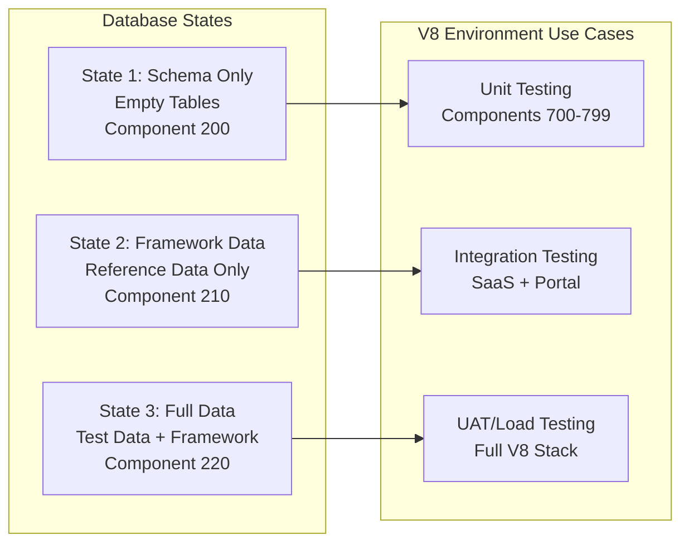
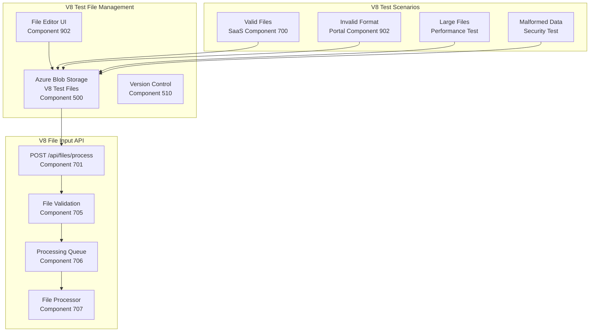

# Data Management Strategy for V8 Architecture
## Database States & File API Testing

**Version:** 8.0  
**Date:** 2025-09-22  
**Author:** Winston - System Architect  
**Components:** 200-299 (Data Layer), 400-499 (Test Environment)

---

## 📊 Overview

This document defines the V8 data management strategy across all environments, including:
- Three distinct database states (schema-only, framework-only, full)
- State switching mechanisms for hierarchical environments
- Known-good snapshots and rollback procedures
- File API testing capabilities across SaaS and Customer Portal

---

## 🗄️ V8 Database State Management

### Three-State Model for V8 Architecture



### V8 State Definitions

| State | Name | Contents | V8 Use Case | Size | Components |
|-------|------|----------|-------------|------|------------|
| **1** | Schema Only | DDL only, empty tables | Unit tests, clean slate testing | ~15 MB | 200 |
| **2** | Framework Data | Reference data, lookups, configs | Integration testing SaaS+Portal | ~150 MB | 210 |
| **3** | Full Data | Framework + test transactions | UAT, performance testing | ~2 GB | 220 |

---

## 🔄 V8 Database State Implementation

### Component 200: PostgreSQL Backup Strategy

```bash
#!/bin/bash
# scripts/data/create-db-snapshots-v8.sh
# V8 Architecture: Components 200-220

set -e

# V8 Configuration - Hierarchical Resource Groups
RG_OVERSIGHT_DEV="rg-oversight-dev-database-uksouth"
RG_OVERSIGHT_TEST="rg-oversight-test-database-uksouth"
RG_OVERSIGHT_PROD="rg-oversight-prod-database-uksouth"

DB_HOST_DEV="postgres-oversight-dev.postgres.database.azure.com"
DB_HOST_TEST="postgres-oversight-test.postgres.database.azure.com"
DB_HOST_PROD="postgres-oversight-prod.postgres.database.azure.com"

DB_NAME="oversight_v8"
DB_USER="oversight_admin"
BACKUP_DIR="/data/backups/v8"

echo "🗄️ Creating V8 Database Snapshots..."

# Create State 1: Schema Only (Component 200)
create_schema_only_backup() {
    local environment=$1
    local db_host=$2
    
    echo "Creating Schema-Only backup for $environment..."
    pg_dump \
        -h $db_host \
        -U $DB_USER \
        -d $DB_NAME \
        --schema-only \
        --no-privileges \
        --no-owner \
        -f "$BACKUP_DIR/v8-state1-schema-only-$environment.sql"
    
    # Compress and version
    gzip -c "$BACKUP_DIR/v8-state1-schema-only-$environment.sql" > \
        "$BACKUP_DIR/v8-state1-schema-only-$environment-$(date +%Y%m%d).sql.gz"
}

# Create State 2: Framework Data (Component 210)
create_framework_backup() {
    local environment=$1
    local db_host=$2
    
    echo "Creating Framework Data backup for $environment..."
    
    # V8 Framework Tables
    FRAMEWORK_TABLES=(
        "users"
        "roles"
        "permissions"
        "organizations" 
        "saas_tenants"           # SaaS Component 700
        "portal_customers"       # Customer Portal Component 902
        "frameworks"
        "framework_controls"
        "control_categories"
        "compliance_standards"
        "risk_matrices"
        "lookup_*"
        "configuration_*"
        "integration_endpoints"  # V8 Integration Layer
    )
    
    # Build table list
    TABLE_LIST=""
    for table in "${FRAMEWORK_TABLES[@]}"; do
        TABLE_LIST="$TABLE_LIST -t $table"
    done
    
    pg_dump \
        -h $db_host \
        -U $DB_USER \
        -d $DB_NAME \
        $TABLE_LIST \
        --data-only \
        -f "$BACKUP_DIR/v8-state2-framework-data-$environment.sql"
    
    # Combine with schema
    cat "$BACKUP_DIR/v8-state1-schema-only-$environment.sql" \
        "$BACKUP_DIR/v8-state2-framework-data-$environment.sql" > \
        "$BACKUP_DIR/v8-state2-framework-complete-$environment.sql"
    
    gzip -c "$BACKUP_DIR/v8-state2-framework-complete-$environment.sql" > \
        "$BACKUP_DIR/v8-state2-framework-$environment-$(date +%Y%m%d).sql.gz"
}

# Create State 3: Full Data (Component 220)
create_full_backup() {
    local environment=$1
    local db_host=$2
    
    echo "Creating Full Data backup for $environment..."
    pg_dump \
        -h $db_host \
        -U $DB_USER \
        -d $DB_NAME \
        --clean \
        --if-exists \
        -f "$BACKUP_DIR/v8-state3-full-data-$environment.sql"
    
    gzip -c "$BACKUP_DIR/v8-state3-full-data-$environment.sql" > \
        "$BACKUP_DIR/v8-state3-full-$environment-$(date +%Y%m%d).sql.gz"
}

# Create all snapshots for all V8 environments
create_all_v8_snapshots() {
    mkdir -p $BACKUP_DIR
    
    # Development Environment
    create_schema_only_backup "dev" $DB_HOST_DEV
    create_framework_backup "dev" $DB_HOST_DEV
    create_full_backup "dev" $DB_HOST_DEV
    
    # Test Environment 
    create_schema_only_backup "test" $DB_HOST_TEST
    create_framework_backup "test" $DB_HOST_TEST
    create_full_backup "test" $DB_HOST_TEST
    
    # Production Environment
    create_schema_only_backup "prod" $DB_HOST_PROD
    create_framework_backup "prod" $DB_HOST_PROD
    create_full_backup "prod" $DB_HOST_PROD
    
    # Store in Azure Blob Storage with V8 naming
    az storage blob upload-batch \
        --destination oversight-db-snapshots-v8 \
        --source "$BACKUP_DIR" \
        --pattern "*.gz"
}

# Execute
create_all_v8_snapshots
```

### Component 210: V8 Database State Switcher

```bash
#!/bin/bash
# scripts/data/switch-db-state-v8.sh
# V8 Database State Management

set -e

STATE="${1:-2}"  # Default to framework state
ENVIRONMENT="${2:-test}"  # dev, test, prod
COMPONENT="${3:-auto}"  # Component override

# V8 Hierarchical Configuration
case $ENVIRONMENT in
    dev)
        DB_HOST="postgres-oversight-dev.postgres.database.azure.com"
        DB_NAME="oversight_v8_dev"
        RESOURCE_GROUP="rg-oversight-dev-database-uksouth"
        ;;
    test)
        DB_HOST="postgres-oversight-test.postgres.database.azure.com"
        DB_NAME="oversight_v8_test" 
        RESOURCE_GROUP="rg-oversight-test-database-uksouth"
        ;;
    prod)
        DB_HOST="postgres-oversight-prod.postgres.database.azure.com"
        DB_NAME="oversight_v8_prod"
        RESOURCE_GROUP="rg-oversight-prod-database-uksouth"
        ;;
    *)
        echo "Invalid environment: $ENVIRONMENT"
        exit 1
        ;;
esac

BACKUP_DIR="/data/backups/v8"
DB_USER="oversight_admin"

# Colors
RED='\033[0;31m'
GREEN='\033[0;32m'
YELLOW='\033[1;33m'
NC='\033[0m'

log_info() { echo -e "${GREEN}[V8-INFO]${NC} $1"; }
log_warn() { echo -e "${YELLOW}[V8-WARN]${NC} $1"; }
log_error() { echo -e "${RED}[V8-ERROR]${NC} $1"; }

# V8 State switching with component tracking
switch_v8_state() {
    local state=$1
    local environment=$2
    
    log_warn "⚠️  This will replace all data in the $environment database!"
    read -p "Continue? (y/n): " -n 1 -r
    echo
    if [[ ! $REPLY =~ ^[Yy]$ ]]; then
        log_info "Operation cancelled"
        exit 0
    fi
    
    # Create backup of current state
    log_info "Backing up current V8 state..."
    pg_dump -h $DB_HOST -U $DB_USER -d $DB_NAME \
        -f "$BACKUP_DIR/previous-v8-state-$environment-$(date +%Y%m%d%H%M%S).sql"
    
    case $state in
        1)
            log_info "Switching to V8 State 1: Schema Only (Component 200)"
            restore_file="$BACKUP_DIR/v8-state1-schema-only-$environment.sql"
            component_id="200"
            ;;
        2)
            log_info "Switching to V8 State 2: Framework Data (Component 210)"
            restore_file="$BACKUP_DIR/v8-state2-framework-complete-$environment.sql"
            component_id="210"
            ;;
        3)
            log_info "Switching to V8 State 3: Full Data (Component 220)"
            restore_file="$BACKUP_DIR/v8-state3-full-data-$environment.sql"
            component_id="220"
            ;;
        *)
            log_error "Invalid state: $state (use 1, 2, or 3)"
            exit 1
            ;;
    esac
    
    # Drop and recreate database
    log_info "Resetting V8 database..."
    psql -h $DB_HOST -U $DB_USER -d postgres << EOF
DROP DATABASE IF EXISTS ${DB_NAME}_temp;
CREATE DATABASE ${DB_NAME}_temp;
EOF
    
    # Restore selected state
    log_info "Restoring V8 state $state (Component $component_id)..."
    psql -h $DB_HOST -U $DB_USER -d ${DB_NAME}_temp < "$restore_file"
    
    # Swap databases
    log_info "Swapping V8 databases..."
    psql -h $DB_HOST -U $DB_USER -d postgres << EOF
ALTER DATABASE $DB_NAME RENAME TO ${DB_NAME}_old;
ALTER DATABASE ${DB_NAME}_temp RENAME TO $DB_NAME;
DROP DATABASE ${DB_NAME}_old;
EOF
    
    # Update V8 component tracking
    log_info "Updating V8 component tracking..."
    psql -h $DB_HOST -U $DB_USER -d $DB_NAME << EOF
INSERT INTO system_info (key, value, component_id, updated_at) 
VALUES ('database_state', '$state', '$component_id', NOW())
ON CONFLICT (key) DO UPDATE SET 
    value = '$state', 
    component_id = '$component_id',
    updated_at = NOW();
EOF
    
    log_info "✅ Successfully switched to V8 state $state (Component $component_id)"
    
    # Verify V8 state
    verify_v8_state $state $environment
}

# V8 State verification with component validation
verify_v8_state() {
    local state=$1
    local environment=$2
    
    log_info "Verifying V8 database state..."
    
    case $state in
        1)
            # Check for empty tables
            COUNT=$(psql -h $DB_HOST -U $DB_USER -d $DB_NAME -t -c \
                "SELECT SUM(n_live_tup) FROM pg_stat_user_tables;")
            if [ "$COUNT" -eq 0 ]; then
                log_info "✓ V8 Schema only - all tables empty (Component 200)"
            else
                log_warn "Tables contain data: $COUNT rows"
            fi
            ;;
        2)
            # Check for V8 framework data
            FRAMEWORK_COUNT=$(psql -h $DB_HOST -U $DB_USER -d $DB_NAME -t -c \
                "SELECT COUNT(*) FROM frameworks;")
            SAAS_COUNT=$(psql -h $DB_HOST -U $DB_USER -d $DB_NAME -t -c \
                "SELECT COUNT(*) FROM saas_tenants;")
            PORTAL_COUNT=$(psql -h $DB_HOST -U $DB_USER -d $DB_NAME -t -c \
                "SELECT COUNT(*) FROM portal_customers;")
            INCIDENT_COUNT=$(psql -h $DB_HOST -U $DB_USER -d $DB_NAME -t -c \
                "SELECT COUNT(*) FROM incidents;")
            
            if [ "$FRAMEWORK_COUNT" -gt 0 ] && [ "$SAAS_COUNT" -gt 0 ] && [ "$PORTAL_COUNT" -gt 0 ] && [ "$INCIDENT_COUNT" -eq 0 ]; then
                log_info "✓ V8 Framework data present, no test data (Component 210)"
                log_info "  - Frameworks: $FRAMEWORK_COUNT"
                log_info "  - SaaS Tenants: $SAAS_COUNT"
                log_info "  - Portal Customers: $PORTAL_COUNT"
            else
                log_warn "V8 State verification warning"
            fi
            ;;
        3)
            # Check for full V8 data
            TOTAL_COUNT=$(psql -h $DB_HOST -U $DB_USER -d $DB_NAME -t -c \
                "SELECT SUM(n_live_tup) FROM pg_stat_user_tables;")
            log_info "✓ V8 Full data: $TOTAL_COUNT total rows (Component 220)"
            ;;
    esac
}

# Main execution
switch_v8_state $STATE $ENVIRONMENT
```

---

## 📁 V8 File API Management

### Component 701/902: File Processing API Architecture



### Component 705: V8 File API Test Harness

```typescript
// scripts/testing/file-api-test-harness-v8.ts
// V8 Architecture Components: 705, 706, 707

import axios from 'axios';
import FormData from 'form-data';
import fs from 'fs';
import path from 'path';

interface V8TestFile {
  name: string;
  path: string;
  expectedResult: 'success' | 'failure';
  component: string;  // V8 component ID
  modifications?: FileModification[];
}

interface FileModification {
  line: number;
  column?: number;
  newValue: string;
}

class V8FileAPITestHarness {
  private apiUrls: Record<string, string>;
  private testFilesDir: string;
  private workDir: string;
  private componentMetrics: Record<string, any> = {};
  
  constructor(environment: 'dev' | 'test' | 'prod') {
    this.apiUrls = this.getV8ApiUrls(environment);
    this.testFilesDir = '/data/test-files/v8';
    this.workDir = '/tmp/file-api-tests-v8';
  }
  
  private getV8ApiUrls(env: string): Record<string, string> {
    const baseUrls = {
      dev: {
        saas: 'http://oversight-saas-dev.azurecontainer.io/api/files/process',
        portal: 'http://oversight-portal-dev.azurecontainer.io/api/files/process'
      },
      test: {
        saas: 'http://oversight-saas-test.azurecontainer.io/api/files/process', 
        portal: 'http://oversight-portal-test.azurecontainer.io/api/files/process'
      },
      prod: {
        saas: 'https://api.oversight-saas.com/api/files/process',
        portal: 'https://api.customer-portal.com/api/files/process'
      }
    };
    return baseUrls[env];
  }
  
  // Test V8 file upload across components
  async testV8FileUpload(file: V8TestFile): Promise<void> {
    console.log(`🧪 Testing V8 file: ${file.name} (Component ${file.component})`);
    
    // Apply modifications if needed
    const filePath = file.modifications 
      ? await this.modifyFile(file)
      : file.path;
    
    // Determine API endpoint based on component
    const apiUrl = file.component.startsWith('7') 
      ? this.apiUrls.saas    // SaaS components (700-799)
      : this.apiUrls.portal; // Portal components (900-999)
    
    // Create form data
    const formData = new FormData();
    formData.append('file', fs.createReadStream(filePath));
    formData.append('processType', 'v8-standard');
    formData.append('component', file.component);
    formData.append('version', '8.0');
    
    try {
      // Upload file with V8 headers
      const response = await axios.post(apiUrl, formData, {
        headers: {
          ...formData.getHeaders(),
          'Authorization': `Bearer ${process.env.API_TOKEN}`,
          'X-V8-Component': file.component,
          'X-V8-Version': '8.0'
        },
        maxContentLength: Infinity,
        maxBodyLength: Infinity,
        timeout: 30000
      });
      
      // Record metrics for component
      this.recordComponentMetric(file.component, 'success', response.data);
      
      // Check result
      if (file.expectedResult === 'success') {
        if (response.status === 200) {
          console.log(`✅ ${file.name} (${file.component}): Passed`);
          console.log(`   Processing ID: ${response.data.processingId}`);
          console.log(`   Component: ${response.data.component}`);
        } else {
          console.error(`❌ ${file.name} (${file.component}): Failed - Expected success, got ${response.status}`);
        }
      } else {
        console.error(`❌ ${file.name} (${file.component}): Should have failed but succeeded`);
      }
      
    } catch (error) {
      this.recordComponentMetric(file.component, 'failure', error);
      
      if (file.expectedResult === 'failure') {
        console.log(`✅ ${file.name} (${file.component}): Correctly failed`);
      } else {
        console.error(`❌ ${file.name} (${file.component}): Unexpected failure`, error.message);
      }
    }
  }
  
  private recordComponentMetric(component: string, status: string, data: any) {
    if (!this.componentMetrics[component]) {
      this.componentMetrics[component] = {
        successes: 0,
        failures: 0,
        responses: []
      };
    }
    
    this.componentMetrics[component][status === 'success' ? 'successes' : 'failures']++;
    this.componentMetrics[component].responses.push({
      timestamp: new Date().toISOString(),
      status,
      data: status === 'success' ? data : data.message
    });
  }
  
  // Run all V8 tests
  async runAllV8Tests(): Promise<void> {
    const v8TestFiles: V8TestFile[] = [
      // SaaS Component Tests (700-799)
      {
        name: 'saas_incident_data.csv',
        path: '/data/test-files/v8/saas/valid_incident_data.csv',
        expectedResult: 'success',
        component: '701'
      },
      {
        name: 'saas_malformed_headers.csv',
        path: '/data/test-files/v8/saas/valid_incident_data.csv',
        expectedResult: 'failure',
        component: '705',
        modifications: [{
          line: 0,
          newValue: 'INVALID,V8,HEADERS'
        }]
      },
      {
        name: 'saas_large_dataset.csv',
        path: '/data/test-files/v8/saas/large_dataset.csv',
        expectedResult: 'success',
        component: '707'
      },
      
      // Customer Portal Component Tests (900-999)
      {
        name: 'portal_customer_data.xlsx',
        path: '/data/test-files/v8/portal/customer_data.xlsx',
        expectedResult: 'success',
        component: '902'
      },
      {
        name: 'portal_invalid_format.txt',
        path: '/data/test-files/v8/portal/invalid.txt',
        expectedResult: 'failure',
        component: '905'
      },
      
      // Cross-component Integration Tests
      {
        name: 'integration_saas_to_portal.json',
        path: '/data/test-files/v8/integration/saas_to_portal.json',
        expectedResult: 'success',
        component: '800' // Integration layer
      }
    ];
    
    console.log('🚀 Starting V8 File API Tests...\n');
    
    for (const file of v8TestFiles) {
      await this.testV8FileUpload(file);
      await this.wait(2000); // Rate limiting
    }
    
    console.log('\n📊 V8 Test Component Metrics:');
    for (const [component, metrics] of Object.entries(this.componentMetrics)) {
      console.log(`Component ${component}: ${metrics.successes} successes, ${metrics.failures} failures`);
    }
    
    console.log('\n✅ V8 test run complete');
  }
  
  private wait(ms: number): Promise<void> {
    return new Promise(resolve => setTimeout(resolve, ms));
  }
}

// Run V8 tests
const harness = new V8FileAPITestHarness('test');
harness.runAllV8Tests();
```

---

## 🔄 V8 Jenkins Pipeline Integration

### Component 400: Database State in V8 Pipeline

```groovy
// Jenkinsfile additions for V8 database state management

stage('Prepare V8 Test Database') {
    steps {
        script {
            def dbState = params.DATABASE_STATE ?: '2'  // Default to framework
            def environment = params.ENVIRONMENT ?: 'test'
            def component = getComponentFromState(dbState)
            
            sh """
                echo "Setting V8 database to state ${dbState} (Component ${component})"
                ./scripts/data/switch-db-state-v8.sh ${dbState} ${environment}
            """
            
            // Validate V8 component state
            sh """
                echo "Validating V8 component state..."
                ./scripts/data/validate-v8-state.sh ${dbState} ${environment}
            """
        }
    }
}

stage('V8 File API Testing') {
    parallel {
        stage('SaaS Components (700-799)') {
            steps {
                sh 'npm run test:v8:file-api:saas'
            }
        }
        stage('Portal Components (900-999)') {
            steps {
                sh 'npm run test:v8:file-api:portal'
            }
        }
        stage('Integration Layer (800-899)') {
            steps {
                sh 'npm run test:v8:file-api:integration'
            }
        }
        stage('Performance Tests') {
            steps {
                sh 'npm run test:v8:file-api:performance'
            }
        }
    }
    post {
        always {
            // Archive V8 component metrics
            archiveArtifacts artifacts: '**/v8-component-metrics.json'
            publishHTML([
                reportDir: 'reports',
                reportFiles: 'v8-file-api-report.html',
                reportName: 'V8 File API Test Report'
            ])
        }
    }
}

stage('V8 Restore Known-Good') {
    when {
        expression { currentBuild.result == 'FAILURE' }
    }
    steps {
        sh './scripts/data/restore-known-good-v8.sh'
    }
}

def getComponentFromState(state) {
    def stateToComponent = [
        '1': '200',  // Schema Only
        '2': '210',  // Framework Data  
        '3': '220'   // Full Data
    ]
    return stateToComponent[state] ?: '210'
}
```

---

## 🎯 V8 Test Data Scenarios

### Scenario Matrix for V8 Architecture

| Scenario | DB State | Test Files | V8 Components | Purpose |
|----------|----------|------------|---------------|---------|
| Unit Tests | Schema Only (200) | Mock files | 700-799 (SaaS) | Isolated component testing |
| Integration | Framework (210) | Small valid files | 700-799 + 900-999 | SaaS + Portal integration |
| Load Testing | Full Data (220) | Large files (100MB+) | All components | Performance validation |
| Security | Framework (210) | Malicious payloads | 705, 905 (Security) | Security scanning |
| UAT | Full Data (220) | Production-like files | Full V8 stack | User acceptance |
| Regression | Framework (210) | Previous bug files | Affected components | Prevent regressions |

---

## 📊 V8 Known-Good Management

### V8 Snapshot Schedule

```yaml
Daily V8 Snapshots:
  - Time: 02:00 UTC
  - Retention: 7 days
  - States: All (200, 210, 220)
  - Environments: dev, test, prod
  - Storage: oversight-db-snapshots-v8

Weekly V8 Snapshots:
  - Day: Sunday
  - Time: 03:00 UTC
  - Retention: 4 weeks
  - States: Framework (210), Full (220)
  - Components: Core data components

Release V8 Snapshots:
  - Trigger: Before each V8 release
  - Retention: Permanent
  - States: All (200, 210, 220)
  - Naming: v8-release-{version}-state{n}-{component}.sql.gz
```

### V8 Restore Procedures

```bash
#!/bin/bash
# scripts/data/restore-known-good-v8.sh
# V8 Known-Good State Restoration

# Restore to last known-good V8 state
restore_v8_known_good() {
    local state=${1:-2}  # Default to framework state
    local environment=${2:-test}
    local component=$(get_component_from_state $state)
    
    echo "🔄 Restoring V8 to last known-good state $state (Component $component) in $environment"
    
    # Find latest known-good backup
    LATEST_BACKUP=$(az storage blob list \
        --container-name oversight-db-snapshots-v8 \
        --prefix "v8-known-good-state${state}-${environment}" \
        --query "sort_by([].{name:name, modified:properties.lastModified}, &modified)[-1].name" \
        -o tsv)
    
    if [ -z "$LATEST_BACKUP" ]; then
        echo "❌ ERROR: No V8 known-good backup found for state $state in $environment"
        exit 1
    fi
    
    # Download backup
    az storage blob download \
        --container-name oversight-db-snapshots-v8 \
        --name "$LATEST_BACKUP" \
        --file "/tmp/${LATEST_BACKUP}"
    
    # Decompress
    gunzip "/tmp/${LATEST_BACKUP}"
    
    # Restore with V8 validation
    local db_host=$(get_v8_db_host $environment)
    psql -h $db_host -U oversight_admin -d oversight_v8_${environment} < "/tmp/${LATEST_BACKUP%.gz}"
    
    # Update V8 component tracking
    psql -h $db_host -U oversight_admin -d oversight_v8_${environment} << EOF
INSERT INTO system_info (key, value, component_id, updated_at) 
VALUES ('restore_source', '$LATEST_BACKUP', '$component', NOW());
EOF
    
    echo "✅ V8 restored to known-good: $LATEST_BACKUP (Component $component)"
}

get_component_from_state() {
    case $1 in
        1) echo "200" ;;
        2) echo "210" ;;
        3) echo "220" ;;
        *) echo "210" ;;
    esac
}

get_v8_db_host() {
    case $1 in
        dev) echo "postgres-oversight-dev.postgres.database.azure.com" ;;
        test) echo "postgres-oversight-test.postgres.database.azure.com" ;;
        prod) echo "postgres-oversight-prod.postgres.database.azure.com" ;;
        *) echo "postgres-oversight-test.postgres.database.azure.com" ;;
    esac
}
```

---

## 🚀 V8 Quick Commands

### For V8 Developers

```bash
# Switch V8 database states
./scripts/data/switch-db-state-v8.sh 1 test  # Schema only (Component 200)
./scripts/data/switch-db-state-v8.sh 2 test  # Framework data (Component 210) 
./scripts/data/switch-db-state-v8.sh 3 test  # Full data (Component 220)

# Test V8 file API
npm run test:v8:file-api                # Run all V8 file API tests
npm run test:v8:file-api:saas          # Test SaaS components (700-799)
npm run test:v8:file-api:portal        # Test Portal components (900-999)

# Restore V8 known-good
./scripts/data/restore-known-good-v8.sh 2 test  # Restore framework state

# Create V8 test file
./scripts/testing/create-v8-test-file.sh --type incident --records 1000 --component 701
```

### For V8 DevOps

```bash
# Create V8 snapshots
./scripts/data/create-all-v8-snapshots.sh

# Schedule V8 snapshot job
kubectl apply -f k8s/cronjobs/v8-db-snapshot.yaml

# Verify V8 backups
az storage blob list \
    --container-name oversight-db-snapshots-v8 \
    --query "[?contains(name, 'v8-state')].{name:name, size:properties.contentLength, component:metadata.component}" \
    -o table

# Monitor V8 component health
./scripts/monitoring/check-v8-component-health.sh
```

---

## 📊 V8 Monitoring & Alerts

### V8 Component Metrics

```yaml
Database Health (Components 200-220):
  - Connection pool usage per component
  - Query performance by component
  - Disk usage per environment
  - Backup success rate
  - Component state consistency

File API (Components 701, 705-707, 902, 905):
  - Upload success rate per component
  - Processing time by component
  - Queue depth per service
  - Error rate by component type

V8 Integration (Components 800-899):
  - Cross-component communication
  - Data flow between SaaS and Portal
  - Integration endpoint health
  - Message queue metrics

Alerts:
  - V8 database state change (audit)
  - Component backup failure
  - File processing timeout per component
  - Storage quota exceeded
  - Cross-component communication failure
```

---

## 🔐 V8 Security Considerations

1. **Database Credentials**: Stored in Azure Key Vault with V8 naming
2. **File Sanitization**: All uploaded files scanned per component
3. **SQL Injection Protection**: Parameterized queries across all components
4. **Access Control**: Role-based access to V8 state switching
5. **Audit Trail**: All V8 state changes logged with component tracking
6. **Encryption**: Data encrypted at rest and in transit
7. **Component Isolation**: Separate security contexts per component layer

---

This comprehensive V8 data management strategy ensures reliable testing with proper state management across the integrated SaaS and Customer Portal codebase, with full component traceability and hierarchical environment support.