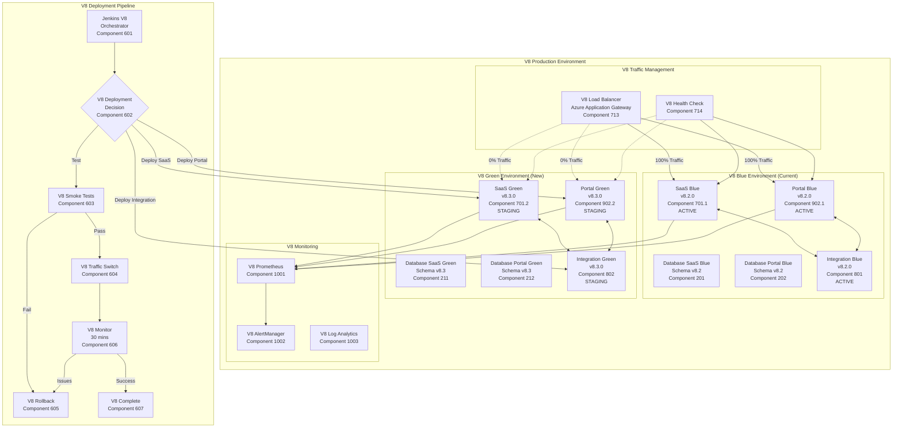

# Deployment Strategy V8
## Integrated Blue-Green & Multi-Track Deployment for SaaS & Customer Portal

**Version:** 8.0  
**Date:** 2025-09-22  
**Author:** Winston - System Architect  
**Components:** 600-699 (Deployment Layer), 700-799 (SaaS), 900-999 (Portal)

---

## 🔄 Overview

This document defines the comprehensive V8 deployment strategy combining:
1. **Blue-Green Deployment** - Zero-downtime production deployments with automated rollback
2. **Multi-Track Deployment** - Integrated SaaS (/home/jez/code/SaaS) and Customer Portal (/home/jez/code/customer-portal-v2) deployment
3. **Component-Aware Deployment** - V8 hierarchical resource group deployment
4. **Cross-Component Validation** - Ensuring SaaS and Portal compatibility during deployment

---

## 🏗️ V8 Blue-Green Architecture Overview



---

## 📋 V8 Implementation Components

### Component 600: V8 Infrastructure Setup

```yaml
V8 Azure Resources:
  Resource Groups (Hierarchical):
    Production:
      - rg-oversight-prod-saas-uksouth
      - rg-oversight-prod-portal-uksouth  
      - rg-oversight-prod-integration-uksouth
      - rg-oversight-prod-database-uksouth
      - rg-oversight-prod-monitoring-uksouth
    
    Staging:
      - rg-oversight-staging-saas-uksouth
      - rg-oversight-staging-portal-uksouth
      - rg-oversight-staging-integration-uksouth
      - rg-oversight-staging-database-uksouth
    
    Test:
      - rg-oversight-test-saas-uksouth
      - rg-oversight-test-portal-uksouth
      - rg-oversight-test-integration-uksouth
      - rg-oversight-test-database-uksouth

  App Service Plans:
    - asp-oversight-v8-saas-blue-prod
    - asp-oversight-v8-saas-green-prod
    - asp-oversight-v8-portal-blue-prod
    - asp-oversight-v8-portal-green-prod
  
  App Services:
    SaaS:
      - app-oversight-saas-v8-blue (Component 701.1)
      - app-oversight-saas-v8-green (Component 701.2)
    Portal:
      - app-oversight-portal-v8-blue (Component 902.1)
      - app-oversight-portal-v8-green (Component 902.2)
    Integration:
      - app-oversight-integration-v8-blue (Component 801)
      - app-oversight-integration-v8-green (Component 802)
  
  Application Gateway:
    - Backend Pools:
      - v8-saas-blue-backend-pool
      - v8-saas-green-backend-pool
      - v8-portal-blue-backend-pool  
      - v8-portal-green-backend-pool
    - Routing Rules:
      - v8-production-routing-rule (weighted)
    
  Databases:
    - PostgreSQL Flexible Server (per component)
    - Read replicas for Green environment
    
  Key Vaults (Hierarchical):
    - kv-oversight-prod-saas-uksouth
    - kv-oversight-prod-portal-uksouth
    - kv-oversight-prod-integration-uksouth
```

### Component 201-202: V8 Database Strategy

```sql
-- V8 Database Migration Strategy
-- Both SaaS and Portal environments share compatible schema approach

-- V8.3.0 Migration (backward compatible with V8.2.0)
BEGIN TRANSACTION;

-- V8 SaaS Schema Updates
-- Component 201: SaaS Database
ALTER TABLE saas_tenants ADD COLUMN IF NOT EXISTS v8_features JSONB;
ALTER TABLE saas_users ADD COLUMN IF NOT EXISTS v8_preferences JSONB;

-- Component 202: Portal Database
ALTER TABLE portal_customers ADD COLUMN IF NOT EXISTS v8_integration_config JSONB;
ALTER TABLE portal_users ADD COLUMN IF NOT EXISTS v8_portal_settings JSONB;

-- V8 Cross-component integration table
CREATE TABLE IF NOT EXISTS v8_integration_sync (
    id SERIAL PRIMARY KEY,
    saas_component_id VARCHAR(10) NOT NULL,
    portal_component_id VARCHAR(10) NOT NULL,
    sync_data JSONB,
    last_sync TIMESTAMP DEFAULT NOW(),
    sync_status VARCHAR(20) DEFAULT 'pending'
);

-- V8 Component tracking
CREATE TABLE IF NOT EXISTS v8_component_deployments (
    id SERIAL PRIMARY KEY,
    component_id VARCHAR(10) NOT NULL,
    version VARCHAR(20) NOT NULL,
    environment VARCHAR(20) NOT NULL,
    deployment_status VARCHAR(20) DEFAULT 'deployed',
    deployed_at TIMESTAMP DEFAULT NOW(),
    blue_green_slot VARCHAR(10) NOT NULL -- 'blue' or 'green'
);

-- Don't remove old columns yet (wait for next V8 release)
-- ALTER TABLE users DROP COLUMN old_v7_feature; -- DO NOT RUN YET

COMMIT;

-- Run after successful V8 deployment
-- UPDATE saas_tenants SET v8_features = '{"enabled": true}' WHERE v8_features IS NULL;
-- UPDATE portal_customers SET v8_integration_config = '{"sync_enabled": true}' WHERE v8_integration_config IS NULL;
```

---

## 🚀 V8 Deployment Process

### Component 601: Phase 1 - Pre-Deployment Checks

```bash
#!/bin/bash
# scripts/deployment/v8-pre-deployment-checks.sh
# V8 Pre-deployment validation

set -e

echo "🔍 Running V8 pre-deployment checks..."

V8_SAAS_VERSION="${1:-v8.3.0}"
V8_PORTAL_VERSION="${2:-v8.3.0}"
V8_INTEGRATION_VERSION="${3:-v8.3.0}"

# V8 Hierarchical resource groups
RG_PROD_SAAS="rg-oversight-prod-saas-uksouth"
RG_PROD_PORTAL="rg-oversight-prod-portal-uksouth"
RG_PROD_INTEGRATION="rg-oversight-prod-integration-uksouth"

# 1. Check V8 Blue environment health
check_v8_blue_health() {
    echo "🔍 Checking V8 Blue environment health..."
    
    # Check SaaS Blue
    saas_response=$(curl -s -o /dev/null -w "%{http_code}" https://app-oversight-saas-v8-blue.azurewebsites.net/health)
    if [ $saas_response -eq 200 ]; then
        echo "✅ V8 SaaS Blue environment healthy"
    else
        echo "❌ V8 SaaS Blue environment unhealthy (HTTP $saas_response)"
        return 1
    fi
    
    # Check Portal Blue  
    portal_response=$(curl -s -o /dev/null -w "%{http_code}" https://app-oversight-portal-v8-blue.azurewebsites.net/health)
    if [ $portal_response -eq 200 ]; then
        echo "✅ V8 Portal Blue environment healthy"
    else
        echo "❌ V8 Portal Blue environment unhealthy (HTTP $portal_response)"
        return 1
    fi
    
    # Check Integration Blue
    integration_response=$(curl -s -o /dev/null -w "%{http_code}" https://app-oversight-integration-v8-blue.azurewebsites.net/health)
    if [ $integration_response -eq 200 ]; then
        echo "✅ V8 Integration Blue environment healthy"
    else
        echo "❌ V8 Integration Blue environment unhealthy (HTTP $integration_response)"
        return 1
    fi
}

# 2. Verify V8 Green environment is ready
prepare_v8_green_environment() {
    echo "🔧 Preparing V8 Green environment..."
    
    # Stop SaaS Green
    az webapp stop --name app-oversight-saas-v8-green --resource-group $RG_PROD_SAAS
    az webapp config appsettings set --name app-oversight-saas-v8-green \
        --resource-group $RG_PROD_SAAS \
        --settings V8_DEPLOYMENT_VERSION="$V8_SAAS_VERSION" V8_COMPONENT_ID="701.2" V8_SLOT="green"
    
    # Stop Portal Green
    az webapp stop --name app-oversight-portal-v8-green --resource-group $RG_PROD_PORTAL
    az webapp config appsettings set --name app-oversight-portal-v8-green \
        --resource-group $RG_PROD_PORTAL \
        --settings V8_DEPLOYMENT_VERSION="$V8_PORTAL_VERSION" V8_COMPONENT_ID="902.2" V8_SLOT="green"
    
    # Stop Integration Green
    az webapp stop --name app-oversight-integration-v8-green --resource-group $RG_PROD_INTEGRATION
    az webapp config appsettings set --name app-oversight-integration-v8-green \
        --resource-group $RG_PROD_INTEGRATION \
        --settings V8_DEPLOYMENT_VERSION="$V8_INTEGRATION_VERSION" V8_COMPONENT_ID="802" V8_SLOT="green"
}

# 3. V8 Database backup
backup_v8_databases() {
    echo "💾 Creating V8 database backups..."
    timestamp=$(date +%Y%m%d_%H%M%S)
    
    # Backup SaaS database
    az postgres flexible-server backup create \
        --resource-group rg-oversight-prod-database-uksouth \
        --name postgres-oversight-saas-v8-prod \
        --backup-name "v8-pre-deploy-saas-$timestamp"
    
    # Backup Portal database
    az postgres flexible-server backup create \
        --resource-group rg-oversight-prod-database-uksouth \
        --name postgres-oversight-portal-v8-prod \
        --backup-name "v8-pre-deploy-portal-$timestamp"
}

# 4. Check V8 codebase compatibility
check_v8_codebase_compatibility() {
    echo "🔗 Checking V8 codebase compatibility..."
    
    # Check SaaS codebase
    if [ -d "/home/jez/code/SaaS" ]; then
        cd /home/jez/code/SaaS
        SAAS_COMMIT=$(git rev-parse HEAD)
        echo "V8 SaaS commit: $SAAS_COMMIT"
    else
        echo "❌ V8 SaaS codebase not found at /home/jez/code/SaaS"
        return 1
    fi
    
    # Check Portal codebase
    if [ -d "/home/jez/code/customer-portal-v2" ]; then
        cd /home/jez/code/customer-portal-v2
        PORTAL_COMMIT=$(git rev-parse HEAD)
        echo "V8 Portal commit: $PORTAL_COMMIT"
    else
        echo "❌ V8 Portal codebase not found at /home/jez/code/customer-portal-v2"
        return 1
    fi
    
    # Validate V8 component compatibility
    node scripts/v8-compatibility-check.js --saas-commit="$SAAS_COMMIT" --portal-commit="$PORTAL_COMMIT"
}

# Execute V8 checks
echo "🚀 Starting V8 pre-deployment checks for versions:"
echo "  SaaS: $V8_SAAS_VERSION"
echo "  Portal: $V8_PORTAL_VERSION"
echo "  Integration: $V8_INTEGRATION_VERSION"

check_v8_blue_health || exit 1
prepare_v8_green_environment
backup_v8_databases
check_v8_codebase_compatibility || exit 1

echo "✅ V8 pre-deployment checks completed successfully"
```

### Component 602: Phase 2 - Deploy to V8 Green

```groovy
// Jenkinsfile V8 deployment stage
pipeline {
    agent any
    
    environment {
        V8_SAAS_REPO = '/home/jez/code/SaaS'
        V8_PORTAL_REPO = '/home/jez/code/customer-portal-v2'
        V8_ACR_NAME = 'acrsecdevopsdev'
    }
    
    parameters {
        string(name: 'V8_SAAS_VERSION', defaultValue: 'v8.3.0', description: 'V8 SaaS Version')
        string(name: 'V8_PORTAL_VERSION', defaultValue: 'v8.3.0', description: 'V8 Portal Version')
        string(name: 'V8_INTEGRATION_VERSION', defaultValue: 'v8.3.0', description: 'V8 Integration Version')
        choice(name: 'V8_DEPLOYMENT_STRATEGY', choices: ['blue-green', 'canary'], description: 'V8 Deployment Strategy')
        boolean(name: 'V8_AUTO_ROLLBACK', defaultValue: true, description: 'V8 Auto Rollback on Failure')
    }
    
    stages {
        stage('V8 Pre-Deployment') {
            steps {
                sh './scripts/deployment/v8-pre-deployment-checks.sh ${V8_SAAS_VERSION} ${V8_PORTAL_VERSION} ${V8_INTEGRATION_VERSION}'
            }
        }
        
        stage('Build V8 Components') {
            parallel {
                stage('Build V8 SaaS') {
                    steps {
                        script {
                            sh '''
                                cd ${V8_SAAS_REPO}
                                
                                # Build V8 SaaS Docker image
                                docker build \
                                    --build-arg V8_VERSION=${V8_SAAS_VERSION} \
                                    --build-arg V8_COMPONENT_ID=701.2 \
                                    --build-arg V8_SLOT=green \
                                    -t ${V8_ACR_NAME}.azurecr.io/oversight-saas-v8:${V8_SAAS_VERSION} \
                                    -f Dockerfile.v8 \
                                    .
                                
                                # Push to ACR
                                az acr login --name ${V8_ACR_NAME}
                                docker push ${V8_ACR_NAME}.azurecr.io/oversight-saas-v8:${V8_SAAS_VERSION}
                            '''
                        }
                    }
                }
                
                stage('Build V8 Portal') {
                    steps {
                        script {
                            sh '''
                                cd ${V8_PORTAL_REPO}
                                
                                # Build V8 Portal Docker image
                                docker build \
                                    --build-arg V8_VERSION=${V8_PORTAL_VERSION} \
                                    --build-arg V8_COMPONENT_ID=902.2 \
                                    --build-arg V8_SLOT=green \
                                    -t ${V8_ACR_NAME}.azurecr.io/oversight-portal-v8:${V8_PORTAL_VERSION} \
                                    -f Dockerfile.portal.v8 \
                                    .
                                
                                # Push to ACR
                                docker push ${V8_ACR_NAME}.azurecr.io/oversight-portal-v8:${V8_PORTAL_VERSION}
                            '''
                        }
                    }
                }
                
                stage('Build V8 Integration') {
                    steps {
                        script {
                            sh '''
                                # Build V8 Integration service
                                docker build \
                                    --build-arg V8_VERSION=${V8_INTEGRATION_VERSION} \
                                    --build-arg V8_COMPONENT_ID=802 \
                                    --build-arg V8_SLOT=green \
                                    -t ${V8_ACR_NAME}.azurecr.io/oversight-integration-v8:${V8_INTEGRATION_VERSION} \
                                    -f integration/Dockerfile.v8 \
                                    .
                                
                                docker push ${V8_ACR_NAME}.azurecr.io/oversight-integration-v8:${V8_INTEGRATION_VERSION}
                            '''
                        }
                    }
                }
            }
        }
        
        stage('Deploy V8 to Green') {
            parallel {
                stage('Deploy V8 SaaS Green') {
                    steps {
                        script {
                            sh '''
                                # Deploy V8 SaaS to Green slot
                                az webapp config container set \
                                    --name app-oversight-saas-v8-green \
                                    --resource-group rg-oversight-prod-saas-uksouth \
                                    --docker-custom-image-name ${V8_ACR_NAME}.azurecr.io/oversight-saas-v8:${V8_SAAS_VERSION}
                                
                                # Start V8 SaaS Green
                                az webapp start --name app-oversight-saas-v8-green --resource-group rg-oversight-prod-saas-uksouth
                            '''
                        }
                    }
                }
                
                stage('Deploy V8 Portal Green') {
                    steps {
                        script {
                            sh '''
                                # Deploy V8 Portal to Green slot
                                az webapp config container set \
                                    --name app-oversight-portal-v8-green \
                                    --resource-group rg-oversight-prod-portal-uksouth \
                                    --docker-custom-image-name ${V8_ACR_NAME}.azurecr.io/oversight-portal-v8:${V8_PORTAL_VERSION}
                                
                                # Start V8 Portal Green
                                az webapp start --name app-oversight-portal-v8-green --resource-group rg-oversight-prod-portal-uksouth
                            '''
                        }
                    }
                }
                
                stage('Deploy V8 Integration Green') {
                    steps {
                        script {
                            sh '''
                                # Deploy V8 Integration to Green slot
                                az webapp config container set \
                                    --name app-oversight-integration-v8-green \
                                    --resource-group rg-oversight-prod-integration-uksouth \
                                    --docker-custom-image-name ${V8_ACR_NAME}.azurecr.io/oversight-integration-v8:${V8_INTEGRATION_VERSION}
                                
                                # Start V8 Integration Green
                                az webapp start --name app-oversight-integration-v8-green --resource-group rg-oversight-prod-integration-uksouth
                            '''
                        }
                    }
                }
            }
        }
        
        stage('V8 Database Migration') {
            steps {
                script {
                    sh '''
                        # Wait for V8 services to be ready
                        sleep 60
                        
                        # Run V8 database migrations
                        echo "Running V8 SaaS database migration..."
                        az webapp ssh \
                            --name app-oversight-saas-v8-green \
                            --resource-group rg-oversight-prod-saas-uksouth \
                            --command "npm run migrate:v8:production"
                        
                        echo "Running V8 Portal database migration..."
                        az webapp ssh \
                            --name app-oversight-portal-v8-green \
                            --resource-group rg-oversight-prod-portal-uksouth \
                            --command "npm run migrate:v8:production"
                    '''
                }
            }
        }
    }
}
```

### Component 603: Phase 3 - V8 Smoke Tests

```javascript
// scripts/deployment/v8-smoke-tests.js
const axios = require('axios');
const { performance } = require('perf_hooks');

const v8GreenUrls = {
    saas: 'https://app-oversight-saas-v8-green-internal.azurewebsites.net',
    portal: 'https://app-oversight-portal-v8-green-internal.azurewebsites.net',
    integration: 'https://app-oversight-integration-v8-green-internal.azurewebsites.net'
};

const v8SmokeTests = async () => {
    console.log('🧪 Running V8 Smoke Tests...');
    
    const v8Tests = [
        // V8 SaaS Tests (Component 701.2)
        { 
            name: 'V8 SaaS Health Check', 
            component: '701.2',
            endpoint: '/health', 
            service: 'saas',
            expectedStatus: 200 
        },
        { 
            name: 'V8 SaaS API Version', 
            component: '701.2',
            endpoint: '/api/v8/version', 
            service: 'saas',
            expectedStatus: 200 
        },
        { 
            name: 'V8 SaaS Database Connection', 
            component: '701.2',
            endpoint: '/api/v8/db-check', 
            service: 'saas',
            expectedStatus: 200 
        },
        { 
            name: 'V8 SaaS Auth Service', 
            component: '701.2',
            endpoint: '/api/v8/auth/status', 
            service: 'saas',
            expectedStatus: 200 
        },
        { 
            name: 'V8 SaaS Tenant Management', 
            component: '701.2',
            endpoint: '/api/v8/saas/tenants/health', 
            service: 'saas',
            expectedStatus: 200 
        },
        
        // V8 Portal Tests (Component 902.2)
        { 
            name: 'V8 Portal Health Check', 
            component: '902.2',
            endpoint: '/health', 
            service: 'portal',
            expectedStatus: 200 
        },
        { 
            name: 'V8 Portal API Version', 
            component: '902.2',
            endpoint: '/api/v8/version', 
            service: 'portal',
            expectedStatus: 200 
        },
        { 
            name: 'V8 Portal Database Connection', 
            component: '902.2',
            endpoint: '/api/v8/db-check', 
            service: 'portal',
            expectedStatus: 200 
        },
        { 
            name: 'V8 Portal Customer Service', 
            component: '902.2',
            endpoint: '/api/v8/portal/customers/health', 
            service: 'portal',
            expectedStatus: 200 
        },
        
        // V8 Integration Tests (Component 802)
        { 
            name: 'V8 Integration Health Check', 
            component: '802',
            endpoint: '/health', 
            service: 'integration',
            expectedStatus: 200 
        },
        { 
            name: 'V8 Integration SaaS Connection', 
            component: '802',
            endpoint: '/api/v8/integration/saas/ping', 
            service: 'integration',
            expectedStatus: 200 
        },
        { 
            name: 'V8 Integration Portal Connection', 
            component: '802',
            endpoint: '/api/v8/integration/portal/ping', 
            service: 'integration',
            expectedStatus: 200 
        },
        
        // V8 Cross-Component Tests
        { 
            name: 'V8 SaaS to Portal Integration', 
            component: '701.2+902.2',
            endpoint: '/api/v8/saas/integration/portal-ping', 
            service: 'saas',
            expectedStatus: 200 
        },
        { 
            name: 'V8 Portal to SaaS Integration', 
            component: '902.2+701.2',
            endpoint: '/api/v8/portal/integration/saas-ping', 
            service: 'portal',
            expectedStatus: 200 
        }
    ];
    
    const results = [];
    let passedTests = 0;
    let failedTests = 0;
    
    for (const test of v8Tests) {
        const startTime = performance.now();
        
        try {
            console.log(`🧪 Running: ${test.name} (Component ${test.component})`);
            
            const response = await axios.get(`${v8GreenUrls[test.service]}${test.endpoint}`, {
                timeout: 10000,
                headers: {
                    'X-V8-Component': test.component,
                    'X-V8-Test': 'smoke-test',
                    'User-Agent': 'V8-Smoke-Test/8.0'
                }
            });
            
            const duration = performance.now() - startTime;
            
            if (response.status === test.expectedStatus) {
                console.log(`✅ ${test.name} passed (${duration.toFixed(2)}ms)`);
                console.log(`   Component: ${test.component}`);
                console.log(`   Response: ${JSON.stringify(response.data).substring(0, 100)}...`);
                
                results.push({
                    test: test.name,
                    component: test.component,
                    service: test.service,
                    status: 'passed',
                    duration: duration,
                    response: response.data
                });
                passedTests++;
            } else {
                throw new Error(`Expected ${test.expectedStatus}, got ${response.status}`);
            }
        } catch (error) {
            const duration = performance.now() - startTime;
            console.error(`❌ ${test.name} failed (${duration.toFixed(2)}ms): ${error.message}`);
            console.error(`   Component: ${test.component}`);
            
            results.push({
                test: test.name,
                component: test.component,
                service: test.service,
                status: 'failed',
                duration: duration,
                error: error.message
            });
            failedTests++;
        }
        
        // Small delay between tests
        await new Promise(resolve => setTimeout(resolve, 1000));
    }
    
    // Generate V8 smoke test report
    const report = {
        timestamp: new Date().toISOString(),
        v8_version: '8.0',
        total_tests: v8Tests.length,
        passed_tests: passedTests,
        failed_tests: failedTests,
        success_rate: ((passedTests / v8Tests.length) * 100).toFixed(2),
        components_tested: [...new Set(v8Tests.map(t => t.component))],
        services_tested: [...new Set(v8Tests.map(t => t.service))],
        results: results
    };
    
    // Save report
    require('fs').writeFileSync(
        `v8-smoke-test-report-${Date.now()}.json`,
        JSON.stringify(report, null, 2)
    );
    
    console.log('\n📊 V8 Smoke Test Summary:');
    console.log(`Total Tests: ${report.total_tests}`);
    console.log(`Passed: ${report.passed_tests}`);
    console.log(`Failed: ${report.failed_tests}`);
    console.log(`Success Rate: ${report.success_rate}%`);
    console.log(`Components Tested: ${report.components_tested.join(', ')}`);
    console.log(`Services Tested: ${report.services_tested.join(', ')}`);
    
    if (failedTests > 0) {
        console.error('\n❌ V8 Smoke tests failed');
        process.exit(1);
    } else {
        console.log('\n✅ All V8 smoke tests passed');
    }
};

// Execute V8 smoke tests
v8SmokeTests().catch(error => {
    console.error('Fatal error running V8 smoke tests:', error);
    process.exit(1);
});
```

### Component 604: Phase 4 - V8 Traffic Switch

```bash
#!/bin/bash
# scripts/deployment/v8-traffic-switch.sh
# V8 Component-aware traffic switching

set -e

V8_PERCENTAGE="${1:-10}"
V8_COMPONENT="${2:-all}"  # all, saas, portal

# V8 Hierarchical resource groups
RG_PROD_SECURITY="rg-oversight-prod-security-uksouth"
APP_GW_NAME="appgw-oversight-v8-prod"

echo "🔄 Switching ${V8_PERCENTAGE}% traffic to V8 Green (Component: $V8_COMPONENT)"

v8_switch_traffic() {
    local percentage=$1
    local component=$2
    
    case $component in
        saas)
            echo "Switching V8 SaaS traffic to Green..."
            az network application-gateway rule update \
                --gateway-name $APP_GW_NAME \
                --resource-group $RG_PROD_SECURITY \
                --name v8-saas-routing-rule \
                --backend-pool v8-saas-green-backend-pool \
                --rule-type WeightedRouting \
                --weight $percentage
            ;;
            
        portal)
            echo "Switching V8 Portal traffic to Green..."
            az network application-gateway rule update \
                --gateway-name $APP_GW_NAME \
                --resource-group $RG_PROD_SECURITY \
                --name v8-portal-routing-rule \
                --backend-pool v8-portal-green-backend-pool \
                --rule-type WeightedRouting \
                --weight $percentage
            ;;
            
        all)
            echo "Switching ALL V8 traffic to Green..."
            # Switch SaaS
            az network application-gateway rule update \
                --gateway-name $APP_GW_NAME \
                --resource-group $RG_PROD_SECURITY \
                --name v8-saas-routing-rule \
                --backend-pool v8-saas-green-backend-pool \
                --rule-type WeightedRouting \
                --weight $percentage
            
            # Switch Portal
            az network application-gateway rule update \
                --gateway-name $APP_GW_NAME \
                --resource-group $RG_PROD_SECURITY \
                --name v8-portal-routing-rule \
                --backend-pool v8-portal-green-backend-pool \
                --rule-type WeightedRouting \
                --weight $percentage
            ;;
            
        *)
            echo "Invalid V8 component: $component (use saas, portal, or all)"
            exit 1
            ;;
    esac
}

# V8 Gradual rollout with component monitoring
v8_gradual_rollout() {
    local target_percentage=$1
    local component=$2
    
    # Start with small percentage
    local current_percentage=10
    
    while [ $current_percentage -le $target_percentage ]; do
        echo "🔄 V8 Traffic switch: ${current_percentage}% (Component: $component)"
        v8_switch_traffic $current_percentage $component
        
        # Monitor for 5 minutes at each stage
        echo "📊 Monitoring V8 ${component} for 5 minutes..."
        sleep 300
        
        # Check V8 component health
        if ! ./scripts/monitoring/check-v8-component-health.sh $component; then
            echo "❌ V8 ${component} health check failed - stopping rollout"
            return 1
        fi
        
        # Increase percentage
        if [ $current_percentage -lt 50 ]; then
            current_percentage=$((current_percentage + 15))
        else
            current_percentage=$((current_percentage + 25))
        fi
        
        # Don't exceed target
        if [ $current_percentage -gt $target_percentage ]; then
            current_percentage=$target_percentage
        fi
    done
    
    echo "✅ V8 ${component} traffic switch to ${target_percentage}% complete"
}

# Execute V8 gradual rollout
if [ "$V8_PERCENTAGE" -eq 100 ]; then
    v8_gradual_rollout 100 $V8_COMPONENT
else
    v8_switch_traffic $V8_PERCENTAGE $V8_COMPONENT
fi
```

### Component 605: Phase 5 - V8 Monitoring & Validation

```yaml
# v8-monitoring-config.yaml
v8_alerts:
  - name: v8_high_error_rate
    condition: v8_error_rate > 1%
    duration: 5m
    action: rollback
    components: ["701.2", "902.2", "802"]
    
  - name: v8_high_latency
    condition: v8_p95_latency > 500ms
    duration: 5m
    action: alert_team
    components: ["701.2", "902.2"]
    
  - name: v8_low_success_rate
    condition: v8_success_rate < 99%
    duration: 5m
    action: rollback
    components: ["701.2", "902.2", "802"]
    
  - name: v8_memory_spike
    condition: v8_memory_usage > 80%
    duration: 10m
    action: alert_team
    components: ["701.2", "902.2", "802"]
    
  - name: v8_cross_component_failure
    condition: v8_integration_success_rate < 95%
    duration: 3m
    action: rollback
    components: ["802"]

v8_monitoring_period: 30m
v8_auto_rollback: true
v8_component_isolation: true
```

### Component 605: Phase 6 - V8 Rollback (if needed)

```bash
#!/bin/bash
# scripts/deployment/v8-automated-rollback.sh
# V8 Component-aware automated rollback

set -e

ROLLBACK_REASON="${1:-monitoring_alert}"
AFFECTED_COMPONENTS="${2:-all}"  # all, saas, portal, integration

echo "🔄 Initiating V8 rollback due to: $ROLLBACK_REASON"
echo "🔄 Affected components: $AFFECTED_COMPONENTS"

# V8 Hierarchical resource groups
RG_PROD_SECURITY="rg-oversight-prod-security-uksouth"
RG_PROD_SAAS="rg-oversight-prod-saas-uksouth"
RG_PROD_PORTAL="rg-oversight-prod-portal-uksouth"
RG_PROD_INTEGRATION="rg-oversight-prod-integration-uksouth"

APP_GW_NAME="appgw-oversight-v8-prod"

v8_rollback() {
    echo "🔄 Rolling back V8 to Blue environment..."
    
    case $AFFECTED_COMPONENTS in
        saas|all)
            echo "🔄 Rolling back V8 SaaS to Blue..."
            # Immediate V8 SaaS traffic switch
            az network application-gateway rule update \
                --gateway-name $APP_GW_NAME \
                --resource-group $RG_PROD_SECURITY \
                --name v8-saas-routing-rule \
                --backend-pool v8-saas-blue-backend-pool \
                --weight 100
            
            # Stop V8 SaaS Green environment
            az webapp stop --name app-oversight-saas-v8-green --resource-group $RG_PROD_SAAS
            ;;
    esac
    
    case $AFFECTED_COMPONENTS in
        portal|all)
            echo "🔄 Rolling back V8 Portal to Blue..."
            # Immediate V8 Portal traffic switch
            az network application-gateway rule update \
                --gateway-name $APP_GW_NAME \
                --resource-group $RG_PROD_SECURITY \
                --name v8-portal-routing-rule \
                --backend-pool v8-portal-blue-backend-pool \
                --weight 100
            
            # Stop V8 Portal Green environment
            az webapp stop --name app-oversight-portal-v8-green --resource-group $RG_PROD_PORTAL
            ;;
    esac
    
    case $AFFECTED_COMPONENTS in
        integration|all)
            echo "🔄 Rolling back V8 Integration to Blue..."
            # Stop V8 Integration Green environment
            az webapp stop --name app-oversight-integration-v8-green --resource-group $RG_PROD_INTEGRATION
            ;;
    esac
    
    # V8 Rollback database if needed
    if [ "$ROLLBACK_REASON" = "database_migration_failure" ]; then
        echo "🔄 Rolling back V8 database changes..."
        # Database rollback would be implemented here
        # This is typically more complex and may require manual intervention
    fi
    
    # Notify V8 team
    curl -X POST $V8_SLACK_WEBHOOK -d "{
        \"text\": \"⚠️ V8 Production deployment rolled back to Blue environment\",
        \"attachments\": [{
            \"color\": \"danger\",
            \"fields\": [
                {\"title\": \"Reason\", \"value\": \"$ROLLBACK_REASON\", \"short\": true},
                {\"title\": \"Components\", \"value\": \"$AFFECTED_COMPONENTS\", \"short\": true},
                {\"title\": \"Timestamp\", \"value\": \"$(date -Iseconds)\", \"short\": true}
            ]
        }]
    }"
    
    # Create V8 incident
    az boards work-item create \
        --title "V8 Production Rollback $(date)" \
        --type Bug \
        --priority 1 \
        --description "V8 Automated rollback triggered due to $ROLLBACK_REASON affecting components: $AFFECTED_COMPONENTS" \
        --tags "v8,rollback,production,$AFFECTED_COMPONENTS"
    
    echo "✅ V8 Rollback complete"
}

# Check if V8 rollback needed
if [ "$1" == "auto" ]; then
    v8_rollback
else
    echo "Manual V8 rollback initiated"
    read -p "Are you sure you want to rollback V8 $AFFECTED_COMPONENTS components? (y/n): " -n 1 -r
    echo
    if [[ $REPLY =~ ^[Yy]$ ]]; then
        v8_rollback
    else
        echo "V8 Rollback cancelled"
    fi
fi
```

### Component 607: Phase 7 - V8 Finalization

```bash
#!/bin/bash
# scripts/deployment/v8-finalize-deployment.sh
# V8 Deployment finalization

set -e

V8_SAAS_VERSION="${1:-v8.3.0}"
V8_PORTAL_VERSION="${2:-v8.3.0}"
V8_INTEGRATION_VERSION="${3:-v8.3.0}"

echo "🏁 Finalizing V8 deployment..."

v8_finalize() {
    echo "Finalizing V8 deployment..."
    
    # Update V8 DNS if needed (typically not required for App Gateway)
    echo "📝 Updating V8 deployment records..."
    
    # Clean up V8 Blue environment (keep for rollback window)
    echo "⏰ Scheduling V8 Blue cleanup in 24 hours..."
    at now + 24 hours <<EOF
    echo "🧹 Cleaning up V8 Blue environment..."
    az webapp stop --name app-oversight-saas-v8-blue --resource-group rg-oversight-prod-saas-uksouth
    az webapp stop --name app-oversight-portal-v8-blue --resource-group rg-oversight-prod-portal-uksouth  
    az webapp stop --name app-oversight-integration-v8-blue --resource-group rg-oversight-prod-integration-uksouth
EOF
    
    # Update V8 deployment records
    echo "📊 Recording V8 deployment completion..."
    cat > /tmp/v8-deployment-record.json << EOF
{
    "v8_deployment": {
        "saas_version": "$V8_SAAS_VERSION",
        "portal_version": "$V8_PORTAL_VERSION", 
        "integration_version": "$V8_INTEGRATION_VERSION",
        "timestamp": "$(date -Iseconds)",
        "environment": "green",
        "status": "active",
        "components": {
            "saas": "701.2",
            "portal": "902.2",
            "integration": "802"
        },
        "codebases": {
            "saas_commit": "$(cd /home/jez/code/SaaS && git rev-parse HEAD)",
            "portal_commit": "$(cd /home/jez/code/customer-portal-v2 && git rev-parse HEAD)"
        }
    }
}
EOF
    
    # Store deployment record
    az storage blob upload \
        --container-name v8-deployment-records \
        --file /tmp/v8-deployment-record.json \
        --name "v8-deployment-$(date +%Y%m%d_%H%M%S).json" \
        --account-name oversightstoragev8
    
    # Update V8 component tracking in database
    echo "📊 Updating V8 component tracking..."
    psql -h postgres-oversight-prod.postgres.database.azure.com \
         -U oversight_admin \
         -d oversight_v8_prod << EOF
INSERT INTO v8_component_deployments (component_id, version, environment, deployment_status, blue_green_slot) VALUES
('701.2', '$V8_SAAS_VERSION', 'production', 'active', 'green'),
('902.2', '$V8_PORTAL_VERSION', 'production', 'active', 'green'),
('802', '$V8_INTEGRATION_VERSION', 'production', 'active', 'green');

UPDATE v8_component_deployments 
SET deployment_status = 'inactive' 
WHERE component_id IN ('701.1', '902.1', '801') 
AND environment = 'production';
EOF
    
    # Send V8 success notification
    curl -X POST $V8_SLACK_WEBHOOK -d "{
        \"text\": \"✅ V8 Production deployment completed successfully!\",
        \"attachments\": [{
            \"color\": \"good\",
            \"fields\": [
                {\"title\": \"SaaS Version\", \"value\": \"$V8_SAAS_VERSION\", \"short\": true},
                {\"title\": \"Portal Version\", \"value\": \"$V8_PORTAL_VERSION\", \"short\": true},
                {\"title\": \"Integration Version\", \"value\": \"$V8_INTEGRATION_VERSION\", \"short\": true},
                {\"title\": \"Environment\", \"value\": \"Green (Active)\", \"short\": true}
            ]
        }]
    }"
    
    # Update V8 monitoring dashboards
    echo "📊 Updating V8 monitoring dashboards..."
    curl -X POST http://grafana.oversight.io/api/annotations \
        -H "Authorization: Bearer $GRAFANA_API_KEY" \
        -H "Content-Type: application/json" \
        -d "{
            \"text\": \"V8 Production deployment completed\",
            \"tags\": [\"v8\", \"deployment\", \"production\"],
            \"time\": $(date +%s)000
        }"
    
    echo "✅ V8 Deployment finalization complete"
}

v8_finalize
```

---

## 📊 V8 Monitoring Dashboard

```yaml
V8 Grafana Dashboard:
  - V8 Traffic Distribution:
    - Blue vs Green percentage by component
    - Request rate per V8 environment
    - Component-specific traffic patterns
    
  - V8 Performance Metrics:
    - Response time (p50, p95, p99) per component
    - Error rate by component
    - Success rate by component
    - Cross-component communication latency
    
  - V8 Resource Usage:
    - CPU utilization per component
    - Memory usage per component
    - Database connections per component
    
  - V8 Business Metrics:
    - Active users per component
    - Transaction rate per component
    - Feature adoption per component
    - SaaS tenant activity
    - Portal customer activity
```

---

## 🔄 V8 Automated Pipeline

```groovy
// Complete V8 Jenkins Pipeline
pipeline {
    agent any
    
    parameters {
        choice(name: 'V8_DEPLOYMENT_STRATEGY', choices: ['blue-green', 'canary'], description: 'V8 Deployment Strategy')
        string(name: 'V8_SAAS_VERSION', defaultValue: 'latest', description: 'V8 SaaS Version')
        string(name: 'V8_PORTAL_VERSION', defaultValue: 'latest', description: 'V8 Portal Version')
        string(name: 'V8_INTEGRATION_VERSION', defaultValue: 'latest', description: 'V8 Integration Version')
        boolean(name: 'V8_AUTO_ROLLBACK', defaultValue: true, description: 'V8 Auto Rollback')
        choice(name: 'V8_COMPONENTS', choices: ['all', 'saas', 'portal', 'integration'], description: 'Components to Deploy')
    }
    
    environment {
        V8_SAAS_REPO = '/home/jez/code/SaaS'
        V8_PORTAL_REPO = '/home/jez/code/customer-portal-v2'
    }
    
    stages {
        stage('V8 Pre-Deployment') {
            steps {
                sh './scripts/deployment/v8-pre-deployment-checks.sh ${V8_SAAS_VERSION} ${V8_PORTAL_VERSION} ${V8_INTEGRATION_VERSION}'
            }
        }
        
        stage('V8 Build Components') {
            when {
                expression { params.V8_COMPONENTS == 'all' || params.V8_COMPONENTS == 'saas' }
            }
            parallel {
                stage('Build V8 SaaS') {
                    steps {
                        script {
                            sh '''
                                cd ${V8_SAAS_REPO}
                                docker build -t oversight-saas-v8:${V8_SAAS_VERSION} -f Dockerfile.v8 .
                                docker tag oversight-saas-v8:${V8_SAAS_VERSION} acrsecdevopsdev.azurecr.io/oversight-saas-v8:${V8_SAAS_VERSION}
                                docker push acrsecdevopsdev.azurecr.io/oversight-saas-v8:${V8_SAAS_VERSION}
                            '''
                        }
                    }
                }
                stage('Build V8 Portal') {
                    when {
                        expression { params.V8_COMPONENTS == 'all' || params.V8_COMPONENTS == 'portal' }
                    }
                    steps {
                        script {
                            sh '''
                                cd ${V8_PORTAL_REPO}
                                docker build -t oversight-portal-v8:${V8_PORTAL_VERSION} -f Dockerfile.portal.v8 .
                                docker tag oversight-portal-v8:${V8_PORTAL_VERSION} acrsecdevopsdev.azurecr.io/oversight-portal-v8:${V8_PORTAL_VERSION}
                                docker push acrsecdevopsdev.azurecr.io/oversight-portal-v8:${V8_PORTAL_VERSION}
                            '''
                        }
                    }
                }
            }
        }
        
        stage('V8 Deploy to Green') {
            steps {
                script {
                    def deploymentScript = params.V8_COMPONENTS == 'all' ? 
                        './scripts/deployment/v8-deploy-all-green.sh' : 
                        "./scripts/deployment/v8-deploy-${params.V8_COMPONENTS}-green.sh"
                    
                    sh "${deploymentScript} ${V8_SAAS_VERSION} ${V8_PORTAL_VERSION} ${V8_INTEGRATION_VERSION}"
                }
            }
        }
        
        stage('V8 Smoke Tests') {
            steps {
                sh 'npm run test:v8-smoke'
            }
        }
        
        stage('V8 Gradual Traffic Switch') {
            steps {
                script {
                    for (percentage in [10, 25, 50, 75, 100]) {
                        sh "./scripts/deployment/v8-traffic-switch.sh ${percentage} ${params.V8_COMPONENTS}"
                        sh "sleep 300"
                        
                        def metrics = sh(
                            script: "./scripts/monitoring/check-v8-component-health.sh ${params.V8_COMPONENTS}",
                            returnStatus: true
                        )
                        
                        if (metrics != 0 && params.V8_AUTO_ROLLBACK) {
                            sh "./scripts/deployment/v8-automated-rollback.sh auto ${params.V8_COMPONENTS}"
                            error "V8 Deployment failed - rolled back"
                        }
                    }
                }
            }
        }
        
        stage('V8 Monitor') {
            steps {
                timeout(time: 30, unit: 'MINUTES') {
                    sh "./scripts/monitoring/v8-monitor-deployment.sh ${params.V8_COMPONENTS}"
                }
            }
        }
        
        stage('V8 Finalize') {
            when {
                expression { currentBuild.result == 'SUCCESS' }
            }
            steps {
                sh './scripts/deployment/v8-finalize-deployment.sh ${V8_SAAS_VERSION} ${V8_PORTAL_VERSION} ${V8_INTEGRATION_VERSION}'
            }
        }
    }
    
    post {
        failure {
            sh "./scripts/deployment/v8-automated-rollback.sh auto ${params.V8_COMPONENTS}"
        }
        success {
            echo "V8 Deployment successful - Green is now active for components: ${params.V8_COMPONENTS}"
            
            // Update V8 component status
            sh """
                echo "Updating V8 component deployment status..."
                curl -X POST http://oversight-api.com/api/v8/deployments \
                    -H "Content-Type: application/json" \
                    -d '{
                        "components": "${params.V8_COMPONENTS}",
                        "saas_version": "${V8_SAAS_VERSION}",
                        "portal_version": "${V8_PORTAL_VERSION}",
                        "integration_version": "${V8_INTEGRATION_VERSION}",
                        "status": "deployed",
                        "environment": "green"
                    }'
            """
        }
        always {
            // Archive V8 deployment artifacts
            archiveArtifacts artifacts: '**/v8-*-report-*.json'
            
            // Publish V8 deployment report
            publishHTML([
                reportDir: 'reports',
                reportFiles: 'v8-deployment-report.html',
                reportName: 'V8 Deployment Report'
            ])
        }
    }
}
```

---

## 🚨 V8 Rollback Triggers

### V8 Automatic Rollback Conditions
1. **V8 Error rate > 1%** for 5 minutes (any component)
2. **V8 P95 latency > 500ms** for 5 minutes (SaaS or Portal)
3. **V8 Success rate < 99%** for 5 minutes (any component)
4. **V8 Failed health checks** (3 consecutive for any component)
5. **V8 Database connection errors** (any component)
6. **V8 Out of memory errors** (any component)
7. **V8 Cross-component integration failure** (success rate < 95%)

### V8 Manual Rollback
```bash
# V8 Emergency rollback command
./scripts/deployment/v8-emergency-rollback.sh

# V8 Rollback with reason and specific components
./scripts/deployment/v8-rollback.sh --reason "Performance degradation" --components "saas,portal"

# V8 Rollback single component
./scripts/deployment/v8-rollback.sh --reason "SaaS database issues" --components "saas"
```

---

## ✅ V8 Benefits

1. **Zero Downtime** - Traffic switch is instant for both SaaS and Portal
2. **Component-Aware Rollback** - Can rollback individual components
3. **Cross-Component Validation** - Ensures SaaS-Portal compatibility
4. **Risk Mitigation** - Test both components in production safely
5. **Gradual Rollout** - Detect issues early with component isolation
6. **Full Validation** - Production environment testing for both codebases
7. **Hierarchical Management** - Proper resource group organization

---

## ⚠️ V8 Considerations

1. **Database Migrations** - Must be backward compatible across components
2. **Session Management** - Handle user sessions during component switches
3. **Cache Warming** - Pre-warm both SaaS and Portal Green environments
4. **Cost** - Running duplicate environments for all components
5. **Complexity** - More components to manage and coordinate
6. **Cross-Component Dependencies** - Ensure integration layer compatibility
7. **Codebase Synchronization** - Keep SaaS and Portal deployments aligned

---

## 🚀 V8 Quick Commands

### V8 Deployment Commands
```bash
# Deploy all V8 components
./scripts/deployment/v8-deploy-all.sh v8.3.0

# Deploy only V8 SaaS
./scripts/deployment/v8-deploy-saas.sh v8.3.0

# Deploy only V8 Portal  
./scripts/deployment/v8-deploy-portal.sh v8.3.0

# Check V8 deployment status
./scripts/deployment/v8-status.sh

# Monitor V8 health
./scripts/monitoring/v8-health-check.sh all
```

### V8 Traffic Management
```bash
# Switch 50% traffic to V8 Green (all components)
./scripts/deployment/v8-traffic-switch.sh 50 all

# Switch 100% SaaS traffic to Green
./scripts/deployment/v8-traffic-switch.sh 100 saas

# Switch 100% Portal traffic to Green
./scripts/deployment/v8-traffic-switch.sh 100 portal

# Check V8 traffic distribution
./scripts/monitoring/v8-traffic-status.sh
```

### V8 Rollback Commands
```bash
# Emergency V8 rollback (all components)
./scripts/deployment/v8-emergency-rollback.sh

# Rollback specific V8 component
./scripts/deployment/v8-rollback.sh --components saas

# Check V8 rollback history
./scripts/deployment/v8-rollback-history.sh
```

---

This comprehensive V8 deployment strategy ensures safe, reliable production deployments with instant rollback capability across the integrated SaaS (/home/jez/code/SaaS) and Customer Portal (/home/jez/code/customer-portal-v2) architecture, with full component traceability and hierarchical resource group management.