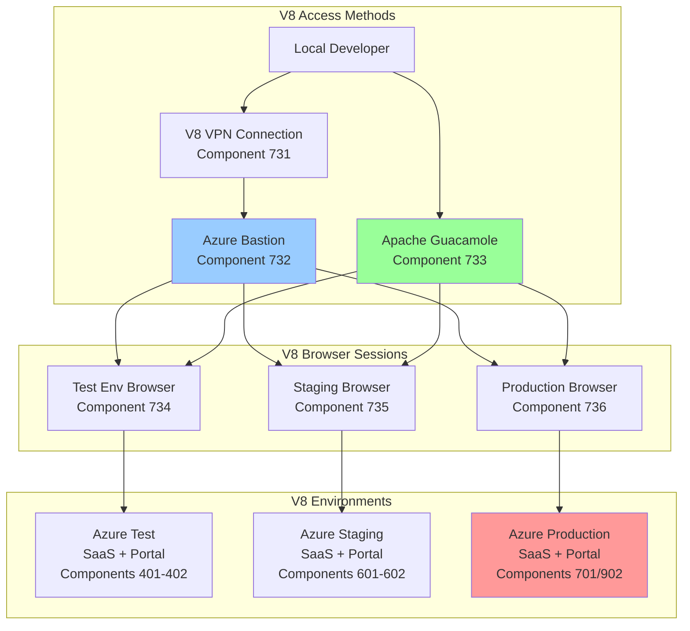

# Security Strategy V8
## Comprehensive Security Framework for Integrated SaaS & Customer Portal Architecture

**Version:** 8.0  
**Date:** 2025-09-22  
**Author:** Winston - System Architect  
**Components:** 730-739 (Security Layer), 700-799 (SaaS), 900-999 (Portal)

---

## 🔒 Overview

This document defines the comprehensive V8 security strategy including:
1. Human browser access in Azure Test, staging, and production environments
2. Developer console log access across all V8 environments  
3. Kali Linux penetration testing for integrated SaaS and Portal
4. WAF traffic flow with component-aware IP restrictions
5. Network security architecture for V8 hierarchical resource groups
6. Security testing and troubleshooting capabilities

---

## 🌐 V8 Human Browser Access Architecture



---

## 🔒 V8 SaaS Traffic Flow - All Through WAF

```mermaid
graph LR
    subgraph "Internet Traffic"
        USER[User Traffic]
        ADMIN[Admin Traffic]
        API[API Clients]
        PORTAL_USER[Portal Users]
    end
    
    subgraph "V8 Network Security Layer [730]"
        IP_ALLOW[731: V8 IP Allowlist<br/>Component-Aware]
        DDoS[732: DDoS Protection<br/>Standard + Advanced]
        GEO_FILTER[733: Geo Filtering<br/>V8 Rules]
    end
    
    USER --> IP_ALLOW
    ADMIN --> IP_ALLOW
    API --> IP_ALLOW
    PORTAL_USER --> IP_ALLOW
    
    IP_ALLOW --> DDoS
    DDoS --> GEO_FILTER
    GEO_FILTER --> WAF
    
    subgraph "V8 WAF & App Gateway [713-714]"
        WAF[714: V8 WAF<br/>OWASP Rules<br/>Component Rules<br/>SaaS + Portal]
        APP_GW[713: Application Gateway<br/>172.178.54.100<br/>V8 Load Balancer]
        
        WAF --> APP_GW
    end
    
    subgraph "V8 Backend Pool [734]"
        APP_GW --> LB[735: V8 Load Balancer]
        LB --> SAAS1[701.1: SaaS App Service 1]
        LB --> SAAS2[701.2: SaaS App Service 2]
        LB --> PORTAL1[902.1: Portal App Service 1]
        LB --> PORTAL2[902.2: Portal App Service 2]
        LB --> INTEGRATION[800.1: Integration Service]
    end
    
    %% NO DIRECT ACCESS
    USER -.->|❌ BLOCKED| SAAS1
    USER -.->|❌ BLOCKED| PORTAL1
    PORTAL_USER -.->|❌ BLOCKED| SAAS1
    
    style WAF fill:#ff6b6b,color:#fff
    style IP_ALLOW fill:#ffcc00
    style LB fill:#99ff99
```



---

## 🖥️ V8 Browser Access Implementation

### Component 734: V8 Azure Test Environment Browser Access

```yaml
# v8-azure-test-browser-deployment.yaml
apiVersion: apps/v1
kind: Deployment
metadata:
  name: v8-browser-access-test
  namespace: test-environment-v8
  labels:
    component: "734"
    version: "8.0"
spec:
  replicas: 2
  selector:
    matchLabels:
      app: v8-browser-access
  template:
    metadata:
      labels:
        app: v8-browser-access
        component: "734"
    spec:
      containers:
      # V8 SaaS application container
      - name: oversight-saas-v8
        image: acrsecdevopsdev.azurecr.io/oversight-saas-v8:latest
        ports:
        - containerPort: 3000
        env:
        - name: V8_COMPONENT_ID
          value: "700"
        - name: V8_INTEGRATION_PORTAL_ENDPOINT
          value: "http://oversight-portal-v8:3001"
        
      # V8 Portal application container
      - name: oversight-portal-v8
        image: acrsecdevopsdev.azurecr.io/oversight-portal-v8:latest
        ports:
        - containerPort: 3001
        env:
        - name: V8_COMPONENT_ID
          value: "902"
        - name: V8_INTEGRATION_SAAS_ENDPOINT
          value: "http://oversight-saas-v8:3000"
        
      # V8 Browser access container with VNC
      - name: v8-browser-vnc
        image: selenium/standalone-chrome-debug:latest
        ports:
        - containerPort: 4444  # Selenium
        - containerPort: 5900  # VNC
        environment:
        - name: VNC_NO_PASSWORD
          value: "1"
        - name: SE_NODE_MAX_SESSIONS
          value: "8"
        - name: SE_NODE_SESSION_TIMEOUT
          value: "3600"
        - name: SCREEN_WIDTH
          value: "1920"
        - name: SCREEN_HEIGHT
          value: "1080"
        - name: V8_BROWSER_MODE
          value: "integrated"
        resources:
          requests:
            memory: "4Gi"
            cpu: "2"
          limits:
            memory: "8Gi"
            cpu: "4"
            
      # V8 NoVNC web interface
      - name: v8-novnc
        image: theasp/novnc:latest
        ports:
        - containerPort: 8080
        environment:
        - name: DISPLAY_WIDTH
          value: "1920"
        - name: DISPLAY_HEIGHT
          value: "1080"
        - name: RUN_XTERM
          value: "yes"
        - name: V8_NOVNC_TITLE
          value: "V8 Oversight Browser Access"
        command:
        - /bin/bash
        - -c
        - |
          # Start V8 NoVNC server with custom title
          websockify --web /usr/share/novnc 8080 localhost:5900

---
apiVersion: v1
kind: Service
metadata:
  name: v8-browser-access-service
  namespace: test-environment-v8
  labels:
    component: "734"
spec:
  type: LoadBalancer
  ports:
  - name: saas-app
    port: 3000
    targetPort: 3000
  - name: portal-app
    port: 3001
    targetPort: 3001
  - name: selenium
    port: 4444
    targetPort: 4444
  - name: vnc
    port: 5900
    targetPort: 5900
  - name: novnc
    port: 8080
    targetPort: 8080
  selector:
    app: v8-browser-access
```

### Component 733: V8 Apache Guacamole Setup

```yaml
# docker-compose.v8-guacamole.yml
version: '3.8'

services:
  v8-guacd:
    image: guacamole/guacd:latest
    restart: always
    networks:
      - v8-guac-network
    volumes:
      - v8-guacd-drive:/drive:rw
      - v8-guacd-record:/record:rw
    environment:
      - GUACD_LOG_LEVEL=info

  v8-postgres:
    image: postgres:14-alpine
    restart: always
    environment:
      POSTGRES_DB: guacamole_v8_db
      POSTGRES_USER: guacamole_v8_user
      POSTGRES_PASSWORD: ${V8_GUAC_DB_PASSWORD}
    networks:
      - v8-guac-network
    volumes:
      - v8-postgres-data:/var/lib/postgresql/data

  v8-guacamole:
    image: guacamole/guacamole:latest
    restart: always
    ports:
      - "8080:8080"
    environment:
      GUACD_HOSTNAME: v8-guacd
      POSTGRES_DATABASE: guacamole_v8_db
      POSTGRES_HOSTNAME: v8-postgres
      POSTGRES_PASSWORD: ${V8_GUAC_DB_PASSWORD}
      POSTGRES_USER: guacamole_v8_user
      RECORDING_SEARCH_PATH: /record
      GUACAMOLE_HOME: /etc/guacamole
    networks:
      - v8-guac-network
    depends_on:
      - v8-guacd
      - v8-postgres
    volumes:
      - ./v8-guacamole-config:/etc/guacamole

networks:
  v8-guac-network:
    driver: bridge

volumes:
  v8-guacd-drive:
  v8-guacd-record:
  v8-postgres-data:
```

### Component 735: V8 Browser Access Configuration Script

```bash
#!/bin/bash
# scripts/access/setup-v8-browser-access.sh
# V8 Browser Access Setup

set -e

ENVIRONMENT="${1:-test}"
ACCESS_TYPE="${2:-vnc}"  # vnc, rdp, or ssh
COMPONENT="${3:-734}"

echo "🌐 Setting up V8 browser access for $ENVIRONMENT environment (Component $COMPONENT)"

case $ENVIRONMENT in
  test)
    # V8 Azure Test Environment
    echo "Configuring V8 Azure Test browser access..."
    
    # Deploy V8 browser access pod
    kubectl apply -f v8-azure-test-browser-deployment.yaml
    
    # Get V8 access URL
    BROWSER_URL=$(kubectl get service v8-browser-access-service \
      -n test-environment-v8 \
      -o jsonpath='{.status.loadBalancer.ingress[0].ip}')
    
    echo "V8 Browser VNC Access: vnc://$BROWSER_URL:5900"
    echo "V8 Web Browser Access: http://$BROWSER_URL:8080"
    echo "V8 SaaS Application: http://$BROWSER_URL:3000"
    echo "V8 Portal Application: http://$BROWSER_URL:3001"
    ;;
    
  staging)
    # V8 Staging Environment
    echo "Configuring V8 staging browser access..."
    
    # Add V8 browser container to staging docker-compose
    cat >> docker-compose.v8-staging.yml << 'EOF'
  v8-browser-access:
    image: selenium/standalone-chrome-debug:latest
    ports:
      - "4444:4444"
      - "5900:5900"
      - "7900:7900"  # NoVNC
    environment:
      - SE_VNC_NO_PASSWORD=1
      - SE_NODE_MAX_SESSIONS=8
      - V8_BROWSER_MODE=staging
    shm_size: 4gb
    networks:
      - v8-staging-network
EOF
    
    docker-compose -f docker-compose.v8-staging.yml up -d v8-browser-access
    echo "V8 Staging Browser Access: http://localhost:7900"
    ;;
    
  production)
    # V8 Production
    echo "Configuring V8 production browser access..."
    
    # Use Azure Bastion for V8 Production
    az network bastion create \
      --name bastion-v8-prod \
      --public-ip-address bastion-v8-pip \
      --resource-group rg-oversight-prod-security-uksouth \
      --vnet-name vnet-oversight-v8-prod \
      --location uksouth
    
    echo "V8 Production Browser Access via Azure Portal Bastion"
    ;;
esac

# Configure V8 Guacamole connections
configure_v8_guacamole() {
  echo "Adding V8 $ENVIRONMENT to Guacamole..."
  
  # Create V8 connection configuration
  cat > v8-guacamole-$ENVIRONMENT.json << EOF
{
  "name": "V8 $ENVIRONMENT Browser Access",
  "protocol": "$ACCESS_TYPE",
  "parameters": {
    "hostname": "$BROWSER_URL",
    "port": "5900",
    "password": "${V8_VNC_PASSWORD:-}",
    "recording-path": "/record",
    "recording-name": "v8-$ENVIRONMENT-\${GUAC_DATE}-\${GUAC_USERNAME}",
    "enable-clipboard": "true",
    "enable-drive": "true"
  },
  "attributes": {
    "guac-full-screen": "true",
    "guac-resize-method": "display-update"
  }
}
EOF
  
  # Import to V8 Guacamole
  curl -X POST http://localhost:8080/api/session/data/postgresql/connections \
    -H "Content-Type: application/json" \
    -d @v8-guacamole-$ENVIRONMENT.json
}

configure_v8_guacamole

echo "✅ V8 Browser access configured for $ENVIRONMENT (Component $COMPONENT)"
```

---

## 📝 V8 Console Log Access

### Component 736: V8 Centralized Logging Architecture

```yaml
# v8-logging-stack.yaml
apiVersion: v1
kind: ConfigMap
metadata:
  name: v8-fluent-bit-config
  namespace: v8-logging
data:
  fluent-bit.conf: |
    [SERVICE]
        Flush         5
        Log_Level     info
        Daemon        off
        Parsers_File  parsers.conf

    [INPUT]
        Name              tail
        Path              /var/log/containers/*v8*.log
        Parser            v8_docker
        Tag               v8.kube.*
        Refresh_Interval  5
        Skip_Long_Lines   On

    [FILTER]
        Name                kubernetes
        Match               v8.kube.*
        Kube_URL            https://kubernetes.default.svc:443
        Kube_CA_File        /var/run/secrets/kubernetes.io/serviceaccount/ca.crt
        Kube_Token_File     /var/run/secrets/kubernetes.io/serviceaccount/token
        Kube_Tag_Prefix     v8.kube.var.log.containers.
        Merge_Log           On
        K8S-Logging.Parser  On
        K8S-Logging.Exclude Off

    [FILTER]
        Name                modify
        Match               v8.*
        Add                 v8_version 8.0
        Add                 v8_architecture integrated

    [OUTPUT]
        Name              azure_loganalytics
        Match             v8.*
        Customer_ID       ${V8_LOG_ANALYTICS_WORKSPACE_ID}
        Shared_Key        ${V8_LOG_ANALYTICS_WORKSPACE_KEY}
        Log_Type          V8ContainerLog
        Time_Key          time
        Time_Generated    true

    [OUTPUT]
        Name              stdout
        Match             v8.*
        Format            json_lines

  parsers.conf: |
    [PARSER]
        Name        v8_docker
        Format      json
        Time_Key    time
        Time_Format %Y-%m-%dT%H:%M:%S.%L
        Time_Keep   On
---
apiVersion: apps/v1
kind: DaemonSet
metadata:
  name: v8-fluent-bit
  namespace: v8-logging
spec:
  selector:
    matchLabels:
      name: v8-fluent-bit
  template:
    metadata:
      labels:
        name: v8-fluent-bit
        component: "736"
    spec:
      containers:
      - name: v8-fluent-bit
        image: fluent/fluent-bit:latest
        env:
        - name: V8_LOG_ANALYTICS_WORKSPACE_ID
          valueFrom:
            secretKeyRef:
              name: v8-log-analytics
              key: workspace-id
        - name: V8_LOG_ANALYTICS_WORKSPACE_KEY
          valueFrom:
            secretKeyRef:
              name: v8-log-analytics
              key: workspace-key
        volumeMounts:
        - name: varlog
          mountPath: /var/log
        - name: varlibdockercontainers
          mountPath: /var/lib/docker/containers
          readOnly: true
        - name: v8-config
          mountPath: /fluent-bit/etc/
      volumes:
      - name: varlog
        hostPath:
          path: /var/log
      - name: varlibdockercontainers
        hostPath:
          path: /var/lib/docker/containers
      - name: v8-config
        configMap:
          name: v8-fluent-bit-config
```

### Component 737: V8 Developer Console Access Tool

```typescript
// scripts/console/v8-dev-console-access.ts
import { WebSocket } from 'ws';
import { createInterface } from 'readline';
import chalk from 'chalk';
import blessed from 'blessed';

export class V8DevConsoleAccess {
  private v8Environments = {
    test: {
      saas: 'wss://console-saas-v8-test.oversight.io/ws',
      portal: 'wss://console-portal-v8-test.oversight.io/ws'
    },
    staging: {
      saas: 'wss://console-saas-v8-staging.oversight.io/ws',
      portal: 'wss://console-portal-v8-staging.oversight.io/ws'
    },
    production: {
      saas: 'wss://console-saas-v8-prod.oversight.io/ws',
      portal: 'wss://console-portal-v8-prod.oversight.io/ws'
    }
  };
  
  private screen: any;
  private logBox: any;
  private commandBox: any;
  private statusBox: any;
  private componentBox: any;
  private connections: Map<string, WebSocket> = new Map();
  private currentComponent: string = 'saas';
  
  async connectV8(environment: string, component: string = 'saas') {
    console.log(chalk.green(`🔌 Connecting to V8 ${environment} ${component} console...`));
    
    // Create V8 blessed terminal UI
    this.setupV8UI();
    
    const wsUrl = this.v8Environments[environment]?.[component];
    if (!wsUrl) {
      throw new Error(`Invalid V8 environment/component: ${environment}/${component}`);
    }
    
    // Connect to V8 WebSocket
    const ws = new WebSocket(wsUrl, {
      headers: {
        'Authorization': `Bearer ${process.env.V8_CONSOLE_TOKEN}`,
        'X-V8-Environment': environment,
        'X-V8-Component': component,
        'X-V8-Version': '8.0'
      }
    });
    
    this.connections.set(`${environment}-${component}`, ws);
    
    ws.on('open', () => {
      this.logBox.log(chalk.green(`✅ Connected to V8 ${environment} ${component} console`));
      this.updateStatus(`Connected: ${environment}-${component}`);
      this.screen.render();
    });
    
    ws.on('message', (data) => {
      const log = JSON.parse(data.toString());
      this.displayV8Log(log, component);
    });
    
    ws.on('error', (err) => {
      this.logBox.log(chalk.red(`❌ V8 Error (${component}): ${err.message}`));
      this.screen.render();
    });
    
    ws.on('close', () => {
      this.logBox.log(chalk.yellow(`🔌 V8 ${component} connection closed`));
      this.connections.delete(`${environment}-${component}`);
      this.screen.render();
    });
  }
  
  private setupV8UI() {
    // Create V8 blessed screen
    this.screen = blessed.screen({
      smartCSR: true,
      title: 'V8 Developer Console Access'
    });
    
    // Create V8 component selector
    this.componentBox = blessed.box({
      parent: this.screen,
      top: 0,
      left: 0,
      width: '100%',
      height: 3,
      border: {
        type: 'line'
      },
      label: ' V8 Component Selection ',
      content: 'Current: SaaS (700) | Press TAB to switch to Portal (902) | Press CTRL+I for Integration (800)',
      style: {
        fg: 'white',
        bg: 'blue'
      }
    });
    
    // Create V8 log display box
    this.logBox = blessed.log({
      parent: this.screen,
      top: 3,
      left: 0,
      width: '80%',
      height: '75%',
      border: {
        type: 'line'
      },
      label: ' V8 Console Logs ',
      scrollable: true,
      alwaysScroll: true,
      mouse: true,
      keys: true,
      vi: true,
      scrollbar: {
        ch: ' ',
        inverse: true
      }
    });
    
    // Create V8 status box
    this.statusBox = blessed.box({
      parent: this.screen,
      top: 3,
      left: '80%',
      width: '20%',
      height: '75%',
      border: {
        type: 'line'
      },
      label: ' V8 Status ',
      content: 'Connections:\n- SaaS: Disconnected\n- Portal: Disconnected\n\nComponent Stats:\n- Logs: 0\n- Errors: 0',
      scrollable: true
    });
    
    // Create V8 command input box
    this.commandBox = blessed.textbox({
      parent: this.screen,
      bottom: 0,
      left: 0,
      width: '100%',
      height: '25%',
      border: {
        type: 'line'
      },
      label: ' V8 Commands (type "help" for V8 commands) ',
      inputOnFocus: true,
      mouse: true
    });
    
    // Setup V8 keybindings
    this.screen.key(['q', 'C-c'], () => {
      this.disconnectAll();
      process.exit(0);
    });
    
    this.screen.key('tab', () => {
      // Switch between SaaS and Portal
      this.currentComponent = this.currentComponent === 'saas' ? 'portal' : 'saas';
      this.updateComponentDisplay();
    });
    
    this.screen.key('C-i', () => {
      // Switch to integration view
      this.currentComponent = 'integration';
      this.updateComponentDisplay();
    });
    
    this.screen.key('/', () => {
      // Search in V8 logs
      this.commandBox.focus();
      this.commandBox.setValue('/');
      this.screen.render();
    });
    
    this.screen.key('f', () => {
      // Filter V8 logs
      this.showV8FilterDialog();
    });
    
    this.commandBox.on('submit', (value) => {
      this.executeV8Command(value);
      this.commandBox.clearValue();
      this.commandBox.focus();
      this.screen.render();
    });
    
    // Focus on command box initially
    this.commandBox.focus();
    this.screen.render();
  }
  
  private displayV8Log(log: any, component: string) {
    const timestamp = new Date(log.timestamp).toISOString();
    const level = this.colorizeLevel(log.level);
    const componentTag = this.getComponentTag(component, log.v8_component);
    const message = log.message;
    const metadata = log.metadata ? chalk.gray(JSON.stringify(log.metadata)) : '';
    
    const formatted = `${chalk.gray(timestamp)} ${componentTag} ${level} ${message} ${metadata}`;
    this.logBox.log(formatted);
    this.screen.render();
  }
  
  private getComponentTag(component: string, v8Component?: string): string {
    const componentId = v8Component || (component === 'saas' ? '700' : '902');
    
    switch (component) {
      case 'saas':
        return chalk.blue(`[SaaS-${componentId}]`);
      case 'portal':
        return chalk.green(`[Portal-${componentId}]`);
      case 'integration':
        return chalk.magenta(`[Integration-${componentId}]`);
      default:
        return chalk.white(`[${component}-${componentId}]`);
    }
  }
  
  private colorizeLevel(level: string): string {
    switch (level.toLowerCase()) {
      case 'error':
        return chalk.red('[ERROR]');
      case 'warn':
        return chalk.yellow('[WARN]');
      case 'info':
        return chalk.blue('[INFO]');
      case 'debug':
        return chalk.gray('[DEBUG]');
      default:
        return `[${level.toUpperCase()}]`;
    }
  }
  
  private executeV8Command(command: string) {
    if (command.startsWith('/')) {
      // V8 search command
      const searchTerm = command.substring(1);
      this.searchV8Logs(searchTerm);
    } else if (command === 'help') {
      this.showV8Help();
    } else if (command === 'clear') {
      this.logBox.setContent('');
    } else if (command.startsWith('filter ')) {
      const filter = command.substring(7);
      this.applyV8Filter(filter);
    } else if (command === 'export') {
      this.exportV8Logs();
    } else if (command.startsWith('connect ')) {
      const parts = command.split(' ');
      if (parts.length >= 3) {
        this.connectV8(parts[1], parts[2]);
      }
    } else if (command.startsWith('component ')) {
      const component = command.substring(10);
      this.switchV8Component(component);
    } else {
      // Send command to active V8 connections
      this.sendToV8Connections({
        type: 'command',
        command: command,
        component: this.currentComponent
      });
    }
  }
  
  private showV8Help() {
    const help = `
V8 Console Commands:
  /search_term     - Search for term in V8 logs
  filter level     - Filter by log level (error, warn, info, debug)
  filter component - Filter by V8 component ID (700, 902, 800)
  clear           - Clear console display
  export          - Export V8 logs to file
  connect env comp - Connect to V8 environment (test/staging/prod) and component (saas/portal)
  component saas   - Switch to SaaS component view
  component portal - Switch to Portal component view
  tail n          - Show last n lines
  status          - Show V8 connection status
  health          - Check V8 component health
  
V8 Keyboard Shortcuts:
  TAB             - Switch between SaaS and Portal
  CTRL+I          - Switch to Integration view
  /               - Start search
  f               - Show filter dialog
  q               - Quit console
    `;
    this.logBox.log(chalk.cyan(help));
  }
  
  private updateComponentDisplay() {
    const componentInfo = {
      saas: 'SaaS (700)',
      portal: 'Portal (902)',
      integration: 'Integration (800)'
    };
    
    this.componentBox.setContent(
      `Current: ${componentInfo[this.currentComponent]} | Press TAB to switch | Press CTRL+I for Integration`
    );
    this.screen.render();
  }
  
  private updateStatus(status: string) {
    const connections = Array.from(this.connections.keys()).join('\n- ');
    this.statusBox.setContent(`Status: ${status}\n\nConnections:\n- ${connections}`);
    this.screen.render();
  }
  
  private sendToV8Connections(message: any) {
    this.connections.forEach((ws, key) => {
      if (ws.readyState === WebSocket.OPEN) {
        ws.send(JSON.stringify(message));
      }
    });
  }
  
  private searchV8Logs(term: string) {
    // Highlight search results in V8 logs
    const content = this.logBox.getLines();
    const highlighted = content.map(line => {
      if (line.includes(term)) {
        return line.replace(term, chalk.bgYellow.black(term));
      }
      return line;
    });
    this.logBox.setContent(highlighted.join('\n'));
  }
  
  private applyV8Filter(filter: string) {
    this.sendToV8Connections({
      type: 'filter',
      filter: filter,
      component: this.currentComponent
    });
  }
  
  private exportV8Logs() {
    const fs = require('fs');
    const filename = `v8-console-logs-${this.currentComponent}-${Date.now()}.txt`;
    fs.writeFileSync(filename, this.logBox.getContent());
    this.logBox.log(chalk.green(`✅ V8 Logs exported to ${filename}`));
  }
  
  private switchV8Component(component: string) {
    this.currentComponent = component;
    this.updateComponentDisplay();
    this.logBox.log(chalk.blue(`🔄 Switched to V8 ${component} component`));
  }
  
  private showV8FilterDialog() {
    // Implementation for V8 filter dialog
    this.logBox.log(chalk.cyan('V8 Filter dialog - use "filter" command'));
  }
  
  disconnectAll() {
    this.connections.forEach((ws) => {
      if (ws.readyState === WebSocket.OPEN) {
        ws.close();
      }
    });
    this.connections.clear();
    if (this.screen) {
      this.screen.destroy();
    }
  }
}

// V8 CLI Interface
const program = require('commander');

program
  .command('connect <environment> [component]')
  .description('Connect to V8 environment console')
  .action(async (environment, component = 'saas') => {
    const console = new V8DevConsoleAccess();
    await console.connectV8(environment, component);
  });

program.parse(process.argv);
```

### Component 738: V8 Azure Log Access Script

```bash
#!/bin/bash
# scripts/access/v8-azure-log-access.sh
# V8 Azure Log Access with Component Awareness

ENVIRONMENT="${1:-test}"
COMPONENT="${2:-saas}"
FOLLOW="${3:-true}"

# V8 Hierarchical resource group naming
case $ENVIRONMENT in
  test)
    RG_SAAS="rg-oversight-test-saas-uksouth"
    RG_PORTAL="rg-oversight-test-portal-uksouth"
    ;;
  staging)
    RG_SAAS="rg-oversight-staging-saas-uksouth"
    RG_PORTAL="rg-oversight-staging-portal-uksouth"
    ;;
  production)
    RG_SAAS="rg-oversight-prod-saas-uksouth"
    RG_PORTAL="rg-oversight-prod-portal-uksouth"
    ;;
  *)
    echo "Invalid V8 environment: $ENVIRONMENT"
    exit 1
    ;;
esac

echo "📝 Accessing V8 logs for $ENVIRONMENT environment, $COMPONENT component"

case $COMPONENT in
  saas)
    # V8 SaaS Azure Container Instance logs
    if [ "$FOLLOW" = "true" ]; then
      az container logs \
        --resource-group $RG_SAAS \
        --name oversight-saas-v8-$ENVIRONMENT \
        --follow
    else
      az container logs \
        --resource-group $RG_SAAS \
        --name oversight-saas-v8-$ENVIRONMENT \
        --tail 1000
    fi
    ;;
    
  portal)
    # V8 Portal Azure Container Instance logs
    if [ "$FOLLOW" = "true" ]; then
      az container logs \
        --resource-group $RG_PORTAL \
        --name oversight-portal-v8-$ENVIRONMENT \
        --follow
    else
      az container logs \
        --resource-group $RG_PORTAL \
        --name oversight-portal-v8-$ENVIRONMENT \
        --tail 1000
    fi
    ;;
    
  integration)
    # V8 Integration service logs from both resource groups
    echo "📊 Accessing V8 Integration logs..."
    kubectl logs -f deployment/oversight-integration-v8 -n integration-v8
    ;;
    
  all)
    # Stream all V8 component logs
    echo "📊 Streaming all V8 component logs..."
    kubectl logs -f -l version=8.0 --all-namespaces
    ;;
    
  *)
    echo "Invalid V8 component: $COMPONENT (use saas, portal, integration, or all)"
    exit 1
    ;;
esac
```

---

## 🔒 V8 Kali Linux Penetration Testing

### Component 739: V8 Kali Setup for Integrated Testing

```bash
#!/bin/bash
# scripts/pentesting/setup-v8-kali-pentest.sh
# V8 Kali Linux Penetration Testing Setup

set -e

echo "🐉 Setting up V8 Kali Linux penetration testing environment"

# Pull V8 Kali Docker image
docker pull kalilinux/kali-rolling:latest

# Create V8 Kali container with tools
docker run -it -d \
  --name v8-kali-pentest \
  --network host \
  --cap-add NET_ADMIN \
  --cap-add SYS_PTRACE \
  -v $(pwd)/v8-pentest-results:/results \
  -v $(pwd)/scripts/v8-pentesting:/scripts \
  -e V8_TARGET_SAAS="https://saas.oversight-v8.com" \
  -e V8_TARGET_PORTAL="https://portal.oversight-v8.com" \
  -e V8_TARGET_INTEGRATION="https://api.oversight-v8.com" \
  kalilinux/kali-rolling:latest

# Install V8-specific tools
docker exec v8-kali-pentest bash -c "
  apt-get update && apt-get install -y \
    nmap \
    nikto \
    sqlmap \
    metasploit-framework \
    burpsuite \
    zaproxy \
    gobuster \
    hydra \
    john \
    hashcat \
    aircrack-ng \
    wfuzz \
    dirb \
    ffuf \
    subfinder \
    amass \
    masscan \
    git \
    python3-pip \
    curl \
    jq \
    nodejs \
    npm
  
  # Install V8-specific Python tools
  pip3 install impacket crackmapexec bloodhound requests beautifulsoup4 selenium
  
  # Install V8 testing utilities
  npm install -g newman artillery
"

echo "✅ V8 Kali environment ready for integrated SaaS + Portal testing"
```

### Component 739: V8 Automated Penetration Testing Suite

```python
#!/usr/bin/env python3
# scripts/pentesting/v8-automated-pentest.py
# V8 Integrated Penetration Testing Suite

import subprocess
import json
import datetime
import os
import concurrent.futures
from typing import Dict, List
import requests

class V8SaaSPortalPenTest:
    def __init__(self, saas_url: str, portal_url: str, integration_url: str, output_dir: str = "./v8-pentest-results"):
        self.saas_url = saas_url
        self.portal_url = portal_url
        self.integration_url = integration_url
        self.output_dir = output_dir
        self.timestamp = datetime.datetime.now().strftime("%Y%m%d_%H%M%S")
        self.results_dir = f"{output_dir}/v8-{self.timestamp}"
        os.makedirs(self.results_dir, exist_ok=True)
        self.results = {
            "saas": {},
            "portal": {},
            "integration": {},
            "cross_component": {}
        }
    
    def run_all_v8_tests(self):
        """Execute complete V8 penetration testing suite"""
        print(f"🔍 Starting V8 penetration testing against:")
        print(f"  SaaS: {self.saas_url}")
        print(f"  Portal: {self.portal_url}")
        print(f"  Integration: {self.integration_url}")
        
        v8_tests = [
            ("v8_reconnaissance", self.run_v8_reconnaissance),
            ("v8_vulnerability_scanning", self.run_v8_vulnerability_scan),
            ("v8_web_application_testing", self.run_v8_web_app_tests),
            ("v8_authentication_testing", self.run_v8_auth_tests),
            ("v8_api_testing", self.run_v8_api_tests),
            ("v8_ssl_testing", self.run_v8_ssl_tests),
            ("v8_injection_testing", self.run_v8_injection_tests),
            ("v8_cross_component_testing", self.run_v8_cross_component_tests),
            ("v8_privilege_escalation", self.run_v8_privesc_tests)
        ]
        
        with concurrent.futures.ThreadPoolExecutor(max_workers=6) as executor:
            futures = {executor.submit(test_func): test_name 
                      for test_name, test_func in v8_tests}
            
            for future in concurrent.futures.as_completed(futures):
                test_name = futures[future]
                try:
                    result = future.result()
                    component = self.determine_component_from_test(test_name)
                    self.results[component][test_name] = result
                    print(f"✅ Completed: {test_name}")
                except Exception as e:
                    print(f"❌ Failed: {test_name} - {e}")
                    component = self.determine_component_from_test(test_name)
                    self.results[component][test_name] = {"error": str(e)}
        
        self.generate_v8_report()
    
    def determine_component_from_test(self, test_name: str) -> str:
        if "cross_component" in test_name:
            return "cross_component"
        elif "api" in test_name or "integration" in test_name:
            return "integration"
        elif "saas" in test_name:
            return "saas"
        elif "portal" in test_name:
            return "portal"
        else:
            return "saas"  # default
    
    def run_v8_reconnaissance(self) -> Dict:
        """V8 Reconnaissance phase"""
        print("🔍 Running V8 reconnaissance...")
        results = {}
        
        targets = {
            "saas": self.saas_url,
            "portal": self.portal_url,
            "integration": self.integration_url
        }
        
        for component, url in targets.items():
            print(f"🔍 Reconning V8 {component}: {url}")
            
            # V8 Nmap scan
            domain = url.replace("http://", "").replace("https://", "").split("/")[0]
            nmap_output = subprocess.run([
                "nmap", "-sV", "-sC", "-O", "-A",
                "-oX", f"{self.results_dir}/v8-nmap-{component}.xml",
                domain
            ], capture_output=True, text=True)
            results[f"{component}_nmap"] = nmap_output.stdout
            
            # V8 DNS enumeration
            dns_output = subprocess.run([
                "dnsrecon", "-d", domain
            ], capture_output=True, text=True)
            results[f"{component}_dns"] = dns_output.stdout
            
            # V8 Subdomain enumeration
            subdomain_output = subprocess.run([
                "subfinder", "-d", domain,
                "-o", f"{self.results_dir}/v8-subdomains-{component}.txt"
            ], capture_output=True, text=True)
            results[f"{component}_subdomains"] = subdomain_output.stdout
        
        return results
    
    def run_v8_vulnerability_scan(self) -> Dict:
        """V8 Vulnerability scanning"""
        print("🔍 Running V8 vulnerability scan...")
        results = {}
        
        targets = {
            "saas": self.saas_url,
            "portal": self.portal_url,
            "integration": self.integration_url
        }
        
        for component, url in targets.items():
            print(f"🔍 Scanning V8 {component}: {url}")
            
            # V8 Nikto scan
            nikto_output = subprocess.run([
                "nikto", "-h", url,
                "-output", f"{self.results_dir}/v8-nikto-{component}.txt"
            ], capture_output=True, text=True)
            results[f"{component}_nikto"] = nikto_output.stdout
            
            # V8 Nuclei scan
            nuclei_output = subprocess.run([
                "nuclei", "-u", url,
                "-o", f"{self.results_dir}/v8-nuclei-{component}.txt"
            ], capture_output=True, text=True)
            results[f"{component}_nuclei"] = nuclei_output.stdout
        
        return results
    
    def run_v8_web_app_tests(self) -> Dict:
        """V8 Web application testing"""
        print("🔍 Testing V8 web applications...")
        results = {}
        
        targets = {
            "saas": self.saas_url,
            "portal": self.portal_url
        }
        
        for component, url in targets.items():
            print(f"🔍 Testing V8 {component} web app: {url}")
            
            # V8 Directory brute forcing
            gobuster_output = subprocess.run([
                "gobuster", "dir",
                "-u", url,
                "-w", "/usr/share/wordlists/dirb/common.txt",
                "-o", f"{self.results_dir}/v8-gobuster-{component}.txt"
            ], capture_output=True, text=True, timeout=300)
            results[f"{component}_directory_bruteforce"] = gobuster_output.stdout
            
            # V8 OWASP ZAP baseline scan
            zap_output = subprocess.run([
                "docker", "run", "--rm",
                "-v", f"{self.results_dir}:/zap/reports",
                "owasp/zap2docker-stable",
                "zap-baseline.py",
                "-t", url,
                "-r", f"/zap/reports/v8-zap-report-{component}.html"
            ], capture_output=True, text=True)
            results[f"{component}_owasp_zap"] = zap_output.stdout
        
        return results
    
    def run_v8_auth_tests(self) -> Dict:
        """V8 Authentication testing"""
        print("🔍 Testing V8 authentication...")
        results = {}
        
        # Test V8 SaaS authentication
        saas_auth_result = self.test_v8_component_auth(self.saas_url, "saas")
        results["saas_auth"] = saas_auth_result
        
        # Test V8 Portal authentication
        portal_auth_result = self.test_v8_component_auth(self.portal_url, "portal")
        results["portal_auth"] = portal_auth_result
        
        return results
    
    def test_v8_component_auth(self, url: str, component: str) -> Dict:
        """Test authentication for V8 component"""
        results = {
            "component": component,
            "url": url,
            "tests": []
        }
        
        # Test common authentication endpoints
        auth_endpoints = [
            "/api/auth/login",
            "/api/v8/auth/login",
            "/auth/login",
            "/login",
            "/api/sessions",
            "/api/v8/sessions"
        ]
        
        for endpoint in auth_endpoints:
            test_url = f"{url}{endpoint}"
            try:
                # Test for authentication bypass
                response = requests.post(test_url, {
                    "username": "admin",
                    "password": "admin"
                }, timeout=10)
                
                results["tests"].append({
                    "endpoint": endpoint,
                    "status_code": response.status_code,
                    "response_size": len(response.content),
                    "headers": dict(response.headers)
                })
            except Exception as e:
                results["tests"].append({
                    "endpoint": endpoint,
                    "error": str(e)
                })
        
        return results
    
    def run_v8_api_tests(self) -> Dict:
        """V8 API security testing"""
        print("🔍 Testing V8 API endpoints...")
        results = {}
        
        # V8 API endpoints to test
        v8_api_endpoints = {
            "saas": [
                "/api/v8/tenants",
                "/api/v8/users",
                "/api/v8/billing",
                "/api/v8/saas/config"
            ],
            "portal": [
                "/api/v8/customers",
                "/api/v8/portal/config",
                "/api/v8/portal/admin"
            ],
            "integration": [
                "/api/v8/integration/saas",
                "/api/v8/integration/portal",
                "/api/v8/integration/sync"
            ]
        }
        
        targets = {
            "saas": self.saas_url,
            "portal": self.portal_url,
            "integration": self.integration_url
        }
        
        for component, base_url in targets.items():
            if component in v8_api_endpoints:
                component_results = []
                
                for endpoint in v8_api_endpoints[component]:
                    # V8 API fuzzing with wfuzz
                    wfuzz_output = subprocess.run([
                        "wfuzz", "-c", "-z", "file,/usr/share/wordlists/wfuzz/general/common.txt",
                        "--hc", "404", f"{base_url}{endpoint}/FUZZ"
                    ], capture_output=True, text=True, timeout=300)
                    
                    component_results.append({
                        "endpoint": endpoint,
                        "wfuzz_output": wfuzz_output.stdout
                    })
                
                results[f"{component}_api_fuzzing"] = component_results
        
        return results
    
    def run_v8_ssl_tests(self) -> Dict:
        """V8 SSL/TLS testing"""
        print("🔍 Testing V8 SSL/TLS...")
        results = {}
        
        targets = {
            "saas": self.saas_url,
            "portal": self.portal_url,
            "integration": self.integration_url
        }
        
        for component, url in targets.items():
            if url.startswith("https://"):
                domain = url.replace("https://", "").split("/")[0]
                
                # V8 SSLyze scan
                sslyze_output = subprocess.run([
                    "python3", "-m", "sslyze",
                    "--regular", domain
                ], capture_output=True, text=True)
                results[f"{component}_sslyze"] = sslyze_output.stdout
        
        return results
    
    def run_v8_injection_tests(self) -> Dict:
        """V8 Injection testing (SQL, XSS, etc.)"""
        print("🔍 Testing V8 injection vulnerabilities...")
        results = {}
        
        targets = {
            "saas": self.saas_url,
            "portal": self.portal_url
        }
        
        for component, url in targets.items():
            # V8 SQLMap for SQL injection
            sqlmap_output = subprocess.run([
                "sqlmap", "-u", f"{url}/api/v8/search?q=test",
                "--batch", "--random-agent",
                "--output-dir", f"{self.results_dir}/v8-sqlmap-{component}"
            ], capture_output=True, text=True, timeout=600)
            results[f"{component}_sql_injection"] = sqlmap_output.stdout
        
        return results
    
    def run_v8_cross_component_tests(self) -> Dict:
        """V8 Cross-component integration testing"""
        print("🔍 Testing V8 cross-component security...")
        results = {}
        
        # Test SaaS to Portal communication
        saas_to_portal_result = self.test_v8_cross_component_communication(
            self.saas_url, self.portal_url, "saas-to-portal"
        )
        results["saas_to_portal"] = saas_to_portal_result
        
        # Test Portal to SaaS communication
        portal_to_saas_result = self.test_v8_cross_component_communication(
            self.portal_url, self.saas_url, "portal-to-saas"
        )
        results["portal_to_saas"] = portal_to_saas_result
        
        # Test Integration layer
        integration_result = self.test_v8_integration_security()
        results["integration_security"] = integration_result
        
        return results
    
    def test_v8_cross_component_communication(self, source_url: str, target_url: str, test_name: str) -> Dict:
        """Test cross-component communication security"""
        results = {
            "test_name": test_name,
            "source": source_url,
            "target": target_url,
            "tests": []
        }
        
        # Test for unauthorized cross-component access
        cross_component_endpoints = [
            "/api/v8/integration/callback",
            "/api/v8/webhook/external",
            "/api/v8/sync/data"
        ]
        
        for endpoint in cross_component_endpoints:
            try:
                # Test unauthorized access
                response = requests.post(f"{target_url}{endpoint}", {
                    "source": source_url,
                    "data": "test_payload"
                }, timeout=10)
                
                results["tests"].append({
                    "endpoint": endpoint,
                    "status_code": response.status_code,
                    "unauthorized_access": response.status_code == 200
                })
            except Exception as e:
                results["tests"].append({
                    "endpoint": endpoint,
                    "error": str(e)
                })
        
        return results
    
    def test_v8_integration_security(self) -> Dict:
        """Test V8 integration layer security"""
        results = {
            "integration_url": self.integration_url,
            "tests": []
        }
        
        # Test integration API security
        integration_endpoints = [
            "/api/v8/integration/health",
            "/api/v8/integration/status",
            "/api/v8/integration/config"
        ]
        
        for endpoint in integration_endpoints:
            try:
                response = requests.get(f"{self.integration_url}{endpoint}", timeout=10)
                results["tests"].append({
                    "endpoint": endpoint,
                    "status_code": response.status_code,
                    "exposed": response.status_code == 200 and "error" not in response.text.lower()
                })
            except Exception as e:
                results["tests"].append({
                    "endpoint": endpoint,
                    "error": str(e)
                })
        
        return results
    
    def run_v8_privesc_tests(self) -> Dict:
        """V8 Privilege escalation testing"""
        print("🔍 Testing V8 privilege escalation...")
        results = {}
        
        # This would typically require authenticated access
        # and would test for horizontal and vertical privilege escalation
        # across V8 components
        
        results["note"] = "Privilege escalation testing requires authenticated access"
        return results
    
    def generate_v8_report(self):
        """Generate V8 penetration testing report"""
        print("📊 Generating V8 report...")
        
        report = {
            "timestamp": self.timestamp,
            "v8_version": "8.0",
            "targets": {
                "saas": self.saas_url,
                "portal": self.portal_url,
                "integration": self.integration_url
            },
            "summary": self.generate_v8_summary(),
            "findings": self.analyze_v8_results(),
            "recommendations": self.generate_v8_recommendations(),
            "raw_results": self.results
        }
        
        # Save V8 JSON report
        with open(f"{self.results_dir}/v8-pentest-report.json", "w") as f:
            json.dump(report, f, indent=2)
        
        # Generate V8 HTML report
        self.generate_v8_html_report(report)
        
        print(f"✅ V8 Report saved to {self.results_dir}/")
    
    def generate_v8_summary(self) -> Dict:
        """Generate V8 executive summary"""
        critical_findings = 0
        high_findings = 0
        medium_findings = 0
        low_findings = 0
        
        # Analyze V8 results and count findings by severity
        # This would parse the actual tool outputs
        
        return {
            "critical": critical_findings,
            "high": high_findings,
            "medium": medium_findings,
            "low": low_findings,
            "total_tests_run": len(self.results),
            "components_tested": ["saas", "portal", "integration"],
            "cross_component_tests": len(self.results.get("cross_component", {}))
        }
    
    def analyze_v8_results(self) -> List[Dict]:
        """Analyze V8 test results and extract findings"""
        findings = []
        
        # Parse each component's results and extract vulnerabilities
        for component, component_results in self.results.items():
            for test_name, test_result in component_results.items():
                if isinstance(test_result, dict) and "error" not in test_result:
                    # Analyze test results for security issues
                    finding = self.analyze_component_test_result(component, test_name, test_result)
                    if finding:
                        findings.append(finding)
        
        return findings
    
    def analyze_component_test_result(self, component: str, test_name: str, test_result: Dict) -> Dict:
        """Analyze individual component test result"""
        # This would contain logic to parse different tool outputs
        # and identify security vulnerabilities
        return None
    
    def generate_v8_recommendations(self) -> List[str]:
        """Generate V8 security recommendations"""
        recommendations = [
            "Implement V8 component-aware Web Application Firewall (WAF)",
            "Enable rate limiting on V8 API endpoints for each component",
            "Implement proper input validation across V8 SaaS and Portal",
            "Use parameterized queries to prevent SQL injection in V8 components",
            "Implement Content Security Policy (CSP) for V8 web interfaces",
            "Enable HSTS and other security headers for V8 applications",
            "Regular security updates and patching for V8 architecture",
            "Implement least privilege access control across V8 components",
            "Enable audit logging and monitoring for V8 cross-component communication",
            "Conduct regular V8 security assessments",
            "Implement secure V8 inter-component communication protocols",
            "Set up V8 component isolation and network segmentation"
        ]
        
        return recommendations
    
    def generate_v8_html_report(self, report: Dict):
        """Generate V8 HTML report"""
        html_template = """
<!DOCTYPE html>
<html>
<head>
    <title>V8 Penetration Test Report - {timestamp}</title>
    <style>
        body {{ font-family: Arial, sans-serif; margin: 40px; }}
        h1 {{ color: #333; }}
        h2 {{ color: #666; border-bottom: 2px solid #ddd; padding-bottom: 5px; }}
        .critical {{ color: #d9534f; font-weight: bold; }}
        .high {{ color: #f0ad4e; font-weight: bold; }}
        .medium {{ color: #5bc0de; }}
        .low {{ color: #5cb85c; }}
        .v8-component {{ background: #f0f8ff; padding: 10px; margin: 10px 0; border-left: 4px solid #007acc; }}
        table {{ width: 100%; border-collapse: collapse; margin: 20px 0; }}
        th, td {{ border: 1px solid #ddd; padding: 12px; text-align: left; }}
        th {{ background-color: #f5f5f5; }}
        .summary-box {{ background: #f9f9f9; padding: 20px; border-radius: 5px; margin: 20px 0; }}
    </style>
</head>
<body>
    <h1>V8 Integrated Penetration Test Report</h1>
    <div class="v8-component">
        <h3>V8 Architecture Overview</h3>
        <p><strong>SaaS Target:</strong> {saas_target}</p>
        <p><strong>Portal Target:</strong> {portal_target}</p>
        <p><strong>Integration Target:</strong> {integration_target}</p>
        <p><strong>Date:</strong> {timestamp}</p>
        <p><strong>V8 Version:</strong> 8.0</p>
    </div>
    
    <div class="summary-box">
        <h2>V8 Executive Summary</h2>
        <p>Total Tests Run: {total_tests}</p>
        <p>Components Tested: {components_tested}</p>
        <p>Cross-Component Tests: {cross_component_tests}</p>
        <p class="critical">Critical Findings: {critical}</p>
        <p class="high">High Findings: {high}</p>
        <p class="medium">Medium Findings: {medium}</p>
        <p class="low">Low Findings: {low}</p>
    </div>
    
    <h2>V8 Component-Specific Recommendations</h2>
    <ul>
        {recommendations}
    </ul>
    
    <h2>V8 Detailed Findings</h2>
    {findings}
    
    <div class="v8-component">
        <h3>V8 Integration Security Notes</h3>
        <p>Special attention was paid to the security of communication between V8 SaaS and Portal components, 
        as well as the integration layer security.</p>
    </div>
    
</body>
</html>
        """
        
        recommendations_html = "\n".join([f"<li>{r}</li>" for r in report["recommendations"]])
        
        html_content = html_template.format(
            timestamp=report["timestamp"],
            saas_target=report["targets"]["saas"],
            portal_target=report["targets"]["portal"],
            integration_target=report["targets"]["integration"],
            total_tests=report["summary"]["total_tests_run"],
            components_tested=", ".join(report["summary"]["components_tested"]),
            cross_component_tests=report["summary"]["cross_component_tests"],
            critical=report["summary"]["critical"],
            high=report["summary"]["high"],
            medium=report["summary"]["medium"],
            low=report["summary"]["low"],
            recommendations=recommendations_html,
            findings="<p>See detailed findings in individual tool reports</p>"
        )
        
        with open(f"{self.results_dir}/v8-pentest-report.html", "w") as f:
            f.write(html_content)

if __name__ == "__main__":
    import sys
    
    if len(sys.argv) < 4:
        print("Usage: python3 v8-automated-pentest.py <saas_url> <portal_url> <integration_url>")
        sys.exit(1)
    
    saas_url = sys.argv[1]
    portal_url = sys.argv[2]
    integration_url = sys.argv[3]
    
    pentest = V8SaaSPortalPenTest(saas_url, portal_url, integration_url)
    pentest.run_all_v8_tests()
```

---

## 📋 V8 IP Restriction Configuration

### Component 731: V8 IP Allowlist Management

```typescript
// scripts/network/v8-ip-restriction-manager.ts
export interface V8IPRestrictionConfig {
  environment: string;
  components: string[];
  allowedIPs: V8IPRange[];
  blockMode: 'allowlist' | 'blocklist';
  hierarchicalRG: string;
}

export interface V8IPRange {
  name: string;
  cidr: string;
  components: string[];
  description: string;
}

export const V8IPRestrictions: V8IPRestrictionConfig[] = [
  {
    environment: 'Production',
    components: ['700-799', '900-999'],
    hierarchicalRG: 'rg-oversight-prod-security-uksouth',
    blockMode: 'allowlist',
    allowedIPs: [
      { 
        name: 'Office Network', 
        cidr: '203.0.113.0/24', 
        components: ['700', '902'],
        description: 'Main office network access'
      },
      { 
        name: 'V8 VPN Range', 
        cidr: '10.8.0.0/16', 
        components: ['700', '902', '800'],
        description: 'V8 VPN users'
      },
      { 
        name: 'Azure DevOps V8', 
        cidr: '13.107.6.0/24', 
        components: ['700', '902'],
        description: 'V8 CI/CD pipeline'
      },
      { 
        name: 'CloudFlare V8', 
        cidr: '173.245.48.0/20', 
        components: ['700'],
        description: 'V8 SaaS CDN'
      },
      { 
        name: 'Customer Portal CDN', 
        cidr: '198.51.100.0/24', 
        components: ['902'],
        description: 'V8 Portal CDN'
      }
    ]
  },
  {
    environment: 'Test',
    components: ['401-402', '700', '902'],
    hierarchicalRG: 'rg-oversight-test-security-uksouth',
    blockMode: 'allowlist',
    allowedIPs: [
      { 
        name: 'Development Team', 
        cidr: '203.0.113.0/24', 
        components: ['401', '700', '902'],
        description: 'V8 development team'
      },
      { 
        name: 'V8 CI/CD Pipeline', 
        cidr: '10.8.1.0/24', 
        components: ['401', '700', '902'],
        description: 'V8 test pipeline'
      },
      { 
        name: 'V8 Kali Testing', 
        cidr: '192.168.8.100/32', 
        components: ['700', '902'],
        description: 'V8 penetration testing'
      }
    ]
  },
  {
    environment: 'Staging',
    components: ['601-602', '700', '902'],
    hierarchicalRG: 'rg-oversight-staging-security-uksouth',
    blockMode: 'allowlist',
    allowedIPs: [
      { 
        name: 'V8 Internal Network', 
        cidr: '10.8.0.0/16', 
        components: ['601', '700', '902'],
        description: 'V8 internal access'
      },
      { 
        name: 'V8 Customer Preview', 
        cidr: '10.8.2.0/24', 
        components: ['902'],
        description: 'V8 customer preview access'
      }
    ]
  }
];
```

### V8 Azure Implementation Scripts

```bash
#!/bin/bash
# scripts/network/configure-v8-waf-ip-restrictions.sh
# V8 Components: 713-714, 731

set -e

# V8 Hierarchical Resource Groups
RG_PROD_SECURITY="rg-oversight-prod-security-uksouth"
RG_PROD_SAAS="rg-oversight-prod-saas-uksouth"
RG_PROD_PORTAL="rg-oversight-prod-portal-uksouth"

APP_GW_NAME="appgw-oversight-v8-prod"
WAF_POLICY_NAME="waf-policy-oversight-v8"

echo "🔒 Configuring V8 WAF and IP Restrictions"

# Step 1: Create V8 WAF Policy
echo "Creating V8 WAF Policy..."
az network application-gateway waf-policy create \
    --name $WAF_POLICY_NAME \
    --resource-group $RG_PROD_SECURITY \
    --location uksouth \
    --type OWASP \
    --version 3.2 \
    --tags component="714" version="8.0"

# Step 2: Configure V8 WAF Rules
echo "Configuring V8 WAF rules..."
az network application-gateway waf-policy managed-rule set add \
    --policy-name $WAF_POLICY_NAME \
    --resource-group $RG_PROD_SECURITY \
    --type OWASP \
    --version 3.2 \
    --rule-group-name REQUEST-931-APPLICATION-ATTACK-RFI \
    --rules 931100 931110 931120

# Step 3: Add V8 Custom Rules for IP Restrictions
echo "Adding V8 IP restriction rules..."
cat > v8-ip-restriction-rule.json << 'EOF'
{
  "name": "V8IPAllowlistRule",
  "priority": 1,
  "ruleType": "MatchRule",
  "matchConditions": [
    {
      "matchVariables": [
        {
          "variableName": "RemoteAddr"
        }
      ],
      "operator": "IPMatch",
      "negationCondition": true,
      "matchValues": [
        "203.0.113.0/24",
        "10.8.0.0/16",
        "13.107.6.0/24",
        "173.245.48.0/20",
        "198.51.100.0/24"
      ]
    }
  ],
  "action": "Block"
}
EOF

az network application-gateway waf-policy custom-rule create \
    --policy-name $WAF_POLICY_NAME \
    --resource-group $RG_PROD_SECURITY \
    --name V8IPAllowlistRule \
    --priority 1 \
    --action Block \
    --rule-type MatchRule

# Step 4: Add V8 Component-Specific Rules
echo "Adding V8 component-specific rules..."

# V8 SaaS-specific rule
cat > v8-saas-protection-rule.json << 'EOF'
{
  "name": "V8SaaSProtectionRule",
  "priority": 2,
  "ruleType": "MatchRule",
  "matchConditions": [
    {
      "matchVariables": [
        {
          "variableName": "RequestUri"
        }
      ],
      "operator": "Contains",
      "matchValues": [
        "/api/v8/saas/"
      ]
    },
    {
      "matchVariables": [
        {
          "variableName": "RequestHeaders",
          "selector": "User-Agent"
        }
      ],
      "operator": "Contains",
      "matchValues": [
        "sqlmap",
        "nikto",
        "burp"
      ]
    }
  ],
  "action": "Block"
}
EOF

az network application-gateway waf-policy custom-rule create \
    --policy-name $WAF_POLICY_NAME \
    --resource-group $RG_PROD_SECURITY \
    --name V8SaaSProtectionRule \
    --priority 2 \
    --action Block \
    --rule-type MatchRule

# V8 Portal-specific rule
cat > v8-portal-protection-rule.json << 'EOF'
{
  "name": "V8PortalProtectionRule",
  "priority": 3,
  "ruleType": "MatchRule",
  "matchConditions": [
    {
      "matchVariables": [
        {
          "variableName": "RequestUri"
        }
      ],
      "operator": "Contains",
      "matchValues": [
        "/api/v8/portal/"
      ]
    },
    {
      "matchVariables": [
        {
          "variableName": "RequestMethod"
        }
      ],
      "operator": "Equal",
      "matchValues": [
        "DELETE"
      ]
    }
  ],
  "action": "Block"
}
EOF

az network application-gateway waf-policy custom-rule create \
    --policy-name $WAF_POLICY_NAME \
    --resource-group $RG_PROD_SECURITY \
    --name V8PortalProtectionRule \
    --priority 3 \
    --action Block \
    --rule-type MatchRule

# Step 5: Associate V8 WAF Policy with Application Gateway
echo "Associating V8 WAF with Application Gateway..."
az network application-gateway update \
    --name $APP_GW_NAME \
    --resource-group $RG_PROD_SECURITY \
    --waf-policy $WAF_POLICY_NAME \
    --sku WAF_v2 \
    --capacity 3

# Step 6: Configure V8 Backend Pool
echo "Configuring V8 backend pool..."
az network application-gateway address-pool update \
    --gateway-name $APP_GW_NAME \
    --resource-group $RG_PROD_SECURITY \
    --name v8BackendPool \
    --servers \
        oversight-saas-v8-1.azurewebsites.net \
        oversight-saas-v8-2.azurewebsites.net \
        oversight-portal-v8-1.azurewebsites.net \
        oversight-portal-v8-2.azurewebsites.net

# Step 7: Block Direct Access to V8 App Services
echo "Blocking direct access to V8 App Services..."

# V8 SaaS App Services
for i in 1 2; do
    az webapp config access-restriction add \
        --name oversight-saas-v8-$i \
        --resource-group $RG_PROD_SAAS \
        --rule-name "V8AllowOnlyFromAppGateway" \
        --priority 100 \
        --action Allow \
        --ip-address 172.178.54.100/32 \
        --description "V8 Only allow traffic from Application Gateway"
    
    # Deny all other traffic to V8 SaaS
    az webapp config access-restriction add \
        --name oversight-saas-v8-$i \
        --resource-group $RG_PROD_SAAS \
        --rule-name "V8DenyAll" \
        --priority 65000 \
        --action Deny \
        --ip-address 0.0.0.0/0 \
        --description "V8 Deny all other traffic"
done

# V8 Portal App Services
for i in 1 2; do
    az webapp config access-restriction add \
        --name oversight-portal-v8-$i \
        --resource-group $RG_PROD_PORTAL \
        --rule-name "V8AllowOnlyFromAppGateway" \
        --priority 100 \
        --action Allow \
        --ip-address 172.178.54.100/32 \
        --description "V8 Portal only allow traffic from Application Gateway"
    
    # Deny all other traffic to V8 Portal
    az webapp config access-restriction add \
        --name oversight-portal-v8-$i \
        --resource-group $RG_PROD_PORTAL \
        --rule-name "V8DenyAll" \
        --priority 65000 \
        --action Deny \
        --ip-address 0.0.0.0/0 \
        --description "V8 Portal deny all other traffic"
done

echo "✅ V8 WAF and IP restrictions configured"
```

---

## 🚀 V8 Quick Reference

### V8 Browser Access
```bash
# V8 Azure Test Environment
kubectl port-forward service/v8-browser-access-service 7900:7900 -n test-environment-v8
open http://localhost:7900

# V8 SaaS Application
open http://localhost:3000

# V8 Portal Application  
open http://localhost:3001

# V8 Production via Bastion
az network bastion rdp --resource-group rg-oversight-prod-security-uksouth --name bastion-v8-prod
```

### V8 Console Logs
```bash
# Connect to V8 test console (SaaS)
node scripts/console/v8-dev-console-access.ts connect test saas

# Connect to V8 test console (Portal)
node scripts/console/v8-dev-console-access.ts connect test portal

# Stream V8 Azure logs (SaaS)
./scripts/access/v8-azure-log-access.sh test saas true

# Stream V8 Azure logs (Portal)
./scripts/access/v8-azure-log-access.sh test portal true

# Export V8 logs from last hour
./scripts/access/export-v8-logs.sh test saas 1h
./scripts/access/export-v8-logs.sh test portal 1h
```

### V8 Penetration Testing
```bash
# Run full V8 pentest suite
docker exec v8-kali-pentest python3 /scripts/v8-automated-pentest.py \
  https://saas.oversight-v8.com \
  https://portal.oversight-v8.com \
  https://api.oversight-v8.com

# Quick V8 vulnerability scan
docker exec v8-kali-pentest nikto -h https://saas.oversight-v8.com
docker exec v8-kali-pentest nikto -h https://portal.oversight-v8.com

# V8 API security test
docker exec v8-kali-pentest wfuzz -c -z file,/wordlists/v8-api.txt \
  https://saas.oversight-v8.com/api/v8/FUZZ

# V8 Cross-component security test
docker exec v8-kali-pentest python3 /scripts/v8-cross-component-test.py
```

### V8 WAF Management
```bash
# Update V8 IP allowlist
./scripts/network/add-v8-ip-allowlist.sh "Customer Name" "198.51.100.15/32" "700,902"

# Remove IP from V8 allowlist
./scripts/network/remove-v8-ip-allowlist.sh "198.51.100.15/32"

# View current V8 allowlist
az network application-gateway waf-policy custom-rule show \
    --policy-name waf-policy-oversight-v8 \
    --resource-group rg-oversight-prod-security-uksouth \
    --name V8IPAllowlistRule

# Test V8 WAF protection
./scripts/network/test-v8-waf-protection.sh

# Verify V8 backend isolation
./scripts/network/verify-v8-backend-isolation.sh
```

---

## 🔐 V8 Critical Security Notes

1. **ALL V8 traffic MUST go through WAF** - No exceptions for SaaS or Portal
2. **Direct V8 App Service URLs must be blocked** - Only accessible via App Gateway
3. **V8 IP Allowlist must be component-aware** - Different rules for SaaS vs Portal
4. **V8 WAF rules must stay in Prevention mode** - Not just Detection
5. **V8 DDoS Protection Standard required** - Basic is insufficient for production
6. **Regular V8 penetration testing** - Verify WAF effectiveness across components
7. **V8 Certificate management** - Auto-renewal for App Gateway SSL
8. **V8 Backup IP allowlist** - In case of accidental deletion
9. **V8 Cross-component security** - Monitor SaaS-Portal communication
10. **V8 Component isolation** - Separate security contexts maintained

---

This comprehensive V8 security strategy ensures complete protection across the integrated SaaS (/home/jez/code/SaaS) and Customer Portal (/home/jez/code/customer-portal-v2) architecture with:
- Component-aware WAF protection (Component 714)
- No direct access to backend App Services
- Hierarchical IP restrictions across all V8 environments (Component 731)
- Complete traffic visibility and monitoring
- Cross-component security testing and validation
- Human access capabilities for troubleshooting and testing